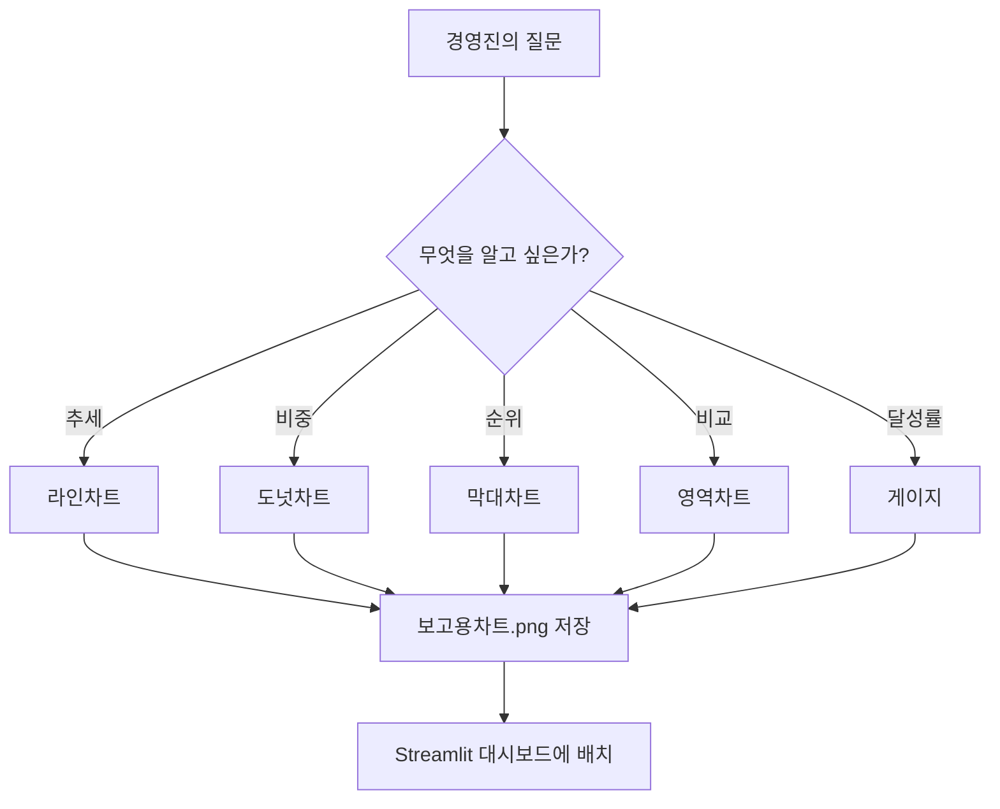

# 3️⃣ 분석 그래프와 Streamlit - 데이터 대시보드 만들기

정리일: 2026-10-08 · 교육 에셋 N0735

본문 수집·공개 편집. 도구 실행·최신 기능 재검증은 미실시. 고객·참여자 정보와 개별 접근 링크, 원본 첨부는 제외했습니다.

---

**사용 도구**
Claude Code에 엑셀 파일 경로를 알려주고 요청하면, 코드 작성·실행·차트 파일 저장까지 한 번에 끝납니다. <br>VSCode 터미널에서 `claude` 명령으로 Claude Code를 실행해, 대시보드 파일 생성부터 `pip install`, `streamlit run`까지 한 번의 대화로 진행합니다.

# 숫자 더미에서 인사이트로 — 차트 완성부터 대시보드 배포까지
---
> 🧑‍💼 **오롱 씨의 다음 두 가지 미션**
**미션 1.** 팀장님: "이 숫자들 경영진 회의에 가져가야 해. 라인 하나로 추세가 보이고, 어느 지역이 1등인지 한 장에 다 보이게 만들어줘."
**미션 2.** 팀장님: "매달 엑셀 보내지 말고 **링크 하나 보내줘.** 내가 직접 필터 걸어서 볼 수 있게. 경영진 회의에서 실시간으로 보여주고 싶어."
오늘 이 두 가지를 이번 시간에 완성합니다.
---
## 챕터 학습 목표
- 목적에 따라 적합한 차트 유형을 선택할 수 있다
- KPI 카드·필터·이상치 경고가 있는 대시보드를 완성할 수 있다
- 사내 IP로 팀원에게 대시보드를 공유할 수 있다
---
## 실습 파일
```javascript
day2/
  ├── 보고용차트.png        ← Part 1 산출물 (Claude Code가 생성)
  ├── dashboard.py         ← Part 2에서 Claude Code가 만들 파일
  └── Day2_reference_data/
        └── 실습_영업팀_매출데이터.xlsx
            (날짜 / 지역 / 담당자 / 상품카테고리 / 매출 / 건수 / 목표매출)
```
---
## 어떤 그래프로 무엇을 보여줄까


경영진의 질문

추천 그래프

이유


"매출이 올라가? 내려가?"

**라인차트**

시간 흐름 추세


"어떤 제품이 제일 잘 팔려?"

**도넛차트**

전체 대비 비중


"어느 지역이 1등?"

**수평 막대차트**

항목 간 크기 비교


"올해 vs 작년?"

**영역차트**

두 기간 겹쳐 비교


"목표 달성률?"

**게이지 차트**

0\~100% 직관 표현


"이번 달 vs 저번 달?"

**증감 막대**

증가(파랑)/감소(빨강)


<details>
<summary>참고) 다이어그램</summary>

</details>
# Part 1 — 보고용 차트 4종 완성
## Step 0 — 데이터 현황 파악
Claude Code에 실습_영업팀_매출데이터**.xlsx** 파일 경로를 프롬프트에 직접 적어 실행합니다.
기본 경로는 `day2/Day2_reference_data/실습_영업팀_매출데이터.xlsx`이며, <br>`claude`를 실행한 폴더가 `day2/`가 아니라면 전체 경로(예: `[로컬 경로] 적어주세요.

[첨부 원본 제외: 파일 권리·개인정보 확인 전입니다.]

```javascript
[실습_영업팀_매출데이터.xlsx — 전체 경로: day2/실습_영업팀_매출데이터.xlsx]

데이터의 날짜범위, 주요 수치 컬럼, 카테고리 컬럼을 요약해줘.
차트로 보여주면 좋을 인사이트 아이디어도 포함해줘.
```
```javascript
실습_영업팀_매출데이터.xlsx 파일 대상으로,
데이터의 날짜범위, 주요 수치 컬럼, 카테고리 컬럼을 요약해줘.
차트로 보여주면 좋을 인사이트 아이디어도 포함해줘.
```
이 단계는 코드 없이 채팅으로만 진행합니다. AI가 데이터를 읽고 요약과 아이디어를 줍니다.
<details>
<summary>답변</summary>
```plain text
좋은 질문이에요. 이 데이터는 **2025년 1월부터 2026년 6월까지의 월별 지역·카테고리 매출 실적 데이터**로 보면 돼요.

---

• **날짜 범위는 2025-01-01 ~ 2026-06-01**이며, 월 단위로 정리된 **18개월 데이터**예요.
• 주요 수치 컬럼은 **매출, 건수, 목표매출**이고, 분석용으로는 **달성률(매출÷목표매출), 건당매출(매출÷건수)**를 추가하면 좋아요.
• 주요 카테고리 컬럼은 **지역(대구, 대전, 부산, 서울, 인천)**과 **카테고리(A, B, C, D)**예요.
• 데이터 구조는 **월 × 지역 5개 × 카테고리 4개 = 총 360행**으로 보이며, 월별 비교와 지역/카테고리 교차분석에 적합해요.
• 차트 관점에서는 **월별 추이, 지역별 성과 비교, 카테고리별 달성률, 이상치 탐지**가 가장 잘 보이는 데이터예요.

---

### 📅 데이터 범위와 구조

이 데이터의 날짜는 모두 월 초일로 들어가 있어서, **일별 데이터가 아니라 월별 집계 데이터**로 해석하는 것이 맞아요.
범위는 **2025년 1월부터 2026년 6월까지**이고, 지역과 카테고리 조합별로 반복되어 있어 시계열 비교에 적합해요.

| 항목 | 요약 |
|---|---|
| 날짜 범위 | 2025-01-01 ~ 2026-06-01 |
| 기간 길이 | 18개월 |
| 시간 단위 | 월별 |
| 지역 수 | 5개 |
| 카테고리 수 | 4개 |
| 전체 행 수 | 360행 |

---

### 🔢 주요 수치 컬럼

수치 컬럼의 핵심은 **매출, 건수, 목표매출** 3개예요.
여기서 단순 합계만 보기보다, 목표 대비 성과와 효율을 같이 보면 인사이트가 훨씬 잘 나와요.

| 컬럼명 | 의미 | 분석 포인트 |
|---|---|---|
| 매출 | 실제 발생 매출 | 전체 성과, 추이, 지역/카테고리 비교 |
| 건수 | 거래/주문 건수로 해석 가능 | 활동량, 거래 규모 비교 |
| 목표매출 | 월별 목표 기준값 | 달성률 계산 기준 |
| 달성률(파생) | 매출 ÷ 목표매출 | 목표 초과/미달 여부 확인 |
| 건당매출(파생) | 매출 ÷ 건수 | 효율성, 고가/저가 거래 구조 파악 |

> 📌 특히 **목표매출은 같은 월 안에서는 지역·카테고리별로 동일하게 들어가 있어요.**
> 그래서 목표 자체 비교보다 **실제 매출이 목표를 얼마나 초과/미달했는지**를 보는 방식이 더 중요해요.

---

### 🗂️ 카테고리 컬럼

분석 축으로 쓸 수 있는 대표 카테고리 컬럼은 **지역**과 **카테고리**예요.
이 두 축을 조합하면 **어느 지역에서 어떤 카테고리가 강한지**를 바로 볼 수 있어요.

| 컬럼명 | 값 |
|---|---|
| 지역 | 대구, 대전, 부산, 서울, 인천 |
| 카테고리 | A, B, C, D |

추가로 **날짜**도 분석 축으로 사용하면,
**월별 시즌성**, **분기별 흐름**, **연도 전환 시 패턴 변화**까지 확인할 수 있어요.

---

### 📊 차트로 보여주면 좋은 인사이트 아이디어

이 데이터는 단순 표보다 차트로 볼 때 훨씬 강점이 커요.
특히 **성과 추이**, **달성률**, **이상치**, **효율성** 관점으로 구성하면 보고용으로 좋습니다.

| 차트 아이디어 | 차트 형태 | 볼 수 있는 인사이트 |
|---|---|---|
| 월별 전체 매출 추이 | 꺾은선 차트 | 전체 매출 흐름, 상승/하락 시점, 시즌성 |
| 월별 목표 대비 실적 | 꺾은선 + 기준선 | 목표 초과/미달 월 확인 |
| 지역별 월 매출 비교 | 누적 막대/군집 막대 | 어느 지역이 꾸준히 강한지 비교 |
| 카테고리별 매출 비중 | 누적 막대 | A/B/C/D 구성비 변화 확인 |
| 지역×카테고리 달성률 히트맵 | 히트맵 | 강한 조합/약한 조합 한눈에 파악 |
| 매출 vs 건수 산점도 | 버블/산점도 | 건수는 적은데 매출이 높은 고효율 구간 탐지 |
| 이상치 탐지 차트 | 박스플롯/월별 막대 | 특정 월 급증 데이터 확인 |

---

### 💡 바로 눈에 띄는 인사이트 후보

데이터를 훑어보면 **대구 2025-04, 2026-04 매출이 전 카테고리에서 비정상적으로 크게 상승**해 보여요.
이 구간은 프로모션, 대형 계약, 집계 방식 변경 같은 **이벤트성 요인**이 있었는지 따로 확인할 가치가 있어요.

또한 **서울과 부산은 전반적으로 높은 매출 구간이 자주 보이고**, **카테고리 C는 상대적으로 목표 미달 구간이 자주 보이는 편**이에요.
이런 패턴은 **“지역 강점”과 “카테고리 개선 과제”**를 나눠서 보여주는 차트에 잘 드러나요.

> 🎯 추천 보고 흐름은 **1) 월별 전체 추이 → 2) 지역 비교 → 3) 카테고리별 달성률 → 4) 이상치 원인 점검** 순서예요.

---

> 🔑 요지: 이 데이터는 **18개월 월별 매출 실적 데이터**이고, 핵심 수치 컬럼은 **매출·건수·목표매출**, 핵심 분류 컬럼은 **지역·카테고리**예요. 차트는 **추이, 목표대비 성과, 지역/카테고리 비교, 이상치 탐지** 중심으로 구성하면 가장 설득력 있어요.

---

원하시면 이 데이터를 기준으로 **보고서용 차트 5개 구성안과 해석 문구까지 바로 정리해드릴까요?**
```
</details>
## Step 1 — 차트 코드 한 번에 요청
```javascript
경영진 보고용 KPI 차트 4개를 코드로 작성하고, 직접 실행해서
'보고용차트.png' 파일로 저장해줘. 실행 결과 파일도 같이 보여줘.

[차트 1] 월별 매출 추이 라인차트
- 목표선(Target)을 점선으로 함께 표시
- 목표 초과 월: 파란색 점, 미달 월: 빨간색 점으로 강조

[차트 2] 카테고리별 매출 비중 도넛차트
- 각 조각에 퍼센트 레이블 표시
- 가장 큰 조각은 분리(explode)해서 강조

[차트 3] 전월 대비 증감 막대차트
- 증가: 파란색, 감소: 빨간색
- 막대 위에 증감률(%) 표시

[차트 4] 지역별 누적 매출 수평 막대차트
- 내림차순 정렬
- 막대 끝에 금액 레이블 표시

공통:
- 한글 폰트: malgun gothic
- 고해상도 300dpi
- 2×2 그리드에 배치해서 '보고용차트.png'로 저장
- 코드 실행 중 오류가 나면 스스로 수정해서 다시 실행해줘
```
<details>
<summary>답변</summary>
[원본 이미지 제외]
[원본 이미지 제외]
</details>
## Step 2 — 이상치 탐지 + 인사이트
차트가 완성됐으면 AI와 데이터 대화를 시작합니다.
```javascript
데이터에서 주목할 만한 패턴과 이상치를 찾아줘.

1. 평균에서 2 표준편차 이상 벗어난 이상치 항목 목록
2. 갑자기 급등·급락한 날짜와 가능한 원인 가설 제시
3. 상위 20% 항목이 전체 매출의 몇 %를 차지하는지 (파레토 분석)
4. 다음 달 매출 예측값 (최근 3개월 이동평균 기반)

결과를 [현황] → [의미] → [제안 액션] 구조로 정리해줘.
표나 그래프가 필요하면 직접 실행해서 이미지로 저장하고 함께 보여줘.
```
<details>
<summary>답변</summary>
[원본 이미지 제외]
[원본 이미지 제외]
[원본 이미지 제외]
</details>
<details>
<summary>💡 차트 수정 프롬프트 패턴</summary>


<colgroup>
<col>
<col width="311">
</colgroup>


수정 상황

프롬프트


색상 변경

"라인차트 색상을 #CC0000으로"


제목 크기

"제목 폰트 20으로 키워줘"


범례 위치

"범례를 오른쪽 아래로"


축 범위

"Y축 범위를 0부터 최대값의 120%로"


목표선 색상

"목표선을 주황색 점선으로"


저장 형식

"PNG 말고 SVG로도 저장해줘"


</details>

## 참고) 데이터 분석 및 차트 관련 짧팁
### 차트 품질 향상 옵션


옵션

프롬프트 표현

효과


고해상도

"300dpi로 저장해줘"

인쇄·PPT 삽입에 적합


브랜드 컬러

"#CC0000 기반 팔레트 사용해줘"

일관된 보고서 스타일


한글 폰트

"malgun gothic 사용해줘"

깨짐 없는 한글


수치 레이블

"막대 위에 수치 표시해줘"

정확한 값 전달


# Part 2 — Streamlit 대시보드 (with Claude Code)

## Streamlit이 뭔가요?
파이썬 코드 몇 줄만으로 웹 앱을 만드는 라이브러리입니다.


[원본 이미지 제외]


[원본 이미지 제외]


```javascript
[기존 방식]
  매달 엑셀 → 차트 → 캡처 → 이메일 공유 → 반복

[Streamlit 방식]
  데이터 파일 교체 → 차트 자동 갱신
```
## Streamlit 주요 컴포넌트(= 구성요소)


<colgroup>
<col>
<col width="249.97500610351562">
</colgroup>


컴포넌트

역할


`st.sidebar`

좌측 필터 (날짜·지역·카테고리)


`st.metric`

KPI 카드 (숫자 + 증감)


`st.tabs`

탭으로 차트 전환


`st.plotly_chart`

인터랙티브 차트


`st.download_button`

CSV 다운로드


`st.warning`

목표 미달 경고 배너


> ⛔ **보안 수칙 — 반드시 지킬 것**


<colgroup>
<col width="339">
<col>
</colgroup>


구분

허용 여부


사내 실제 데이터로 외부 배포 (share.streamlit.io)

⛔ 절대 금지


사내 데이터로 본인 PC 로컬 실행

✅ 가능


사내 데이터로 사내 서버 배포

⚠️ 정보보안팀 사전 확인


## Step 3 — 플랜 모드로 대시보드 설계
```javascript
Streamlit 매출 분석 대시보드를 만들려고 해.
바로 코드 만들지 말고, 구성 계획을 먼저 보여줘.

데이터 파일 경로: day2/실습_영업팀_매출데이터.xlsx
(컬럼: 날짜, 지역, 카테고리, 매출, 건수, 목표매출)

경영진이 알고 싶은 것:
1. 매출 추세 (올라가나? 내려가나?)
2. 지역 순위 (어디가 1등?)
3. 상품 비중 (뭐가 잘 팔려?)
4. 목표 달성률 (몇 %?)

보여줄 것: 사이드바 필터, KPI 카드, 탭별 차트, 하단 테이블
```
계획을 확인하고 조정한 뒤 코드를 요청합니다.
```javascript
계획 좋아. KPI 카드에 전월 대비 증감률 화살표 추가하고, 하단에 CSV 다운로드 버튼 넣어줘.
이 계획대로 day2/dashboard.py 파일을 만들고, 필요한 패키지 설치와 streamlit 실행까지 직접 진행해줘. 한국어 주석 포함.
```
<details>
<summary>코드 생성 예시</summary>
```plain text
import streamlit as st
import pandas as pd
import plotly.express as px
import plotly.graph_objects as go
from datetime import datetime
import io

# ============= 페이지 설정 =============
st.set_page_config(
    page_title="영업팀 매출 분석 대시보드",
    page_icon="📊",
    layout="wide",
    initial_sidebar_state="expanded"
)

# ============= 데이터 로드 함수 =============
@st.cache_data
def load_data():
    """Excel 파일에서 데이터를 로드하는 함수"""
    df = pd.read_excel('실습_영업팀_매출데이터.xlsx', sheet_name='Sales')
    df['날짜'] = pd.to_datetime(df['날짜'])
    return df

try:
    df = load_data()
except:
    st.error("❌ 파일을 찾을 수 없습니다. '실습_영업팀_매출데이터.xlsx'가 같은 폴더에 있는지 확인하세요.")
    st.stop()

# ============= 전월 대비 증감률 계산 함수 =============
def calculate_mom_growth(df):
    """당월과 전월의 매출을 비교하여 전월 대비 증감률 계산"""
    monthly_sales = df.groupby(df['날짜'].dt.to_period('M'))['매출'].sum()

    if len(monthly_sales) >= 2:
        current_month = monthly_sales.iloc[-1]
        previous_month = monthly_sales.iloc[-2]
        growth_rate = ((current_month - previous_month) / previous_month * 100) if previous_month > 0 else 0
    else:
        growth_rate = 0

    return growth_rate

# ============= 사이드바 필터 설정 =============
st.sidebar.title("🔍 필터 설정")

# 지역 필터
regions = ["전체"] + sorted(df['지역'].unique().tolist())
selected_region = st.sidebar.selectbox("지역 선택", regions)

# 카테고리 필터
categories = ["전체"] + sorted(df['카테고리'].unique().tolist())
selected_category = st.sidebar.selectbox("카테고리 선택", categories)

# ============= 필터 적용 =============
filtered_df = df.copy()
if selected_region != "전체":
    filtered_df = filtered_df[filtered_df['지역'] == selected_region]
if selected_category != "전체":
    filtered_df = filtered_df[filtered_df['카테고리'] == selected_category]

# ============= 주요 지표 계산 =============
total_sales = filtered_df['매출'].sum()
total_target = filtered_df['목표매출'].sum()
achievement_rate = (total_sales / total_target * 100) if total_target > 0 else 0
total_count = filtered_df['건수'].sum()

# 전월 대비 증감률 계산
mom_growth = calculate_mom_growth(filtered_df)
growth_arrow = "📈" if mom_growth >= 0 else "📉"
growth_color = "green" if mom_growth >= 0 else "red"

# ============= 메인 제목 =============
st.title("📊 영업팀 매출 분석 대시보드")
st.write(f"**분석 기간:** {df['날짜'].min().strftime('%Y-%m-%d')} ~ {df['날짜'].max().strftime('%Y-%m-%d')}")

# ============= KPI 카드 (전월 대비 증감률 화살표 포함) =============
col1, col2, col3, col4 = st.columns(4)

with col1:
    st.metric(
        label="💰 총 매출",
        value=f"₩{total_sales/1_000_000:.1f}M",
        delta=f"목표: ₩{total_target/1_000_000:.1f}M"
    )

with col2:
    st.metric(
        label="🎯 달성률",
        value=f"{achievement_rate:.1f}%",
        delta="목표 대비" if achievement_rate >= 100 else "미달"
    )

with col3:
    # 전월 대비 증감률을 화살표와 함께 표시
    st.metric(
        label="📊 전월 대비 증감",
        value=f"{abs(mom_growth):.1f}%",
        delta=f"{growth_arrow} {'증가' if mom_growth >= 0 else '감소'}"
    )

with col4:
    st.metric(
        label="📈 거래 건수",
        value=f"{total_count:,.0f}건",
        delta="총 거래"
    )

# ============= 경고 배너 =============
if achievement_rate < 70:
    st.warning("⚠️ 목표 달성률이 70% 이하입니다. 영업 전략 검토가 필요합니다.")
elif achievement_rate < 100:
    st.info("ℹ️ 목표 달성까지 조금 더 노력이 필요합니다.")
else:
    st.success("✅ 목표를 초과 달성했습니다!")

# ============= 상세 분석 차트 =============
st.subheader("📈 상세 분석")

# 월별 매출 추이 (실제 vs 목표)
monthly_sales = filtered_df.groupby(filtered_df['날짜'].dt.to_period('M')).agg({
    '매출': 'sum',
    '목표매출': 'first'
}).reset_index()
monthly_sales['날짜'] = monthly_sales['날짜'].astype(str)

fig1 = go.Figure()
fig1.add_trace(go.Scatter(
    x=monthly_sales['날짜'],
    y=monthly_sales['매출'],
    mode='lines+markers',
    name='실제 매출',
    line=dict(color='#1f77b4', width=2)
))
fig1.add_trace(go.Scatter(
    x=monthly_sales['날짜'],
    y=monthly_sales['목표매출'],
    mode='lines',
    name='목표 매출',
    line=dict(color='#ff7f0e', width=2, dash='dash')
))
fig1.update_layout(
    title="월별 매출 추이",
    xaxis_title="월",
    yaxis_title="매출 (원)",
    hovermode='x unified',
    height=400
)

# 지역별 매출 (수평 막대 차트)
region_sales = filtered_df.groupby('지역')['매출'].sum().sort_values(ascending=True)
fig2 = px.bar(
    y=region_sales.index,
    x=region_sales.values,
    orientation='h',
    labels={'x': '매출 (원)', 'y': '지역'},
    title="지역별 매출",
    color=region_sales.values,
    color_continuous_scale='Blues'
)
fig2.update_layout(height=400, showlegend=False)

# 카테고리별 매출 비중 (도넛 차트)
category_sales = filtered_df.groupby('카테고리')['매출'].sum()
fig3 = px.pie(
    values=category_sales.values,
    names=category_sales.index,
    title="카테고리별 매출 비중",
    hole=0.4
)
fig3.update_layout(height=400)

# 차트 배열
col1, col2 = st.columns(2)
with col1:
    st.plotly_chart(fig1, use_container_width=True)
with col2:
    st.plotly_chart(fig2, use_container_width=True)

st.plotly_chart(fig3, use_container_width=True)

# ============= 상세 데이터 테이블 =============
st.subheader("📋 상세 데이터")

# 정렬 옵션
sort_option = st.selectbox("정렬 기준", ["매출 (내림차순)", "매출 (오름차순)", "날짜 (최신순)"])

display_df = filtered_df.copy()
if sort_option == "매출 (내림차순)":
    display_df = display_df.sort_values('매출', ascending=False)
elif sort_option == "매출 (오름차순)":
    display_df = display_df.sort_values('매출', ascending=True)
else:
    display_df = display_df.sort_values('날짜', ascending=False)

# 표시용 데이터프레임 포맷 (통화 형식)
display_df_formatted = display_df.copy()
display_df_formatted['매출'] = display_df_formatted['매출'].apply(lambda x: f"₩{x:,.0f}")
display_df_formatted['목표매출'] = display_df_formatted['목표매출'].apply(lambda x: f"₩{x:,.0f}")
display_df_formatted['날짜'] = display_df_formatted['날짜'].dt.strftime('%Y-%m-%d')

st.dataframe(display_df_formatted, use_container_width=True, hide_index=True)

# ============= CSV 다운로드 버튼 =============
st.subheader("⬇️ 데이터 다운로드")

# CSV 데이터 생성
csv_buffer = io.StringIO()
display_df.to_csv(csv_buffer, index=False, encoding='utf-8-sig')
csv_data = csv_buffer.getvalue()

# 다운로드 버튼 (전체 데이터)
st.download_button(
    label="📥 전체 데이터 CSV 다운로드",
    data=csv_data,
    file_name=f"매출데이터_{datetime.now().strftime('%Y%m%d_%H%M%S')}.csv",
    mime="text/csv",
    use_container_width=True
)

# 필터링된 데이터 다운로드 (선택사항)
filtered_csv_buffer = io.StringIO()
display_df_formatted.to_csv(filtered_csv_buffer, index=False, encoding='utf-8-sig')
filtered_csv_data = filtered_csv_buffer.getvalue()

st.download_button(
    label="📥 필터링된 데이터 CSV 다운로드",
    data=filtered_csv_data,
    file_name=f"필터링_매출데이터_{datetime.now().strftime('%Y%m%d_%H%M%S')}.csv",
    mime="text/csv",
    use_container_width=True
)

# ============= 하단 정보 =============
st.divider()
st.markdown(
    f"""
    <div style='text-align: center; color: gray; font-size: 12px;'>
    💼 영업팀 매출 분석 대시보드 | 마지막 업데이트: {datetime.now().strftime('%Y-%m-%d %H:%M:%S')}
    </div>
    """,
    unsafe_allow_html=True
)
```
</details>
## Step 4 — Claude Code로 저장 + 실행
#### VS Code에서 클로드 코드 설치/확장 활용 방법 {toggle="true" color="yellow_bg"}
[원본 이미지 제외]
```bash
STEP 1. VSCode 터미널에서 claude 실행
STEP 2. 위 Step 3의 프롬프트로 요청
         → Claude Code가 dashboard.py 저장 + pip install + streamlit run까지 실행
STEP 3. 터미널에 뜨는 [개별 링크 제외] 주소를 브라우저로 접속
```
**🖇️ 실제로 넣을 프롬프트 예시 (One shot)**
```javascript
Streamlit 매출 분석 대시보드를 만들려고 해.
바로 코드 만들지 말고, 구성 계획을 먼저 보여줘.

데이터 파일 경로: day2/실습_영업팀_매출데이터.xlsx
(컬럼: 날짜, 지역, 카테고리, 매출, 건수, 목표매출)

경영진이 알고 싶은 것:
1. 매출 추세 (올라가나? 내려가나?)
2. 지역 순위 (어디가 1등?)
3. 상품 비중 (뭐가 잘 팔려?)
4. 목표 달성률 (몇 %?)

보여줄 것: 사이드바 필터, KPI 카드, 탭별 차트, 하단 테이블

day2/dashboard.py로 저장하고, streamlit과 필요한 패키지를 설치한 다음 streamlit run day2/dashboard.py로 직접 실행해줘.
실행 후 뜨는 로컬 주소를 알려줘.
```
> ⚠️ 참고: Claude Code가 실행하는 `streamlit run`은 **터미널을 켜 둔 상태로 계속 떠 있어야** 브라우저에서 접속이 유지됩니다. <br>화면을 닫거나 `Ctrl+C`를 누르면 대시보드도 종료됩니다.
### 결과물 예시
[원본 이미지 제외]
## Step 6 — 고급 기능 추가
### 코드 디벨롭하기
```javascript
기능 추가해줘.
1. 지역별 목표달성률 히트맵 탭 추가
2. 목표 대비 달성률 게이지 차트 (100% 기준선)
3. 달성률 70% 이하면 상단 경고 배너 (st.warning)
4. 이상치 데이터 테이블에서 빨간색 하이라이트
5. 지역별 목표달성률 신호등 표시 🟢 100% 이상, 🟡 80~100%, 🔴 80% 미만

수정하고 나서 다시 실행해서 브라우저에서 확인할 수 있게 해줘.
```
Claude Code가 dashboard.py를 수정하고 재실행합니다 → 브라우저 F5 새로고침으로 확인
<details>
<summary>코드 완성 예시</summary>
```plain text
"""
영업팀 매출 분석 대시보드
실습용 Streamlit 앱 - 실습_영업팀_매출데이터.xlsx 기반
config.toml 다크테마 기준으로 작성 (배경 하드코딩 없음)

[추가 기능]
- 목표 대비 달성률 게이지 차트 (100% 기준선)
- 달성률 70% 이하 상단 경고 배너
- 이상치 데이터 테이블 빨간색 하이라이트
- 지역별 목표달성률 신호등 표시
"""

import os
import streamlit as st
import pandas as pd
import plotly.graph_objects as go

# dashboard.py 위치 기준으로 엑셀 경로 고정 (실행 폴더 위치 무관)
BASE_DIR = os.path.dirname(os.path.abspath(__file__))
EXCEL_PATH = os.path.join(BASE_DIR, "실습_영업팀_매출데이터.xlsx")


# ─────────────────────────────────────────────
# 0. 페이지 기본 설정
# ─────────────────────────────────────────────
st.set_page_config(
    page_title="영업팀매출 분석 대시보드",
    page_icon="📊",
    layout="wide",
    initial_sidebar_state="expanded",
)

# 다크테마 config.toml 자동 생성 (dashboard.py 기준 상대경로)
config_dir = os.path.join(BASE_DIR, ".streamlit")
config_path = os.path.join(config_dir, "config.toml")
if not os.path.exists(config_path):
    os.makedirs(config_dir, exist_ok=True)
    with open(config_path, "w", encoding="utf-8") as f:
        f.write(
            '[theme]\n'
            'base = "dark"\n'
            'primaryColor = "#3B82F6"\n'
            'backgroundColor = "#0F172A"\n'
            'secondaryBackgroundColor = "#1E293B"\n'
            'textColor = "#F1F5F9"\n'
            'font = "sans serif"\n'
        )
    st.rerun()

# 한글 폰트 + 공통 스타일
st.markdown("""
<style>
    @import url('[개별 링크 제외]);

    html, body, [class*="css"] {
        font-family: 'Noto Sans KR', sans-serif;
    }

    /* KPI 카드 */
    .kpi-card {
        border-radius: 12px;
        padding: 20px 24px;
        border: 1px solid rgba(255,255,255,0.1);
        border-left: 4px solid;
        margin-bottom: 8px;
        background: rgba(255,255,255,0.04);
    }
    .kpi-label {
        font-size: 13px;
        font-weight: 500;
        margin-bottom: 6px;
        opacity: 0.6;
    }
    .kpi-value {
        font-size: 28px;
        font-weight: 700;
        line-height: 1.2;
    }
    .kpi-sub {
        font-size: 13px;
        margin-top: 6px;
        font-weight: 500;
        opacity: 0.85;
    }

    /* 섹션 타이틀 */
    .section-title {
        font-size: 16px;
        font-weight: 700;
        margin: 28px 0 12px 0;
        padding-bottom: 8px;
        border-bottom: 1px solid rgba(255,255,255,0.15);
    }

    /* 다운로드 버튼 */
    .stDownloadButton > button {
        width: 100%;
        border-radius: 8px;
        font-weight: 600;
    }
</style>
""", unsafe_allow_html=True)


# ─────────────────────────────────────────────
# 1. 데이터 로드
# ─────────────────────────────────────────────
@st.cache_data
def load_data():
    """엑셀 파일 로드 및 전처리"""
    df = pd.read_excel(EXCEL_PATH, sheet_name="Sales")
    df["날짜"] = pd.to_datetime(df["날짜"])
    df["연월"] = df["날짜"].dt.to_period("M").astype(str)
    df["연월_dt"] = df["날짜"].dt.to_period("M").dt.to_timestamp()
    df["달성률"] = df["매출"] / df["목표매출"] * 100
    return df


df = load_data()


# ─────────────────────────────────────────────
# 2. 사이드바 필터
# ─────────────────────────────────────────────
with st.sidebar:
    st.markdown("## 🔍 데이터 필터")
    st.markdown("---")

    all_regions = sorted(df["지역"].unique().tolist())
    selected_regions = st.multiselect(
        "지역 선택",
        options=all_regions,
        default=all_regions,
        placeholder="지역을 선택하세요",
    )

    all_categories = sorted(df["카테고리"].unique().tolist())
    selected_categories = st.multiselect(
        "카테고리 선택",
        options=all_categories,
        default=all_categories,
        placeholder="카테고리를 선택하세요",
    )

    st.markdown("---")

    min_date = df["날짜"].min().date()
    max_date = df["날짜"].max().date()
    date_range = st.date_input(
        "기간 선택",
        value=(min_date, max_date),
        min_value=min_date,
        max_value=max_date,
    )

    st.markdown("---")
    st.caption("데이터 기간: 2025.01 ~ 2026.06")


# ─────────────────────────────────────────────
# 3. 필터 적용
# ─────────────────────────────────────────────
sel_regions = selected_regions if selected_regions else all_regions
sel_categories = selected_categories if selected_categories else all_categories

if isinstance(date_range, (list, tuple)) and len(date_range) == 2:
    start_date, end_date = pd.Timestamp(date_range[0]), pd.Timestamp(date_range[1])
else:
    start_date, end_date = df["날짜"].min(), df["날짜"].max()

filtered_df = df[
    (df["지역"].isin(sel_regions))
    & (df["카테고리"].isin(sel_categories))
    & (df["날짜"] >= start_date)
    & (df["날짜"] <= end_date)
].copy()


# ─────────────────────────────────────────────
# 4. KPI 계산
# ─────────────────────────────────────────────
def calc_kpis(data):
    """KPI 지표 계산"""
    total_sales = data["매출"].sum()
    total_target = data["목표매출"].sum()
    total_count = data["건수"].sum()
    achievement = (total_sales / total_target * 100) if total_target > 0 else 0

    monthly = data.groupby("연월_dt")["매출"].sum().sort_index()
    if len(monthly) >= 2:
        mom_diff = monthly.iloc[-1] - monthly.iloc[-2]
        mom_pct = (mom_diff / monthly.iloc[-2] * 100) if monthly.iloc[-2] > 0 else 0
    else:
        mom_diff = mom_pct = 0

    return {
        "total_sales": total_sales,
        "total_target": total_target,
        "achievement": achievement,
        "mom_diff": mom_diff,
        "mom_pct": mom_pct,
        "total_count": total_count,
    }


kpis = calc_kpis(filtered_df)


# ─────────────────────────────────────────────
# 5. 헤더
# ─────────────────────────────────────────────
st.markdown("# 📊 영업팀매출 분석 대시보드")

filter_info = (
    f"지역: {', '.join(sel_regions)} | "
    f"카테고리: {', '.join(sel_categories)} | "
    f"기간: {start_date.strftime('%Y.%m')} ~ {end_date.strftime('%Y.%m')}"
)
st.caption(filter_info)


# ─────────────────────────────────────────────
# [추가 1] 달성률 70% 이하 경고 배너
# ─────────────────────────────────────────────
if kpis["achievement"] <= 70:
    st.warning(
        f"⚠️ 전체 달성률이 **{kpis['achievement']:.1f}%**로 목표 대비 심각하게 미달 중입니다. "
        f"즉각적인 영업 전략 점검이 필요합니다."
    )


# ─────────────────────────────────────────────
# 6. KPI 카드 4개
# ─────────────────────────────────────────────
col1, col2, col3, col4 = st.columns(4)

with col1:
    st.markdown(f"""
    <div class="kpi-card" style="border-left-color: #3B82F6;">
        <div class="kpi-label">💰 총 매출</div>
        <div class="kpi-value">₩{kpis['total_sales']:,.0f}</div>
        <div class="kpi-sub" style="color:#60A5FA;">{kpis['total_sales']/100000000:.1f}억원</div>
    </div>
    """, unsafe_allow_html=True)

with col2:
    ach_color = "#10B981" if kpis["achievement"] >= 100 else "#F59E0B" if kpis["achievement"] >= 80 else "#EF4444"
    ach_label = "✅ 목표 초과 달성" if kpis["achievement"] >= 100 else "⚠️ 목표 미달" if kpis["achievement"] < 80 else "📈 목표 근접"
    st.markdown(f"""
    <div class="kpi-card" style="border-left-color: {ach_color};">
        <div class="kpi-label">🎯 달성률</div>
        <div class="kpi-value" style="color:{ach_color};">{kpis['achievement']:.1f}%</div>
        <div class="kpi-sub" style="color:{ach_color};">{ach_label}</div>
    </div>
    """, unsafe_allow_html=True)

with col3:
    arrow = "▲" if kpis["mom_diff"] >= 0 else "▼"
    diff_color = "#10B981" if kpis["mom_diff"] >= 0 else "#EF4444"
    st.markdown(f"""
    <div class="kpi-card" style="border-left-color: {diff_color};">
        <div class="kpi-label">📈 전월 대비 증감</div>
        <div class="kpi-value" style="color:{diff_color};">{arrow} {abs(kpis['mom_pct']):.1f}%</div>
        <div class="kpi-sub" style="color:{diff_color};">{arrow} ₩{abs(kpis['mom_diff']):,.0f}</div>
    </div>
    """, unsafe_allow_html=True)

with col4:
    avg_per_deal = kpis["total_sales"] / kpis["total_count"] if kpis["total_count"] > 0 else 0
    st.markdown(f"""
    <div class="kpi-card" style="border-left-color: #8B5CF6;">
        <div class="kpi-label">📦 거래 건수</div>
        <div class="kpi-value">{kpis['total_count']:,}건</div>
        <div class="kpi-sub" style="color:#A78BFA;">건당 평균 ₩{avg_per_deal:,.0f}</div>
    </div>
    """, unsafe_allow_html=True)

st.markdown("<div style='height:8px'></div>", unsafe_allow_html=True)


# ─────────────────────────────────────────────
# [추가 2] 달성률 게이지 차트 (100% 기준선)
# ─────────────────────────────────────────────
st.markdown("<div class='section-title'>목표 대비 달성률 게이지</div>", unsafe_allow_html=True)

gauge_color = "#10B981" if kpis["achievement"] >= 100 else "#F59E0B" if kpis["achievement"] >= 80 else "#EF4444"

fig_gauge = go.Figure(go.Indicator(
    mode="gauge+number+delta",
    value=kpis["achievement"],
    number=dict(suffix="%", font=dict(size=36)),
    delta=dict(
        reference=100,
        valueformat=".1f",
        suffix="%p",
        increasing=dict(color="#10B981"),
        decreasing=dict(color="#EF4444"),
    ),
    gauge=dict(
        axis=dict(
            range=[0, 150],
            tickvals=[0, 50, 70, 80, 100, 120, 150],
            ticktext=["0%", "50%", "70%", "80%", "100%", "120%", "150%"],
            tickfont=dict(size=11),
        ),
        bar=dict(color=gauge_color, thickness=0.3),
        bgcolor="rgba(0,0,0,0)",
        borderwidth=0,
        steps=[
            dict(range=[0, 70],    color="rgba(239,68,68,0.15)"),
            dict(range=[70, 80],   color="rgba(245,158,11,0.12)"),
            dict(range=[80, 100],  color="rgba(245,158,11,0.08)"),
            dict(range=[100, 150], color="rgba(16,185,129,0.12)"),
        ],
        threshold=dict(
            line=dict(color="white", width=3),  # 100% 기준선
            thickness=0.85,
            value=100,
        ),
    ),
    title=dict(text="전체 목표 달성률", font=dict(size=14)),
))

fig_gauge.update_layout(
    paper_bgcolor="rgba(0,0,0,0)",
    font=dict(size=12),
    height=260,
    margin=dict(l=30, r=30, t=40, b=10),
)

col_gauge, col_gauge_info = st.columns([1.4, 0.6])

with col_gauge:
    st.plotly_chart(fig_gauge, use_container_width=True)

with col_gauge_info:
    st.markdown("<div style='height:40px'></div>", unsafe_allow_html=True)
    st.markdown(f"""
    <div style='font-size:14px; line-height:2.2;'>
        <div>🟢 100% 이상   목표 초과</div>
        <div>🟡 80~100%   목표 근접</div>
        <div>🔴 80% 미만   목표 미달</div>
        <div style='margin-top:12px; opacity:0.5; font-size:12px;'>
            ┃ 흰색 기준선 = 목표 100%
        </div>
        <div style='margin-top:12px; font-size:13px;'>
            목표액 ₩{kpis['total_target']:,.0f}
        </div>
        <div style='font-size:13px;'>
            실적액 ₩{kpis['total_sales']:,.0f}
        </div>
    </div>
    """, unsafe_allow_html=True)


# ─────────────────────────────────────────────
# 7. 월별 매출 추이 (실제 vs 목표)
# ─────────────────────────────────────────────
st.markdown("<div class='section-title'>월별 매출 추이 (실제 vs 목표)</div>", unsafe_allow_html=True)

monthly_df = (
    filtered_df.groupby("연월_dt")
    .agg(실제매출=("매출", "sum"), 목표매출=("목표매출", "sum"))
    .reset_index()
    .sort_values("연월_dt")
)
monthly_df["연월_str"] = monthly_df["연월_dt"].dt.strftime("%Y.%m")

fig_line = go.Figure()
fig_line.add_trace(go.Scatter(
    x=monthly_df["연월_str"],
    y=monthly_df["목표매출"],
    name="목표 매출",
    mode="lines",
    line=dict(color="#6B7280", width=2, dash="dash"),
    hovertemplate="목표: ₩%{y:,.0f}<extra></extra>",
))
fig_line.add_trace(go.Scatter(
    x=monthly_df["연월_str"],
    y=monthly_df["실제매출"],
    name="실제 매출",
    mode="lines+markers",
    line=dict(color="#3B82F6", width=2.5),
    marker=dict(size=6),
    fill="tozeroy",
    fillcolor="rgba(59,130,246,0.1)",
    hovertemplate="실제: ₩%{y:,.0f}<extra></extra>",
))
fig_line.update_layout(
    paper_bgcolor="rgba(0,0,0,0)",
    plot_bgcolor="rgba(0,0,0,0)",
    font=dict(size=12),
    legend=dict(orientation="h", yanchor="bottom", y=1.02, xanchor="right", x=1),
    margin=dict(l=0, r=0, t=10, b=0),
    height=320,
    xaxis=dict(showgrid=False, tickangle=-45, tickfont=dict(size=11)),
    yaxis=dict(showgrid=True, gridcolor="rgba(255,255,255,0.08)", tickformat=",.0f", tickprefix="₩"),
    hovermode="x unified",
)
st.plotly_chart(fig_line, use_container_width=True)


# ─────────────────────────────────────────────
# 8. 지역별 & 카테고리별 차트
# ─────────────────────────────────────────────
col_left, col_right = st.columns([1.1, 0.9])

with col_left:
    st.markdown("<div class='section-title'>지역별 매출 비교</div>", unsafe_allow_html=True)

    region_df = (
        filtered_df.groupby("지역")
        .agg(매출=("매출", "sum"), 목표=("목표매출", "sum"))
        .reset_index()
        .sort_values("매출", ascending=True)
    )
    region_df["달성률"] = (region_df["매출"] / region_df["목표"] * 100).round(1)

    bar_colors = [
        "#10B981" if r >= 100 else "#3B82F6" if r >= 80 else "#F59E0B"
        for r in region_df["달성률"]
    ]

    fig_bar = go.Figure(go.Bar(
        x=region_df["매출"],
        y=region_df["지역"],
        orientation="h",
        marker_color=bar_colors,
        text=[f"₩{v/100000000:.1f}억  {r:.0f}%" for v, r in zip(region_df["매출"], region_df["달성률"])],
        textposition="outside",
        hovertemplate="<b>%{y}</b><br>매출: ₩%{x:,.0f}<extra></extra>",
    ))
    fig_bar.update_layout(
        paper_bgcolor="rgba(0,0,0,0)",
        plot_bgcolor="rgba(0,0,0,0)",
        font=dict(size=12),
        margin=dict(l=0, r=90, t=10, b=0),
        height=300,
        xaxis=dict(showgrid=True, gridcolor="rgba(255,255,255,0.08)", tickformat=",.0f", tickprefix="₩"),
        yaxis=dict(showgrid=False, tickfont=dict(size=13)),
    )
    st.plotly_chart(fig_bar, use_container_width=True)

with col_right:
    st.markdown("<div class='section-title'>카테고리별 매출 비중</div>", unsafe_allow_html=True)

    cat_df = (
        filtered_df.groupby("카테고리")["매출"]
        .sum()
        .reset_index()
        .sort_values("매출", ascending=False)
    )

    fig_donut = go.Figure(go.Pie(
        labels=cat_df["카테고리"],
        values=cat_df["매출"],
        hole=0.55,
        marker=dict(
            colors=["#3B82F6", "#8B5CF6", "#10B981", "#F59E0B"][:len(cat_df)],
            line=dict(color="rgba(0,0,0,0.3)", width=2),
        ),
        textinfo="label+percent",
        hovertemplate="<b>카테고리 %{label}</b><br>매출: ₩%{value:,.0f}<br>비중: %{percent}<extra></extra>",
    ))
    fig_donut.add_annotation(
        text=f"<b>{len(cat_df)}개</b><br>카테고리",
        x=0.5, y=0.5,
        font=dict(size=14),
        showarrow=False,
    )
    fig_donut.update_layout(
        paper_bgcolor="rgba(0,0,0,0)",
        plot_bgcolor="rgba(0,0,0,0)",
        font=dict(size=12),
        margin=dict(l=0, r=0, t=10, b=0),
        height=300,
        legend=dict(orientation="v", x=1.05, font=dict(size=12)),
    )
    st.plotly_chart(fig_donut, use_container_width=True)


# ─────────────────────────────────────────────
# [추가 3] 지역별 목표달성률 신호등 테이블
# st.dataframe + Styler 방식 (HTML 렌더링 버그 방지)
# ─────────────────────────────────────────────
st.markdown("<div class='section-title'>지역별 목표달성률 신호등</div>", unsafe_allow_html=True)

# 지역별 달성률 집계 (내림차순 정렬)
signal_df = (
    filtered_df.groupby("지역")
    .agg(매출=("매출", "sum"), 목표=("목표매출", "sum"), 건수=("건수", "sum"))
    .reset_index()
)
signal_df["달성률"] = (signal_df["매출"] / signal_df["목표"] * 100).round(1)
signal_df = signal_df.sort_values("달성률", ascending=False).reset_index(drop=True)

# 신호등 이모지 컬럼 추가
def get_signal(rate):
    if rate >= 100:
        return "🟢"
    elif rate >= 80:
        return "🟡"
    else:
        return "🔴"

signal_df.insert(0, "상태", signal_df["달성률"].apply(get_signal))

# 행 배경색 하이라이트 함수
def highlight_signal(row):
    if row["달성률"] >= 100:
        return ["background-color: rgba(16,185,129,0.12);"] * len(row)
    elif row["달성률"] >= 80:
        return ["background-color: rgba(245,158,11,0.10);"] * len(row)
    else:
        return ["background-color: rgba(239,68,68,0.12);"] * len(row)

# 달성률 컬럼 색상 함수
def color_rate(val):
    if val >= 100:
        return "color: #10B981; font-weight: 700;"
    elif val >= 80:
        return "color: #F59E0B; font-weight: 700;"
    else:
        return "color: #EF4444; font-weight: 700;"

styled_signal = (
    signal_df.style
    .apply(highlight_signal, axis=1)
    .map(color_rate, subset=["달성률"])
    .format({
        "매출":  "₩{:,.0f}",
        "목표":  "₩{:,.0f}",
        "달성률": "{:.1f}%",
        "건수":  "{:,.0f}건",
    })
)

st.dataframe(styled_signal, use_container_width=True, hide_index=True, height=220)
st.caption("🟢 100% 이상  |  🟡 80~100%  |  🔴 80% 미만")


# ─────────────────────────────────────────────
# 9. 상세 데이터 테이블 ([추가 4] 이상치 하이라이트 포함)
# ─────────────────────────────────────────────
st.markdown("<div class='section-title'>상세 데이터 테이블</div>", unsafe_allow_html=True)

table_df = filtered_df[["날짜", "지역", "카테고리", "매출", "목표매출", "건수", "달성률"]].copy()
table_df["날짜"] = table_df["날짜"].dt.strftime("%Y-%m-%d")
table_df["달성률"] = table_df["달성률"].round(1)

sort_col, sort_order_col = st.columns([2, 1])
with sort_col:
    sort_by = st.selectbox(
        "정렬 기준",
        options=["날짜", "매출", "목표매출", "건수", "달성률"],
        index=1,
        label_visibility="collapsed",
    )
with sort_order_col:
    sort_asc = st.radio(
        "정렬 방향",
        options=["내림차순 ↓", "오름차순 ↑"],
        horizontal=True,
        label_visibility="collapsed",
    )

ascending = sort_asc == "오름차순 ↑"
table_df = table_df.sort_values(sort_by, ascending=ascending).reset_index(drop=True)

# 이상치 기준: 달성률 70% 이하 → 행 전체 빨간색 하이라이트
def highlight_outlier(row):
    """달성률 70% 이하 행을 빨간색으로 하이라이트"""
    if row["달성률"] <= 70:
        return ["background-color: rgba(239,68,68,0.18); color: #FCA5A5;"] * len(row)
    return [""] * len(row)

styled = (
    table_df.style
    .apply(highlight_outlier, axis=1)
    .format({
        "매출":   "₩{:,.0f}",
        "목표매출": "₩{:,.0f}",
        "달성률":  "{:.1f}%",
    })
)

st.dataframe(styled, use_container_width=True, height=380, hide_index=True)
st.caption(
    f"총 {len(table_df):,}건 표시 중  |  "
    f"🔴 빨간색 행 = 달성률 70% 이하 이상치"
)


# ─────────────────────────────────────────────
# 10. CSV 다운로드
# ─────────────────────────────────────────────
st.markdown("<div class='section-title'>데이터 다운로드</div>", unsafe_allow_html=True)

dl_col1, dl_col2, _ = st.columns([1, 1, 2])

with dl_col1:
    full_csv = df.drop(columns=["연월", "연월_dt", "달성률"]).to_csv(index=False, encoding="utf-8-sig")
    st.download_button(
        label="⬇️ 전체 데이터 다운로드",
        data=full_csv.encode("utf-8-sig"),
        file_name="영업팀_매출_전체.csv",
        mime="text/csv",
        use_container_width=True,
    )

with dl_col2:
    filtered_csv = filtered_df.drop(columns=["연월", "연월_dt", "달성률"]).to_csv(index=False, encoding="utf-8-sig")
    st.download_button(
        label="⬇️ 필터링 데이터 다운로드",
        data=filtered_csv.encode("utf-8-sig"),
        file_name="영업팀_매출_필터링.csv",
        mime="text/csv",
        use_container_width=True,
    )

st.markdown("<div style='height:32px'></div>", unsafe_allow_html=True)
```
</details>
<details>
<summary>대시보드 완성 예시</summary>
[원본 이미지 제외]
</details>
## 대시보드 심화 — 상부 보고 대시보드의 3가지 질문
1. **지금 어떤 상태?** → KPI 카드
2. **왜 그런 상태?** → 차트로 패턴 시각화
3. **무엇을 해야 하나?** → 이상치 하이라이트·경고·권장 액션
## ✅ S4 산출물

**보고용차트.png** — KPI 차트 4종 (300dpi, 2×2 그리드)
**dashboard.py** — Streamlit 대시보드 (KPI 카드 + 탭 차트 + 이상치 경고)
S5에서는 **구글 트렌드에서 CSV를 다운받아** 같은 차트·대시보드 흐름을 반복 연습합니다.


---


# 나만의 업무 대시보드 만들기

> 🧑‍💼 **오롱 씨의 마지막 미션**
"나는 영업팀이 아닌데... 이 대시보드가 우리 팀이랑 맞지 않아요."
맞습니다. 오늘 실습은 영업팀 데이터였지만,<br>**여러분의 업무는 각자 다릅니다.**
이번 파트에서는 **내 업무에 필요한 대시보드**를 직접 만들어봅니다.


## 챕터 학습 목표
- Claude Code로 내 업무에 맞는 가상 데이터를 직접 만들 수 있다
- 가상 데이터로 대시보드를 완성하고 실행할 수 있다
- 실무 데이터로 교체하는 방법을 이해할 수 있다
---
## 왜 가상 데이터로 시작하나요?
```plain text
❌ "우리 팀 데이터는 보안 때문에 못 써요"
❌ "실무 데이터가 너무 복잡해요"
❌ "어떤 컬럼이 필요한지 모르겠어요"

✅ 가상 데이터로 먼저 구조를 만들고
✅ 나중에 실무 데이터로 교체하면 됩니다
```
## 전체 프로세스 (3단계)
```plain text
STEP 1. 내 업무 컬럼 설계
    ↓ Claude Code에서 가상 데이터 생성
STEP 2. 가상 데이터로 대시보드 완성
    ↓ Streamlit 실행 + 확인
STEP 3. 실무 데이터로 교체 (교육 이후)
    ↓ 컬럼명만 맞추면 끝!
```

## STEP 1 — 내 업무 컬럼 설계하기

## 먼저 생각해보기
아래 질문에 답해보세요.


질문

내 답변


내 부서는?

(예: 경영지원, 생산품질, 연구, 사업)


매달 보고하는 숫자는?

(예: 생산량, 불량률, 달성률, 출원건수)


비교하고 싶은 기준은?

(예: 목표 대비, 전월 대비, 라인별, 팀별)


꼭 보고 싶은 인사이트는?

(예: 달성률, 이상치, 순위, 추세)


## 부서별 컬럼 예시


<colgroup>
<col>
<col width="395.99200439453125">
</colgroup>


부서

주요 컬럼 예시


경영지원 (인사)

날짜, 부서, 채용공고수, 지원자수, 합격자수, 이직률, 채용목표


경영지원 (재무)

날짜, 항목, 예산, 실지출, 달성률, 잔여예산, 전월대비증감


생산품질 (생산)

날짜, 라인, 생산목표, 실생산량, 달성률, 가동율, 비가동시간


생산품질 (품질)

날짜, 제품, 검사건수, 합격건수, 불량건수, 불량률, 품질목표


연구 (프로젝트)

날짜, 프로젝트명, 진행단계, 목표일, 달성률, 담당자, 상태


연구 (특허)

날짜, 기술분야, 출원건수, 등록건수, 거절건수, 누적등록수


사업

날짜, 상품, 목표매출, 실적매출, 달성률, 담당팀, 환율


## Claude Code에서 가상 데이터 만들기
아래 프롬프트를 **내 업무에 맞게 수정**해서 입력하세요.
**💡 가장 좋은 것은, 내가 평소에 가장 많이 보아야 하는 데이터의 컬럼을 그대로 집어넣는 것입니다!**

[첨부 원본 제외: 파일 권리·개인정보 확인 전입니다.]

### 프롬프트 템플릿
```plain text
엑셀 파일을 만들어줘.

【목적】
[내 직군/팀명] 업무용 가상 데이터 생성

【컬럼 구성】
- 날짜: 2025-01 ~ 2026-06 (월별, 18개월)
- [카테고리 컬럼 1]: [값 예시] (예: 부서명)
- [숫자 컬럼 1]: [범위] (예: 50~200 사이 정수)
- [숫자 컬럼 2]: [범위] (예: 0.0~1.0 사이 소수)
- [목표 컬럼]: [범위] (예: 100~300 사이 정수)

【저장】
파일 경로: day2/data/my_data.xlsx
시트명: Data
위 경로에 엑셀 파일로 저장해줘.
```
### 예시 1: 경영지원부서 — 채용 현황
```plain text
엑셀 파일을 만들어줘.

【목적】
경영지원부서 채용 현황 가상 데이터 생성

【컬럼 구성】
- 날짜: 2025-01 ~ 2026-06 (월별, 18개월)
- 부서: 경영지원, 생산품질, 연구, 사업 (4개)
- 채용공고수: 1~10 사이 정수
- 지원자수: 10~100 사이 정수
- 합격자수: 1~10 사이 정수
- 채용목표: 3~8 사이 정수
- 이직률: 0.0~0.2 사이 소수 (소수점 2자리)

【저장】
파일 경로: day2/data/my_data.xlsx
시트명: Data
위 경로에 엑셀 파일로 저장해줘.
```
### 예시 2: 사업부서 — 영업 현황
```plain text
엑셀 파일을 만들어줘.

【목적】
사업부서 영업 현황 가상 데이터 생성

【컬럼 구성】
- 날짜: 2025-01 ~ 2026-06 (월별, 18개월)
- 상품: 상품A, 상품B, 상품C, 상품D (4개)
- 목표매출: 50000000~200000000 사이 정수
- 실적매출: 30000000~220000000 사이 정수
- 달성률: 0.5~1.3 사이 소수 (소수점 2자리)
- 담당팀: 국내팀, 해외팀 (2개)
- 거래건수: 10~100 사이 정수

【저장】
파일 경로: day2/data/my_data.xlsx
시트명: Data
위 경로에 엑셀 파일로 저장해줘.
```
**결과:** `day2/data/my_data.xlsx` 생성 확인
<details>
<summary>경영지원부서 채용 현황 가상 데이터 생성 **`파일 생성 예시(다운로드X)`**</summary>

[첨부 원본 제외: 파일 권리·개인정보 확인 전입니다.]

</details>

### 예시 3: 생산품질부서 — 생산 현황
```plain text
엑셀 파일을 만들어줘.

【목적】
생산품질부서 생산 현황 가상 데이터 생성

【컬럼 구성】
- 날짜: 2025-01 ~ 2026-06 (월별, 18개월)
- 라인: A라인, B라인, C라인 (3개)
- 생산목표: 1000~3000 사이 정수
- 실생산량: 800~3200 사이 정수
- 불량건수: 0~50 사이 정수
- 불량률: 0.0~0.05 사이 소수 (소수점 3자리)
- 가동율: 0.7~1.0 사이 소수 (소수점 2자리)

【저장】
파일 경로: day2/data/my_data.xlsx
시트명: Data
위 경로에 엑셀 파일로 저장해줘.
```
### 예시 4: 연구부서 — 프로젝트 현황
```plain text
엑셀 파일을 만들어줘.

【목적】
연구부서 프로젝트 진행 현황 가상 데이터 생성

【컬럼 구성】
- 날짜: 2025-01 ~ 2026-06 (월별, 18개월)
- 프로젝트명: 프로젝트A, 프로젝트B, 프로젝트C, 프로젝트D (4개)
- 진행단계: 기획, 진행중, 검토, 완료 (4개)
- 달성률: 0~100 사이 정수
- 담당자수: 1~10 사이 정수
- 예산: 10000000~100000000 사이 정수
- 집행액: 5000000~100000000 사이 정수

【저장】
파일 경로: day2/data/my_data.xlsx
시트명: Data
위 경로에 엑셀 파일로 저장해줘.
```
### Claude Code 작업 폴더(data)에 my_data.xlsx 생성 확인
[원본 이미지 제외]
### 터미널에서 data 폴더로 이동(cd) \> claude 실행
[원본 이미지 제외]

```python
지금 선택한 엑셀 파일로 streamlit 라이브러리 활용해서 어떤 대시보드를 만들 수 있을지 컬럼과 데이터 검토해서 추천해줘.
```

## STEP 2 — 가상 데이터로 대시보드 만들기

### 📋 실습 순서
```plain text
STEP 1. my_data.xlsx 생성 (가상 데이터)
    ↓
STEP 2. my_data.xlsx 파일 열기
    ↓
STEP 3. 1행 컬럼명 확인
    날짜 | 부서 | 채용공고수 | 지원자수 | ...
    ↓
STEP 4. Python Streamlit 대시보드 프롬프트 【컬럼】 칸에 복붙
    ↓
STEP 5. Claude Code에 입력
    ↓
STEP 6. Streamlit 실행
```
### 1️⃣ Claude Code 프롬프트
```plain text
day2/data/my_data.xlsx로 Python Streamlit 대시보드를 만들어줘.

【파일】
파일 경로: day2/data/my_data.xlsx
시트명: Data

【컬럼】
← my_data.xlsx 파일을 열어서
  1행(컬럼명)을 그대로 여기에 붙여넣으세요!

【기능】
1. KPI 카드 3개 (총합, 평균, 달성률)
2. 월별 추이 라인차트 (실제 vs 목표)
3. 카테고리별 막대차트
4. 달성률 70% 이하 경고 배너
5. 원본 데이터 탭

【주의】
- 파일 경로: day2/data/my_dashboard.py
- __file__ 기준 상대경로로 데이터 로드
- 한국어 주석 포함

파일을 만든 뒤 필요한 패키지(streamlit, plotly, openpyxl)를 설치하고
streamlit으로 실행해서 브라우저에서 확인할 수 있게 해줘.
에러가 나면 직접 수정해서 다시 실행해줘.
```
<details>
<summary>코드 생성 예시</summary>
```javascript
import streamlit as st
import pandas as pd
import plotly.express as px
import io

st.set_page_config(page_title="인사 채용 대시보드", layout="wide")
st.title("부서별 채용 현황 및 목표 달성 대시보드")

@st.cache_data
def load_data():
    df = pd.read_excel("my_data.xlsx", sheet_name="Data")
    df['날짜'] = pd.to_datetime(df['날짜'])
    df['월'] = df['날짜'].dt.to_period('M').astype(str)
    return df

try:
    df = load_data()
except FileNotFoundError:
    st.error("my_data.xlsx 파일을 찾을 수 없습니다. 파이썬 파일과 같은 폴더에 위치시켜 주세요.")
    st.stop()

total_hires = df['합격자수'].sum()
total_target = df['채용목표'].sum()
achievement_rate = (total_hires / total_target * 100) if total_target > 0 else 0
avg_turnover = df['이직률'].mean()

if achievement_rate <= 70:
    st.warning(f"경고 뱃지 - 현재 전체 채용 목표 달성률이 {achievement_rate:.1f}%로 70% 이하입니다.")

col1, col2, col3 = st.columns(3)
col1.metric("총 합격자수", f"{total_hires}명")
col2.metric("평균 이직률", f"{avg_turnover:.1f}%")
col3.metric("채용 달성률", f"{achievement_rate:.1f}%")

st.markdown("---")

tab1, tab2 = st.tabs(["시각화 대시보드", "원본 데이터 확인"])

with tab1:
    chart_col1, chart_col2 = st.columns(2)

    with chart_col1:
        df_monthly = df.groupby('월')[['합격자수', '채용목표']].sum().reset_index()
        fig_line = px.line(
            df_monthly,
            x='월',
            y=['합격자수', '채용목표'],
            labels={'value': '인원 수 (명)', 'variable': '구분'}
        )
        fig_line.update_layout(
            title=dict(text='월별 채용 실제 대비 목표 추이', font=dict(size=18))
        )
        st.plotly_chart(fig_line, use_container_width=True)

    with chart_col2:
        df_dept = df.groupby('부서')['합격자수'].sum().reset_index()
        fig_bar = px.bar(
            df_dept,
            x='부서',
            y='합격자수',
            text_auto=True
        )
        fig_bar.update_layout(
            title=dict(text='부서별 총 합격자수', font=dict(size=18))
        )
        st.plotly_chart(fig_bar, use_container_width=True)

with tab2:
    st.dataframe(df, use_container_width=True)

    buffer = io.BytesIO()
    with pd.ExcelWriter(buffer, engine='openpyxl') as writer:
        df.to_excel(writer, index=False, sheet_name='Data')

    st.download_button(
        label="엑셀 원본 파일 다운로드",
        data=buffer.getvalue(),
        file_name="my_data_export.xlsx",
        mime="application/vnd.openxmlformats-officedocument.spreadsheetml.sheet"
    )
```
</details>
### 2️⃣ Claude Code가 my_dashboard.py 생성 → 패키지 설치 → 실행까지 진행
[원본 이미지 제외]
### 3️⃣ streamlit 대시보드 재실행 (터미널을 닫았다 다시 열 때)
### Windows
```powershell
py -m streamlit run my_dashboard.py
```
### Mac
```python
python3 -m streamlit run my_dashboard.py
```
<details>
<summary>결과물 예시</summary>
[원본 이미지 제외]
[원본 이미지 제외]
</details>
### 화면 확인 체크리스트
```plain text
✅ KPI 카드가 보이나요?
✅ 월별 추이 차트가 보이나요?
✅ 카테고리별 차트가 보이나요?
✅ 경고 배너가 뜨나요?
✅ 원본 데이터 탭이 있나요?
✅ 다운로드 버튼이 있나요?
```

## STEP 3 — 실무 데이터로 교체하기

## 핵심 원칙
```plain text
가상 데이터의 컬럼명 = 실무 데이터의 컬럼명
```
컬럼명만 맞추면 코드 변경 없이 실무 데이터로 바로 교체 가능합니다.
## 실무 데이터 교체 방법
### 방법 1: 컬럼명 맞추기 (추천)
```plain text
실무 엑셀 파일 열기
    ↓
컬럼명을 가상 데이터와 동일하게 수정
    ↓
파일명을 my_data.xlsx로 저장
    ↓
Streamlit 재실행
```
### 방법 2: 코드에서 파일명 변경
```python
# 코드에서 파일명만 바꾸기
df = pd.read_excel("my_data.xlsx")       # 가상 데이터
df = pd.read_excel("실무_데이터.xlsx")    # 실무 데이터로 교체
```
## 실무 적용 시 주의사항


<colgroup>
<col>
<col width="372">
</colgroup>


항목

주의사항


보안

실무 데이터는 사내 PC에서만 실행


컬럼명

한글/영문 통일 권장


날짜 형식

YYYY-MM-DD 형식 통일


빈 값

빈 셀 최소화 (오류 원인)


파일 위치

my_dashboard.py와 같은 폴더에 위치


## 자주 발생하는 오류와 해결


<colgroup>
<col>
<col>
<col width="381">
</colgroup>


오류

원인

해결


KeyError: '컬럼명'

컬럼명 불일치

컬럼명 정확히 확인


FileNotFoundError

파일 위치 다름

같은 폴더에 위치시키기


Address already in use

이전 streamlit 앱이 아직 실행 중

Claude Code에 "기존 실행 종료하고 다시 실행해줘"


ModuleNotFoundError

라이브러리 미설치

pip3 install 라이브러리명


## ✅ Part 3 산출물
```plain text
my_data.xlsx          ← Claude Code가 생성한 가상 데이터
my_dashboard.py       ← Claude Code가 만든 나만의 대시보드
```
## 💡 핵심 메시지
- 오늘 배운 흐름:
```plain text
Claude Code로 가상 데이터 설계·생성 (my_data.xlsx)
    ↓
Claude Code로 대시보드 생성·실행 (my_dashboard.py)
    ↓
실무 데이터로 교체
```
이 흐름을 기억하면 어떤 업무든 대시보드로 만들 수 있습니다.


## VS Code 네트워크 URL을 통한 대시보드(HTML) 로컬 공유 가이드
[원본 이미지 제외]
### 1. 직접 클릭해서 접속하기 (VS Code 터미널 내부)
VS Code 터미널 창에 보이는 주소를 마우스로 바로 클릭할 수 있습니다.
- **Windows**: `Ctrl` 키를 누른 상태에서 `[개별 링크 제외] 주소를 마우스 **왼쪽 클릭**합니다.
- **Mac**: `Cmd(⌘)` 키를 누른 상태에서 `[개별 링크 제외] 주소를 마우스 **왼쪽 클릭**합니다.
- 클릭하면 기본 웹 브라우저(Chrome, Edge 등)가 자동으로 열리면서 대시보드 화면으로 이동합니다.
### 2. 다른 기기(스마트폰, 다른 PC)에서 접속하기
동일한 네트워크에 있는 다른 사람이나 본인의 모바일 기기에서 접속하려면 다음 순서로 진행하세요.
1. 터미널의 Network URL 주소 전체(`[개별 링크 제외])를 복사합니다.
2. 공유받을 기기의 웹 브라우저(Chrome, Safari 등) 주소창에 그대로 붙여넣고 엔터
### ⚠️ 접속 전 필수 체크리스트 (접속이 안 될 경우)
1. **동일한 네트워크(Wi-Fi) 연결 필수**
- 앱을 실행 중인 내 컴퓨터와 접속하려는 다른 기기가 **같은 Wi-Fi**(또는 동일한 사내 망)에 연결되어 있어야 합니다.
- *예: 내 PC는 사내 Wi-Fi, 스마트폰은 LTE/5G 상태라면 접속되지 않습니다.*
2. **VS Code 실행 상태 유지**
- 터미널에서 Streamlit 프로세스가 실행 중이어야 합니다. (`Ctrl + C`를 눌러 종료하거나 VS Code를 닫으면 접속이 끊어집니다.)
3. **Windows 방화벽 허용**
- 만약 같은 Wi-Fi인데도 접속 실패(시간 초과)가 뜬다면, Windows 방화벽에서 Python 또는 8502 포트의 인바운드 접근을 차단하고 있을 가능성이 높습니다. (알림창이 떴을 때 '액세스 허용'을 눌러주셔야 합니다.)
