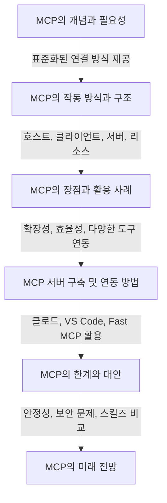

# AI 스터디 2회차 내용 공유

정리일: 2026-10-08 · 교육 에셋 N0786

본문 수집·공개 편집. 도구 실행·최신 기능 재검증은 미실시. 고객·참여자 정보와 개별 접근 링크, 원본 첨부는 제외했습니다.

---

## AI 에이전트 및 MCP 기술 통합 분석 보고서
---

[원본 이미지 제외]
## **1. AI 에이전트의 정의 및 등장 배경**
### **기존 챗봇 형태에서 능동적 에이전트로의 패러다임 변화 원인 분석**
- 대규모 언어 모델(LLM)의 구조적 한계로 지적되어 온 수동적 단방향 질의응답 인터페이스가 외부 시스템과의 능동적 상호작용 및 다단계 추론 워크플로우를 독자적으로 기획하고 수행하는 자율형 에이전트 아키텍처로 전면 개편됨.
- 과거 단순 텍스트 생성에 머물렀던 AI의 역할이 파일 시스템 접근, 외부 API 호출, 터미널 명령어 실행, 코드 컴파일, 에러 검출, 테스트 자동화 등을 스스로 판단하고 실행하는 능동형 운영 주체로 진화함.
- 오픈클로(OpenClaw)와 같은 오픈소스 기반의 자율형 에이전트 게이트웨이가 인프라 계층에 도입됨에 따라, 사용자는 텔레그램(Telegram), 왓츠앱(WhatsApp) 등의 대중적인 모바일 메신저 환경에서도 복잡한 백엔드 작업을 에이전트에게 위임할 수 있는 환경이 조성됨.
- 자율형 에이전트의 도입은 인간의 인지적 한계를 초과하는 방대한 데이터의 실시간 파싱, 분산된 문서의 병렬 검색, 능동적인 이메일 분류 및 요약 등 일상적이고 반복적인 업무의 처리 속도를 극대화하여 기업 및 개인의 생산성 패러다임을 혁신적으로 전환시키는 핵심 동력으로 작용함.
- 이러한 패러다임 변화의 기저에는 AI 모델이 외부 세계와 소통하기 위한 표준화된 규격의 부재라는 병목 현상이 존재했으며, 이를 해결하기 위해 범용 프로토콜과 로컬 실행 런타임의 결합이 필수적인 기술적 요구사항으로 대두됨.
### **오픈클로(OpenClaw)와 MCP의 개념적 정의 및 차이점 정리**
- 2025년 11월에 최초 공개된 오픈클로(OpenClaw)는 로컬 하드웨어 및 클라우드(GCP VM 등) 환경에서 AI 에이전트의 구동, 라우팅, 보안 샌드박싱을 총괄하는 독립적인 오픈소스 자율형 에이전트 게이트웨이(Agent Gateway) 시스템임.
- 오픈클로는 단순한 통신 규격을 넘어 모델 추론 파이프라인, 도구 실행을 위한 격리된 샌드박스, 웹소켓(WebSocket) 기반의 세션 상태 유지, 순수 마크다운(Markdown) 기반의 장단기 기억 장치를 단일 런타임 내에 통합하여 관리하는 '운영 체제'의 역할을 수행함.
- 반면, MCP(Model Context Protocol)는 앤스로픽(Anthropic)이 제안한 개방형 표준 프로토콜(Open Standard Protocol)로서, AI 모델(추론 엔진)과 외부 데이터 소스 또는 도구 간의 양방향 통신 규격을 JSON-RPC 2.0 포맷으로 정의한 논리적 인터페이스임.
- MCP는 독자적인 실행 권한이나 상태 유지 능력을 보유하지 않은 순수한 연결 매개체이며, 앤스로픽은 이를 'AI를 위한 USB-C 타입'으로 명명하여 어떠한 하드웨어나 소프트웨어 환경에서도 플러그 앤 플레이(Plug-and-play) 방식으로 통합할 수 있는 범용성을 강조함.
- 결론적으로 오픈클로가 에이전트의 생존 및 활동을 보장하는 물리적·논리적 서식지(Runtime)를 제공한다면, MCP는 그 서식지 내의 에이전트가 외부의 방대한 데이터베이스나 API 시스템과 소통하기 위해 채택하는 만국 공통어(Standard Protocol)로 기능하여 명확한 아키텍처 상의 역할 분담을 이룸.
## **2. 기술적 아키텍처 및 작동 원리**
### **MCP(Model Context Protocol): 3계층 구조 및 전송 표준화 원리**
- MCP 아키텍처는 시스템의 확장성과 격리성을 보장하기 위해 호스트(Host), 클라이언트(Client), 서버(Server)로 구성된 엄격한 3계층 논리 구조를 채택함.
- 호스트(Host)는 Claude Desktop, IDE(Visual Studio Code, Cursor, Windsurf 등)와 같이 사용자의 초기 자연어 요청을 수신하고, 시스템 전반의 컨텍스트 접근을 조율하는 최상위 AI 애플리케이션으로 기능함.
- 클라이언트(Client)는 호스트 프로세스 내부에 인스턴스화되어 존재하며, 연결된 특정 MCP 서버와 1:1 세션 관계를 유지하고, 서버로부터 반환된 데이터를 조합하여 최종 프롬프트를 조립(Prompt Assembly)하거나 상태 관리를 수행하는 오케스트레이션 역할을 담당함.
- 서버(Server)는 로컬 런타임 또는 원격 클라우드에 위치하며 클라이언트의 JSON-RPC 요청을 실제 외부 서비스 동작(데이터베이스 쿼리, 파일 시스템 IO, API 호출 등)으로 변환하는 경량화된 연결 프로그램임.
- 데이터 계층(Data Layer)은 서버가 클라이언트에게 컨텍스트를 제공하기 위한 3대 핵심 원시 데이터(Primitives)를 노출하며, 이는 읽기 전용 데이터인 리소스(Resources), 실행 가능한 함수인 도구(Tools), 상호작용 템플릿인 프롬프트(Prompts)로 분류됨.
- 전송 계층(Transport Layer)은 물리적 통신 채널을 추상화하며, 단일 기기 내의 프로세스 간 통신을 위한 고속 표준 입출력(Stdio) 방식과 원격 서버와의 실시간 데이터 스트리밍을 지원하는 HTTP/SSE(Server-Sent Events) 방식을 이원화하여 제공함.
### **OpenClaw: 로컬 기반 실행 구조, 장기 기억 및 스킬 확장 시스템**
- 오픈클로는 기존 AI 시스템이 겪던 장기 컨텍스트 유실 문제를 해결하기 위해, 연산 부하가 높은 벡터 데이터베이스(Redis, Pinecone 등)를 배제하고 경량화된 마크다운(Markdown) 파일 시스템과 SQLite 확장(sqlite-vec) 모델을 결합한 독창적인 3티어 메모리 아키텍처를 도입함.
- 최상위 티어인 `MEMORY.md`는 사용자의 고정된 선호도, 프로젝트 아키텍처 결정 사항, 영구적 사실 등 장기 기억을 저장하며 매 세션 시작 시 시스템 프롬프트에 자동 적재됨.
- 중간 티어인 `memory/YYYY-MM-DD.md`는 에이전트의 일일 실행 관찰 및 단기 컨텍스트를 기록하는 일지 형태로 동작하며, 당일 및 전일의 데이터만을 동적으로 병합하여 토큰 낭비를 억제함.
- 백그라운드 프로세스인 `DREAMS.md`는 에이전트가 유휴 상태일 때 이전 작업 기록의 패턴을 스스로 요약 및 정제하여, 가치가 입증된 단기 기억을 장기 기억(`MEMORY.md`)으로 승격시키는 메모리 스윕(Memory Sweep) 및 30일 경과 데이터의 에이징 기반 삭제(Decay) 로직을 수행함.
- 스킬 확장 측면에서 Antfarm 모듈을 통합하여 단일 커맨드 실행만으로 다중 에이전트 팀을 구성하며, 기획자(Planner), 개발자(Developer), 검증자(Verifier), 테스터(Tester), 리뷰어(Reviewer)로 역할이 세분화된 에이전트들이 상호 검증하는 반복 가능한(Repeatable) 워크플로우를 생성함.
### **Claude Code Ultra Plan: 병렬 에이전트 체계 및 텔레포트(Teleport) 워크플로우**
- Claude Code Ultraplan은 개발자의 로컬 CLI 터미널 자원 점유율을 최소화하기 위해, 복잡한 코드 베이스 분석 및 아키텍처 기획 연산을 원격 앤스로픽 클라우드 인스턴스로 오프로드(Offload)하는 획기적인 기능임.
- 해당 시스템은 내부적으로 병렬 에이전트 분산 아키텍처를 가동하며, 독립적으로 코드를 탐색 및 분석하는 3명의 워커 에이전트(탐색 3명)와 이들의 산출물을 취합, 비평, 조율하는 1명의 코디네이터 에이전트(비평 1명)가 Unix Domain Sockets(UDS)를 기반으로 고속 통신하는 체계를 이룸.
- 터미널에서 작업 지시가 클라우드로 이관되면 로컬 환경의 블로킹 현상이 해제되어 개발자는 다른 작업을 병행할 수 있으며, CLI 창의 `◇ ultraplan` 상태 표시기를 통해 원격 코디네이터의 기획 진행 상황을 실시간으로 모니터링함.
- 클라우드 환경에서 최대 30분간 수행된 기획안이 브라우저 인터페이스를 통해 최종 승인되면, '텔레포트(Teleport)' 메커니즘이 발동하여 클라우드의 완성된 컨텍스트와 기획 데이터가 사용자의 로컬 터미널로 즉각 주입됨.
- 텔레포트의 성공적 실행을 위해서는 작업 디렉터리의 깃(Git) 상태가 커밋 또는 스태시(Stash)를 통해 정리(Clean)되어 있어야 하며, 로컬과 클라우드가 동일한 레포지토리, 동일한 브랜치, 동일한 인증 계정을 공유함이 필수적임.
- 텔레포트 완료 시 터미널은 세 가지 실행 분기를 제공하며, 기존 대화 흐름을 유지하며 기획을 즉시 주입하는 'Implement here', 이전 맥락을 소거하고 기획안만으로 완전히 새로운 세션을 시작하는 'Start new session', 기획안을 실행하지 않고 마크다운 파일로만 보존하는 'Cancel' 옵션 중 하나를 선택하여 워크플로우를 완성함.
## **3. 주요 도구 및 환경 설정 가이드**
### **하드웨어: 맥미니 M4의 가성비 및 저전력 효율 (VRAM 공유 장점 포함)**
- 로컬 에이전트 구동을 위한 하드웨어 인프라 평가 결과, 600달러 가격대로 출시된 애플의 베이스 모델 맥미니 M4 시스템이 비용 대비 연산 효율 부문에서 압도적인 시장 우위를 점유함이 확인됨.
- 애플 실리콘 아키텍처의 핵심인 통합 메모리(Unified Memory) 구조는 시스템 RAM(기본 32GB 이상 구성 권장)을 GPU VRAM으로 동적 할당할 수 있도록 지원하여, RTX 4090 수준의 고가 외장 그래픽카드 없이도 Llama 3.2 70B 파라미터급의 거대 로컬 LLM을 원활히 적재하고 구동하는 강력한 이점을 제공함.
- 전력 소비 효율(Power Efficiency) 측면에서 맥미니 M4는 아이들(Idle) 대기 상태에서 라즈베리 파이(Raspberry Pi)와 유사한 수준인 3\~4W의 극단적인 저전력을 소모하여 24시간 상시 가동되는 에이전트 호스트로서의 경제성이 탁월함.
- 연산 스트레스 테스트 결과 시스템 최대 부하 상태(42W)에서 283 Gflops의 성능을 달성하여 전력당 6.74 Gflops/W라는 극한의 효율을 기록했으며, 이는 이전 세대 하이엔드 칩셋인 M1 Max(66W 소모, 264 Gflops, 4.00 Gflops/W)의 종합 성능을 상회하는 수치임.
- Blender 3D 그래픽 렌더링 벤치마크 테스트에서 맥미니 M4 베이스 모델은 고부하 다중 작업 상태에서도 45분 만에 렌더링을 완료하여, 64GB RAM을 탑재한 M1 Max 맥북 프로 대비 오히려 30분 더 빠른 처리 속도를 실증함.
- 공간 활용도 측면에서도 표준 1.25U 서버 랙 공간에 3대의 맥미니를 병렬 클러스터링으로 배치할 수 있으며, 클러스터 아이들 전력이 10W 내외에 불과하여 엔터프라이즈급 AI 인프라 구축의 대안으로 부상함.

**하드웨어/칩셋**

**타겟 모델 환경**

**소비 전력(최대)**

**연산 성능(Gflops)**

**전력당 효율(Gflops/W)**

**Mac Mini M4**

Base (\$600)

42W

283

6.74

**M1 Max**

Mac Studio / Pro

66W

264

4.00

### **소프트웨어 및 라이브러리 환경 설정**
- 다기능 MCP 서버를 구축하고 유지보수하기 위한 핵심 프로그래밍 환경으로 Node.js 생태계와 Python 생태계가 표준으로 채택되었으며, 모델 컨텍스트 프로토콜 공식 규격에 따른 Tier 1 수준의 SDK가 완벽히 지원됨.
- 공식 SDK 티어 분류 체계에 따르면 기능 완전성과 유지보수성이 보장되는 Tier 1 SDK는 TypeScript, Python, C#, Go 언어를 지원하며, Tier 2로는 Java, Rust가, Tier 3로는 Swift, Ruby, PHP 환경이 제공됨.
- TypeScript 환경의 개발자들은 LiteMCP 및 FastMCP와 같은 고수준 프레임워크를 도입하여 복잡한 JSON-RPC 직렬화 로직을 추상화하고, 선언적인 문법으로 신규 MCP 서버 템플릿을 신속히 생성함.
- Python 환경의 경우 패키지 매니저로 `uv`를 적극 활용하여 가상 환경 생성 및 패키지 설치 속도를 비약적으로 단축시키며, 독립된 실행 환경 내에서 MCP 런타임을 샌드박싱하여 외부 라이브러리 간의 의존성 충돌을 원천 차단함.
- 프로젝트 환경 설정의 자동화를 위해 프로젝트 최상위 루트 디렉터리에 `CLAUDE.md` 또는 `SKILL.md` 마크다운 파일을 배치함이 필수적이며, 이를 통해 프로젝트 코딩 컨벤션, 의존성 라이브러리 명세, 린트(Lint) 규칙 등을 에이전트가 세션 초기화 단계에서 자동으로 파싱하여 시스템 프롬프트에 동기화함.
### **연동 실습: Notion, Slack, Telegram, Discord, GitHub API 프로세스 요약**
- 다양한 외부 애플리케이션 리소스를 에이전트 컨텍스트에 편입하기 위한 API 연동은 전송 계층의 Streamable HTTP 방식 또는 로컬 STDIO 방식을 통하여 표준 JSON-RPC 2.0 포맷으로 수행됨.
- **GitHub 연동:** Octocode MCP 서버를 매개로 레포지토리 내의 방대한 코드 베이스를 AI가 검색하고, 이슈 트래킹 로그를 분석하며, 정적 분석 후 인간의 개입 없이 풀 리퀘스트(Pull Request)를 자율적으로 생성하고 브랜치를 병합(Merge)하는 완전 무인화 프로세스를 실현함.
- **Notion 및 Slack 연동:** 에이전트가 처리한 워크플로우 상태 및 주요 데이터 추출 결과를 기업의 공식 커뮤니케이션 채널과 문서화 도구에 실시간 양방향으로 동기화하여 조직 전체의 정보 투명성을 확보함.
- **Telegram 및 WhatsApp 연동:** OpenClaw 런타임 환경에 봇(Bot) API를 연동하여 모바일 기기를 통한 원격 에이전트 제어 인터페이스를 구축하며, 외부 이동 중에도 자연어 명령을 하달하여 실시간으로 복잡한 데이터 분석 및 요약 메일을 수신하는 모바일 자율 작업 환경을 완성함.
- **Discord 연동:** 서버 내 심각한 오류 발생 로그나 배치 작업 완료 알림을 웹훅(Webhook) 및 봇 API 기반으로 비동기식 수신하여 24시간 중단 없는 시스템 모니터링 경고 체계를 구축함.
## **4. 실전 활용 사례 및 자동화 시나리오**
### **콘텐츠 제작 및 수집: 테크 뉴스 크롤링과 유튜브 분석 리포트 자동화**
- 웹 콘텐츠 수집 과정에서 직면하는 비정형 HTML 데이터의 파싱 난제를 해결하기 위해 파이어크롤(Firecrawl) 도구가 에이전트 워크플로우에 통합되었으며, 이를 통해 복잡한 테크 뉴스 웹페이지를 AI 모델이 즉각 소비할 수 있는 순수 마크다운 포맷(`llms.txt`)으로 일괄 변환하여 추출함.
- 단순 정적 페이지가 아닌 자바스크립트 렌더링이 필수적인 동적 웹사이트의 크롤링을 위해, Playwright 또는 Puppeteer와 같은 헤드리스(Headless) 브라우저 자동화 라이브러리를 시스템에 연동함.
- 도구 선정 시 Playwright는 Chromium, Firefox, WebKit 등 멀티 브라우저 네이티브 지원 및 내장된 자동 대기(Auto-wait) 기능을 제공하여 복잡한 E2E(End-to-End) 환경에 적합한 반면, 구글 크롬 팀이 직접 관리하는 Puppeteer는 단일 Chrome 환경에서의 단순 데이터 추출 및 크롬 개발자 도구(DevTools)와의 심층 통합 작업에 압도적인 속도를 보임이 입증됨.
- 유튜브 데이터 분석의 경우 자동화 에이전트가 Puppeteer를 통해 목표 영상의 자막(CC) 텍스트 노드를 파싱하고, 파이어크롤의 인터랙트(Interact) 엔드포인트를 활용해 영상 내 핵심 메타데이터를 추출한 뒤, 최종적으로 LLM 기반 요약 모듈을 거쳐 정형화된 인사이트 리포트를 생성하는 종단간(End-to-End) 파이프라인을 구축함.

**기능 비교 항목**

**Playwright**

**Puppeteer**

**지원 브라우저 범위**

Chromium, Firefox, WebKit

Chrome/Chromium 중심 (Firefox 베타)

**개발 언어 지원**

JavaScript, TypeScript, Python, Java,.NET

JavaScript, TypeScript 전용

**요소 렌더링 대기**

시스템 내장 자동 대기 (Built-in Actionability)

수동 대기 호출 (waitForSelector) 필수

**주도 기관 및 배포**

Microsoft (2020년 출시)

Google Chrome DevTools 팀 (2017년 출시)

**최적 활용 시나리오**

복잡한 크로스 브라우저 테스트 및 기업용 E2E

Chrome 특화 단순 스크립팅 및 스텔스 크롤링

### **개발/코딩 고도화: 안티그래비티 기반 '코딩 신' 세팅**
- 고도의 복잡성을 지닌 프로그래밍 문제를 해결하기 위해 구글의 제미나이 3(Gemini 3) 기반 Anti-gravity 환경과 Claude Code 2.1 플러그인을 결합하여, 심층 사고력을 극대화한 이른바 '코딩 신' 에이전트 세팅을 구현함.
- 해당 세팅은 Context 7 데이터베이스 주입 기술과 순차적 사고(Sequential Thinking) 프롬프트 엔지니어링을 결합하여, 단일 지시로 코드의 종속성, 아키텍처 결함, 보안 취약점을 다차원적으로 검토하는 논리 추론 프로세스를 가동함.
- 게임 개발 엔진 수정 시연 사례에서, 에이전트는 C++ 물리 엔진 소스(b2Island.cpp)를 직접 탐색하고 기본 중력 연산식인 `b->m_linearVelocity += step.dt * (gravity + b->m_invMass * b->m_force)` 로직에 커스텀 중력 인자(Gravity Factor)를 곱하는 형태로 정밀한 수학적 수정을 단독 수행하여 인간 개입 없는 엔진 튜닝을 완수함.
- 비주얼 콘텐츠 컴파일 영역에서는 커서 에이전트 스킬(Cursor Agent Skills)과 Test Sprite 기술을 연동하여, Remotion 라이브러리 기반의 비디오 자동화 렌더링 스크립트 작성부터 커스텀 브랜드 로고 애니메이션 컴파일 및 시각적 테스트까지 전 과정을 10배 빠른 속도로 자율화함.
- 클라우드 개발 인프라 내에서는 솔라나(Solana) 블록체인 생태계와 직결된 트레이딩 봇 서버(Jupiter MCP, Uniswap PoolSpy 등)를 컨테이너로 배포하고 크론잡(Cron jobs) 스케줄러와 연동하여, 인간의 감독 없이 24시간 연중무휴로 코드를 리팩토링하고 신규 유동성 풀을 추적하는 완전 자율형 소프트웨어 엔지니어 시스템을 가동함.
### **업무 자동화: 이메일 일정 조율 및 가계부·서류 정리 시스템**
- 일상적 금융 및 행정 업무의 완전한 자동화를 목표로 네이버페이 금융 데이터에 접근 권한을 부여받은 재무 에이전트를 구축하여, 개별 소비 영수증 파싱 및 가계부 지출 내역 자동 분류 작업을 실시간으로 수행함.
- 로컬 환경에서는 LedgerAI MCP 서버를 도입하여 터미널 내 복식부기(Double-entry accounting) 데이터를 안전한 CLI 인터페이스로 쿼리하고, LLM이 금융 포트폴리오의 건전성을 교차 검증하는 자동 분석 체계를 확립함.
- 기업 내 전문직 사용자의 실증 사례에 따르면, 왓츠앱을 통해 명령을 수신한 에이전트가 Emma.msrb.org의 방대한 미국 지방채권(Municipal Bond) 분기별 보고서를 직접 크롤링하고, 클라이언트의 투자설명서(OS) 3건을 동시 비교 분석하여 단 3분 만에 치밀한 개선안 이메일을 작성 및 발송하는 경이적인 생산성 향상 지표를 기록함.
- 다자간 협업 환경에서는 이메일 Inbox 서버와 구글 캘린더 MCP 서버를 병렬 연결하여 수신된 이메일 내의 회의 제안 시간을 파싱하고, 전체 참여자의 가용 시간을 교차 검증하여 최적의 회의 일정을 자동 확정함.
- 복잡도와 분량이 방대한 금융권 대출 서류 등의 PDF 문서를 에이전트가 직접 파싱하여 필수 제출 목록, 누락된 서명 구간, 약관의 핵심 리스크를 요약한 사용자 맞춤형 가이드 문서를 자동 생성함.
## **5. 기술적 한계 및 비판적 검토**
### **MCP의 단점: 컨텍스트 윈도우 낭비 및 네트워크 연결 불안정성**
- MCP 프로토콜의 가장 치명적인 단점은 '고정된 도구 정의 패턴(Fixed Tool Definitions)'을 사용하여, 에이전트가 특정 도구를 실제 사용하지 않더라도 도구 스키마 명세(도구당 평균 100\~300 토큰)가 시스템 프롬프트에 상시 적재되어 제한된 컨텍스트 윈도우 자원을 심각하게 낭비한다는 점임.
- 다수의 MCP 서버(예: 슬랙, 깃허브, 노션 동시 연결)가 복합적으로 연동될 경우 수천 토큰이 단지 도구 정의만으로 소진되어, 정작 핵심적인 비즈니스 로직이나 추론을 위한 여유 토큰이 극도로 부족해지는 구조적 비효율성이 발생함.
- HTTP/SSE 기반 전송 계층의 네트워크 통신 특성상 서버 간 지연(Latency) 및 연결 불안정성이 필연적으로 존재하며, 단일 API 호출의 타임아웃 발생 시 클라이언트 단의 오케스트레이션 단계에서 전체 다중 에이전트 워크플로우가 정지되는 심각한 병목 지점이 존재함.
### **보안 리스크: 좀비 PC 전락 위험성 및 기업의 사용 금지 사례**
- 에이전트에게 파일 시스템 제어 및 외부 도구 호출의 자율적 권한(Arbitrary Code Execution)을 부여함에 따라 심각한 제로데이 보안 사고가 발생할 물리적 위험이 상존하며, 실제 2026년 4월 한 암호화폐 트레이더가 에이전트에게 포트폴리오 제어권을 부여했다가 로직 오류 및 탈취로 인해 100만 달러의 치명적 손실을 기록한 사례가 학계에 보고됨.
- 악의적으로 조작된 써드파티 기술(ClawHub Skills)을 검증 없이 다운로드하여 실행할 경우 프롬프트 인젝션(Prompt Injection) 또는 코드 인젝션(Code Injection) 공격에 즉각 노출되며, 터미널 명령어가 무단 실행되어 사용자의 업무 이메일이 대량 삭제되고 호스트 PC가 해커의 좀비 PC로 전락하는 인프라 붕괴 사례가 발견됨.
- 이러한 심각한 보안 리스크로 인해 앤스로픽(Anthropic) 본사 측에서 공식적으로 자사 클라우드 인프라 내 OpenClaw 사용을 강제 금지(Banning)하는 조치를 취했으며, 이에 반발한 오픈클로 창시자 피터 스테인버거(Peter Steinberger)가 경쟁사인 OpenAI로 전격 이직(2026년 2월)하는 등 엔터프라이즈 AI 보안 표준을 둘러싼 업계 간 기술적 마찰이 극도로 심화됨.
- 국내의 경우 네이버, 카카오를 비롯한 주요 IT 대기업들은 외부 원격 서버로의 내부 데이터 무단 유출 가능성 및 제로 데이터 보존(Zero Data Retention, ZDR) 원칙 위반 리스크를 선제적으로 차단하기 위해, 로컬망 외부로 통신하는 검증되지 않은 퍼블릭 MCP 서버의 사내 업무망 도입을 사내 보안 규정으로 엄격히 금지함.
### **대안 제시: 스킬즈(Skills) 방식의 점진적 구조 및 효율성 분석**
- 상시 토큰 적재라는 MCP의 구조적 한계와 비효율성을 근본적으로 보완하기 위해, 마크다운 문서 및 격리된 실행 샌드박스를 결합한 '스킬즈(Skills)' 아키텍처가 토큰 고효율 대안 기술로 급부상함.
- 스킬 아키텍처는 '점진적 로딩(Progressive Disclosure)'이라는 획기적인 방식론을 채택하여, 세션 초기화 단계에서는 100 토큰 미만의 핵심 메타데이터(YAML)만을 스캔하고, 실제 자연어 프롬프트가 트리거 조건을 충족시키는 순간에만 2,000\~5,000 토큰 규모의 전체 지시 문서(`SKILL.md`)를 동적 로드하므로 컨텍스트 토큰 효율성이 압도적으로 우수함.
- 도구 실행 과정에서 수반되는 복잡한 파이썬 연산 로직이나 자바스크립트 소스 코드는 외부 시스템의 코드 샌드박스 내부에서 묵시적으로 처리되며, 최종 연산 결과값(Output)만이 컨텍스트 윈도우로 반환되므로 방대한 원시 코드 유입에 의한 토큰 소진을 원천 차단함.
- 사전에 하드코딩된 정형화된 JSON-RPC 스키마 규칙에 구속되는 MCP와 비교하여, 스킬 시스템은 순수 자연어 명령어 기반으로 동작하므로 복잡한 룰 기반 비즈니스 로직(예: VIP 고객 식별 및 이메일 답변 어조의 맥락적 변경)을 처리할 때 AI 모델의 자체 추론력을 극대화하는 높은 유연성을 보장함.

**비교 평가 항목**

**Skills (에이전트 스킬 시스템)**

**MCP (모델 컨텍스트 프로토콜)**

**토큰 소모 및 적재 방식**

점진적 로딩 (트리거 충족 시 전체 로드)

상시 적재 (고정된 스키마 구조 상시 유지)

**명령 유연성 및 제어 권한**

자연어 지시 기반의 높은 해석적 유연성 보장

사전 정의된 스키마 규격 내 결정론적 API 실행

**스크립트 코드 실행 환경**

에이전트 제어 하의 샌드박스 내부 직접 실행

외부 분리된 원격/로컬 서버로 API 통신 수행

**최적 도입 권장 시나리오**

복잡한 룰 기반 비즈니스 로직 및 다단계 배치 작업

정형화된 외부 데이터베이스의 빈번한 실시간 호출

## **6. 결론 및 미래 전망**
### **UI의 종말과 단일 채팅 인터페이스(UI-less) 시대의 도래**
- 터미널 환경에서 단순 텍스트 기반의 tmux 세션 제어에 의존했던 과거의 한계를 탈피하여, 에이전트가 CDP(Chrome DevTools Protocol)를 통해 브라우저 렌더링 엔진 깊숙이 침투하여 실제 DOM 트리 구조, CSS 컴퓨팅 속성, 픽셀 렌더링 단위의 시각 정보를 직접 제어하고 조작하는 극한의 진화 단계로 진입함.
- 사용자는 복잡하게 분산된 애플리케이션의 그래픽 사용자 인터페이스(GUI) 요소들을 마우스로 클릭할 필요가 일절 없어졌으며, 단일 텍스트 프롬프트 채팅창이나 CLI 터미널 하나만으로 수십 개의 분산 시스템을 오케스트레이션하는 'UI-less(인터페이스 소멸)' 패러다임이 업계의 기술적 표준으로 확립됨.
- 기술 철학적 관점에서 "개인 개발자의 단순 바이브 코딩(Vibe Coding) 영역에서는 자유로운 CLI 제어가 효율적이지만, 대규모 엔터프라이즈급 조직 단위에서는 HTTP 기반의 엄격한 MCP 프로토콜이 에이전트의 보안적 제약 및 시스템 아키텍처 정렬에 필수적이다"라는 비판적 합의가 도출되며, 양 진영의 아키텍처가 각자의 특화된 영역을 구축하며 융합 발전하는 추세가 가속화됨.
### **기업 내부 데이터 보호를 위한 로컬 모델(Local LLM) 도입의 필수성**
- 외부 퍼블릭 클라우드 기반 AI API 연결 시 필연적으로 발생하는 기업 핵심 지식재산권(IP) 유출, 코드 베이스 탈취, 그리고 각국의 강화된 개인정보보호 보안 규정 위반 리스크를 원천적으로 방지하기 위해, 오프라인 로컬 호스트망 기반의 폐쇄형 오픈클로(OpenClaw) 런타임 도입이 엔터프라이즈 IT의 최우선 과제로 부상함.
- 애플 맥미니 M4와 같이 소형 폼팩터 내부에 고성능 NPU 및 통합 메모리 구조를 탑재한 비용 효율적인 엣지(Edge) 컴퓨팅 하드웨어가 널리 대중화됨에 따라, 클라우드 서버에 종속될 필요 없이 Llama 3.2 등 70B 파라미터급 오픈소스 로컬 LLM을 기업 내부망(On-premise)에 독립 구축함이 필수적이고 실현 가능한 기술로 입증됨.
- 네이버가 2026년 주주총회에서 천명한 소버린 AI(Sovereign AI) 전략에서 명확히 관찰되듯, 향후 기업형 B2B 및 B2C 플랫폼 생태계는 단순 텍스트 검색 포털의 수준을 완전히 벗어나 내부 결제망, 예약 데이터베이스, 의료 재무 데이터 등을 철저히 격리된 독립 로컬 MCP 서버 내에서 안전하게 자율 연산하는 '총체적 에이전트 플랫폼(Agent Platform)'의 형태로 산업 구조가 완전 전환될 것임이 자명함.

---
## 1. 개요
## 1.1. 서론
- AI 시대에 필수적인 기술로 떠오르는 '모델 컨텍스트 프로토콜(MCP)'에 대해 알아봅니다.
- MCP는 AI 모델이 외부 서비스와 도구를 표준화된 방식으로 연결하고 소통할 수 있게 돕는 기술입니다.
- 복잡한 AI 개발 과정을 단순화하고 확장성을 높여, AI 에이전트 시대의 핵심적인 역할을 할 것으로 기대됩니다.
## 1.2. 전체 구조

## 2. MCP의 개념과 필요성
## 2.1. MCP란 무엇인가?
- MCP는 '모델 컨텍스트 프로토콜(Model Context Protocol)'의 약자입니다.
- AI 모델이 외부 데이터 소스, 도구, 서비스와 양방향으로 연결될 수 있도록 표준화된 방식을 제공하는 개방형 프로토콜입니다.
- 마치 다양한 하드웨어 기기를 연결하는 USB-C 포트처럼, AI와 외부 도구들을 쉽게 연결해주는 역할을 합니다.
- 프로토콜은 컴퓨터나 통신 장비 간에 데이터를 주고받는 규칙의 집합을 의미합니다.
## 2.2. MCP가 필요한 이유
- 기존에는 AI 모델을 외부 도구와 연결하기 위해 각 프레임워크나 플랫폼에 맞춰 커스텀 구현이 필요했습니다.
- 이는 확장성을 어렵게 만들고, 도구가 늘어날수록 유지보수 부담이 커지는 단점이 있었습니다.
- AI 모델 자체만으로는 외부 정보를 알 수 없어 '할루시네이션(환각 현상)'이 발생할 수 있습니다.
- MCP는 이러한 문제를 해결하여, AI와 도구 연결 시 매번 새로운 구현 없이 통일된 방식으로 연동할 수 있게 합니다.
- AI 에이전트 개발 시, 다양한 능력을 부여하는 데 필요한 코드가 복잡해지는 문제를 해결합니다.
- 'MCP는 죽었다'는 말이 나올 정도로 안정성, 보안, 디버깅의 어려움이 제기되기도 합니다.
## 3. MCP의 작동 방식과 구조
## 3.1. MCP의 핵심 구성 요소
- MCP는 크게 세 가지 아키텍처로 구성됩니다.
- **MCP 서버**: MCP 표준으로 정의된 도구들을 의미하며, 각 기능이 하나의 서버에 구현됩니다.
- 도구(Tools): AI가 호출하여 특정 작업을 수행하는 함수입니다. (예: 메시지 전송, DB 업데이트)
- 리소스(Resources): 파일, DB 레코드, API 응답 등 AI에게 더 많은 컨텍스트를 제공하는 데이터입니다. (예: GET 요청)
- 프롬프트(Prompts): 사용자가 더 명확한 지시를 AI에게 내릴 수 있도록 돕는 템플릿입니다.
- **MCP 클라이언트**: 사용자의 요청을 받아 MCP 서버에 전달하는 AI 애플리케이션입니다. (예: Claude, Csor)
- **MCP 호스트**: MCP 클라이언트를 포함하며, MCP를 통해 도구나 데이터에 접근하려는 주체를 의미합니다. (예: Cursor ID, Claude 데스크톱, ChatGPT)
## 3.2. MCP 작동 과정
- 사용자가 AI에게 명령을 내리면, MCP 클라이언트가 이를 분석합니다.
- 필요한 MCP 서버를 판단하여 해당 서버에 요청을 전달합니다.
- MCP 서버는 요청받은 도구나 리소스를 활용하여 작업을 수행합니다.
- 작업 결과를 다시 MCP 클라이언트로 전달하여 사용자에게 응답합니다.
- MCP 서버는 로컬 데이터 소스, 외부 API, 원격 서비스와 연결될 수 있습니다.
- AI 호스트(클라이언트)는 LLM 기능을 담당하고, MCP 서버는 외부 기능 수행을 담당합니다.
## 4. MCP의 장점과 활용 사례
## 4.1. MCP의 주요 장점
- **표준화된 연결**: AI 모델과 도구 간의 표준화된 연결을 제공하여 통합을 용이하게 합니다.
- **확장성 및 유연성**: 사전 구축된 다양한 컨텍스트 도구 연결이 가능해지고, 3계층 아키텍처로 각 요소의 유지보수가 용이합니다.
- **개발 효율성 증대**: 각 프레임워크나 플랫폼에 맞춰 개별 구현할 필요 없이, 표준화된 방식으로 도구를 연동할 수 있습니다.
- **새로운 비즈니스 기회 창출**: MCP 서버를 개발하여 API 키 판매 등으로 새로운 수익 모델을 만들 수 있습니다.
## 4.2. MCP 활용 사례
- **웹사이트 개발**:
- Context7 MCP를 활용하여 디자인 시스템, 컨텍스트, 로직을 AI에게 전달하여 웹사이트 개발을 돕습니다.
- Sequential Thinking MCP를 통해 AI가 스스로 생각하고 고품질 결과물을 생성하도록 유도합니다.
- Test Sprite MCP를 활용하여 코드 디버깅 및 테스트를 자동화합니다.
- 대표 사례: Manyfast X Claude MCP 가이드북(jay.pm.ai)
- **업무 자동화**:
- Notion MCP를 연결하여 AI가 Notion에 글을 쓰거나 문서를 읽고 분석하도록 합니다.
- YouTube MCP를 통해 영상 스크립트를 가져와 핵심 내용을 요약합니다.
- Slack MCP를 통해 AI가 메시지를 보내거나 슬랙 채널에 정보를 게시합니다.
- Google Drive, GitHub 등 다양한 서비스와 연동하여 AI가 데이터를 조작하고 정보를 가져오도록 합니다.
- **3D 모델링**:
- Blender MCP를 통해 AI가 3D 모델링 도구를 직접 조작하여 오브젝트를 생성하고 수정합니다.
- **데이터 분석 및 리포트 생성**:
- Firecrawl MCP를 사용하여 웹페이지를 크롤링하고, Slack MCP를 통해 슬랙으로 리포트를 전송합니다.
- YouTube MCP와 Notion MCP를 연동하여 채널 분석 리포트를 생성하고 Notion에 업데이트합니다.
- **로봇 제어**:
- ROS MCP를 통해 AI가 로봇을 제어하고 카메라로 주변 환경을 인식합니다.
## 5. MCP 서버 구축 및 연동 방법
## 5.1. MCP 서버 구축 도구
- **Fast MCP**: Python 기반으로 MCP 서버를 쉽게 만들 수 있는 라이브러리입니다.
- `MCP.tool`, `MCP.resource`, `MCP.prompt` 데코레이터를 사용하여 기능을 정의합니다.
- **Fast MCP Cloud**: 로컬에서 만든 MCP 서버를 클라우드에서 실행하고 관리할 수 있게 해주는 서비스입니다.
- **SDK**: Python, TypeScript, Java, Kotlin 등 다양한 언어별 SDK를 제공합니다.
## 5.2. MCP 서버 연동 방법
- **Claude 데스크톱**:
- 설정 \> 개발자 \> 설정 편집에서 `claude_desktop_config.json` 파일에 MCP 서버 정보를 추가합니다.
- 로컬 서버 실행 시 `uvicorn main:app --reload`와 같은 명령어를 사용합니다.
- 원격 서버 연결은 향후 지원 예정입니다.
- **Cursor**:
- 설정 파일에 MCP 서버 정보를 복사하여 붙여넣는 방식으로 연동합니다.
- `Ctrl+Shift+P`를 눌러 MCP 연결 메뉴를 사용합니다.
- STDIO (표준 입출력) 또는 Streamable HTTP 방식으로 연결할 수 있습니다.
- **Anti-gravity**:
- MCP 서버 관리 패널에서 설정 파일에 MCP 서버 정보를 추가하고 API 키를 입력합니다.
- 에러 발생 시 환경 변수에 경로를 추가하는 방식으로 해결할 수 있습니다.
- **CrewAI**:
- MCP 서버를 툴로 등록하여 에이전트가 활용하도록 합니다.
- 로컬 실행 시 `pip install`로 설치하거나, 원격 서버 주소를 입력하여 연결합니다.
## 5.3. MCP 서버 찾기
- **Smith.ai**: 다양한 커뮤니티에서 만든 MCP 서버를 검색하고 설치할 수 있습니다.
- **GitHub**: 개발자들이 직접 만든 MCP 서버 소스 코드를 찾을 수 있습니다.
- 공식 리포지토리, 서드파티 서버, 커뮤니티 서버 등 다양한 소스를 제공합니다.

- **MCP 마켓플레이스**: 다양한 MCP 서버를 모아놓은 장터에서 필요한 기능을 검색하여 사용할 수 있습니다.
## 6. MCP의 한계와 대안
## 6.1. MCP의 문제점
- **작업 공간 낭비**:
- MCP를 연결하면 사용 여부와 상관없이 모든 도구 설명서가 AI의 작업 공간에 로딩되어 공간을 차지합니다.
- MCP 수가 많아질수록 낭비되는 공간이 기하급수적으로 늘어나 AI가 실제 작업할 공간이 줄어듭니다.
- 이는 AI가 긴 대화를 기억하지 못하거나 복잡한 작업을 놓치는 문제로 이어집니다.
- **안정성 문제**:
- MCP 서버가 자주 꺼지거나 연결이 끊겨 AI 도구 전체를 재시작해야 하는 경우가 발생합니다.
- **반복적인 인증**:
- 서비스 연결 시 인증이 자주 필요하며, MCP는 이를 안정적으로 유지하는 데 어려움이 있습니다.
- **권한 제어의 어려움**:
- 읽기 권한만 필요한 경우에도 읽기/쓰기 권한이 모두 열리는 경우가 많아 보안상 찜찜할 수 있습니다.
- **디버깅의 어려움**:
- 오류 발생 시 JSON 형식의 로그를 직접 뒤져야 하여 디버깅이 어렵습니다.
- **보안 위험**:
- 일부 공개된 MCP에서 악성 요소가 발견되었으며, 사용자 정보 유출 가능성이 있습니다.
- **마케팅 수단화**:
- MCP 지원이 실질적인 필요보다는 마케팅을 위한 체크리스트처럼 사용되는 경향이 있습니다.
## 6.2. 대안: 스킬즈(Skills)
- **작동 방식**:
- 도서관 사서처럼, AI가 필요할 때만 해당 스킬(도구)의 내용을 불러와 사용합니다.
- MCP와 달리 외부 서버 없이 내 컴퓨터의 폴더나 파일로 투명하게 운영 가능합니다.
- AI에게 일하는 방법을 가르치는 업무 매뉴얼과 같습니다.
- **장점**:
- AI의 작업 공간 대부분이 실제 작업을 위해 남아 있어 긴 대화 기억, 복잡한 코드 처리, 정확한 작업 수행이 가능합니다.
- 내용을 직접 확인하고 수정할 수 있으며, 문제가 생기면 파일을 삭제하는 것으로 해결 가능합니다.
- MCP 없이도 복잡한 자동화 시스템 구축이 실전에서 검증되었습니다.
- **핵심**: 잔뜩 연결하는 것이 아니라 잘 가르치는 스킬을 쓰는 것이 중요합니다.
## 7. MCP의 미래 전망
## 7.1. MCP의 발전 가능성
- MCP가 보편화되면 UI가 채팅 창으로 통합될 수 있으며, AI 기업이 사용자 데이터를 더 많이 확보할 수 있습니다.
- 향후 OOF(OAuth) 지원을 통해 API 키 대신 사용자 인증으로 서비스에 접근할 수 있게 될 것입니다.
- 공식 MCP 서버 레지스트리 구축으로 서버 발견 및 검증이 용이해질 것입니다.
- 많은 서비스들이 MCP 서버를 공식적으로 제공하게 되어 활용성이 더욱 높아질 것입니다.
- 아직 초기 단계라 모든 MCP 서버가 완벽하게 작동하지는 않지만, 지속적인 발전이 기대됩니다.
- OpenAI, Google 등도 MCP를 도입할 가능성이 있어 더욱 흥미로운 기술 발전이 예상됩니다.
