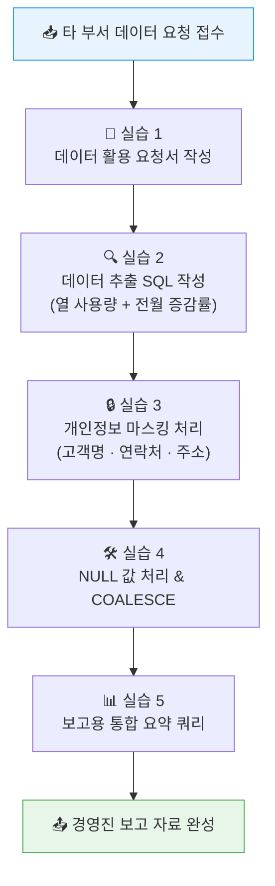

# 🏋️ 10.[실습] 데이터 기반 업무 지원 실습

정리일: 2026-10-08 · 교육 에셋 N0787

본문 수집·공개 편집. 도구 실행·최신 기능 재검증은 미실시. 고객·참여자 정보와 개별 접근 링크, 원본 첨부는 제외했습니다.

---

💡 **본 강의는 MySQL 을 기준으로 진행됩니다.**
**\[수업 목표\]**
- 데이터 활용 요청서 표준 양식을 이해하고 작성할 수 있습니다.
- 요청 조건에 맞는 데이터 추출 SQL을 작성할 수 있습니다.
- 전월 대비 증감률(MoM)을 서브쿼리 방식으로 계산할 수 있습니다.
- 개인정보 마스킹 SQL(고객명·연락처·주소)을 작성하여 안전하게 제공할 수 있습니다.
- NULL 값이 집계에 미치는 영향을 이해하고 COALESCE로 처리할 수 있습니다.
- 보고용 통합 요약 쿼리를 작성하여 경영진 보고 자료를 완성할 수 있습니다.
- 실습파일 경로: [개별 링크 제외]
**\[목차\]**

---
## 01. 실습 목표 및 시나리오
> ⏱ 예상 소요: 약 15분
💡 **타 부서의 실제 데이터 요청을 처리하는 전 과정을 처음부터 끝까지 실습합니다.**
- **☑️ 오늘 실습의 큰 그림**
데이터 매니저는 단순히 SQL을 잘 짜는 사람이 아닙니다.<br>요청 의도를 파악하고 → 안전하게 처리하고 → 보고 가능한 형태로<br>가공해 전달하는 **전 과정의 책임자**입니다. 🙂
오늘 실습은 아래 5단계 워크플로우를 그대로 따라가며 진행합니다.

- **☑️ 실습 시나리오**
에너지사업팀 **김팀장**이 다음 주 경영진 보고를 위해<br>데이터 매니저에게 메시지를 보내왔습니다.
> 📩 **김팀장의 요청:**<br>“올해 1\~2월 지역별 열 사용량 현황과 전월 대비 증감률을 정리해 주세요.<br>같은 기간 민원 건수도 지역별로 함께 넣어 주시고요,<br>민원 데이터에 고객 이름과 연락처가 포함되어 있으니 마스킹 처리도 부탁드립니다.”
- **☑️ 실습에 사용하는 테이블**
오늘 실습에서 사용하는 테이블 구조입니다.<br>컬럼명은 CSV 파일의 실제 이름과 동일합니다.
```sql
-- 열 사용량 테이블 (heat_usage)
-- usage_id   : 사용 ID (PK)
-- region     : 지역명
-- usage_date : 사용일자 (YYYY-MM-DD)
-- heat_amount: 열 사용량 (Gcal) ← NULL 또는 음수(-) 값이 섞여 있습니다!
-- customer_id: 고객 ID (FK)

-- 민원 테이블 (complaints)
-- complaint_id  : 민원 ID (PK)
-- receipt_date  : 접수일자
-- complaint_type: 민원 유형 ← 일부 NULL 있음!
-- region        : 지역명
-- customer_name : 고객명 (마스킹 대상)
-- customer_phone: 연락처 (마스킹 대상)
-- status        : 처리상태 (처리완료 / 처리중 / 접수)
-- close_date    : 처리완료일 (미완료 시 NULL)
-- customer_id   : 고객 ID (미등록 고객은 NULL)
```
> 💡 **Tip:** 실습 데이터에는 의도적으로 **NULL 값**, **음수 값**, **날짜 형식 오류** 등<br>실무에서 자주 마주치는 데이터 품질 문제가 포함되어 있습니다.<br>이 문제들을 어떻게 처리하는지가 오늘 실습의 핵심입니다! 😊
---
## 02. 실습 1 — 데이터 활용 요청서 작성
> ⏱ 예상 소요: 약 20분
💡 **요청서 한 장이 있으면 “나중에 말이 달라졌어요”가 사라집니다. 작성 습관이 곧 신뢰입니다.**
- **☑️ 왜 요청서를 써야 할까요?**
데이터 매니저 없이 일하면 어떤 일이 생길지 상상해 보겠습니다.
**만약 요청서 없이 구두로만 요청을 받는다면…**
- 요청자: “지난달 데이터 주세요”
- 데이터 매니저: (1월? 2월? 작년? 올해?) → 추측해서 만들어 제출
- 요청자: “이게 아닌데요. 제가 말한 건 지역별 합계였는데…”
⚠️ 작업을 두 번 하게 됩니다.<br>개인정보가 포함된 파일을 잘못된 범위로 제공하면 보안 사고로도 이어집니다.
**요청서가 있으면?**
- 요청 범위, 집계 단위, 개인정보 포함 여부가 문서로 고정됩니다.
- 나중에 “그런 말 한 적 없다”는 상황을 예방합니다.
- 처리 이력이 남아 감사(audit)에도 대응할 수 있습니다.
- **☑️ 표준 데이터 활용 요청서 양식**
아래 양식을 참고하여 김팀장의 요청 내용을 요청서로 정리해 보세요.
**✏️ 실습 과제:** 시나리오 내용을 바탕으로 빈칸을 채워 요청서를 완성하세요.


항목

내용


**요청 번호**

REQ-2024-001


**요청 부서**


**요청자**


**요청일**


**활용 목적**


**필요 데이터**


**기간 / 범위**


**집계 단위**


**개인정보 포함 여부**


**처리 방법**


**제공 기한**


**제공 방식**


- **예시 답안**


항목

내용


**요청 번호**

REQ-2024-001


**요청 부서**

에너지사업팀


**요청자**

김팀장


**요청일**

2024-03-01


**활용 목적**

경영진 보고용 지역별 열 사용량 및 민원 현황 자료


**필요 데이터**

지역별 열 사용량(1\~2월), 지역별 민원 건수


**기간 / 범위**

2024년 1월\~2월 (전월 대비 비교 포함)


**집계 단위**

지역별 월별 합계


**개인정보 포함 여부**

✅ 포함 (민원 테이블 고객명, 연락처)


**처리 방법**

고객명 마스킹(홍*동), 연락처 마스킹(010-*\*\*\*-1234)


**제공 기한**

2024-03-05


**제공 방식**

내부 공유 드라이브 업로드


---
## 03. 실습 2 — 데이터 추출 SQL (열 사용량 + 전월 증감률)
> ⏱ 예상 소요: 약 55분
💡 **요청서를 SQL로 구현합니다. “무엇을 왜 조회하는가”를 먼저 생각하고 쿼리를 작성합니다.**
- **☑️ STEP 1 — 기본 데이터 확인부터 시작하기**
본격적인 집계 전에 데이터 현황을 먼저 파악합니다.<br>마치 요리 전에 재료를 확인하는 것과 같습니다. 🙂
**지금 무엇을 하는가:** heat_usage 테이블에 어떤 데이터가 있는지, 범위는 어떤지 확인합니다.
```sql
-- 1️⃣ 전체 행 수 및 날짜 범위 확인
SELECT
    COUNT(*)            AS 전체_행수,
    MIN(usage_date)     AS 최초_사용일,
    MAX(usage_date)     AS 최신_사용일,
    COUNT(DISTINCT region) AS 지역_수
FROM heat_usage;
```
- 정답화면


전체_행수

최초_사용일

최신_사용일

지역_수


122

2023-11-05

2024-02-18

9


> 💡 **Tip:** 지역 수가 예상보다 많다면? 데이터에 `이태원지사`처럼<br>표준화되지 않은 지역명이 섞여 있을 수 있습니다. 집계 전 반드시 확인하세요!
```sql
-- 2️⃣ 지역명 목록 확인 (표준화 이슈 체크)
SELECT DISTINCT region
FROM heat_usage
ORDER BY region;
```
- 정답화면region강남마포수원옹산용산이태원이태원지사제주파주파주지사
---
---
---
---
---
---
---
---
---
---
---
⚠️ `이태원지사`, `파주지사`는 지역명이 다르게 입력된 데이터입니다.<br>이런 행은 WHERE 절로 제외하거나, 별도로 처리해야 합니다.
- **☑️ STEP 2 — 2024년 1\~2월 지역별 월별 열 사용량 집계**
**지금 무엇을 하는가:** 요청 기간(2024년 1\~2월)과 정상 지역만 필터링하여<br>지역별, 월별로 열 사용량을 집계합니다.
```sql
-- 2024년 1~2월 지역별 월별 열 사용량 집계
-- (표준화되지 않은 지사명과 음수 값은 제외)
SELECT
    region          AS 지역,
    MONTH(usage_date) AS 월,
    SUM(heat_amount)  AS 열사용량_Gcal
FROM heat_usage
WHERE YEAR(usage_date) = 2024
  AND MONTH(usage_date) BETWEEN 1 AND 2
  AND region NOT LIKE '%지사%'   -- 이태원지사, 파주지사 제외
  AND heat_amount > 0            -- 음수 데이터 제외 (강남 U047: -50)
GROUP BY region, MONTH(usage_date)
ORDER BY region, 월;
```
- 정답화면


지역

월

열사용량_Gcal


강남

1

7500.00


강남

2

5750.00


마포

1

2800.00


마포

2

2950.00


수원

1

4290.00


수원

2

4320.00


옹산

1

2260.00


옹산

2

3280.00


용산

1

2080.00


용산

2

1970.00


이태원

1

4020.00


이태원

2

4190.00


제주

1

1760.00


제주

2

1820.00


파주

1

2590.00


파주

2

2740.00


- **☑️ STEP 3 — 전월 대비 증감률(MoM) 계산**
**지금 무엇을 하는가:** 1월 대비 2월의 열 사용량이 얼마나 늘었는지(또는 줄었는지)<br>비율로 계산합니다. 경영진은 절대값보다 “몇 % 변했는가”를 더 중요하게 봅니다.
**왜 서브쿼리를 사용하는가?**
1월 합계와 2월 합계를 한 번의 GROUP BY로 나란히 놓으려면,<br>각각을 먼저 집계한 뒤 JOIN으로 합쳐야 합니다.<br>이처럼 “집계한 결과를 다시 활용”할 때 **서브쿼리**를 사용합니다.
쉽게 말하면…<br>\> 1월 지역별 합계 테이블과 2월 지역별 합계 테이블을 각각 만들어,<br>\> 지역을 기준으로 나란히 붙이는 것입니다!
```sql
-- 전월 대비(1월 → 2월) 증감률 계산
-- 서브쿼리 a: 1월 지역별 합계
-- 서브쿼리 b: 2월 지역별 합계
-- LEFT JOIN: 1월 데이터는 있는데 2월 데이터가 없는 지역도 포함
SELECT
    a.region            AS 지역,
    a.합계_1월,
    b.합계_2월,
    ROUND(
        (b.합계_2월 - a.합계_1월) / a.합계_1월 * 100
    , 1)                AS 전월대비_증감률_PCT
FROM (
    -- 기준 컬럼 🚩: region (지역)
    SELECT region, SUM(heat_amount) AS 합계_1월
    FROM heat_usage
    WHERE YEAR(usage_date) = 2024 AND MONTH(usage_date) = 1
      AND region NOT LIKE '%지사%'
      AND heat_amount > 0
    GROUP BY region
) a
LEFT JOIN (
    -- 집계함수 ✅: SUM(heat_amount)
    SELECT region, SUM(heat_amount) AS 합계_2월
    FROM heat_usage
    WHERE YEAR(usage_date) = 2024 AND MONTH(usage_date) = 2
      AND region NOT LIKE '%지사%'
      AND heat_amount > 0
    GROUP BY region
) b ON a.region = b.region
ORDER BY a.region;
```
- 정답화면


지역

합계_1월

합계_2월

전월대비_증감률_PCT


강남

7500.00

5750.00

-23.3


마포

2800.00

2950.00

5.4


수원

4290.00

4320.00

0.7


옹산

2260.00

3280.00

45.1


용산

2080.00

1970.00

-5.3


이태원

4020.00

4190.00

4.2


제주

1760.00

1820.00

3.4


파주

2590.00

2740.00

5.8


> 💡 **Tip:** 증감률 공식은 항상 `(이번 - 이전) / 이전 × 100` 입니다.<br>결과가 음수(-)이면 사용량이 줄었다는 뜻입니다.<br>강남이 -23.3%라면, 1월 대비 2월에 열 사용량이 약 23% 감소했다는 의미입니다.
**📌 LAG 함수를 활용하는 방법 (참고)**
MySQL 8.0 이상에서는 윈도우 함수 `LAG()`로 더 간결하게 작성할 수 있습니다.<br>`LAG()`는 “이전 행의 값을 현재 행에서 참조”하는 함수입니다.
```sql
-- LAG() 함수를 활용한 전월 비교 (MySQL 8.0+)
SELECT
    지역,
    월,
    열사용량_Gcal,
    LAG(열사용량_Gcal) OVER (PARTITION BY 지역 ORDER BY 월) AS 전월_열사용량,
    ROUND(
        (열사용량_Gcal - LAG(열사용량_Gcal) OVER (PARTITION BY 지역 ORDER BY 월))
        / LAG(열사용량_Gcal) OVER (PARTITION BY 지역 ORDER BY 월) * 100
    , 1) AS 전월대비_증감률_PCT
FROM (
    SELECT
        region AS 지역,
        MONTH(usage_date) AS 월,
        SUM(heat_amount) AS 열사용량_Gcal
    FROM heat_usage
    WHERE YEAR(usage_date) = 2024
      AND MONTH(usage_date) BETWEEN 1 AND 2
      AND region NOT LIKE '%지사%'
      AND heat_amount > 0
    GROUP BY region, MONTH(usage_date)
) monthly
ORDER BY 지역, 월;
```
**서브쿼리 방식 vs LAG 방식 비교**


**구분**

🔴 서브쿼리 방식

🔵 LAG 함수 방식


**MySQL 버전**

5.x 이상 모두 지원

8.0 이상 필요


**코드 길이**

길고 반복적

짧고 간결


**이해 난이도**

낮음 (구조가 명확)

높음 (윈도우 함수 개념 필요)


**추천 상황**

환경 확인이 어려울 때

MySQL 8.0 확인된 환경


- **☑️ 실습 과제: 지역별 민원 건수 추출 쿼리 작성**
2024년 1\~2월 지역별 민원 유형별 건수를 집계하는 쿼리를 직접 작성해 보세요.
```sql
-- 여기에 쿼리를 작성하세요.
```
- **예시 답안**
```sql
SELECT
    region          AS 지역,
    complaint_type  AS 민원유형,
    COUNT(*)        AS 민원건수
FROM complaints
WHERE receipt_date >= '2024-01-01'
  AND receipt_date < '2024-03-01'   -- '다음 달 1일 미만'이 월말 경계 처리에 안전합니다
GROUP BY region, complaint_type
ORDER BY region, 민원건수 DESC;
```
- 정답화면


지역

민원유형

민원건수


강남

요금문의

2


강남

공급중단

1


강남

난방불량

1


마포

난방불량

2


마포

요금문의

1


마포

공급중단

1


수원

난방불량

2


수원

공급중단

1


수원

요금문의

1


옹산

난방불량

2


옹산

시설점검

2


용산

난방불량

1


용산

요금문의

1


이태원

난방불량

3


이태원

공급중단

1


이태원

요금문의

1


이태원

시설점검

1


제주

시설점검

2


제주

공급중단

1


제주

요금문의

1


파주

요금문의

2


파주

난방불량

1


파주

시설점검

1


⚠️ `complaint_type`이 NULL인 행(CM008: 강호동)은 민원유형이 `NULL`로 표시됩니다.<br>NULL 처리는 실습 4에서 자세히 다룹니다!
---
## 04. 실습 3 — 개인정보 마스킹 처리
> ⏱ 예상 소요: 약 45분
💡 **개인정보는 목적 외로 제공하면 법적 책임이 생깁니다. SQL로 안전하게 마스킹하는 방법을 익혀봅시다.**
- **☑️ 왜 마스킹이 필요할까요?**
민원 데이터를 그대로 에너지사업팀에 전달하면 어떻게 될까요?
**마스킹 전 (제공 불가)**


complaint_id

customer_name

customer_phone


CM001

구동매

[연락처 비공개]


CM002

조이서

[연락처 비공개]


**마스킹 후 (제공 가능)**


complaint_id

고객명

연락처


CM001

구\*매

010-\*\*\*\*-5678


CM002

조\*서

010-\*\*\*\*-6789


개인정보보호법에 따라 업무 목적에 필요한 최소한의 정보만 제공해야 합니다.<br>고객 이름 전체나 연락처 전체는 집계·보고 용도에 불필요합니다!
- **☑️ 마스킹 유형 정리**


**마스킹 유형**

**원본**

**마스킹 결과**

**적용 함수**


이름 (3글자)

프로님

홍\*동

LEFT + RIGHT + CONCAT


이름 (2글자)

구동매

구\*매

LEFT + RIGHT + CONCAT


이름 (전체)

조이서

조\*\*

LEFT + REPEAT


전화번호

[연락처 비공개]

010-\*\*\*\*-5678

SUBSTRING_INDEX + CONCAT


주소

서울시 강남구 역삼동

서울시 \*\* 역삼동

CONCAT + REPEAT


- **☑️ STEP 1 — 고객명 마스킹**
**지금 무엇을 하는가:** 이름 첫 글자(성)와 마지막 글자만 남기고<br>중간 글자(들)를 `*`로 대체합니다.
3글자 이름: 홍**길**동 → 홍*동<br>2글자 이름: 구**동**매 → 구*매
```sql
-- 고객명 마스킹
-- LEFT(customer_name, 1)  : 첫 글자(성씨)
-- RIGHT(customer_name, 1) : 마지막 글자
-- 중간 글자 수 = CHAR_LENGTH - 2 → 그만큼 * 반복
SELECT
    complaint_id,
    receipt_date AS 접수일,
    region AS 지역,
    customer_name AS 원본_이름,
    CONCAT(
        LEFT(customer_name, 1),
        REPEAT('*', CHAR_LENGTH(customer_name) - 2),
        RIGHT(customer_name, 1)
    ) AS 고객명_마스킹
FROM complaints
WHERE receipt_date >= '2024-01-01'
  AND receipt_date < '2024-03-01'
LIMIT 5;
```
- 정답화면


complaint_id

접수일

지역

원본_이름

고객명_마스킹


CM001

2024-01-03

이태원

구동매

구\*매


CM002

2024-01-04

이태원

조이서

조\*서


CM003

2024-01-05

옹산

동백

동\*백


CM004

2024-01-06

파주

리정혁

리\*혁


CM005

2024-01-07

수원

우영우

우\*우


> 💡 **Tip:** 이름이 1글자인 경우 `CHAR_LENGTH - 2`가 음수(-1)가 되어<br>REPEAT 함수가 오류를 낼 수 있습니다.<br>실무에서는 `GREATEST(CHAR_LENGTH(customer_name) - 2, 0)`처럼<br>최솟값을 0으로 보정해 두면 안전합니다.
- **☑️ STEP 2 — 연락처 마스킹**
**지금 무엇을 하는가:** 전화번호 중간 4자리를 `****`로 대체합니다.<br>[연락처 비공개] → 010-\*\*\*\*-5678
```sql
-- 연락처 마스킹
-- SUBSTRING_INDEX(str, '-', 1)  : 첫 번째 '-' 앞 부분 → '010'
-- SUBSTRING_INDEX(str, '-', -1) : 마지막 '-' 뒤 부분 → '5678'
SELECT
    complaint_id,
    customer_phone AS 원본_연락처,
    CONCAT(
        SUBSTRING_INDEX(customer_phone, '-', 1), '-',
        REPEAT('*', 4), '-',
        SUBSTRING_INDEX(customer_phone, '-', -1)
    ) AS 연락처_마스킹
FROM complaints
WHERE receipt_date >= '2024-01-01'
  AND receipt_date < '2024-03-01'
LIMIT 5;
```
- 정답화면


complaint_id

원본_연락처

연락처_마스킹


CM001

[연락처 비공개]

010-\*\*\*\*-5678


CM002

[연락처 비공개]

010-\*\*\*\*-6789


CM003

[연락처 비공개]

010-\*\*\*\*-7890


CM004

[연락처 비공개]

010-\*\*\*\*-8901


CM005

[연락처 비공개]

010-\*\*\*\*-9012


- **☑️ 실습 과제: 마스킹 포함 최종 제공용 쿼리 작성**
고객명 마스킹 + 연락처 마스킹을 모두 적용한<br>민원 데이터 조회 쿼리를 완성하세요.
포함 컬럼: 지역, 민원유형, 고객명(마스킹), 연락처(마스킹), 접수일, 처리상태
```sql
-- 여기에 쿼리를 작성하세요.
```
- **예시 답안**
```sql
SELECT
    region          AS 지역,
    complaint_type  AS 민원유형,
    CONCAT(
        LEFT(customer_name, 1),
        REPEAT('*', CHAR_LENGTH(customer_name) - 2),
        RIGHT(customer_name, 1)
    )               AS 고객명,
    CONCAT(
        SUBSTRING_INDEX(customer_phone, '-', 1), '-',
        REPEAT('*', 4), '-',
        SUBSTRING_INDEX(customer_phone, '-', -1)
    )               AS 연락처,
    receipt_date    AS 접수일,
    status          AS 처리상태
FROM complaints
WHERE receipt_date >= '2024-01-01'
  AND receipt_date < '2024-03-01'
ORDER BY region, receipt_date;
```
- 정답화면 (앞 5행)


지역

민원유형

고객명

연락처

접수일

처리상태


강남

공급중단

박\*진

010-\*\*\*\*-1234

2024-01-09

처리완료


강남

요금문의

문\*은

010-\*\*\*\*-5555

2024-01-16

처리완료


강남

처리중

전\*준

010-\*\*\*\*-3030

2024-01-23

처리중


강남

요금문의

현\*원

010-\*\*\*\*-9090

2024-01-30

처리완료


강남

난방불량

문\*은

010-\*\*\*\*-5555

2024-02-09

처리완료


---
## 05. 실습 4 — NULL 값 처리와 COALESCE
> ⏱ 예상 소요: 약 35분
💡 **NULL은 “모른다”는 뜻입니다. 집계에서 조용히 빠지기 때문에, 모르면 숫자가 틀려집니다.**
- **☑️ NULL이 집계에서 어떻게 작동할까요?**
NULL은 단순히 “빈 값”이 아닙니다. “값이 없다(알 수 없다)”는 의미입니다.<br>집계 함수는 NULL을 자동으로 제외합니다.<br>이 사실을 모르면 집계 결과가 왜 다른지 알 수 없습니다!
**실습 데이터에서 NULL이 있는 행 확인**
```sql
-- heat_amount가 NULL인 행 확인
SELECT *
FROM heat_usage
WHERE heat_amount IS NULL;
```
- 정답화면


usage_id

region

usage_date

heat_amount

customer_id


U012

옹산

2024-01-12

NULL

C008


```sql
-- complaint_type이 NULL인 행 확인
SELECT complaint_id, region, customer_name, complaint_type
FROM complaints
WHERE complaint_type IS NULL;
```
- 정답화면


complaint_id

region

customer_name

complaint_type


CM008

마포

강호동

NULL


- **☑️ NULL 있을 때 vs 없을 때 집계 비교**
옹산 지역 1월 heat_amount 합계를 두 가지 방법으로 비교해 봅니다.
```sql
-- NULL을 그냥 SUM하면? (NULL 행 자동 제외됨)
SELECT
    region      AS 지역,
    COUNT(*)    AS 전체_행수,
    COUNT(heat_amount) AS 값있는_행수,
    SUM(heat_amount) AS 합계_NULL제외
FROM heat_usage
WHERE region = '옹산'
  AND YEAR(usage_date) = 2024
  AND MONTH(usage_date) = 1
GROUP BY region;
```
- 정답화면


지역

전체_행수

값있는_행수

합계_NULL제외


옹산

4

3

2260.00


> ⚠️ **주의:** 옹산 1월 데이터는 4행인데, COUNT(heat_amount)는 3입니다.<br>U012(heat_amount=NULL)가 SUM에서 자동으로 제외되었습니다.<br>NULL을 0으로 처리하고 싶다면 COALESCE를 사용합니다.
- **☑️ COALESCE로 NULL을 0으로 처리하기**
`COALESCE(값, 대체값)` 함수는 값이 NULL이면 대체값을 사용합니다.
```sql
-- COALESCE로 NULL을 0으로 처리한 집계
SELECT
    region              AS 지역,
    COUNT(*)            AS 전체_행수,
    SUM(COALESCE(heat_amount, 0)) AS 합계_NULL은0처리
FROM heat_usage
WHERE region = '옹산'
  AND YEAR(usage_date) = 2024
  AND MONTH(usage_date) = 1
GROUP BY region;
```
- 정답화면


지역

전체_행수

합계_NULL은0처리


옹산

4

2260.00


> 💡 **Tip:** 이 케이스에서는 NULL=0 처리를 해도 합계가 동일합니다.<br>하지만 **AVG(평균)** 계산에서는 차이가 납니다.<br>NULL 제외 AVG(3개 기준)와 NULL=0 처리 AVG(4개 기준)는 다른 숫자가 나옵니다!
**AVG에서 NULL 처리 비교**
```sql
SELECT
    region AS 지역,
    AVG(heat_amount)              AS 평균_NULL제외,
    AVG(COALESCE(heat_amount, 0)) AS 평균_NULL은0처리
FROM heat_usage
WHERE region = '옹산'
  AND YEAR(usage_date) = 2024
  AND MONTH(usage_date) = 1
GROUP BY region;
```
- 정답화면


지역

평균_NULL제외

평균_NULL은0처리


옹산

753.33

565.00


**NULL 포함 여부에 따른 집계 차이**


**집계 함수**

**NULL 행 자동 제외**

**COALESCE(값, 0) 적용 시**


\*\*COUNT(\*)\*\*

❌ 제외 안 함 (모든 행 카운트)

변화 없음


**COUNT(컬럼명)**

✅ NULL 제외

변화 없음


**SUM**

✅ NULL 제외 (0으로 처리 시 동일)

합계 동일, 행 수 포함


**AVG**

✅ NULL 제외 → 더 높게 나올 수 있음

더 낮게 나올 수 있음


- **☑️ 실습 과제: complaint_type NULL 처리 포함 민원 집계**
민원 유형(complaint_type)이 NULL인 행을 `'미분류'`로 대체하여<br>민원 건수를 집계하는 쿼리를 작성하세요.
```sql
-- 여기에 쿼리를 작성하세요.
```
- **예시 답안**
```sql
SELECT
    region                               AS 지역,
    COALESCE(complaint_type, '미분류')   AS 민원유형,
    COUNT(*)                             AS 민원건수
FROM complaints
WHERE receipt_date >= '2024-01-01'
  AND receipt_date < '2024-03-01'
GROUP BY region, COALESCE(complaint_type, '미분류')
ORDER BY region, 민원건수 DESC;
```
- 정답화면 (마포 지역 부분)


지역

민원유형

민원건수


마포

난방불량

2


마포

공급중단

1


마포

요금문의

1


마포

미분류

1


---
## 06. 실습 5 — 보고용 통합 요약 쿼리
> ⏱ 예상 소요: 약 50분
💡 **추출한 데이터를 보고서에 바로 활용할 수 있도록 하나의 쿼리로 통합합니다.**
- **☑️ 경영진 보고용 통합 요약표 구성**
지금까지 만든 쿼리 3개를 하나로 합칩니다.
- 열 사용량 (1월 / 2월 / 전월 대비 증감률)
- 민원 건수 (1\~2월 합계)
- 민원 처리율
```sql
-- 지역별 열 사용량 + 전월 증감률 + 민원 건수 + 처리율 통합 보고용 쿼리
SELECT
    h.지역,
    h.합계_1월          AS 열사용량_1월_Gcal,
    h.합계_2월          AS 열사용량_2월_Gcal,
    h.전월대비_증감률_PCT,
    COALESCE(c.민원건수, 0)  AS 민원건수,
    COALESCE(c.처리율_PCT, 0) AS 처리율_PCT
FROM (
    -- 서브쿼리 h: 열 사용량 + 증감률
    SELECT
        a.region AS 지역,
        a.합계_1월,
        b.합계_2월,
        ROUND((b.합계_2월 - a.합계_1월) / a.합계_1월 * 100, 1) AS 전월대비_증감률_PCT
    FROM (
        SELECT region, SUM(heat_amount) AS 합계_1월
        FROM heat_usage
        WHERE YEAR(usage_date) = 2024 AND MONTH(usage_date) = 1
          AND region NOT LIKE '%지사%' AND heat_amount > 0
        GROUP BY region
    ) a
    LEFT JOIN (
        SELECT region, SUM(heat_amount) AS 합계_2월
        FROM heat_usage
        WHERE YEAR(usage_date) = 2024 AND MONTH(usage_date) = 2
          AND region NOT LIKE '%지사%' AND heat_amount > 0
        GROUP BY region
    ) b ON a.region = b.region
) h
LEFT JOIN (
    -- 서브쿼리 c: 민원 건수 + 처리율
    SELECT
        region,
        COUNT(*) AS 민원건수,
        ROUND(
            SUM(CASE WHEN status = '처리완료' THEN 1 ELSE 0 END) * 100.0 / COUNT(*)
        , 1) AS 처리율_PCT
    FROM complaints
    WHERE receipt_date >= '2024-01-01'
      AND receipt_date < '2024-03-01'
    GROUP BY region
) c ON h.지역 = c.region
ORDER BY h.지역;
```
- 정답화면


지역

열사용량_1월_Gcal

열사용량_2월_Gcal

전월대비_증감률_PCT

민원건수

처리율_PCT


강남

7500.00

5750.00

-23.3

4

75.0


마포

2800.00

2950.00

5.4

5

80.0


수원

4290.00

4320.00

0.7

4

50.0


옹산

2260.00

3280.00

45.1

4

50.0


용산

2080.00

1970.00

-5.3

2

50.0


이태원

4020.00

4190.00

4.2

6

83.3


제주

1760.00

1820.00

3.4

4

75.0


파주

2590.00

2740.00

5.8

4

75.0


- **☑️ 실습 과제: 민원 처리율 단독 계산 쿼리 작성**
2024년 1\~2월 지역별 민원 처리율(처리완료 건수 / 전체 건수 × 100)을<br>계산하는 쿼리를 단독으로 작성하세요.<br>처리율이 높은 순으로 정렬하세요.
```sql
-- 여기에 쿼리를 작성하세요.
```
- **예시 답안**
```sql
SELECT
    region AS 지역,
    COUNT(*) AS 전체건수,
    SUM(CASE WHEN status = '처리완료' THEN 1 ELSE 0 END) AS 완료건수,
    ROUND(
        SUM(CASE WHEN status = '처리완료' THEN 1 ELSE 0 END) * 100.0 / COUNT(*)
    , 1) AS 처리율_PCT
FROM complaints
WHERE receipt_date >= '2024-01-01'
  AND receipt_date < '2024-03-01'
GROUP BY region
ORDER BY 처리율_PCT DESC;
```
- 정답화면


지역

전체건수

완료건수

처리율_PCT


이태원

6

5

83.3


마포

5

4

80.0


강남

4

3

75.0


제주

4

3

75.0


파주

4

3

75.0


용산

2

1

50.0


수원

4

2

50.0


옹산

4

2

50.0


- **☑️ 심화 과제: 결과를 해석해 봅시다 👿 💣💥**
위 통합 보고용 쿼리 결과를 보고 아래 질문에 답해보세요.
1. 전월 대비 열 사용량 증감률이 가장 크게 오른 지역은 어디인가요?<br>그 이유를 어떻게 추정할 수 있을까요?
2. 민원 처리율이 50%인 지역(용산, 수원, 옹산)의 공통점은 무엇일까요?<br>`complaints` 테이블에서 `status`를 직접 조회해 확인해 보세요.
3. 강남 지역의 2월 열 사용량이 1월보다 23.3% 줄었습니다.<br>`heat_usage` 테이블에서 강남 2월 데이터를 직접 조회하여<br>이상한 데이터가 있는지 확인해 보세요. (힌트: U047)
---
## 07. 셀프 체크리스트 및 과제 제출
> ⏱ 예상 소요: 약 15분
💡 **오늘 실습 내용을 점검해 보겠습니다.**
- **☑️ 셀프 체크리스트**


항목

확인


데이터 활용 요청서 양식을 완성할 수 있다

☐


DISTINCT와 LIKE로 데이터 품질 이슈를 사전에 체크할 수 있다

☐


조건에 맞는 데이터 추출 SQL을 작성할 수 있다

☐


서브쿼리 + LEFT JOIN으로 전월 대비 증감률을 계산할 수 있다

☐


LEFT, RIGHT, CONCAT, REPEAT 함수로 고객명을 마스킹할 수 있다

☐


SUBSTRING_INDEX로 연락처 중간 번호를 마스킹할 수 있다

☐


NULL이 SUM과 AVG에 미치는 영향 차이를 설명할 수 있다

☐


COALESCE로 NULL을 원하는 값으로 대체할 수 있다

☐


CASE WHEN으로 처리율 같은 비율 지표를 계산할 수 있다

☐


두 서브쿼리를 LEFT JOIN으로 결합한 통합 요약표를 만들 수 있다

☐


- **☑️ 과제 제출 항목**


과제

내용


**과제 1**

실습 1에서 완성한 데이터 활용 요청서(표)를 제출하세요.


**과제 2**

실습 2 지역별 민원 건수 집계 쿼리와 실행 결과를 제출하세요.


**과제 3**

실습 3 마스킹 최종 쿼리와 실행 결과(앞 10행)를 제출하세요.


**과제 4**

실습 4 complaint_type NULL 처리 집계 쿼리와 결과를 제출하세요.


**과제 5**

실습 5 민원 처리율 쿼리와 실행 결과를 제출하세요.


**과제 6 (심화)**

심화 과제 3가지 질문에 대한 분석 결과와 SQL 쿼리를 제출하세요.


---
## 08. 요약
> ⏱ 예상 소요: 약 10분
💡 **금일 수업내용을 복기해 보겠습니다.**
- 데이터 활용 요청서는 요청 범위, 집계 단위, 개인정보 처리 방법을 문서로 고정하는 장치입니다.
- 집계 쿼리 작성 전, DISTINCT로 지역명 표준화 이슈를 먼저 확인하는 것이 좋습니다.
- 전월 대비 증감률(MoM)은 월별 집계 서브쿼리 두 개를 LEFT JOIN으로 결합하여 계산합니다.
- LEFT JOIN을 사용하면 한쪽에 데이터가 없는 지역도 빠지지 않고 결과에 포함됩니다.
- MySQL 8.0 이상에서는 LAG() 윈도우 함수로 전월 비교 쿼리를 더 간결하게 작성할 수 있습니다.
- 개인정보 마스킹은 LEFT, RIGHT, CONCAT, REPEAT, SUBSTRING_INDEX 함수를 조합합니다.
- 이름 마스킹 형식은 첫 글자 +  + 마지막 글자, 전화번호는 중간 4자리를 `***`로 대체합니다.
- NULL은 집계 함수(SUM, AVG, COUNT(컬럼명))에서 자동으로 제외됩니다.
- SUM에서 NULL 제외와 0 처리는 합계가 같지만, AVG에서는 결과가 달라집니다.
- COALESCE(값, 대체값)를 사용하면 NULL을 원하는 값(0, ‘미분류’ 등)으로 대체할 수 있습니다.
- CASE WHEN status = ‘처리완료’ THEN 1 ELSE 0 END 패턴으로 조건부 집계(처리율 등)를 계산합니다.
- 음수 열 사용량(-50) 같은 이상 데이터는 WHERE heat_amount \> 0 조건으로 제외합니다.
- 보고용 통합 쿼리는 열 사용량 서브쿼리와 민원 서브쿼리를 지역명 기준으로 LEFT JOIN하여 완성합니다.
