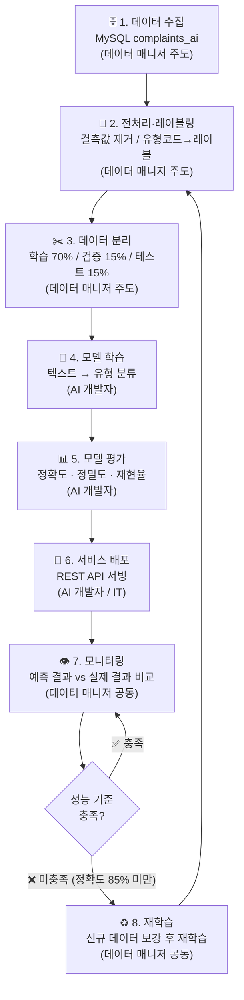
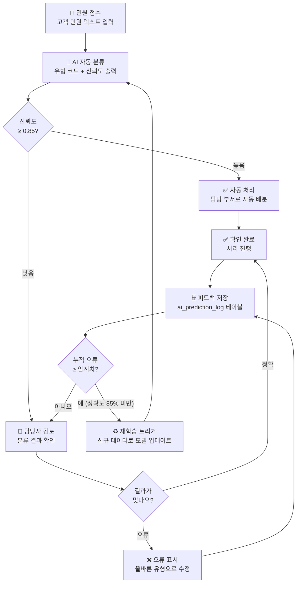

# 🏋️ 18.[실습] 데이터 기반 AI 활용 흐름 구현 실습

정리일: 2026-10-08 · 교육 에셋 N0796

본문 수집·공개 편집. 도구 실행·최신 기능 재검증은 미실시. 고객·참여자 정보와 개별 접근 링크, 원본 첨부는 제외했습니다.

---

💡 **본 강의는 MySQL 을 기준으로 진행됩니다.**
💡 **데이터 매니저 관점:** 이 실습은 AI 알고리즘을 구현하는 것이 아닙니다. 데이터 매니저로서 AI 서비스에 필요한 데이터 흐름을 설계하고, 품질 기준을 적용하며, 데이터 제공 체계를 구축하는 실무 역량을 익히는 것이 핵심입니다.
**\[수업 목표\]**
- MySQL에서 AI 학습에 필요한 민원 데이터를 조건에 맞게 추출할 수 있습니다.
- CASE WHEN 등 SQL 문법을 활용하여 데이터 전처리 및 레이블링 설계를 수행할 수 있습니다.
- 데이터 수집·학습·서빙·모니터링으로 이어지는 AI 서비스 흐름을 이해하고 설계서를 작성할 수 있습니다.
- AI 프로젝트에서 데이터 매니저의 역할과 데이터 관리 전략을 정의할 수 있습니다.
- 민원 자동분류 AI 프로젝트를 가정한 실습을 통해 데이터 기반 AI 적용의 전체 흐름을 체험할 수 있습니다.
- 실습파일 경로: [개별 링크 제외]
**\[목차\]**

---
## 01. 실습 목표 및 시나리오
> ⏱ 예상 소요: 약 20분
💡 **민원 자동분류 AI 프로젝트, 데이터 매니저로서 어떤 역할을 맡게 될까요?**
### **☑️ 실습 목표**
이번 실습은 교육기관 10에서 **민원 자동분류 AI 모델**을 개발한다고 가정하고,<br>해당 모델의 학습에 필요한 데이터를 MySQL에서 추출·준비하는 전 과정을 체험하는 실습입니다.
단순히 SQL을 작성하는 것을 넘어, 데이터 매니저 관점에서<br>**AI 프로젝트에 데이터가 어떻게 기여하는지**를 이해하고,<br>실제 업무에 적용할 수 있는 역량을 키우는 것을 목표로 합니다.


번호

실습 목표

내용


1

AI 학습용 데이터 추출

완료된 민원 데이터에서 학습에 적합한 데이터를 조건에 맞게 추출합니다.


2

데이터 전처리·레이블링 설계

민원 유형 코드를 AI가 학습할 수 있는 레이블로 변환하고, 결측값을 제거합니다.


3

데이터-모델-서비스 구조 이해

데이터 수집부터 AI 서빙·모니터링까지 이어지는 전체 흐름을 설계합니다.


4

AI 적용 시 데이터 관리 전략

학습 데이터 버전 관리, 개인정보 처리, 품질 기준 등 관리 전략을 수립합니다.


---
### **☑️ 시나리오 설명**
> **배경:** 교육기관 10 고객센터에는 매일 수백 건의 민원이 접수됩니다.<br>현재는 담당자가 민원 내용을 읽고 수동으로 유형을 분류하여 해당 부서에 배분하고 있습니다.<br>이 과정에서 분류 오류, 처리 지연, 담당자 과부하 등의 문제가 발생하고 있습니다.
**목표:** 민원 내용(텍스트)을 입력받아 자동으로 민원 유형을 분류하는 AI 모델을 개발합니다.<br>이를 위해 과거 민원 데이터를 학습 데이터로 준비해야 합니다.
**데이터 매니저의 역할:** AI 개발팀이 모델 학습을 시작하기 전,<br>데이터 매니저는 DB에서 학습에 적합한 데이터를 추출하고,<br>전처리 기준을 정의하며, 데이터 품질을 보장하는 역할을 담당합니다.
---
### **☑️ 실습용 테이블 생성 및 샘플 데이터**
실습을 시작하기 전에 아래 DDL을 실행하여 AI 학습용 민원 테이블을 생성하고,<br>샘플 데이터를 삽입합니다.
💡 이 테이블(`complaints_ai`)은 이전 실습에서 사용한 `complaints` 테이블과 **별개**입니다. AI 학습에 필요한 컬럼(민원 텍스트, 만족도 등)을 추가하여 새로 설계한 전용 테이블이에요. 기존 `complaints` 테이블은 그대로 유지됩니다.
```sql
-- AI 학습용 민원 테이블 생성 (기존 complaints 테이블과 별개)
CREATE TABLE complaints_ai (
    complaint_id    INT AUTO_INCREMENT PRIMARY KEY,
    customer_id     VARCHAR(20),
    complaint_type  VARCHAR(20),   -- 민원 유형 코드 (C01~C05)
    content         TEXT,          -- 민원 내용 (텍스트) — AI 분류 입력값
    region          VARCHAR(50),   -- 지역명
    status          VARCHAR(10),   -- 처리 상태 (S01=접수, S02=처리중, S03=완료)
    created_at      DATETIME,      -- 민원 접수일시
    resolved_at     DATETIME,      -- 민원 완료일시
    satisfaction    INT            -- 고객 만족도 (1~5점)
);
```
샘플 데이터를 아래와 같이 삽입합니다. 실습 중 쿼리 결과를 직접 확인해 볼 수 있어요. 😊
```sql
-- 샘플 데이터 삽입 (10건)
INSERT INTO complaints_ai
    (customer_id, complaint_type, content, region, status, created_at, resolved_at, satisfaction)
VALUES
    ('C001', 'C01', '이번 달 요금이 지난달보다 두 배 넘게 나왔는데 이유를 알고 싶습니다. 정확한 내역을 확인해 주세요.',
     '서울 강남구', 'S03', '2024-11-05 09:12:00', '2024-11-06 14:30:00', 4),

    ('C002', 'C02', '어제저녁부터 난방이 전혀 안 됩니다. 온도를 높여도 차갑기만 합니다. 빨리 조치 부탁드립니다.',
     '경기 성남시', 'S03', '2024-11-10 18:45:00', '2024-11-11 10:20:00', 5),

    ('C003', 'C03', '세대 내 배관에서 이상한 소리가 계속 납니다. 점검 방문을 요청드립니다.',
     '서울 강남구', 'S03', '2024-11-12 10:00:00', '2024-11-14 09:00:00', 3),

    ('C004', 'C04', '집을 이사하게 되어 계약 명의를 변경하고 싶습니다. 절차를 안내해 주세요.',
     '경기 수원시', 'S03', '2024-11-15 14:22:00', '2024-11-16 11:00:00', 5),

    ('C005', 'C05', '지역난방 요금 납부 방법이 궁금합니다. 자동이체 신청은 어떻게 하나요?',
     '인천 남동구', 'S03', '2024-11-18 09:05:00', '2024-11-18 15:30:00', 4),

    ('C006', 'C01', '납부 기한을 놓쳤는데 연체료가 얼마나 부과되는지 알고 싶습니다.',
     '경기 성남시', 'S03', '2024-12-01 11:30:00', '2024-12-02 09:00:00', 3),

    ('C007', 'C02', '온수가 전혀 나오지 않습니다. 아이가 있어서 매우 불편한 상황입니다. 긴급 처리 요청합니다.',
     '서울 강남구', 'S03', '2024-12-05 07:55:00', '2024-12-05 13:40:00', 5),

    ('C008', 'C03', '계량기 수치가 비정상적으로 높게 나오는 것 같습니다. 계량기 점검을 요청합니다.',
     '경기 수원시', 'S03', '2024-12-10 13:00:00', '2024-12-12 10:30:00', 2),

    ('C009', 'C04', '세입자가 바뀌어서 계약 해지 후 신규 체결을 해야 합니다. 방법을 알려주세요.',
     '인천 남동구', 'S03', '2024-12-15 10:45:00', '2024-12-16 14:00:00', 4),

    ('C010', 'C01', '12월 요금 고지서가 아직 오지 않았습니다. 재발송 부탁드립니다.',
     '서울 강남구', 'S02', '2025-01-03 16:20:00', NULL, NULL);
```
**민원 유형 코드 정의:**


코드

유형

설명


C01

요금 관련

요금 청구 오류, 납부 문의 등


C02

공급 장애

난방·온수 공급 중단 또는 불량


C03

시설 점검

배관, 계량기, 밸브 등 시설 점검 요청


C04

계약 변경

사용자 변경, 계약 해지·신규 체결 등


C05

기타 문의

위 유형에 해당하지 않는 일반 문의


**처리 상태 코드 정의:**


코드

상태

설명


S01

접수

민원이 접수되어 담당자 배정 대기 중


S02

처리중

담당자가 처리 진행 중


S03

완료

민원 처리가 완료된 상태


---
### **☑️ 민원 자동분류 AI 전체 흐름**
아래 흐름도는 민원 자동분류 AI 서비스의 전체 생애주기를 나타낸 것입니다.<br>**데이터 매니저가 주도하는 단계(파란색 박스)**를 중심으로 살펴보세요.



단계

구분

내용

담당


1

데이터 수집

MySQL complaints_ai 테이블에서 완료된 민원 데이터 추출

**데이터 매니저**


2

전처리

결측값 제거, 유형 코드 → 레이블 변환, 텍스트 정제

**데이터 매니저**


3

데이터 분리

학습(70%) / 검증(15%) / 테스트(15%) 분리

**데이터 매니저**


4

모델 학습

분류 모델 학습 (민원 텍스트 → 유형 분류)

AI 개발자


5

모델 평가

정확도, 정밀도, 재현율 등 성능 지표 측정

AI 개발자


6

서비스 배포

API 형태로 분류 모델 서빙

AI 개발자 / IT


7

모니터링

실제 분류 결과와 담당자 수정 결과 비교, 성능 추적

**데이터 매니저** / AI 개발자


8

재학습

모델 성능 저하 시 새 데이터로 재학습

**데이터 매니저** / AI 개발자


> 💡 **Tip:** 데이터 매니저의 핵심 역할은 1\~3단계(데이터 수집·전처리·분리)와 7단계(모니터링용 데이터 관리)입니다. AI 개발자가 좋은 모델을 만들 수 있느냐 없느냐는 **데이터 매니저가 얼마나 좋은 데이터를 준비하느냐**에 달려 있습니다.
---
## 02. 실습 1. AI 학습용 데이터 추출 SQL
> ⏱ 예상 소요: 약 50분
💡 **AI 모델은 ’좋은 재료’로만 좋은 요리를 만들 수 있습니다. 지금부터 AI의 재료, 즉 학습 데이터를 추출해 보겠습니다.**
### **☑️ 학습 데이터 추출 조건 이해**
AI 모델 학습에 사용할 데이터는 **양질의 데이터**여야 합니다.
흔히 이렇게 말하죠. *“Garbage In, Garbage Out.”*<br>쓰레기 데이터를 넣으면 쓰레기 모델이 나온다는 뜻입니다.
만약 이 조건들을 **지키지 않으면** 어떻게 될까요?
- 처리 완료되지 않은(S01, S02) 민원을 학습에 사용하면 → 유형이 아직 확정되지 않아 **오답 레이블**로 학습하게 됩니다.
- 민원 내용(content)이 없는 데이터를 넣으면 → 텍스트 분류 모델인데 입력값이 없으니 **학습 오류**가 발생합니다.
- 5년 전 오래된 데이터를 그대로 넣으면 → 당시에는 없던 민원 유형이 지금은 주류가 되어 **모델이 현실을 반영하지 못합니다**.
아래 조건을 모두 만족하는 데이터만 추출합니다.


조건

이유


처리 상태 = S03 (완료)

처리 완료된 민원만 실제 유형이 확정된 데이터입니다.


민원 내용(content) 존재

텍스트가 없으면 분류 학습에 사용할 수 없습니다.


최근 2년 이내 데이터

너무 오래된 데이터는 현재 민원 패턴을 반영하지 못합니다.


민원 유형 코드 존재

레이블(정답)이 없으면 지도 학습에 사용할 수 없습니다.


---
### **☑️ 기본 추출 쿼리 작성**
지금 우리가 하려는 것은 이렇습니다.
**“처리가 완료되었고, 민원 내용이 있으며, 유형 코드도 있는 최근 2년 데이터를 뽑아 오자.”**
바로 이 조건들을 SQL의 WHERE 절로 표현하면 아래와 같습니다.
```sql
-- AI 학습용 기본 데이터 추출
SELECT
    complaint_id,
    complaint_type,
    content,
    region,
    satisfaction
FROM complaints_ai
WHERE status = 'S03'                                          -- 완료된 민원만
  AND content IS NOT NULL                                     -- 민원 내용 존재
  AND LENGTH(content) > 10                                    -- 너무 짧은 내용 제외
  AND complaint_type IS NOT NULL                              -- 레이블(유형 코드) 존재
  AND created_at >= DATE_SUB(NOW(), INTERVAL 2 YEAR)         -- 최근 2년 이내
ORDER BY created_at DESC
LIMIT 10000;  -- 초기 탐색용 상한
```
- **예상 결과 (샘플 데이터 기준 — S03 완료 건)**


complaint_id

complaint_type

content

region

satisfaction


9

C04

세입자가 바뀌어서 계약 해지 후 신규 체결을…

인천 남동구

4


8

C03

계량기 수치가 비정상적으로 높게 나오는 것…

경기 수원시

2


7

C02

온수가 전혀 나오지 않습니다. 아이가 있어서…

서울 강남구

5


6

C01

납부 기한을 놓쳤는데 연체료가 얼마나 부과…

경기 성남시

3


5

C05

지역난방 요금 납부 방법이 궁금합니다…

인천 남동구

4


> **포인트:** `LENGTH(content) > 10` 조건은 “도움이 안됩니다”, “불만” 등 매우 짧아 학습에 도움이 되지 않는 데이터를 제거하는 역할을 합니다.
---
### **☑️ 유형별 건수 확인 (균형 여부 점검)**
AI 분류 모델 학습 시, 특정 유형의 데이터가 너무 많거나 적으면<br>**클래스 불균형(Class Imbalance)** 문제가 발생합니다.
예를 들어, C01(요금 관련)이 전체의 80%를 차지하고<br>C05(기타)가 2%밖에 없다면?
→ 모델은 뭘 넣어도 “C01이겠지”라고 대답하는 **게으른 모델**이 됩니다.
유형별 건수를 먼저 확인하는 것이 중요한 이유가 바로 여기에 있습니다. 🙂
```sql
-- 민원 유형별 학습 데이터 건수 확인
SELECT
    complaint_type,
    COUNT(*)        AS total_count,
    ROUND(COUNT(*) * 100.0 / SUM(COUNT(*)) OVER (), 2) AS ratio_pct
FROM complaints_ai
WHERE status = 'S03'
  AND content IS NOT NULL
  AND LENGTH(content) > 10
  AND complaint_type IS NOT NULL
  AND created_at >= DATE_SUB(NOW(), INTERVAL 2 YEAR)
GROUP BY complaint_type
ORDER BY total_count DESC;
```
- **예상 결과 (샘플 데이터 기준)**


complaint_type

total_count

ratio_pct


C01

3

33.33


C02

2

22.22


C03

2

22.22


C04

2

22.22


C05

0

0.00


> ⚠️ 샘플 데이터에서 C05(기타)는 S03 완료 건이 없습니다. 실제 업무에서는 이런 경우 해당 유형의 데이터 보강이 필요합니다.
**결과 해석 기준:**


비율

판단

조치


각 유형이 15%\~35%

균형 데이터

그대로 사용 가능


특정 유형이 50% 초과

불균형 데이터

오버샘플링 또는 언더샘플링 필요


특정 유형이 5% 미만

데이터 부족

추가 수집 또는 해당 유형 제외 검토


---
### **☑️ 만족도 분포 확인**
만족도(satisfaction)는 보조 레이블 또는 필터링 기준으로 활용할 수 있습니다.<br>분포를 확인합니다.
```sql
-- 만족도 점수 분포 확인
SELECT
    satisfaction,
    COUNT(*)    AS count,
    ROUND(COUNT(*) * 100.0 / SUM(COUNT(*)) OVER (), 2) AS ratio_pct
FROM complaints_ai
WHERE status = 'S03'
  AND content IS NOT NULL
  AND created_at >= DATE_SUB(NOW(), INTERVAL 2 YEAR)
GROUP BY satisfaction
ORDER BY satisfaction;
```
- **예상 결과 (샘플 데이터 기준)**


satisfaction

count

ratio_pct


2

1

11.11


3

2

22.22


4

3

33.33


5

3

33.33


> 💡 **Tip:** 만족도 1점(매우 불만족) 민원은 감성 분석 모델 학습에, 만족도 5점 민원은 우수 처리 사례 분석에 활용할 수 있습니다.
---
✏️ **실습 과제 1:** 지역별·유형별 학습 데이터 건수를 한 번에 확인하는 쿼리를 작성하세요.<br>`region`과 `complaint_type`을 모두 GROUP BY에 포함하고, 건수 기준 내림차순으로 정렬하세요.
- **예시 답안**
```sql
-- 지역별·유형별 학습 데이터 건수 확인
SELECT
    region,
    complaint_type,
    COUNT(*) AS total_count
FROM complaints_ai
WHERE status = 'S03'
  AND content IS NOT NULL
  AND LENGTH(content) > 10
  AND complaint_type IS NOT NULL
  AND created_at >= DATE_SUB(NOW(), INTERVAL 2 YEAR)
GROUP BY region, complaint_type
ORDER BY total_count DESC;
```
- **예상 결과 (샘플 데이터 기준)**


region

complaint_type

total_count


서울 강남구

C01

2


서울 강남구

C02

1


서울 강남구

C03

1


경기 성남시

C01

1


경기 성남시

C02

1


경기 수원시

C03

1


경기 수원시

C04

1


인천 남동구

C04

1


인천 남동구

C05

1


---
## 03. 실습 2. 데이터 전처리 및 레이블링 설계
> ⏱ 예상 소요: 약 55분
💡 **추출한 데이터를 AI가 이해할 수 있는 형태로 변환하는 과정입니다. 이 단계가 모델 품질을 결정합니다.**
### **☑️ AI 학습용 레이블 매핑 정의**
AI 모델은 숫자 코드(C01\~C05)보다 **명확한 한국어 레이블**을 사용할 때<br>모델 해석이 용이하고, 결과도 이해하기 쉽습니다.
레이블 매핑 정의서를 먼저 작성합니다.
**\<원본 코드\>***시스템에서 사용하는 내부 코드 — 사람이 직관적으로 이해하기 어려움*


원본 코드

원본 의미


C01

요금 관련


C02

공급 장애


C03

시설 점검


C04

계약 변경


C05

기타 문의


*AI 모델 학습 및 결과 해석에 사용하는 레이블*


원본 코드

AI 학습 레이블

레이블 설명


C01

요금문의

요금 청구·납부·계산 관련 민원


C02

공급장애

난방·온수 공급 중단·불량 민원


C03

시설점검

배관·계량기·밸브 등 시설 관련 민원


C04

계약변경

계약 신규·해지·명의변경 관련 민원


C05

기타

위 유형 외 일반 문의 민원


---
### **☑️ CASE WHEN을 활용한 레이블 변환 쿼리**
CASE WHEN 구문을 사용하여 코드 값을 AI 학습에 적합한 레이블로 변환합니다.<br>`original_code`(원본)와 `label`(변환값)을 함께 출력하여 변환이 올바른지 확인합니다.
```sql
-- 레이블링 전처리: 유형 코드 → 한국어 레이블 변환
SELECT
    complaint_id,
    content,
    region,
    satisfaction,
    complaint_type                         AS original_code,
    CASE complaint_type
        WHEN 'C01' THEN '요금문의'
        WHEN 'C02' THEN '공급장애'
        WHEN 'C03' THEN '시설점검'
        WHEN 'C04' THEN '계약변경'
        WHEN 'C05' THEN '기타'
        ELSE '미분류'
    END                                    AS label,
    created_at
FROM complaints_ai
WHERE status = 'S03'
  AND content IS NOT NULL
  AND LENGTH(content) > 10
  AND complaint_type IS NOT NULL
  AND created_at >= DATE_SUB(NOW(), INTERVAL 2 YEAR)
ORDER BY complaint_id;
```
- **예상 결과 (샘플 데이터 기준)**


complaint_id

content (요약)

region

satisfaction

original_code

label


1

이번 달 요금이 지난달보다 두 배 넘게 나왔는데…

서울 강남구

4

C01

요금문의


2

어제저녁부터 난방이 전혀 안 됩니다…

경기 성남시

5

C02

공급장애


3

세대 내 배관에서 이상한 소리가 계속 납니다…

서울 강남구

3

C03

시설점검


4

집을 이사하게 되어 계약 명의를 변경하고 싶습니다…

경기 수원시

5

C04

계약변경


5

지역난방 요금 납부 방법이 궁금합니다…

인천 남동구

4

C05

기타


---
### **☑️ 결측값·이상값 탐지 및 제거 쿼리**
학습 데이터의 품질을 높이기 위해 결측값과 이상값을 탐지하고 제거합니다.
**1️⃣ 결측값·이상값 탐지 먼저 실행**
“얼마나 많은 불량 데이터가 있는지” 전체 현황을 먼저 파악합니다.
```sql
-- 결측값·이상값 탐지
SELECT
    SUM(CASE WHEN content IS NULL THEN 1 ELSE 0 END)
        AS null_content,
    SUM(CASE WHEN LENGTH(content) <= 10 THEN 1 ELSE 0 END)
        AS too_short_content,
    SUM(CASE WHEN complaint_type IS NULL THEN 1 ELSE 0 END)
        AS null_type,
    SUM(CASE WHEN satisfaction NOT BETWEEN 1 AND 5 THEN 1 ELSE 0 END)
        AS invalid_satisfaction,
    COUNT(*)
        AS total_rows
FROM complaints_ai
WHERE status = 'S03'
  AND created_at >= DATE_SUB(NOW(), INTERVAL 2 YEAR);
```
- **예상 결과 (샘플 데이터 기준)**


null_content

too_short_content

null_type

invalid_satisfaction

total_rows


0

0

0

0

9


**2️⃣ 탐지 결과 확인 후 최종 학습 데이터 추출**
불량 데이터를 모두 걸러낸 뒤, 레이블까지 붙인 최종 학습용 데이터를 추출합니다.
```sql
-- 결측값·이상값 제거 후 최종 학습 데이터 추출
SELECT
    complaint_id,
    content,
    CASE complaint_type
        WHEN 'C01' THEN '요금문의'
        WHEN 'C02' THEN '공급장애'
        WHEN 'C03' THEN '시설점검'
        WHEN 'C04' THEN '계약변경'
        WHEN 'C05' THEN '기타'
        ELSE '미분류'
    END AS label,
    region,
    satisfaction,
    created_at
FROM complaints_ai
WHERE status = 'S03'
  AND content IS NOT NULL
  AND LENGTH(content) > 10                              -- 너무 짧은 내용 제외
  AND complaint_type IN ('C01','C02','C03','C04','C05') -- 유효한 유형 코드만
  AND satisfaction BETWEEN 1 AND 5                      -- 유효한 만족도 범위
  AND created_at >= DATE_SUB(NOW(), INTERVAL 2 YEAR)
ORDER BY complaint_id;
```
- **예상 결과 (샘플 데이터 기준)**


complaint_id

content (요약)

label

region

satisfaction

created_at


1

이번 달 요금이 지난달보다 두 배…

요금문의

서울 강남구

4

2024-11-05 09:12:00


2

어제저녁부터 난방이 전혀 안 됩니다…

공급장애

경기 성남시

5

2024-11-10 18:45:00


3

세대 내 배관에서 이상한 소리가…

시설점검

서울 강남구

3

2024-11-12 10:00:00


4

집을 이사하게 되어 계약 명의를…

계약변경

경기 수원시

5

2024-11-15 14:22:00


5

지역난방 요금 납부 방법이 궁금합니다…

기타

인천 남동구

4

2024-11-18 09:05:00


---
### **☑️ 개인정보 마스킹 처리**
민원 내용(content)에는 고객의 이름, 전화번호, 주소 등 개인식별정보(PII)가<br>포함될 수 있습니다.
예를 들어, 이런 민원이 있다고 해봅시다.
> *“프로님입니다. [연락처 비공개]로 연락 주세요. 서울 강남구 테헤란로 123에 사는데 요금이 이상합니다.”*
이 내용을 그대로 AI 학습 데이터로 사용하면 **개인정보보호법 위반**이 됩니다.<br>따라서 학습 데이터를 추출할 때 마스킹 처리가 필수입니다.
**마스킹 유형별 비교:**


구분

단방향 마스킹

양방향 마스킹(암호화)


원본 복원

❌ 불가능

✅ 가능 (복호화 키 필요)


활용 목적

AI 학습, 통계 분석, 익명화 배포

업무 시스템 내 보안 저장


예시

`프로님` → `홍**`

`프로님` → `enc:aGdFYW...`


보안 수준

높음 (복원 불가)

키 관리에 따라 다름


AI 학습 적합성

✅ 적합

⚠️ 복호화 후 재마스킹 필요


**AI 학습용 데이터에는 단방향 마스킹(익명화)** 을 사용합니다.<br>MySQL의 `REGEXP_REPLACE` 함수를 사용하여 패턴별로 마스킹합니다.
```sql
-- 마스킹 패턴 적용 예시 (정규식 기반)
SELECT
    complaint_id,

    -- 1. 전화번호 마스킹: 010-XXXX-XXXX 또는 02-XXX-XXXX 패턴
    REGEXP_REPLACE(
        content,
        '0[0-9]{1,2}-[0-9]{3,4}-[0-9]{4}',
        '[전화번호]'
    ) AS masked_phone,

    -- 2. 이메일 마스킹: [이메일 비공개] 패턴
    REGEXP_REPLACE(
        content,
        '[a-zA-Z0-9._%+-]+@[a-zA-Z0-9.-]+\\.[a-zA-Z]{2,}',
        '[이메일]'
    ) AS masked_email,

    -- 3. 주소 마스킹: '구', '동', '로', '길' 앞 지명 패턴 (간이 처리)
    REGEXP_REPLACE(
        content,
        '[가-힣]+(구|동|로|길|번지)[0-9]*',
        '[주소]'
    ) AS masked_address

FROM complaints_ai
WHERE status = 'S03'
  AND content IS NOT NULL
LIMIT 5;
```
> 💡 **Tip:** 실제 운영 환경에서는 MySQL 정규식만으로는 완전한 마스킹이 어렵습니다. Python의 `re` 모듈이나 전용 비식별화 라이브러리를 함께 사용하는 것이 더 정확합니다. 데이터 매니저는 **어떤 패턴을 마스킹해야 하는지 기준을 정의**하는 역할을 담당합니다.
**마스킹 정규식 패턴 참조표:**


대상

정규식 패턴

치환 결과

비고


전화번호

`0[0-9]{1,2}-[0-9]{3,4}-[0-9]{4}`

`[전화번호]`

휴대폰·일반전화 모두 포함


이메일

`[a-zA-Z0-9._%+-]+@[a-zA-Z0-9.-]+\.[a-zA-Z]{2,}`

`[이메일]`

영문 이메일 주소


주민등록번호

`[0-9]{6}-[0-9]{7}`

`[주민번호]`

앞 6자리-뒤 7자리 패턴


주소(도로명)

`[가-힣]+(로\|길)[0-9]+`

`[주소]`

도로명 주소 간이 처리


이름(2\~3글자)

`[가-힣]{2,3}(씨\|님\|고객)`

`[고객명]`

호칭 기반 간이 처리


---
✏️ **실습 과제 2:** 학습/검증/테스트 데이터 분리 기준 설계서를 아래 표 형식으로 작성하세요.<br>분리 비율, 기간 기준, 각 데이터셋의 용도를 포함하여 작성합니다.


항목

학습 데이터

검증 데이터

테스트 데이터


비율

(직접 작성)

(직접 작성)

(직접 작성)


기간 기준

(직접 작성)

(직접 작성)

(직접 작성)


용도

(직접 작성)

(직접 작성)

(직접 작성)


건수 기준

(직접 작성)

(직접 작성)

(직접 작성)


- **예시 답안**


항목

학습 데이터

검증 데이터

테스트 데이터


비율

70%

15%

15%


기간 기준

2년 전 \~ 4개월 전

4개월 전 \~ 2개월 전

2개월 전 \~ 현재


용도

모델 가중치 학습

학습 중 과적합 방지, 하이퍼파라미터 조정

최종 모델 성능 평가


건수 기준

전체의 70% (약 7,000건 예시)

전체의 15% (약 1,500건 예시)

전체의 15% (약 1,500건 예시)


**기간 기준으로 분리하는 이유:**<br>무작위 분리 시 미래 데이터가 학습에 포함되는 **데이터 누수(Data Leakage)** 문제가 발생할 수 있습니다.<br>시간 기준으로 분리하면 실제 서비스 환경과 유사한 평가가 가능합니다.
---
## 04. 실습 3. 데이터·모델·서비스 연결 구조 설계
> ⏱ 예상 소요: 약 45분
💡 **데이터를 준비했다면, 이제 AI 모델이 실제 서비스로 연결되는 전체 구조를 설계해 보겠습니다.**
### **☑️ AI 서비스 데이터 흐름 설계서**
민원 자동분류 AI 서비스가 실제로 운영되기 위해서는<br>데이터 수집부터 서빙·모니터링까지 각 단계가 유기적으로 연결되어야 합니다.
아래 설계서를 참고하여 흐름을 이해합니다.


단계

구성 요소

입력

출력

담당자

비고


1. 데이터 소스

MySQL complaints_ai 테이블

원본 민원 데이터

원시 데이터

데이터 매니저

정기 백업 필수


2. ETL

SQL + Python 스크립트

원시 데이터

전처리된 CSV/JSON

데이터 매니저

월 1회 또는 신규 배치 시 실행


3. 학습

AI 프레임워크 (예: scikit-learn)

전처리 데이터

학습된 모델 파일

AI 개발자

모델 버전 관리 필수


4. 평가

테스트 데이터셋

학습된 모델

성능 지표 (정확도 등)

AI 개발자

정확도 90% 이상 기준


5. 서빙

REST API

민원 텍스트

분류 결과 JSON

AI 개발자 / IT

SLA 응답 시간 1초 이내


6. 모니터링

DB 로그 테이블

API 호출 결과

성능 추적 리포트

데이터 매니저

주간 리포트 자동화


7. 재학습 트리거

성능 임계값 알림

모니터링 지표

재학습 요청

데이터 매니저

정확도 85% 미만 시


---
### **☑️ AI 분류 결과 현업 검증 프로세스**
AI 모델이 자동으로 민원을 분류하더라도, **현업 담당자의 검증이 반드시 필요**합니다.
왜냐하면 AI는 틀릴 수 있고, 틀린 결과를 그대로 누적하면<br>모델이 점점 더 나빠지는 악순환이 발생하기 때문입니다.
아래 프로세스는 AI가 분류한 결과를 담당자가 검토하고,<br>오류를 표시하면 재학습에 반영하는 피드백 루프입니다.

> 💡 **Tip:** 신뢰도(confidence)가 낮은 건만 담당자 검토로 보내면 업무 부담을 줄이면서도 품질을 유지할 수 있습니다. 이것을 **인간-AI 협업(Human-in-the-Loop)** 방식이라고 합니다.
---
### **☑️ 모델 성능 모니터링용 데이터 조회**
AI 모델이 배포된 후에는 자동 분류 결과와 실제 담당자가 처리한 유형이<br>일치하는지 지속적으로 확인해야 합니다.
**먼저 모니터링 로그 테이블을 생성합니다.**
```sql
-- 모델 예측 결과 로그 테이블 (모니터링용)
CREATE TABLE ai_prediction_log (
    log_id          INT AUTO_INCREMENT PRIMARY KEY,
    complaint_id    INT,             -- complaints_ai 테이블 참조
    predicted_type  VARCHAR(20),     -- AI가 예측한 유형 코드
    actual_type     VARCHAR(20),     -- 담당자가 최종 처리한 유형 코드
    confidence      DECIMAL(5,4),    -- 예측 신뢰도 (0~1)
    predicted_at    DATETIME,        -- 예측 시각
    corrected_at    DATETIME         -- 담당자 수정 시각 (NULL이면 수정 없음)
);
```
**모니터링용 샘플 데이터도 삽입해봅니다.**
```sql
-- 모니터링 샘플 데이터 삽입 (5건)
INSERT INTO ai_prediction_log
    (complaint_id, predicted_type, actual_type, confidence, predicted_at, corrected_at)
VALUES
    (1, 'C01', 'C01', 0.9521, '2025-01-10 09:15:00', NULL),
    (2, 'C02', 'C02', 0.9803, '2025-01-10 10:22:00', NULL),
    (3, 'C01', 'C03', 0.6134, '2025-01-10 11:05:00', '2025-01-10 11:30:00'),
    (4, 'C04', 'C04', 0.8877, '2025-01-10 14:00:00', NULL),
    (5, 'C02', 'C05', 0.5320, '2025-01-10 15:45:00', '2025-01-10 16:10:00');
```
**주간 정확도 모니터링 쿼리를 실행합니다.**
```sql
-- 모델 정확도 모니터링 쿼리 (주간 집계)
SELECT
    DATE_FORMAT(predicted_at, '%Y-%u') AS year_week,
    COUNT(*)                            AS total_predictions,
    SUM(CASE WHEN predicted_type = actual_type THEN 1 ELSE 0 END)
                                        AS correct_count,
    ROUND(
        SUM(CASE WHEN predicted_type = actual_type THEN 1 ELSE 0 END)
        * 100.0 / COUNT(*), 2
    )                                   AS accuracy_pct
FROM ai_prediction_log
WHERE predicted_at >= DATE_SUB(NOW(), INTERVAL 3 MONTH)
GROUP BY DATE_FORMAT(predicted_at, '%Y-%u')
ORDER BY year_week DESC;
```
- **예상 결과 (샘플 데이터 기준)**


year_week

total_predictions

correct_count

accuracy_pct


2025-02

5

3

60.00


> ⚠️ 샘플 데이터에서 5건 중 2건이 오분류(3번: C01→C03, 5번: C02→C05)되어 정확도 60%입니다. 실제 운영에서는 이 수치가 85% 미만으로 떨어지면 재학습을 트리거합니다.
**유형별 오분류 현황도 확인합니다.**
```sql
-- 유형별 오분류 현황 파악
SELECT
    actual_type,
    predicted_type,
    COUNT(*) AS mismatch_count
FROM ai_prediction_log
WHERE predicted_type <> actual_type
  AND predicted_at >= DATE_SUB(NOW(), INTERVAL 1 MONTH)
GROUP BY actual_type, predicted_type
ORDER BY mismatch_count DESC;
```
- **예상 결과 (샘플 데이터 기준)**


actual_type

predicted_type

mismatch_count


C03

C01

1


C05

C02

1


> 💡 **Tip:** 오분류가 집중되는 유형 조합(예: C03↔︎C01, C05↔︎C02)을 파악하면, 재학습 시 해당 유형의 학습 데이터를 보강하는 전략을 수립할 수 있습니다.
---
✏️ **실습 과제 3:** 교육기관 10 업무 중 AI를 적용할 수 있는 업무 1개를 선택하고,<br>아래 설계서 양식을 직접 채워서 데이터 흐름 설계서를 작성하세요.
**AI 적용 업무 데이터 흐름 설계서 양식:**


항목

내용


적용 업무명

(예: 설비 고장 예측, 요금 이상 탐지, 민원 우선순위 분류 등)


문제 정의

현재 어떤 문제가 있고, AI로 무엇을 해결하려 하는가?


입력 데이터

AI 모델이 입력받을 데이터는 무엇인가?


출력(예측) 결과

AI 모델이 출력할 결과는 무엇인가?


필요 테이블/데이터

어떤 테이블 또는 파일에서 데이터를 가져오는가?


전처리 필요 사항

어떤 전처리가 필요한가? (결측값, 정규화, 레이블링 등)


모니터링 지표

AI 성능을 어떻게 모니터링할 것인가?


- **예시 답안 (설비 고장 예측)**


항목

내용


적용 업무명

열공급 설비 고장 예측


문제 정의

설비 고장이 발생하면 사후에 대응하여 공급 중단 피해가 크다. AI로 고장 가능성을 사전 예측하여 예방 정비를 수행하고자 한다.


입력 데이터

설비별 온도, 압력, 유량 센서 데이터 (시계열), 정기 점검 이력


출력(예측) 결과

향후 7일 내 고장 발생 확률 (0\~1), 고장 위험 등급 (높음/보통/낮음)


필요 테이블/데이터

sensor_log 테이블, maintenance_history 테이블, equipment_master 테이블


전처리 필요 사항

이상 센서값 제거, 시간대별 집계, 고장 여부 레이블링 (정상=0, 고장=1)


모니터링 지표

예측 정확도, 실제 고장 탐지율(Recall), 오탐률(False Positive Rate)


---
## 05. 실습 4. AI 적용 시 데이터 관리 전략 수립
> ⏱ 예상 소요: 약 40분
💡 **좋은 AI 모델을 유지하려면 데이터 관리 전략이 뒷받침되어야 합니다. 이 단계는 데이터 매니저만이 할 수 있는 핵심 업무입니다.**
### **☑️ AI 데이터 관리 전략 체크리스트**
AI 프로젝트에서 데이터 관리는 모델 품질을 좌우하는 핵심 활동입니다.<br>아래 체크리스트를 기준으로 관리 현황을 점검합니다.


번호

점검 항목

세부 내용

확인


1

학습 데이터 버전 관리

학습에 사용된 데이터셋에 버전 번호(예: v1.0, v2.0)를 부여하고, 어떤 데이터로 어떤 모델을 학습했는지 이력을 기록합니다.

☐


2

개인정보 처리

민원 내용에 포함된 고객명, 주소, 전화번호 등 개인식별정보를 마스킹 또는 익명화 처리합니다.

☐


3

데이터 품질 기준 정의

학습 데이터로 사용 가능한 최소 품질 기준(예: 내용 길이, 유효 유형 코드, 만족도 범위)을 문서화합니다.

☐


4

데이터 분리 원칙

학습/검증/테스트 데이터를 시간 기준으로 분리하여 데이터 누수를 방지합니다.

☐


5

정기 데이터 갱신 계획

모델 재학습 시 최신 데이터를 반영하기 위한 주기(예: 분기 1회)와 절차를 정의합니다.

☐


6

데이터 접근 권한 관리

학습 데이터에 접근할 수 있는 인원을 최소화하고, 접근 이력을 기록합니다.

☐


7

모델 편향성 점검

특정 지역, 연령대, 유형에 편중된 학습 데이터가 없는지 정기적으로 점검합니다.

☐


---
### **☑️ AI 데이터 관리 R&R 정의**
AI 프로젝트에서 역할과 책임(R&R)이 불명확하면<br>데이터 품질 문제가 발생했을 때 책임 소재가 불분명해집니다.
아래 표로 역할을 명확히 정의합니다.


활동

데이터 매니저

AI 개발자

업무 담당자 (현업)


학습 데이터 추출 및 전처리

**주도 (R)**

자문 (C)

요건 제공 (I)


레이블 정의 및 검증

**주도 (R)**

자문 (C)

**승인 (A)**


데이터 품질 기준 수립

**주도 (R)**

자문 (C)

**승인 (A)**


개인정보 마스킹 처리

**주도 (R)**

수령 (I)

정책 제공 (C)


모델 학습 및 튜닝

데이터 제공 (I)

**주도 (R)**

결과 확인 (I)


모델 성능 모니터링

**공동 (R)**

**공동 (R)**

이상 신고 (I)


재학습 필요 판단

**공동 (R)**

**공동 (R)**

현장 피드백 (C)


AI 결과 최종 검증

자문 (C)

자문 (C)

**주도 (R)**


> **R&R 범례:** R = Responsible (실행 책임), A = Accountable (결과 책임), C = Consulted (자문), I = Informed (통보 수령)
---
### **☑️ 단계별 데이터 매니저의 역할 정리**
아래 표는 AI 프로젝트 전체 단계에서 데이터 매니저가 **구체적으로 무엇을 해야 하는지**<br>정리한 것입니다.


AI 단계

데이터 매니저의 핵심 역할

산출물


1. 데이터 수집

추출 조건 정의, SQL 작성, 데이터 품질 1차 점검

학습 데이터 추출 쿼리, 품질 점검 보고서


2. 전처리·레이블링

마스킹 처리, CASE WHEN 레이블 변환, 결측값 제거

전처리 스크립트, 레이블 매핑 정의서


3. 데이터 분리

시간 기준 분리 기준 설계, 분리 쿼리 작성

데이터 분리 설계서


4\~6. 모델 학습·배포

데이터 제공, 버전 기록

데이터 버전 이력서


7. 모니터링

주간 정확도 집계, 오분류 현황 분석, 재학습 요청

주간 모니터링 리포트


8. 재학습

신규 데이터 추가 추출 및 전처리

재학습용 데이터셋 v2.0


---
✏️ **실습 과제 4:** 민원 자동분류 AI 프로젝트의 **데이터 관리 계획서 초안**을<br>아래 양식에 따라 직접 작성하세요.
**데이터 관리 계획서 양식:**


항목

내용


프로젝트명

민원 자동분류 AI 모델 개발


작성일

(직접 작성)


작성자

(직접 작성)


1. 목적

AI 모델 학습에 필요한 데이터를 체계적으로 관리하여 모델 품질을 보장하고, 개인정보 보호 법령을 준수하기 위한 데이터 관리 기준을 정의함.


2. 데이터 범위

(대상 테이블, 기간, 건수 범위 등을 직접 작성)


3. 품질 기준

(허용 결측률, 최소 텍스트 길이, 유효 유형 코드 목록 등을 직접 작성)


4. 보안 정책

(개인정보 처리 방침, 접근 권한 기준 등을 직접 작성)


5. 데이터 갱신 주기

(재학습용 데이터 갱신 주기와 절차를 직접 작성)


- **예시 답안**


항목

내용


프로젝트명

민원 자동분류 AI 모델 개발


작성일

2026-06-13


작성자

프로님 (데이터 관리팀)


1. 목적

AI 모델 학습에 필요한 데이터를 체계적으로 관리하여 모델 품질을 보장하고, 개인정보 보호 법령을 준수하기 위한 데이터 관리 기준을 정의함.


2. 데이터 범위

complaints_ai 테이블, 최근 2년 이내 완료(S03) 민원, 약 10,000건 목표


3. 품질 기준

결측률 0%, 내용 길이 10자 초과, 유형 코드 C01\~C05 범위 내, 만족도 1\~5 범위 내


4. 보안 정책

고객ID 해시 처리, 민원 내용 내 개인정보(이름·전화번호·주소) 정규식 마스킹(단방향), 학습 데이터 접근 권한 AI 개발팀·데이터 매니저로 제한


5. 데이터 갱신 주기

분기 1회 신규 데이터 추가, 모델 정확도 85% 미만 시 즉시 재학습 데이터 준비


---
## 06. 요약
> ⏱ 예상 소요: 약 10분
💡 **금일 수업내용을 복기해 보겠습니다.**
- 민원 자동분류 AI 프로젝트에서 데이터 매니저는 데이터 수집·전처리·분리·모니터링 단계를 주도합니다.
- AI 학습에 사용할 데이터는 처리 완료(S03), 내용 존재, 최근 2년 이내, 유형 코드 존재 등 품질 조건을 모두 만족해야 합니다.
- 클래스 불균형 문제가 발생하면 특정 유형으로만 치우친 모델이 만들어지므로, 유형별 건수 분포를 반드시 확인해야 합니다.
- CASE WHEN 구문을 활용하여 민원 유형 코드(C01\~C05)를 AI 학습에 적합한 한국어 레이블로 변환합니다.
- 결측값·이상값 탐지 쿼리로 학습 데이터의 품질을 점검하고, 불량 데이터를 제거한 뒤 최종 학습 데이터를 추출합니다.
- 마스킹은 단방향(익명화)과 양방향(암호화)으로 나뉘며, AI 학습 데이터에는 단방향 마스킹을 적용합니다.
- 전화번호, 이메일, 주소 등 개인식별정보는 정규식 패턴을 활용하여 마스킹 처리합니다.
- 학습/검증/테스트 데이터는 무작위가 아닌 시간 기준으로 분리하여 데이터 누수(Data Leakage)를 방지합니다.
- AI 분류 결과는 신뢰도(confidence) 기준으로 담당자 검토 여부를 결정하는 인간-AI 협업(Human-in-the-Loop) 방식이 효과적입니다.
- ai_prediction_log 테이블을 통해 예측 결과와 실제 처리 유형을 비교하여 모델 정확도를 주기적으로 모니터링합니다.
- 모델 정확도가 85% 미만으로 떨어지면 재학습 트리거를 발동하여 신규 데이터로 모델을 업데이트합니다.
- 데이터 관리 계획서에는 데이터 범위, 품질 기준, 보안 정책, 갱신 주기를 명시해야 합니다.
- AI 프로젝트의 성패는 알고리즘보다 데이터 품질에 달려 있으며, 이를 책임지는 역할이 바로 데이터 매니저입니다.
---
### **☑️ 셀프 체크리스트**
이번 실습에서 학습한 내용을 스스로 점검합니다. 각 항목을 확인하고 체크하세요.


번호

체크 항목

확인


1

완료 상태(S03), 내용 존재, 최근 2년 조건을 모두 적용한 학습 데이터 추출 쿼리를 작성할 수 있다.

☐


2

GROUP BY를 활용하여 유형별·지역별 데이터 건수를 집계하고, 클래스 불균형 여부를 판단할 수 있다.

☐


3

CASE WHEN 구문으로 민원 유형 코드를 한국어 레이블로 변환할 수 있다.

☐


4

결측값·이상값 탐지 쿼리를 작성하여 학습 데이터 품질을 점검할 수 있다.

☐


5

단방향 마스킹과 양방향 마스킹의 차이를 설명하고, AI 학습 데이터에 어떤 방식을 적용해야 하는지 말할 수 있다.

☐


6

학습/검증/테스트 데이터를 시간 기준으로 분리하는 이유와 방법을 설명할 수 있다.

☐


7

데이터 수집 → ETL → 학습 → 서빙 → 모니터링으로 이어지는 AI 서비스 전체 흐름을 설명할 수 있다.

☐


8

AI 프로젝트에서 데이터 매니저의 역할(데이터 추출, 레이블링, 품질 관리, 모니터링)을 정의하고 실습에 적용할 수 있다.

☐


---
### **☑️ 과제 제출**
아래 5가지 산출물을 작성하여 제출합니다.


번호

과제 항목

제출 형식

비고


1

실습 과제 1: 지역별·유형별 학습 데이터 건수 확인 SQL

`.sql` 파일 또는 캡처

SQL 쿼리 + 결과 화면


2

실습 과제 2: 학습/검증/테스트 데이터 분리 기준 설계서

표 형식 (Word 또는 PDF)

비율, 기간, 용도, 건수 포함


3

실습 과제 3: AI 적용 업무 데이터 흐름 설계서

표 형식 (Word 또는 PDF)

본인이 선택한 업무 기준으로 작성


4

실습 과제 4: 민원 AI 프로젝트 데이터 관리 계획서 초안

표 형식 (Word 또는 PDF)

목적, 범위, 품질 기준, 보안 정책, 갱신 주기 포함


5

모델 성능 모니터링 쿼리 작성 및 결과 해석

`.sql` 파일 + 텍스트 설명

정확도 집계 쿼리와 오분류 현황 쿼리 포함


> **제출 방법:** 강사가 안내하는 공유 드라이브 또는 이메일로 제출합니다.<br>**제출 기한:** 실습 종료 후 1주일 이내
---
> **수고하셨습니다!** 🎉<br>이번 실습을 통해 AI 모델 개발에서 데이터 매니저가 담당하는 핵심 역할,<br>즉 학습 데이터 추출·전처리·마스킹·품질 관리·모니터링 전 과정을 체험하셨습니다.<br>**실제 업무에서도 AI 프로젝트의 성패는 데이터 품질에 달려 있다는 점**을 기억하시기 바랍니다. 🙂
