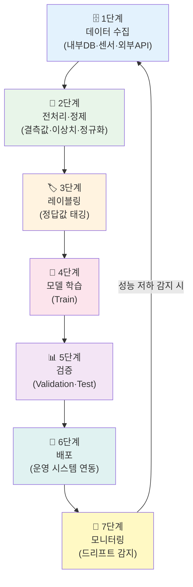
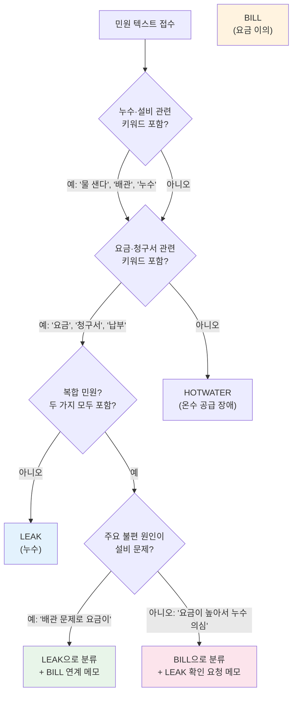

# 📓 17.[이론] AI 프로젝트 데이터 이해 및 학습 데이터 설계

정리일: 2026-10-08 · 교육 에셋 N0811

본문 수집·공개 편집. 도구 실행·최신 기능 재검증은 미실시. 고객·참여자 정보와 개별 접근 링크, 원본 첨부는 제외했습니다.

---

💡 **본 강의는 MySQL 을 기준으로 진행됩니다.**
💡 **데이터 매니저 관점:** AI 모델을 직접 만들지 않더라도, AI 프로젝트에서 어떤 데이터가 필요하고 어떻게 준비해야 하는지 이해하는 것은 데이터 매니저의 핵심 역할입니다. 이 강의는 AI 개발자가 되기 위한 것이 아니라, AI 프로젝트를 데이터 관점에서 지원할 수 있는 역량을 기르는 것이 목표입니다.
**\[수업 목표\]**
- AI/ML 파이프라인 전체 흐름과 각 단계에서 데이터 매니저의 역할을 설명할 수 있습니다.
- 학습(Train) / 검증(Validation) / 테스트(Test) 데이터 분리 개념과 비율 선택 기준을 이해하고 적용할 수 있습니다.
- 레이블링·어노테이션의 개념과 경계 케이스 처리 기준을 이해하고, 공사 민원 자동분류 사례에 적용할 수 있습니다.
- 결측률 수준별로 모델 성능에 미치는 영향을 수치로 설명할 수 있습니다.
- 데이터 드리프트 개념과 발생 원인을 이해하고, 공사 업무 맥락에서 대응 방법을 설명할 수 있습니다.
- AI 프로젝트 데이터 준비 5단계 프로세스를 설계하고 체크리스트를 작성할 수 있습니다.
**\[목차\]**

---
## 01. AI 프로젝트에서 데이터의 역할
> ⏱ 예상 소요: 약 40분
💡 **AI 모델의 성능은 알고리즘이 아니라, 데이터의 품질과 양에 의해 결정됩니다.**
- **☑️ AI/ML 파이프라인 전체 흐름**
AI 프로젝트는 단순히 모델을 만드는 작업이 아닙니다. 데이터 수집부터 실제 운영·모니터링까지 이어지는 **연속적인 파이프라인(Pipeline)** 으로 구성됩니다.
마치 공장의 생산 라인처럼, 각 단계가 순서대로 연결되어야 최종 제품(= AI 모델)이 만들어집니다. 🏭
전체 흐름을 한눈에 파악하면 아래와 같습니다.

각 단계에서 어떤 일이 일어나는지 살펴보겠습니다. 😊

**단계**

**주요 활동**

**산출물 예시**

**1. 데이터 수집**

내부 DB, 외부 공공데이터, 센서 데이터 수집

원시 데이터(Raw Data)

**2. 전처리·정제**

결측값 처리, 이상치 제거, 정규화, 인코딩

정제된 데이터셋

**3. 레이블링**

정답값 생성·검수, 어노테이션 가이드 작성

레이블 완료 데이터셋

**4. 모델 학습**

알고리즘 선택, 모델 훈련(Train)

학습된 모델 파일

**5. 검증**

성능 평가(정확도·F1·RMSE 등), 과적합 확인

성능 리포트

**6. 배포**

운영 시스템 연동, API 노출

서비스 중인 모델

**7. 모니터링**

예측 정확도 추적, 데이터 드리프트 감지

모니터링 대시보드

> 💡 **Tip:** 실제 AI 프로젝트에서 데이터 매니저가 관여하는 단계는 **1·2·3·7단계**입니다. 모델을 직접 만들지 않더라도, 데이터 준비와 모니터링에서 결정적인 역할을 수행합니다.
- **☑️ 데이터 매니저 관점에서 AI 프로젝트의 역할**
AI 프로젝트에서 데이터 매니저는 **“AI가 먹을 재료를 준비하는 요리사”** 와 같습니다. 🍳
셰프(데이터 사이언티스트)가 요리(모델)를 설계하고 만들더라도, 재료(데이터)가 신선하지 않거나 손질이 잘못되어 있으면 아무리 좋은 레시피(알고리즘)라도 맛있는 요리가 나올 수 없습니다.
**만약 데이터 매니저가 없다면 어떻게 될까요?** 🤔
- 학습 데이터에 오염된 값이 섞여 들어가도 아무도 모릅니다.
- 어떤 데이터로 모델을 학습했는지 추적이 불가능합니다.
- 운영 중 모델 성능이 떨어져도 원인을 찾을 수 없습니다.
- 개인정보가 포함된 데이터가 학습에 사용될 수 있습니다.
데이터 매니저의 핵심 역할은 크게 세 가지입니다.
**① 데이터 제공(Data Supply)**
- 모델 학습에 필요한 데이터를 식별하고 수집·추출합니다.
- 내부 시스템(ERP, SCADA, 민원 DB 등)에서 필요한 항목을 정확하게 추출합니다.
**② 품질 보장(Quality Assurance)**
- 학습 데이터의 결측값, 중복, 이상치를 제거합니다.
- 레이블(정답값)의 정확성을 검수합니다.
- 데이터 편향(Bias) 여부를 점검합니다.
**③ 데이터 거버넌스(Data Governance)**
- 학습에 사용된 데이터의 버전과 출처를 기록합니다.
- 개인정보·민감정보 포함 여부를 확인하고 마스킹 처리합니다.
- 데이터 활용 권한과 접근 이력을 관리합니다.
- **☑️ 공사 AI 적용 가능 업무 예시 3가지**
교육기관 10에서 AI 기술을 적용할 수 있는 대표적인 업무 세 가지를 살펴보겠습니다.
**① 열 수요 예측 AI**
- **목적**: 시간대별·계절별 열 수요를 사전에 예측하여 열 생산 계획을 최적화합니다.
- **활용 데이터**: 과거 열 사용량, 기온·습도·풍속 기상 데이터, 요일·공휴일 정보, 단지별 세대수 정보
- **기대 효과**: 과잉 생산·과소 생산 방지 → 연료비 절감
- **데이터 매니저 역할**: SCADA 시스템에서 시간별 사용량 추출, 기상 API 연동, 결측 구간 보간 처리
**② 민원 자동분류 AI**
- **목적**: 고객 민원 텍스트를 분석하여 유형별로 자동 분류·배정합니다.
- **활용 데이터**: 과거 민원 접수 텍스트, 민원 유형 코드, 처리 부서 정보, 처리 결과
- **기대 효과**: 민원 처리 담당자의 분류 업무 자동화 → 응대 속도 향상
- **데이터 매니저 역할**: 민원 텍스트 레이블링 가이드 작성, 경계 케이스 분류 기준 수립, 레이블 검수
**③ 설비 이상 감지 AI**
- **목적**: 배관·펌프·열교환기 등 주요 설비에서 수집되는 센서 데이터를 분석하여 고장을 사전에 탐지합니다.
- **활용 데이터**: 온도·압력·유량 센서 시계열 데이터, 과거 고장 이력, 정비 기록
- **기대 효과**: 예방 정비(Predictive Maintenance) 실현 → 사고 예방
- **데이터 매니저 역할**: 센서 데이터 품질 점검, 고장 이력 레이블 정합성 검수
- **☑️ AI 프로젝트 단계별 데이터 매니저 업무**
아래 표는 AI 프로젝트 단계별로 데이터 매니저가 수행해야 할 업무를 정리한 것입니다.

**AI 프로젝트 단계**

**데이터 매니저 업무**

**공사 적용 예시**

**요건 정의**

필요 데이터 목록 정의, 수집 가능 여부 확인

열 수요 예측에 필요한 기상 데이터 확보 가능 여부 검토

**데이터 수집**

내부 DB 추출 쿼리 작성, 외부 데이터 연동

SCADA 시스템에서 시간별 열 사용량 데이터 추출

**전처리·정제**

결측값 처리, 이상치 제거, 형식 통일

센서 오류로 인한 -999 값 제거, 날짜 형식 통일

**레이블링**

정답값 생성·검수, 어노테이션 가이드 작성

민원 텍스트에 유형 코드(누수·요금·기타) 태깅

**학습 데이터 관리**

버전 관리, 데이터셋 메타데이터 등록

학습 데이터 v1.0 / v2.0 변경 이력 관리

**모델 검증 지원**

테스트 데이터 제공, 성능 리포트 검토

2024년 데이터로 학습 후 2025년 데이터로 검증

**배포 후 모니터링**

실시간 데이터 품질 점검, 드리프트 감지

기온 이상 급변 시 예측 오차 급증 여부 모니터링

---
## 02. 학습 데이터 구성 및 분리 전략
> ⏱ 예상 소요: 약 35분
💡 **학습 데이터를 어떻게 나누고 관리하느냐가 모델의 신뢰성을 좌우합니다.**
- **☑️ 학습 / 검증 / 테스트 데이터 분리 개념**
AI 모델을 학습시킬 때, 전체 데이터를 **세 가지 용도로 분리**하는 것이 원칙입니다.
이것은 마치 학생이 수능을 준비하는 과정과 똑같습니다. 📚
- **교재로 공부하기** → 학습 데이터 (Train)
- **모의고사로 점검하기** → 검증 데이터 (Validation)
- **실제 수능 보기** → 테스트 데이터 (Test)
모의고사 문제를 미리 외워서 시험을 봤다면, 그 점수는 실제 실력이라고 볼 수 없겠죠? 🙂 AI 모델도 마찬가지입니다.

**데이터 종류**

**역할**

**비율(기본)**

**공사 적용 예시**

**학습 데이터 (Train)**

모델이 패턴을 배우는 데 사용

**70%**

2021\~2023년 열 사용량 데이터

**검증 데이터 (Validation)**

학습 중 하이퍼파라미터 튜닝, 과적합 방지

**20%**

2024년 상반기 데이터

**테스트 데이터 (Test)**

최종 성능 평가 (학습에 절대 사용 안 함)

**10%**

2024년 하반기 데이터

> ⚠️ **주의사항**: 테스트 데이터는 모델 학습 과정에서 **절대 노출되어서는 안 됩니다.** 테스트 데이터가 학습에 섞이면, 마치 시험 문제를 미리 외운 것처럼 실제 성능보다 높게 평가되는 **데이터 누수(Data Leakage)** 가 발생합니다.
- **☑️ 비율 선택 기준 — 상황에 따라 다르게 결정합니다**
**7:2:1이 항상 정답은 아닙니다.** 데이터의 양과 특성에 따라 비율을 달리 가져가야 합니다. 아래 기준을 참고해 상황에 맞게 판단하세요. 🙂

**상황**

**권장 비율 (Train:Val:Test)**

**이유**

**데이터가 충분한 경우** (수십만 건 이상)

70 : 20 : 10

기본 원칙, 안정적인 성능 평가

**데이터가 적은 경우** (수천 건 미만)

80 : 10 : 10

학습 데이터 최대 확보 우선

**데이터가 매우 적은 경우** (수백 건)

K-Fold 교차 검증

고정 분리 대신 전체를 돌아가며 사용

**시계열 데이터** (공사 열 사용량 등)

시간 순서로 분리 필수

미래가 과거 학습에 섞이면 안 됨

**클래스 불균형이 심한 경우**

Stratified Split 적용

각 클래스 비율을 유지하며 분리

**공사 열 수요 예측 모델 분리 기준 예시**
열 사용량처럼 **시계열 데이터**는 반드시 시간 순서를 지켜야 합니다. 2024년 데이터를 2023년보다 먼저 학습하면 “미래를 보고 과거를 예측”하는 오류가 생깁니다.
> 학습 기간: 2021-01-01 \~ 2023-12-31 (3년, 약 26,280건/지구) 검증 기간: 2024-01-01 \~ 2024-06-30 테스트 기간: 2024-07-01 \~ 2024-12-31
- **☑️ 학습 데이터 구성 예시: 열 수요 예측 모델**
아래는 열 수요 예측 AI 모델을 위한 실제 학습 데이터 구성 예시입니다.

**컬럼명**

**데이터 타입**

**설명**

**출처 시스템**

**비고**

`measure_dt`

DATETIME

측정 일시 (1시간 단위)

SCADA

기준 컬럼 🚩

`district_code`

VARCHAR(10)

공급 지구 코드

지구 관리 DB

예: `GG-001`

`heat_usage_gcal`

FLOAT

열 사용량 (Gcal)

SCADA

**예측 목표값 (Label) ✅**

`temp_celsius`

FLOAT

외기 온도 (℃)

기상청 API

결측 시 전일 동시간 값으로 보간

`humidity_pct`

FLOAT

습도 (%)

기상청 API

`wind_speed_ms`

FLOAT

풍속 (m/s)

기상청 API

`day_of_week`

INT

요일 (0=월 \~ 6=일)

파생 컬럼

`measure_dt`에서 생성

`is_holiday`

BOOLEAN

공휴일 여부

공공데이터포털

대체 공휴일 포함

`household_count`

INT

공급 세대수

고객 DB

월별 스냅샷

- **☑️ 학습 데이터 관리 원칙**
학습 데이터는 한 번 만들고 끝이 아닙니다. **지속적으로 관리되고 추적 가능해야** 합니다. 📁
**만약 버전 관리를 안 한다면?**
모델 성능이 갑자기 v2.0에서 떨어졌는데, v1.0과 v2.0 데이터의 차이를 아무도 모른다면 원인을 찾는 데만 몇 주가 걸릴 수 있습니다. 최악의 경우 원인을 못 찾고 서비스를 내릴 수도 있습니다. 😥
**① 버전 관리 (Version Control)**
- 데이터셋에 버전 번호를 부여합니다. (예: `dataset_v1.0`, `dataset_v2.1`)
- 어떤 데이터가 추가·수정·삭제되었는지 변경 이력을 기록합니다.
- 모델 성능이 갑자기 떨어졌을 때, 어떤 데이터 변경이 원인인지 추적할 수 있어야 합니다.
**② 출처 추적 (Data Lineage)**
- 각 데이터가 어떤 시스템에서, 언제, 어떻게 수집되었는지 기록합니다.
- 법적 분쟁이나 감사 상황에서 데이터의 신뢰성을 증명할 수 있습니다.
**③ 재현 가능성 (Reproducibility)**
- 동일한 데이터셋으로 다시 학습했을 때 동일한 결과가 나와야 합니다.
- 전처리 코드, 분리 방식(랜덤 시드 등)을 함께 저장합니다.
---
## 03. 레이블링과 경계 케이스 처리
> ⏱ 예상 소요: 약 45분
💡 **레이블링 가이드라인 없이 진행된 레이블링은, 사람마다 다른 정답을 만들어 냅니다.**
- **☑️ 레이블링(Labeling)과 어노테이션(Annotation) 개념**
**레이블(Label)** 이란 AI 모델에게 알려주는 **정답값**입니다.
초등학생에게 “이건 강아지야, 이건 고양이야”라고 가르치듯, AI 모델에게 “이 민원은 누수 신고입니다”라고 알려주는 작업이 바로 **레이블링(Labeling)** 입니다. 🐾
더 세밀한 주석 작업(영역 표시, 속성 태깅 등)은 **어노테이션(Annotation)** 이라 합니다.
**지도학습 vs 비지도학습에서의 레이블 역할**

**학습 방식**

**레이블 필요 여부**

**공사 적용 예시**

**지도학습 (Supervised)**

✅ 필요

민원 텍스트 → 유형 코드 분류, 열 수요 예측

**비지도학습 (Unsupervised)**

❌ 불필요

설비 센서 데이터에서 이상 패턴 군집화

**반지도학습 (Semi-supervised)**

일부 필요

레이블된 민원 1,000건 + 미레이블 5,000건 혼합 학습

- **☑️ 공사 민원 자동분류를 위한 레이블링 예시**
민원 텍스트에 유형 코드를 태깅하는 작업입니다.

**민원 텍스트 (원문)**

**레이블 (유형 코드)**

**담당 부서**

“아파트 지하 배관에서 물이 새는 것 같아요”

`LEAK` (누수)

시설관리팀

“이번 달 난방비가 작년보다 2배나 나왔어요”

`BILL` (요금 이의)

고객서비스팀

“온수가 전혀 안 나오고 있어요. 빨리 와주세요”

`HOTWATER` (온수 공급 장애)

긴급출동팀

“공사 중 소음이 너무 심합니다”

`NOISE` (공사 소음)

민원처리팀

“지역난방 신규 가입 신청하고 싶습니다”

`APPLY` (신규 가입)

영업팀

명확한 민원은 쉽게 분류할 수 있습니다. 그런데… 실제로는 이런 경우가 훨씬 많습니다. 😅
> **“배관에서 물이 새는 것 같기도 하고, 그래서 그런지 난방비도 많이 나왔어요.”**
자, 여기서 문제! 이 민원은 `LEAK`일까요, `BILL`일까요? 🤔
이처럼 하나의 민원이 두 가지 유형에 걸치는 경우를 **경계 케이스(Boundary Case / Edge Case)** 라고 합니다.
- **☑️ 레이블링 경계 케이스 의사결정 기준**
경계 케이스를 처리하는 기준이 없으면, 담당자 A는 `LEAK`, 담당자 B는 `BILL`로 분류하게 됩니다. 이렇게 만들어진 데이터로 학습하면 모델도 혼란에 빠집니다.
**반드시 가이드라인으로 판단 기준을 정해두어야 합니다!**
아래는 공사 민원 분류 경계 케이스별 의사결정 기준 예시입니다.

**복합 민원 처리 3원칙**
1️⃣ **주요 불편 원인 우선**: 민원인이 가장 먼저 언급한 불편 사항을 기준으로 분류합니다.
2️⃣ **연계 정보 메모 필수**: 단일 코드로 분류하되, 관련 유형을 메모란에 기록합니다.
3️⃣ **애매한 경우 상위 분류 코드 사용**: `COMPLEX` 코드로 별도 관리하고, 수동 처리 대기열로 이동합니다.
**공사 민원 경계 케이스 분류 기준표**

**경계 케이스 유형**

**예시 민원 문구**

**분류 기준**

**코드**

누수 + 요금 이의

“배관이 새서 요금이 많이 나온 것 같아요”

설비 문제가 원인 → LEAK 우선

`LEAK`

요금 문의 + 누수 의심

“요금이 갑자기 올랐는데 어디선가 새는 건지”

요금 이의가 주요 불편 → BILL 우선

`BILL`

온수 장애 + 누수 의심

“온수도 안 나오고 바닥이 젖어있어요”

두 가지 동시 → 긴급도 높은 것 우선

`HOTWATER`

단순 문의 + 민원

“신규 가입하고 싶은데 현재 온수가 안 나와요”

서비스 장애가 선결 과제 → HOTWATER

`HOTWATER`

명확하게 분류 불가

“여러 가지 불만이 있습니다”

복합 민원 코드 사용

`COMPLEX`

> 💡 **Tip:** 레이블링 가이드라인 문서는 경계 케이스 예시를 최소 20개 이상 수록하는 것이 좋습니다. 새로운 경계 케이스가 발견될 때마다 즉시 추가하고, 버전 관리하여 레이블링 팀 전원이 최신 기준을 공유해야 합니다.
- **☑️ 레이블링 품질 관리 방법**
레이블링 결과가 일관되는지 확인하는 가장 좋은 방법은 **같은 데이터를 두 사람이 독립적으로 레이블링**하고 얼마나 일치하는지 확인하는 것입니다. 이를 **인터-래터 신뢰도(Inter-Rater Reliability)** 라고 합니다. 😊
일반적으로 일치율이 **80% 미만**이면 가이드라인을 재검토해야 합니다.

**일치율**

**해석**

**조치**

90% 이상

우수 — 가이드라인이 명확함

현행 유지

80\~89%

양호 — 일부 경계 케이스 보완 필요

경계 케이스 예시 추가

70\~79%

주의 — 가이드라인 재작성 필요

담당자 재교육 + 가이드 개정

70% 미만

위험 — 레이블링 전면 재검토 필요

레이블링 중단 후 기준 수립

---
## 04. 데이터 품질과 모델 성능의 관계
> ⏱ 예상 소요: 약 40분
💡 **“Garbage In, Garbage Out” — 나쁜 데이터로 학습한 모델은 나쁜 예측을 합니다.**
- **☑️ “Garbage In, Garbage Out” 원칙**
AI 분야에서 가장 유명한 격언 중 하나입니다.
> **“Garbage In, Garbage Out (GIGO)”** 입력 데이터가 쓰레기이면, 출력 결과도 쓰레기입니다.
아무리 뛰어난 알고리즘과 최신 딥러닝 모델을 사용하더라도, **학습 데이터의 품질이 나쁘면 모델 성능은 기대치에 미치지 못합니다.**
실제로 AI 프로젝트 실패 원인의 상당수는 알고리즘 문제가 아닌 **데이터 문제**에서 비롯됩니다. 😥
마치 눈 나쁜 사람에게 아무리 좋은 안경을 씌워줘도 렌즈가 흐려져 있으면 잘 보이지 않는 것처럼요. 👓
- **☑️ 결측률별 모델 성능 영향 — 수치로 비교해 보겠습니다**
공사 열 수요 예측 모델을 대상으로, 결측률 수준에 따른 모델 성능 변화를 시뮬레이션하면 아래와 같습니다.
**\<결측 처리 미흡 시\>***결측률이 높아질수록 예측 오차(MAPE)가 급격히 악화됩니다*

**결측률**

**예측 오차 (MAPE)**

**판정**

**실무 영향**

**5% 미만**

\~3.2%

✅ 우수

실운영 적용 가능 수준

**5\~20%**

\~8.7%

🟠 주의

특정 계절 예측 오류 증가

**20\~50%**

\~19.4%

🔴 위험

열 생산 계획에 오류 발생 가능

**50% 초과**

\~34% 이상

💀 사용 불가

예측값 신뢰 불가, 모델 재학습 필요

**\<적절한 결측 처리 적용 시\>***보간법 등 올바른 처리를 적용하면 결측률 20%도 관리 가능합니다*

**결측률**

**처리 방법**

**보정 후 예측 오차 (MAPE)**

**개선 효과**

**5% 미만**

선형 보간

\~3.0%

처리 전 대비 약 6% 개선

**5\~20%**

선형 보간 + 전일 동시간 대체

\~5.1%

처리 전 대비 약 41% 개선

**20\~50%**

다중 보간 + 계절 평균 대체

\~11.2%

처리 전 대비 약 42% 개선, 단 여전히 주의 필요

> 💡 **Tip:** MAPE(Mean Absolute Percentage Error)는 예측값이 실제값에서 평균 몇 % 벗어났는지를 나타내는 지표입니다. 5% 미만이면 우수, 10% 이하면 양호, 20% 초과면 실용성 저하로 봅니다.
- **☑️ 데이터 드리프트(Data Drift) — 계절이 바뀌듯 데이터 패턴도 바뀝니다**
봄에 좋아하는 음식과 겨울에 좋아하는 음식이 다르듯, 데이터의 패턴도 시간이 지나면서 변합니다.
여름 식단 정보만 보고 겨울 메뉴를 짜면 어떻게 될까요? 🍱 냉국과 수박만 메뉴에 가득할 겁니다…
AI 모델도 마찬가지입니다. **여름철 데이터로 학습한 열 수요 예측 모델을겨울철에 그대로 사용하면 예측이 완전히 빗나갑니다.** 이것이 바로 **데이터 드리프트(Data Drift)** 현상입니다.
**데이터 드리프트의 종류**

**종류**

**개념**

**공사 적용 예시**

**코셉트 드리프트 (Concept Drift)**

입력-출력 관계 자체가 바뀜

재생에너지 확대로 열 수요 패턴이 구조적으로 변화

**데이터 드리프트 (Data Drift)**

입력 데이터 분포가 변함

신규 단지 입주로 세대수·사용량 분포 변화

**레이블 드리프트 (Label Drift)**

출력값(정답) 분포가 변함

신규 민원 유형 증가로 기존 분류 체계가 맞지 않음

**공사에서 드리프트가 발생하는 상황 예시**
- 겨울철 이후 봄철로 계절 전환 시 → 열 사용량 패턴 급변
- 신규 아파트 단지 대규모 입주 시 → 공급 세대수·지역 분포 변화
- 에너지 요금 체계 개편 시 → 고객 소비 행동 패턴 변화
- COVID-19 등 외부 충격 발생 시 → 재실 패턴, 사용 시간대 변화
**드리프트 대응 방법**
- 모델 성능을 주기적으로 모니터링합니다.
- 성능 저하 임계값을 설정하고, 초과 시 알람을 받습니다.
- 최신 데이터를 추가하여 모델을 재학습(Retrain) 합니다.
- 계절별·분기별 모델을 별도 운영하는 방식도 고려합니다.
- **☑️ 데이터 품질 문제 유형 × 모델 영향 매트릭스**

**품질 문제 유형**

**발생 원인**

**모델 영향**

**심각도**

**권장 대응**

**결측값 (Missing Value)**

센서 오류, DB 미입력

학습 오류 또는 편향된 패턴 학습

🔴 높음

보간, 평균 대체, 행 삭제

**이상치 (Outlier)**

측정 오류, 이벤트성 급변

모델이 이상치 패턴을 정상으로 학습

🟠 중간

IQR·Z-score 기반 제거

**클래스 불균형 (Imbalance)**

특정 유형 데이터 과다 수집

소수 클래스 예측률 극도로 저하

🔴 높음

오버샘플링(SMOTE), 가중치 조정

**레이블 오류 (Label Noise)**

레이블링 가이드 부재, 작업자 실수

모델이 잘못된 정답을 학습

🔴 높음

교차 검수, 가이드라인 강화

**중복 데이터 (Duplicate)**

ETL 오류, 시스템 중복 입력

특정 패턴 과학습

🟡 낮음

중복 제거(DISTINCT)

**시간 순서 오류 (Time Leakage)**

미래 데이터가 과거 학습에 포함

실제보다 성능이 높게 측정됨

🔴 높음

시계열 분리 기준 엄격 적용

**형식 불일치 (Format Error)**

시스템 간 형식 차이

조인·집계 오류, 학습 실패

🟠 중간

형식 통일 전처리

**데이터 드리프트 (Data Drift)**

운영 환경 변화, 계절·정책 변화

시간이 지날수록 예측 정확도 저하

🟠 중간

주기적 모니터링, 재학습 계획 수립

- **☑️ 고품질 학습 데이터의 4가지 조건**
좋은 학습 데이터는 아래 네 가지 조건을 갖춰야 합니다.
**① 대표성 (Representativeness)**
- 학습 데이터가 실제 운영 환경의 다양한 케이스를 포함해야 합니다.
- 예) 여름·겨울·봄·가을 모든 계절 데이터 포함
- 만약 여름 데이터만 있다면? → 겨울 수요를 전혀 예측하지 못합니다.
**② 균형성 (Balance)**
- 클래스(유형)별 데이터 수가 지나치게 불균형하지 않아야 합니다.
- 예) 민원 유형별 학습 샘플 수를 비슷하게 맞춤
- 만약 누수 민원이 90%라면? → 모든 민원을 누수로 분류하는 모델이 됩니다.
**③ 정확성 (Accuracy)**
- 레이블과 실제 값이 정확해야 합니다.
- 예) 민원 유형 코드가 잘못 태깅되면 모델도 잘못 학습
- 만약 레이블 오류율이 10%라면? → 모델 정확도가 최대 10% 낮아집니다.
**④ 최신성 (Recency)**
- 오래된 데이터만으로 학습하면 현재 패턴을 반영하지 못합니다.
- 예) 5년 전 요금 체계 기반 민원 데이터로 현재 분류기 학습 시 성능 저하
- 이것이 바로 데이터 드리프트가 발생하는 근본 원인입니다.
---
## 05. 데이터 준비 프로세스 설계
> ⏱ 예상 소요: 약 30분
💡 **AI 프로젝트 성공의 80%는 데이터 준비 단계에서 결정됩니다.**
- **☑️ 데이터 준비 5단계 프로세스**
AI 모델 학습을 위한 데이터 준비는 아래 5단계 프로세스로 체계적으로 진행합니다.

**1단계: 요건 정의**
- 어떤 문제를 풀기 위한 모델인지 명확히 정의합니다.
- 필요한 데이터 항목, 기간, 수준을 데이터 사이언티스트와 협의합니다.
- 수집 가능 여부·개인정보 포함 여부를 사전 검토합니다.
- **산출물**: 데이터 요건 정의서
**2단계: 수집·추출**
- 내부 DB에서 SQL 쿼리로 데이터를 추출합니다.
- 외부 데이터(기상청, 공공데이터포털 등)와 연동합니다.
- 원시 데이터를 **그대로 보관**하고 이후 작업은 복사본에 진행합니다.
- **산출물**: 원시 데이터셋 (Raw Dataset)
**3단계: 전처리·정제**
- 결측값, 이상치, 중복을 처리합니다.
- 데이터 형식을 통일하고 정규화·인코딩을 적용합니다.
- 처리 방식과 사유를 문서화합니다.
- **산출물**: 정제 데이터셋 + 전처리 로그
**4단계: 레이블링**
- 지도학습 모델의 경우 정답값(Label)을 생성합니다.
- 레이블링 가이드라인 문서를 작성합니다.
- 2인 이상 교차 검수로 레이블 일관성을 확인합니다.
- **산출물**: 레이블 완료 데이터셋 + 가이드라인 문서
**5단계: 검수·승인**
- 데이터 품질 지표(결측률, 이상치 비율, 클래스 분포)를 점검합니다.
- 데이터 책임자(담당 팀장 등)의 승인을 받습니다.
- 최종 데이터셋에 버전 번호를 부여하고 카탈로그에 등록합니다.
- **산출물**: 검수 완료 보고서 + 공식 데이터셋 (버전 부여)
- **☑️ 전처리 기법 개요**
데이터 전처리는 원시 데이터를 모델이 학습할 수 있는 형태로 변환하는 작업입니다. 대표적인 기법을 살펴보겠습니다.

**기법**

**설명**

**공사 적용 예시**

**정규화 (Normalization)**

수치 데이터를 0\~1 또는 -1\~1 범위로 변환

온도(-20\~40℃)와 열 사용량(0\~5000Gcal)의 스케일 차이를 통일

**결측값 처리 (Missing Value)**

평균·중앙값으로 대체 또는 보간

SCADA 결측 구간을 앞뒤 값의 평균으로 보간

**이상치 제거 (Outlier Removal)**

IQR, Z-score 기반으로 극단값 제거

센서 오류로 인한 9999Gcal 값 제거

**인코딩 (Encoding)**

범주형 데이터를 숫자로 변환

민원 유형(`LEAK`, `BILL`)을 숫자 코드로 변환

**피처 엔지니어링 (Feature Engineering)**

기존 컬럼에서 새로운 변수 생성

`measure_dt`에서 `hour`, `day_of_week`, `month` 분리

**스케일링 (Scaling)**

데이터 범위 조정

StandardScaler, MinMaxScaler 적용

- **☑️ 공사 AI 프로젝트 데이터 준비 체크리스트**
AI 프로젝트 착수 전, 아래 체크리스트로 데이터 준비 상태를 점검하세요. ✅

**번호**

**체크 항목**

**확인 여부**

**담당자**

1

AI 모델의 예측 목표(Label)를 명확히 정의했는가?

☐

데이터 매니저

2

학습에 필요한 데이터 항목 목록을 작성했는가?

☐

데이터 매니저

3

개인정보 및 민감정보 포함 여부를 확인했는가?

☐

데이터 보호 담당

4

데이터 수집 기간 및 범위를 결정했는가?

☐

데이터 매니저

5

원시 데이터 백업본을 별도 보관하고 있는가?

☐

데이터 매니저

6

결측값 처리 방식과 사유를 문서화했는가?

☐

데이터 매니저

7

이상치 제거 기준을 정의하고 적용했는가?

☐

데이터 매니저

8

레이블링 가이드라인 문서를 작성했는가?

☐

데이터 매니저

9

경계 케이스 분류 기준을 가이드라인에 포함했는가?

☐

데이터 매니저

10

레이블링 인터-래터 신뢰도(일치율 80% 이상)를 확인했는가?

☐

데이터 매니저

11

학습/검증/테스트 데이터를 정확히 분리했는가?

☐

데이터 매니저

12

클래스 불균형 여부를 확인하고 대응했는가?

☐

데이터 매니저

13

데이터셋 버전 번호를 부여하고 이력을 기록했는가?

☐

데이터 매니저

14

드리프트 모니터링 계획을 수립했는가?

☐

데이터 매니저

15

데이터 책임자의 검수·승인을 완료했는가?

☐

팀장

- **☑️ 공사 열 수요 예측 AI 데이터 준비 계획 예시**
아래는 실제 프로젝트 착수 시 작성하는 데이터 준비 계획서의 예시입니다.

**항목**

**내용**

**프로젝트명**

지구별 시간대 열 수요 예측 AI 모델 구축

**예측 목표 (Label)**

1시간 후 지구별 열 사용량 (단위: Gcal)

**학습 데이터 기간**

2021-01-01 \~ 2023-12-31 (3년)

**검증 데이터 기간**

2024-01-01 \~ 2024-06-30 (6개월)

**테스트 데이터 기간**

2024-07-01 \~ 2024-12-31 (6개월)

**수집 항목**

열 사용량, 외기 온도, 습도, 풍속, 요일, 공휴일 여부, 세대수

**수집 출처**

SCADA (내부), 기상청 API (외부), 공공데이터포털 공휴일 (외부)

**결측값 처리**

선형 보간법 (최대 3시간 연속 결측), 초과 시 해당 구간 제외

**이상치 기준**

Z-score \> 3.0 인 값은 이상치로 분류 후 제거

**레이블링 필요 여부**

불필요 (회귀 모델, 실측값이 Label)

**클래스 불균형**

해당 없음 (회귀 문제)

**드리프트 모니터링**

분기별 MAPE 점검, 10% 초과 시 재학습 트리거

**데이터셋 버전**

v1.0 (2025-07-01 기준)

**담당자**

데이터관리팀 프로님

**승인자**

데이터관리팀장 김담당

---
## 06. 요약
> ⏱ 예상 소요: 약 10분
💡 **금일 수업내용을 복기해 보겠습니다.**
- AI/ML 파이프라인은 **데이터 수집 → 전처리 → 레이블링 → 학습 → 검증 → 배포 → 모니터링** 순서로 진행됩니다.
- 데이터 매니저는 AI 프로젝트에서 **데이터 제공·품질 보장·거버넌스** 세 가지 핵심 역할을 수행합니다.
- 공사에서 AI를 적용할 수 있는 대표 업무는 **열 수요 예측, 민원 자동분류, 설비 이상 감지**입니다.
- 학습 데이터는 **학습(Train) / 검증(Validation) / 테스트(Test)** 로 분리하며, 기본 비율은 7:2:1이지만 데이터 양과 특성에 따라 달리 결정합니다.
- 테스트 데이터는 학습 과정에서 **절대 노출되어서는 안 되며**, 이를 어기면 데이터 누수(Data Leakage)가 발생합니다.
- 시계열 데이터(열 사용량 등)는 반드시 **시간 순서를 지켜 분리**해야 합니다.
- **레이블링**은 지도학습 모델에 정답값을 부여하는 작업이며, **레이블링 가이드라인** 작성이 반드시 선행되어야 합니다.
- 복합 민원처럼 두 가지 유형에 걸치는 **경계 케이스(Edge Case)** 에 대한 분류 기준을 가이드라인에 명시해야 합니다.
- 레이블링 품질은 **인터-래터 신뢰도(일치율 80% 이상)** 로 검증합니다.
- 결측률 5% 미만이면 모델 성능에 큰 영향이 없으나, **20% 초과 시 예측 오차가 두 배 이상** 급증합니다.
- **데이터 드리프트**는 운영 환경이 변하면서 학습 데이터와 실제 데이터의 분포가 달라지는 현상으로, 주기적 모니터링과 재학습으로 대응합니다.
- **“Garbage In, Garbage Out”** — 데이터 품질이 낮으면 아무리 좋은 모델도 나쁜 예측을 합니다.
- 고품질 학습 데이터의 조건은 **대표성, 균형성, 정확성, 최신성** 네 가지입니다.
- 데이터 준비 5단계는 **요건 정의 → 수집·추출 → 전처리·정제 → 레이블링 → 검수·승인** 입니다.
- AI 프로젝트 착수 전 **15개 항목의 데이터 준비 체크리스트**를 통해 누락 없이 점검하는 것이 중요합니다.
