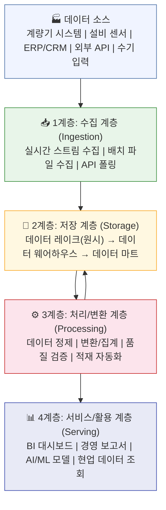
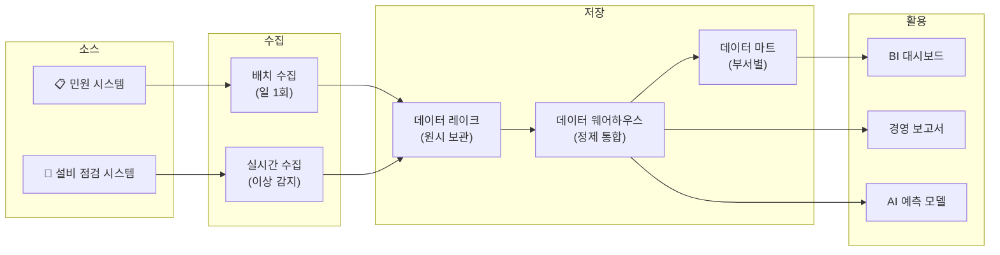

# 📓 19.[이론] 데이터 플랫폼 구조 및 파이프라인 설계

정리일: 2026-10-08 · 교육 에셋 N0813

본문 수집·공개 편집. 도구 실행·최신 기능 재검증은 미실시. 고객·참여자 정보와 개별 접근 링크, 원본 첨부는 제외했습니다.

---

💡 **본 강의는 MySQL 을 기준으로 진행됩니다.**
**\[수업 목표\]**
- 데이터 플랫폼의 정의와 단순 데이터베이스와의 차이를 설명할 수 있습니다.
- 데이터 레이크, 데이터 웨어하우스, 데이터 마트의 개념과 역할을 구분할 수 있습니다.
- 데이터 플랫폼의 4계층 구조(수집·저장·처리·활용)를 이해하고 각 계층의 역할을 설명할 수 있습니다.
- ETL과 ELT의 차이를 이해하고, 상황에 맞는 방식을 선택하는 기준을 파악할 수 있습니다.
- 파이프라인 오류 처리 패턴(재시도, 멱등성, 부분 롤백)의 개념을 이해할 수 있습니다.
- 공사 데이터 플랫폼의 운영 전략과 데이터 매니저의 역할 변화를 파악할 수 있습니다.
**\[목차\]**

---
## **01.** 데이터 플랫폼이란?
> ⏱ 예상 소요: 약 30분
💡 **데이터 플랫폼은 데이터의 수집·저장·처리·분석·활용을 하나의 환경에서 통합 지원하는 인프라입니다.**
- **☑️ 데이터 플랫폼의 정의**
데이터 플랫폼을 한 문장으로 정의하면 이렇습니다.
**“조직의 데이터가 태어나서 사라지기까지, 전체 여정을 관리하는 종합적인 기술 환경”**
조금 더 풀어서 설명해 볼게요. 🙂
회사 안팎에서 발생하는 다양한 데이터를 **체계적으로 수집**하고,<br>안전하게 **저장**하며, 필요에 따라 **가공·처리**하고,<br>최종적으로 업무에 **활용**할 수 있도록 통합 지원하는<br>인프라와 도구들의 집합이 바로 **데이터 플랫폼(Data Platform)**입니다.
여기서 핵심은 **“통합”**이에요.<br>데이터를 단순히 보관하는 창고가 아니라,<br>데이터가 이동하고, 변환되고, 분석되는<br>**전체 흐름을 하나의 환경에서 일관되게 관리**하는 것입니다.
> 💡 **Tip:** 데이터 플랫폼은 데이터의 “전체 생애주기(Life Cycle)”를 다룹니다. 생성 → 수집 → 저장 → 처리 → 활용 → 폐기까지 모두 포함됩니다.
- **☑️ 단순 DB vs 데이터 플랫폼, 무엇이 다를까요?**
흔히 “우리 회사에도 데이터베이스(DB)가 있는데, 그게 데이터 플랫폼 아닌가요?” 라고 물으시는 분들이 있어요.
비유를 하나 들어볼게요. 🙂
**단순 DB**는 특정 업무를 위한 **전용 창고**입니다.<br>“계량기 데이터 창고”, “민원 데이터 창고”, “설비 데이터 창고”처럼<br>각자 따로 운영되는 형태죠.
**데이터 플랫폼**은 이 모든 창고를 하나로 연결한 **물류 센터**입니다.<br>각 창고에서 물건(데이터)을 받아서,<br>분류하고, 정리하고, 필요한 곳에 배달까지 해주는 역할을 합니다.
아래 표로 차이를 정리해 보겠습니다.


구분

🔴 단순 데이터베이스(DB)

🔵 데이터 플랫폼


**목적**

특정 업무 데이터 저장·조회

전사 데이터 통합·분석·활용


**데이터 범위**

단일 시스템, 정형 데이터 중심

다중 시스템, 정형·반정형·비정형 포함


**처리 방식**

실시간 트랜잭션(OLTP) 중심

분석 처리(OLAP) + 배치 + 실시간 혼합


**사용자**

개발자, 운영 담당자

전사 부서, 경영진, 데이터 분석가


**확장성**

수직 확장(서버 업그레이드)

수평 확장(분산 처리) 가능


**거버넌스**

개별 시스템 관리

통합 메타데이터·품질·접근 관리


**예시**

MySQL 업무 DB, ERP DB

데이터 레이크 + 웨어하우스 + 마트 통합 환경


**만약 데이터 플랫폼 없이 운영한다면?**
교육기관 10에서 “지난 3년간 지역별 월평균 열 사용량 추이와 민원 발생 건수의 상관관계를 분석해 주세요”라는 요청이 들어왔다고 가정해 봅시다.
데이터 플랫폼이 없다면?
- 계량기 담당자에게 열 사용량 파일 요청 → 엑셀 파일 수령
- 민원 담당자에게 민원 데이터 파일 요청 → 또 다른 엑셀 파일 수령
- 두 파일의 컬럼명과 기준이 달라서 직접 맞추기 작업 수행
- 이 과정만 며칠…
데이터 플랫폼이 있다면?
- 플랫폼에서 통합된 데이터를 SQL 한 줄로 조회 → 즉시 분석 가능
이것이 데이터 플랫폼이 필요한 이유입니다. 😊
- **☑️ 데이터 레이크, 웨어하우스, 마트 — 세 가지 저장 방식**
데이터 플랫폼 안에는 역할이 다른 세 가지 저장 공간이 있습니다.
이것도 비유로 이해해 봅시다. 🙂
**도서관을 떠올려 보세요.**


공간

도서관 비유

데이터 저장소


창고(지하 보관실)

기증받은 모든 책을 일단 쌓아 두는 공간

**데이터 레이크**


열람실(메인 서가)

분류·정리되어 누구나 찾을 수 있는 공간

**데이터 웨어하우스**


전문 열람실

특정 주제(법률, 의학 등)만 모아 둔 공간

**데이터 마트**


**데이터 레이크(Data Lake)**
모든 원시(Raw) 데이터를 형태와 관계없이 **그대로 저장**하는 대규모 저장소입니다.<br>정형·반정형·비정형 데이터를 모두 수용하며,<br>“일단 다 받아놓고 나중에 필요할 때 꺼내 쓴다”는 방식입니다.
**데이터 웨어하우스(Data Warehouse)**
분석 목적으로 **정제되고 통합된 정형 데이터**를 저장하는 중앙 저장소입니다.<br>레이크에서 처리된 데이터가 적재되어 일관된 기준으로 분석에 활용됩니다.<br>“창고(레이크)에서 꺼내서 깔끔하게 정리한 데이터 보관소”라고 보면 됩니다.
**데이터 마트(Data Mart)**
특정 부서나 업무 영역의 분석 목적에 맞게 웨어하우스의 일부를 추출·가공한<br>**소규모 전문 저장소**입니다.<br>“열사용량 분석팀만 쓰는 전용 창고”, “민원팀만 쓰는 전용 창고” 같은 개념입니다.


구분

🏞️ 데이터 레이크

🏛️ 데이터 웨어하우스

🏪 데이터 마트


**저장 데이터**

원시 데이터 (정형·비정형 모두)

정제된 정형 데이터

특정 주제 정형 데이터


**데이터 형태**

구조화되지 않은 원본 그대로

스키마 정의된 구조화 데이터

특정 분석용 요약·집계 데이터


**용도**

원시 데이터 보관, 탐색적 분석

전사 통합 분석, BI 리포트

부서별 특화 분석, 빠른 조회


**사용 대상**

데이터 엔지니어, 데이터 과학자

데이터 분석가, 경영진

부서 담당자, 현업 분석가


**처리 속도**

상대적으로 느림 (대용량 처리)

중간 (최적화된 쿼리)

빠름 (소규모, 사전 집계)


**공사 예시**

계량기 원시 로그, 설비 센서 스트림

월별 열 사용량 통합 테이블

지역별 고객 민원 분석 테이블


- **☑️ 레이크와 웨어하우스의 경계, 실제로는 모호합니다**
교과서에서는 레이크와 웨어하우스를 명확히 구분하지만,<br>**실제 현장에서는 그 경계가 모호한 경우가 많습니다.** 😅
최근에는 **레이크하우스(Lakehouse)**라는 개념이 등장했는데요,<br>레이크의 저장 유연성과 웨어하우스의 분석 성능을 결합한 형태입니다.<br>(Databricks, Delta Lake, Apache Iceberg 같은 기술이 대표적입니다.)
국내 대기업 사례를 보면:
- **카카오**: 하둡 기반 데이터 레이크에 메타 정보를 올려 웨어하우스처럼 활용
- **현대자동차**: 클라우드 데이터 레이크하우스로 생산·품질 데이터 통합 분석
- **한전KDN**: 전력 데이터 레이크를 구축하여 에너지 분석 플랫폼 운영
**공사 데이터 매니저 관점에서 중요한 것은?**<br>“레이크냐 웨어하우스냐”를 엄격하게 구분하는 것보다,<br>**“원시 데이터를 보존하고 있는가?”, “정제된 데이터로 분석이 가능한가?”**<br>이 두 가지를 운영 기준으로 삼는 것이 실용적입니다.
- **☑️ 공사 데이터 플랫폼 구성 예시**
교육기관 10의 데이터를 세 저장 영역에 매핑하면 아래와 같습니다.


저장 영역

주요 데이터

활용 목적


**데이터 레이크**

계량기 원시 데이터 (15분 단위 측정값), 설비 센서 로그, IoT 스트림 원본

원시 데이터 보존, 재처리 기반 확보


**데이터 웨어하우스**

월별 열 사용량 집계, 고객 계약 정보 통합본, 설비 운전 이력 정제본

전사 통합 분석, 경영 보고


**데이터 마트**

지역별 공급 현황 분석, 고객 민원 통계, 설비 고장 이력 요약

부서별 업무 분석, 현장 지원


!공사_데이터플랫폼_구성도.png
---
## **02.** 데이터 수집·저장·처리·활용 구조
> ⏱ 예상 소요: 약 35분
💡 **데이터는 소스에서 태어나 수집 → 저장 → 처리 → 활용의 4계층을 거쳐 가치를 만들어 냅니다.**
- **☑️ 4계층 구조란 무엇인가요?**
데이터 플랫폼은 데이터가 생성되는 시점부터<br>최종 사용자에게 가치를 제공하는 시점까지의 흐름을<br>**4개의 계층**으로 구분하여 설계합니다.
음식 배달 앱에 비유해 볼게요. 🙂
- **1계층 수집**: 식당에서 주문 접수 (소스에서 데이터 가져오기)
- **2계층 저장**: 주방 냉장고에 식재료 보관 (데이터 레이크/웨어하우스에 저장)
- **3계층 처리**: 요리사가 음식을 만드는 과정 (데이터 정제·변환·집계)
- **4계층 활용**: 손님에게 음식 서빙 (분석 도구, 보고서, AI 모델에 제공)
각 계층은 독립적으로 동작하면서도 유기적으로 연결됩니다.
- **☑️ 4계층별 역할과 주요 기술**


계층

명칭

역할

주요 기술/도구


**1계층**

수집 계층 (Ingestion Layer)

다양한 소스에서 데이터를 수집·유입

Apache Kafka, Fluentd, API 연동, CDC


**2계층**

저장 계층 (Storage Layer)

수집된 데이터를 목적에 맞게 저장

HDFS, Amazon S3, MySQL, NoSQL


**3계층**

처리/변환 계층 (Processing Layer)

저장 데이터를 정제·변환·집계

Apache Spark, dbt, SQL, Python


**4계층**

서비스/활용 계층 (Serving Layer)

분석·보고·AI 모델에 데이터 제공

BI 도구, REST API, ML 플랫폼


- **☑️ 4계층 구조 다이어그램**
아래 다이어그램으로 전체 흐름을 한눈에 확인해 보겠습니다.

> 💡 **Tip:** 처리 계층(3계층)의 결과는 다시 저장 계층(2계층)으로 돌아갑니다. “정제된 데이터를 웨어하우스에 다시 적재”하는 과정이 바로 이 순환 흐름입니다.
- **☑️ 공사 데이터 흐름 예시: 계량기 데이터**
공사의 계량기 데이터가 플랫폼을 통해 경영 보고와 AI 예측 모델로 활용되기까지의 흐름을 단계별로 살펴보겠습니다.


단계

내용

담당 계층


① 계량기 원시 데이터 발생

각 세대별 열 사용량 원시 측정값 (15분 단위)

데이터 소스


② 수집

배치 파일(CSV) 또는 API 방식으로 플랫폼 유입

1계층: 수집


③ 원시 데이터 저장

데이터 레이크에 원본 그대로 저장 (재처리 대비)

2계층: 저장


④ 정제 및 집계

이상값 제거, 일별/월별 합산, 고객 정보 결합

3계층: 처리


⑤ 웨어하우스 적재

정제된 월별 사용량 데이터를 웨어하우스에 적재

2계층: 저장


⑥ 보고/AI 활용

BI 대시보드 공급 현황 시각화, 수요 예측 AI 학습

4계층: 활용


!계량기_데이터_흐름도.png
- **☑️ 민원 데이터와 설비 데이터의 흐름 예시**
계량기 데이터 외에도, 공사에서 관리하는 다양한 데이터가 동일한 4계층 흐름을 따릅니다.

---
## **03.** ETL/ELT와 데이터 파이프라인 설계
> ⏱ 예상 소요: 약 45분
💡 **ETL은 “요리 후 배달”, ELT는 “배달 후 요리” — 변환의 순서가 핵심 차이입니다.**
- **☑️ ETL이란 무엇인가요?**
**ETL(Extract-Transform-Load)**은 데이터 통합의 **전통적인 방식**입니다.
이름 그대로 세 단계로 진행됩니다.
- **E (Extract)**: 원본 시스템(DB, 파일, API)에서 데이터 **추출**
- **T (Transform)**: 중간 서버에서 정제·변환·집계 **처리**
- **L (Load)**: 변환 완료된 데이터를 목적지 DB/웨어하우스에 **적재**
쉽게 말하면, **“식재료를 사서, 집에서 요리하고, 도시락 담아 배달”**하는 방식입니다.
집에서 요리(변환)를 먼저 완성한 뒤에 목적지로 보내는 거죠.
전통적인 온프레미스 환경, 소규모 데이터,<br>데이터 웨어하우스 용량이 제한적인 경우에 적합합니다.
- **☑️ ELT란 무엇인가요?**
**ELT(Extract-Load-Transform)**는 현대적 클라우드 기반 플랫폼에서 주로 사용하는 **현대적인 방식**입니다.
- **E (Extract)**: 원본 시스템에서 데이터 **추출**
- **L (Load)**: 원시 데이터를 그대로 데이터 레이크/웨어하우스에 **적재**
- **T (Transform)**: 플랫폼 내부에서 SQL 또는 처리 도구로 **변환**
비유하면, **“식재료를 그대로 배달받고, 배달 온 곳의 주방에서 요리”**하는 방식입니다.
먼저 모든 재료를 받아 두고, 필요할 때 그 자리에서 요리(변환)하는 거죠.
대용량 데이터, 클라우드 환경, 다양한 분석 요구가 있는 경우에 적합합니다.
- **☑️ ETL vs ELT 비교**
**\<전통적 방식: etl\>***변환을 먼저 하고 적재 — 저장 공간이 부족하거나 정해진 형태만 필요할 때*


구분

ETL

ELT


**변환 시점**

적재 전 (외부 서버에서)

적재 후 (플랫폼 내부에서)


**처리 위치**

중간 ETL 서버

목적지 플랫폼 내부


**원시 데이터 보존**

변환 후 데이터만 보존

원시 데이터 그대로 보존 ✅


**처리 속도**

대용량에서 느릴 수 있음

분산 처리로 대용량에 강함 ✅


**유연성**

사전 정의된 변환 규칙 필요

필요 시 재처리 가능 ✅


**적합 환경**

온프레미스, 소규모 데이터

클라우드, 대용량 데이터


**주요 도구**

전통적 ETL 툴, 사내 스크립트

dbt, Spark, SQL 기반 변환


- **☑️ ETL vs ELT 선택 의사결정 체크리스트**
“우리 공사는 ETL을 써야 할까요, ELT를 써야 할까요?”
아래 체크리스트로 판단해 보세요. ☑️


판단 기준

ETL 선택

ELT 선택


**데이터 규모**

소규모 (GB 이하)

대규모 (TB 이상)


**저장 공간**

저장 공간이 제한적

충분한 클라우드 저장소 확보


**변환 복잡도**

복잡한 비즈니스 로직이 변환에 포함

SQL로 표현 가능한 수준의 변환


**원시 데이터 재활용**

원시 데이터를 다시 볼 일이 없음

원시 데이터를 다양한 목적으로 재활용


**분석 요구의 유연성**

분석 방향이 고정되어 있음

새로운 분석 요구가 자주 발생


**인프라 환경**

온프레미스 서버 중심

클라우드 또는 분산 처리 환경


**비용 구조**

초기 인프라 투자 후 저렴한 운영

저장 비용 + 처리 비용 클라우드 과금


> 💡 **Tip:** 공사처럼 계량기·설비·민원 데이터를 장기 보존하고 다양한 분석에 재활용해야 한다면, **ELT 방식이 더 적합**합니다. 원시 데이터를 그대로 보존해 두면 나중에 “3년 전 데이터를 새로운 기준으로 다시 분석”하는 것이 가능해지기 때문입니다.
- **☑️ 데이터 파이프라인이란 무엇인가요?**
**데이터 파이프라인(Data Pipeline)**은<br>데이터가 소스에서 최종 활용 단계까지 **자동으로 흘러가는 자동화된 처리 흐름**입니다.
물이 수도관을 통해 가정으로 공급되는 것처럼,<br>데이터도 파이프라인을 통해 자동으로 이동하고 처리됩니다.
파이프라인의 5가지 구성 요소:
- **소스(Source)**: 데이터가 발생하는 원점 시스템
- **수집(Ingestion)**: 소스에서 플랫폼으로 데이터를 가져오는 과정
- **변환(Transformation)**: 정제, 집계, 형식 통일, 파생 컬럼 생성 등
- **적재(Load)**: 변환된 데이터를 목적지 저장소에 삽입
- **서빙(Serving)**: 분석 도구, API, 보고 시스템에 데이터 제공
- **☑️ 배치 파이프라인 vs 실시간 파이프라인 비교**
파이프라인은 처리 방식에 따라 크게 두 가지로 나뉩니다.


구분

🔵 배치(Batch) 파이프라인

🔴 실시간(Streaming) 파이프라인


**처리 방식**

일정 시간 단위로 모아서 처리

데이터 발생 즉시 처리


**처리 주기**

시간별, 일별, 월별 등

수 초\~수 밀리초 단위


**데이터 지연**

처리 주기만큼 지연 발생

거의 지연 없음 (Near Real-time)


**시스템 복잡도**

비교적 단순

높음 (스트림 처리 인프라 필요)


**리소스 사용**

집중적 (처리 시점에 집중)

지속적 (항상 리소스 점유)


**적합 사례**

월별 정산, 일별 집계, 정기 보고

실시간 경보, 이상 감지, 모니터링


**공사 적용 예**

월별 열 사용량 집계, 분기 보고

설비 이상 알림, 실시간 공급 모니터링


- **☑️ 공사 배치 파이프라인 예시: 월별 열 사용량 집계**
공사에서 매월 실행되는 열 사용량 집계 배치 파이프라인의 흐름을 단계별로 살펴봅니다.


단계

작업 내용

처리 도구


① 트리거

매월 1일 새벽 2시 자동 실행

스케줄러(Cron)


② 데이터 추출

계량기 DB에서 전월 원시 데이터 추출

SQL SELECT


③ 품질 점검

NULL 값, 음수값, 이상치(Outlier) 검출

Python 스크립트


④ 정제 처리

이상 데이터 보정 또는 제외, 단위 통일

SQL / Python


⑤ 집계 계산

고객별·지역별·공급구역별 월 사용량 합산

SQL GROUP BY


⑥ 적재

집계 결과를 웨어하우스 `monthly_usage` 테이블에 INSERT

SQL INSERT


⑦ 검증

전월 대비 편차 점검, 누락 고객 확인

검증 쿼리


⑧ 알림

처리 완료 또는 오류 발생 시 담당자 이메일 발송

알림 시스템


---
## **04.** 파이프라인 오류 처리 패턴
> ⏱ 예상 소요: 약 40분
💡 **파이프라인은 언제든 실패할 수 있습니다. 중요한 것은 실패를 예상하고 설계하는 것입니다.**
- **☑️ 왜 오류 처리가 중요한가요?**
파이프라인이 중간에 실패하면 어떤 일이 생길까요?
공사의 월별 열 사용량 집계 파이프라인이 ⑥ 적재 단계에서 실패했다고 가정해 봅시다.
- **오류 처리가 없다면**: 일부 데이터만 적재된 채로 멈춤 → 절반만 들어간 데이터로 분석 → 잘못된 경영 보고서 생성 😱
- **오류 처리가 있다면**: 실패를 감지하고 자동 재시도 → 재시도도 실패 시 담당자 알림 → 문제 원인 파악 후 안전하게 재실행
**파이프라인 오류 처리는 “혹시 모를 상황”이 아니라 “반드시 일어날 상황”에 대한 준비입니다.**
자, 이제 핵심 오류 처리 패턴 세 가지를 알아보겠습니다. 🙂
- **☑️ 패턴 1: 재시도(Retry)**
**재시도**는 파이프라인의 특정 단계가 실패했을 때, **정해진 횟수만큼 자동으로 다시 시도**하는 패턴입니다.
네트워크가 일시적으로 끊겼거나, 소스 시스템이 잠깐 응답하지 않을 때처럼<br>**일시적인 오류(Transient Error)**에 효과적입니다.
재시도 설계 시 고려 사항:


항목

설명

예시


**재시도 횟수**

몇 번까지 재시도할지

최대 3회


**대기 시간**

재시도 사이에 얼마나 기다릴지

1분, 2분, 4분 (지수 증가)


**재시도 대상**

어떤 오류에 재시도할지

네트워크 오류, 타임아웃만 재시도


**재시도 상한**

일정 시간 안에 성공 못 하면 포기

30분 내 성공 못 하면 알림 발송


> 💡 **Tip:** 재시도 간격을 일정하게 유지하지 않고 **점점 늘리는 방식(지수 백오프, Exponential Backoff)**을 쓰면 소스 시스템에 과부하를 주지 않으면서 안전하게 재시도할 수 있습니다.
- **☑️ 패턴 2: 멱등성(Idempotency)**
**멱등성(Idempotency)**은 조금 낯선 단어지만, 개념은 아주 간단합니다.
> **“같은 작업을 몇 번 반복해도 결과가 항상 동일하다”**
엘리베이터 버튼을 생각해 볼게요. 🙂<br>1층 버튼을 한 번 누르든, 열 번 누르든 결과는 같습니다. “1층으로 간다”는 것.<br>이것이 멱등성입니다.
파이프라인에서 멱등성이 왜 중요할까요?
파이프라인이 실패하면 **재실행**을 합니다.<br>재실행할 때 이미 처리된 데이터가 **중복 적재**되면 안 됩니다.<br>멱등성을 보장하면 “다시 실행해도 데이터가 중복되지 않는다”는 것을 보장할 수 있습니다.
**멱등성을 보장하는 방법:**
**\<멱등성 없는 경우 — 문제 발생\>**
```sql
-- 매번 실행할 때마다 데이터가 쌓임 (중복 위험!)
INSERT INTO monthly_usage (고객ID, 월, 사용량)
SELECT 고객ID, '2024-01', SUM(사용량)
FROM raw_usage
WHERE 기준월 = '2024-01'
GROUP BY 고객ID;
```
**\<멱등성 있는 경우 — 안전\>**
```sql
-- 1단계: 해당 월 기존 데이터 먼저 삭제
DELETE FROM monthly_usage WHERE 월 = '2024-01';

-- 2단계: 새로 집계해서 삽입
INSERT INTO monthly_usage (고객ID, 월, 사용량)
SELECT 고객ID, '2024-01', SUM(사용량)
FROM raw_usage
WHERE 기준월 = '2024-01'
GROUP BY 고객ID;
```
이렇게 하면 몇 번을 재실행해도 결과가 동일합니다. ✅
> ⚠️ **주의:** 멱등성 설계 없이 재실행을 반복하면, 같은 데이터가 여러 번 집계되어 “실제 사용량의 2배, 3배”가 보고서에 올라가는 심각한 오류가 발생할 수 있습니다.
- **☑️ 패턴 3: 부분 롤백(Partial Rollback)**
파이프라인이 여러 단계로 구성되어 있을 때,<br>중간 단계에서 실패하면 **이미 처리된 단계를 어떻게 처리할지** 결정해야 합니다.
크게 두 가지 전략이 있습니다.
**전체 롤백(Full Rollback)**
- 어느 단계에서 실패하든 전체를 되돌림
- 안전하지만, 앞 단계 작업이 모두 낭비될 수 있음
**부분 롤백(Partial Rollback)**
- 실패한 단계부터 다시 실행
- 앞 단계의 성공한 결과는 그대로 유지
- 멱등성이 보장되어야 안전하게 적용 가능
공사 파이프라인 예시:


단계

작업

실패 시 대응


① 추출

원시 데이터 추출 완료 ✅

재실행 시 ①부터 다시


② 품질 점검

완료 ✅

재실행 시 ②부터 가능


③ 정제

완료 ✅

재실행 시 ③부터 가능


④ 집계

**실패 ❌**

④부터 재실행 (①\~③ 반복 불필요)


⑤ 적재

미실행

④ 성공 후 ⑤ 진행


> 💡 **Tip:** 부분 롤백을 위해서는 각 단계의 **실행 상태(성공/실패)를 로그로 기록**해야 합니다. “어디까지 성공했는지”를 알아야 “어디서부터 다시 시작할지” 결정할 수 있기 때문입니다.
- **☑️ 세 가지 오류 처리 패턴 한눈에 정리**


패턴

개념

언제 적용

핵심 효과


**재시도(Retry)**

실패 시 자동으로 다시 시도

일시적 오류 (네트워크, 타임아웃)

일시적 장애에 자동 복구


**멱등성(Idempotency)**

반복 실행해도 결과가 동일

모든 파이프라인 기본 설계

중복 데이터 방지


**부분 롤백(Partial Rollback)**

실패 지점부터만 재실행

다단계 파이프라인

불필요한 재처리 최소화


- **☑️ 파이프라인 설계 체크리스트**
안정적이고 신뢰할 수 있는 파이프라인을 설계하기 위해 다음 항목을 반드시 점검합니다.


영역

체크 항목


**데이터 품질**

☐ 파이프라인 각 단계에 품질 검증 로직이 포함되어 있는가?


☐ NULL 비율, 범위 이탈값, 중복 레코드를 자동 탐지하는가?


☐ 품질 기준 미달 시 파이프라인을 중단하거나 격리(Quarantine)하는가?


**오류 처리**

☐ 재시도 횟수와 대기 시간이 정의되어 있는가?


☐ 각 단계가 멱등성을 보장하도록 설계되어 있는가?


☐ 부분 롤백 또는 재실행 지점이 로그로 기록되는가?


**모니터링**

☐ 파이프라인 실행 이력(시작·종료·처리 건수·오류 건수)이 로그로 기록되는가?


☐ 처리 지연 또는 이상 징후 발생 시 자동 알림이 발송되는가?


☐ 대시보드로 파이프라인 상태를 실시간 확인할 수 있는가?


!파이프라인_오류처리_패턴.png
---
## **05.** 플랫폼 기반 데이터 운영 전략
> ⏱ 예상 소요: 약 30분
💡 **데이터 플랫폼은 기반 구축 → 확장 → 고도화의 단계적 로드맵으로 운영합니다.**
- **☑️ 데이터 플랫폼 도입 단계: 3단계 로드맵**
데이터 플랫폼은 한 번에 완성되는 것이 아닙니다.<br>조직의 역량과 데이터 성숙도에 맞추어 **단계적으로 구축하고 고도화**하는 것이 중요합니다.


단계

명칭

기간

주요 목표

핵심 활동


**1단계**

기반 구축

1\~2년

데이터 인프라 안정화

핵심 시스템 데이터 수집·저장, 표준·품질 기준 수립, 기본 ETL 파이프라인 구축


**2단계**

확장

2\~3년

활용 범위 확대

전사 데이터 통합, BI 대시보드 구축, 부서별 데이터 마트 확장, 거버넌스 고도화


**3단계**

고도화

3년 이후

데이터 기반 혁신

AI/ML 모델 도입, 실시간 파이프라인 구축, 외부 데이터 연계, 예측·자동화 확대


- **☑️ 플랫폼 운영 핵심 요소**
플랫폼이 아무리 잘 구축되어도, **운영 체계**가 받쳐주지 않으면 무용지물입니다.
세 가지 핵심 운영 요소를 살펴보겠습니다.
**1️⃣ 데이터 거버넌스 통합**
- 플랫폼 내 모든 데이터에 대한 표준 정의, 메타데이터 관리, 품질 기준을 일원화합니다.
- 데이터 소유자(Owner)와 관리자(Steward) 역할을 명확히 정의하고 운영합니다.
- 데이터 카탈로그를 통해 “어떤 데이터가 어디에 있는지”를 전사가 공유합니다.
**2️⃣ 보안·접근 제어**
- 역할 기반 접근 제어(RBAC)를 적용하여 필요한 데이터에만 접근 권한을 부여합니다.
- 개인정보, 계약 정보 등 민감 데이터는 마스킹(Masking) 또는 암호화를 적용합니다.
- 데이터 접근 이력을 감사 로그(Audit Log)로 기록하여 추적 가능성을 확보합니다.
**3️⃣ 성능 모니터링**
- 파이프라인 처리 속도, 저장소 용량, 쿼리 응답 시간 등 핵심 지표를 모니터링합니다.
- 성능 저하 징후를 조기 감지하여 선제적으로 대응합니다.
- 정기적인 성능 리뷰를 통해 아키텍처 최적화 시점을 파악합니다.
- **☑️ 공사 데이터 플랫폼 구축 방향 (단기·중기·장기 전략)**


구분

기간

전략 목표

주요 추진 과제


**단기 전략**

1년 이내

데이터 관리 기반 안정화

핵심 계량·설비 데이터 수집 자동화, 데이터 표준 및 품질 기준 수립, 기본 파이프라인 구축


**중기 전략**

1\~3년

데이터 활용 확산

전사 데이터 웨어하우스 통합, 부서별 데이터 마트 구축, BI 대시보드 전사 배포, 거버넌스 체계 고도화


**장기 전략**

3년 이후

데이터 기반 혁신

에너지 수요 예측 AI 모델 도입, 실시간 설비 이상 감지 플랫폼, 외부 기상·환경 데이터 연계, 디지털 트윈 기반 운영


- **☑️ 데이터 플랫폼 도입 후 데이터 매니저의 역할 변화**
데이터 플랫폼이 도입되면, 데이터 매니저의 업무 성격이 크게 달라집니다.<br>단순 입력·취합 업무에서 **플랫폼 운영의 핵심 주체**로 확장되는 것이죠.
**\<플랫폼 도입 전\>***수동으로 처리하던 시절*


업무 영역

플랫폼 도입 전

플랫폼 도입 후


**데이터 수집**

수동 입력, 파일 취합

자동화 파이프라인 관리·모니터링


**데이터 저장**

개별 시스템 DB 관리

통합 플랫폼 저장 구조 설계·운영


**데이터 품질**

담당자 수기 점검

품질 규칙 정의 및 자동 검증 운영


**데이터 제공**

요청 시 파일/이메일 전달

셀프서비스 카탈로그·대시보드 운영


**분석 지원**

단순 집계 테이블 작성

분석 목적에 맞는 데이터 마트 설계


**거버넌스**

비공식 관리

공식 데이터 오너십 및 스튜어드십 수행


데이터 매니저는 플랫폼의 **“관리자”이자 “운영자”**로서,<br>데이터가 신뢰할 수 있는 상태로 유지되도록 파이프라인을 감시하고,<br>품질 이슈를 해결하며,<br>현업 부서의 데이터 수요를 플랫폼에 반영하는 **가교 역할**을 수행합니다.
데이터분석가는 당연한 데이터도 설명해야 하는 숙명(?)을 가지고 있기에,<br>데이터 매니저가 제공하는 **신뢰할 수 있는 데이터**는 분석의 출발점이 됩니다.
- **☑️ 성공적인 데이터 플랫폼 운영을 위한 체크리스트**


영역

체크 항목


**수집·파이프라인**

☐ 모든 핵심 소스 시스템이 파이프라인에 연결되어 있는가?


☐ 파이프라인 오류 시 자동 알림과 재처리 절차가 정의되어 있는가?


**데이터 품질**

☐ 각 파이프라인에 품질 검증 단계가 포함되어 있는가?


☐ 품질 이슈 발생 시 담당자와 처리 기준이 명확한가?


**저장·관리**

☐ 원시 데이터(레이크)와 정제 데이터(웨어하우스)가 분리 관리되고 있는가?


☐ 데이터 보존 기간과 삭제 정책이 수립되어 있는가?


**보안·접근**

☐ 역할별 접근 권한이 최소 권한 원칙으로 설정되어 있는가?


☐ 민감 데이터에 마스킹 또는 암호화가 적용되어 있는가?


**거버넌스**

☐ 데이터 오너와 스튜어드가 지정되어 있는가?


☐ 메타데이터 카탈로그가 최신 상태로 유지되고 있는가?


**모니터링**

☐ 파이프라인 실행 이력과 처리 현황을 확인할 수 있는가?


☐ 저장소 용량과 쿼리 성능을 정기적으로 점검하고 있는가?


---
## **06.** 요약
> ⏱ 예상 소요: 약 10분
💡 **금일 수업내용을 복기해 보겠습니다.**
- 데이터 플랫폼은 데이터의 수집·저장·처리·분석·활용을 통합 지원하는 인프라와 도구의 집합으로, 단순 데이터베이스와는 목적과 규모 면에서 근본적으로 다릅니다.
- 데이터 레이크는 원시 데이터를 형태와 무관하게 저장하며, 데이터 웨어하우스는 분석용으로 정제된 정형 데이터를, 데이터 마트는 특정 부서 용도의 소규모 전문 저장소를 의미합니다.
- 레이크와 웨어하우스의 경계는 현실에서 모호할 수 있으며, 최근에는 두 방식을 결합한 레이크하우스(Lakehouse) 형태도 널리 활용됩니다.
- 공사 데이터 플랫폼은 계량기 원시 데이터는 레이크에, 집계된 열 사용량은 웨어하우스에, 지역별 분석 데이터는 마트에 저장하는 구조로 운영됩니다.
- 데이터 플랫폼은 수집 계층 → 저장 계층 → 처리/변환 계층 → 서비스/활용 계층의 4계층 구조로 이루어지며, 각 계층은 독립적으로 동작하면서 유기적으로 연결됩니다.
- ETL은 변환 후 저장하는 전통적 방식이며, ELT는 저장 후 변환하는 현대적 방식으로 대용량 데이터 환경과 원시 데이터 재활용이 필요한 경우에 적합합니다.
- ETL/ELT 선택 기준은 데이터 규모, 저장 공간, 변환 복잡도, 원시 데이터 재활용 여부, 분석 요구의 유연성, 인프라 환경, 비용 구조를 종합적으로 고려합니다.
- 배치 파이프라인은 일정 주기로 모아서 처리하는 방식으로 월별 열 사용량 집계에 적합하며, 실시간 파이프라인은 설비 이상 감지와 같이 즉각적인 대응이 필요한 경우에 활용합니다.
- 파이프라인 오류 처리의 핵심 패턴은 재시도(Retry), 멱등성(Idempotency), 부분 롤백(Partial Rollback) 세 가지이며, 세 가지를 조합하여 안정적인 파이프라인을 구성합니다.
- 멱등성은 “같은 작업을 반복 실행해도 결과가 동일하다”는 원칙으로, 파이프라인 재실행 시 중복 데이터가 적재되지 않도록 보장합니다.
- 데이터 플랫폼은 기반 구축 → 확장 → 고도화의 3단계 로드맵으로 단계적으로 도입하는 것이 성공 가능성을 높입니다.
- 플랫폼 운영의 핵심 요소는 거버넌스 통합, 역할 기반 보안·접근 제어, 성능 모니터링이며, 세 가지가 균형 있게 운영되어야 합니다.
- 데이터 플랫폼 도입 이후 데이터 매니저의 역할은 수동 입력·취합에서 파이프라인 관리, 품질 자동화 운영, 데이터 마트 설계, 거버넌스 수행으로 확장됩니다.
- 공사의 장기 전략은 에너지 수요 예측 AI, 실시간 설비 이상 감지, 외부 기상·환경 데이터 연계를 통해 데이터 기반 에너지 운영 혁신을 지향합니다.
