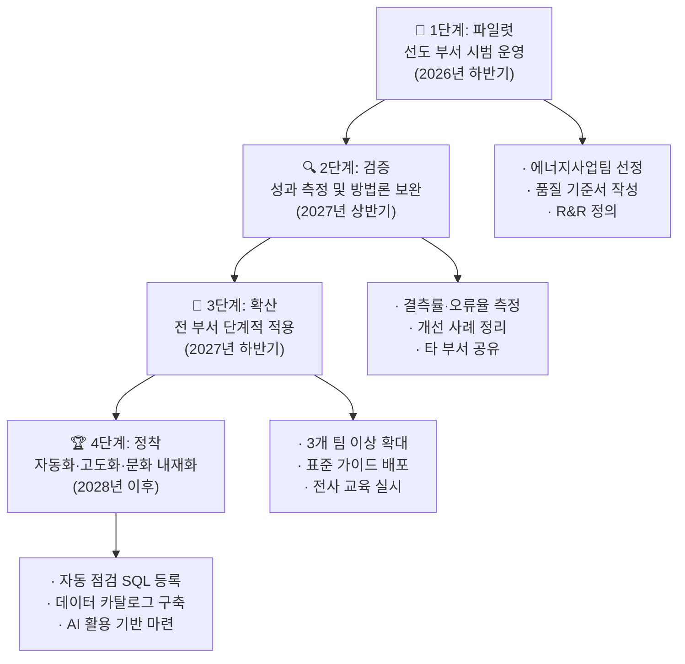

# 🏋️ 12.[실습] 결과 정리·발표 및 조직 확산 로드맵 수립

정리일: 2026-10-08 · 교육 에셋 N0818

본문 수집·공개 편집. 도구 실행·최신 기능 재검증은 미실시. 고객·참여자 정보와 개별 접근 링크, 원본 첨부는 제외했습니다.

---

💡 **본 강의는 MySQL 을 기준으로 진행됩니다.**
**\[수업 목표\]**
- 실습 결과를 발표 가능한 형태로 체계적으로 정리할 수 있습니다.
- 발표 5단계 구조(오프닝→문제→솔루션→효과→실행계획)를 이해하고 활용할 수 있습니다.
- 데이터 관리 개선 방안을 우선순위 매트릭스 기준에 따라 도출할 수 있습니다.
- 공공기관 우수 사례를 분석하여 공사에 맞는 적용 전략을 수립할 수 있습니다.
- 파일럿→검증→확산→정착 4단계 조직 확산 로드맵을 완성할 수 있습니다.
- 실습파일 경로: [개별 링크 제외]
**\[목차\]**

---
## 01. 실습 목표 및 전체 흐름
> ⏱ 예상 소요: 약 10분
💡 **3회차까지 배운 내용을 정리하고, 조직 전체로 확산할 전략을 설계합니다.**
- **☑️ 오늘 실습의 전체 흐름**
오늘은 실습의 마지막 단계입니다. 지금까지 데이터를 발견하고, 정제하고, 검증하고, 협업했다면…<br>이제는 그 결과를 **정리하고 발표하고 퍼뜨리는** 단계입니다. 🙂
```plain text
실습 결과 정리 → 발표 자료 구성 → 개선 방안 도출 → 우수 사례 분석 → 확산 로드맵 수립
```


단계

활동

산출물

예상 소요


1단계

실습 결과 발표 양식 작성

발표 슬라이드 구성안

약 38분


2단계

데이터 관리 개선 방안 도출

개선 과제 목록 (우선순위 포함)

약 35분


3단계

우수 사례 분석 및 적용 전략 수립

사례 분석 요약표

약 30분


4단계

조직 내 확산 로드맵 수립

확산 로드맵 문서

약 40분


- **☑️ 3회차까지 학습한 내용 되돌아보기**
3회차에 걸쳐 우리는 데이터 매니저의 핵심 역할을 모두 경험했습니다.<br>오늘은 그 여정을 마무리하며 **“우리가 한 것”을 세상에 알리는 시간**입니다. 😊


회차

핵심 내용

오늘과의 연결


1회차

데이터 매니저 역할, 거버넌스, 데이터 구조, DB·SQL 기초

발표 배경 지식


2회차

데이터 품질 개념, 오류 유형, 정제·검증, 품질 관리 프로세스·R&R

개선 방안의 근거


3회차

데이터 활용 지원, 협업 체계, End-to-End 통합 실습

발표할 실습 결과물


> 💡 **Tip:** 오늘 실습은 단독 작업이 아닌 **팀 단위 발표**로 진행됩니다. 역할을 나눠 함께 완성하세요!
---
## 02. 실습 1. 발표 양식 작성 — 5단계 발표 구조
> ⏱ 예상 소요: 약 38분
💡 **데이터 매니저로서 분석한 내용을 다른 사람에게 설득력 있게 전달하는 능력도 중요합니다.**
- **☑️ 왜 발표 구조가 중요한가요?**
아무리 좋은 분석 결과라도 잘 전달하지 못하면 아무 소용이 없습니다.
경영진에게 보고할 때를 생각해 보세요. 담당자는 데이터 오류 300건을 밤새 정제했지만,<br>보고서에 “데이터를 정리했습니다”라고만 쓴다면… 경영진은 그 가치를 알 수 없겠죠?
**발표는 내가 한 일의 가치를 숫자와 구조로 증명하는 과정입니다.**
- **☑️ 5단계 발표 구조 (OPSEA 프레임워크)**
좋은 데이터 관리 발표는 아래 5단계 흐름을 따릅니다.<br>마치 뉴스 기사처럼, 핵심→문제→해결→효과→계획 순서로 전달하면<br>청중이 자연스럽게 이해하고 납득하게 됩니다. 🙂
```plain text
1️⃣ 오프닝 (Opening)   → 핵심 메시지 한 줄로 먼저 전달
2️⃣ 문제 (Problem)     → 무엇이 문제였는가? (숫자로)
3️⃣ 솔루션 (Solution)  → 어떻게 해결했는가? (SQL/방법론)
4️⃣ 효과 (Effect)      → 개선 전/후 비교 (Before → After)
5️⃣ 실행계획 (Action)  → 앞으로 무엇을 할 것인가?
```


단계

슬라이드 제목 (예시)

포함할 내용

핵심 원칙


**1️⃣ 오프닝**

“열 사용량 데이터 품질, 이렇게 개선했습니다”

발표 제목, 팀명, 핵심 성과 1줄

숫자 포함 필수


**2️⃣ 문제**

발견된 데이터 문제 현황

오류 유형, 건수, 발생 원인

구체적 수치


**3️⃣ 솔루션**

데이터 정제 및 개선 조치

사용한 SQL, 표준화 방법

재현 가능하게


**4️⃣ 효과**

개선 전/후 비교

오류율 변화, 품질 지표

Before→After


**5️⃣ 실행계획**

향후 확산 계획

담당자, 일정, 목표 지표

측정 가능하게


- **☑️ 데이터 관리 발표의 4가지 원칙**


원칙

잘못된 예

좋은 예


**숫자로 말하기**

“오류가 많았습니다”

“결측값 47건, 지역명 불일치 23건 발견”


**문제→원인→해결 구조**

“데이터를 정리했습니다”

“자유 입력으로 지역명 23종 혼재 → CASE WHEN으로 6종 표준화”


**Before / After 비교**

“품질이 좋아졌습니다”

“오류율 12.3% → 1.8%로 감소”


**1페이지 핵심 요약**

30페이지 상세 보고서만 제출

경영진용 1페이지 요약 + 상세 부록


- **☑️ 실습 과제: 발표 슬라이드 구성안 작성**
아래 템플릿을 참고하여 우리 팀의 실습 결과 발표 구성안을 완성하세요.<br>슬라이드 3\~7번은 직접 채워야 합니다. 예시 답안을 참고해도 좋습니다. 😄


슬라이드 번호

발표 단계

제목

주요 내용


1

—

표지

발표 제목, 팀명, 날짜


2

—

목차

전체 발표 흐름


3

1️⃣ 오프닝

핵심 성과 요약

(작성하세요)


4

2️⃣ 문제

발견된 데이터 문제

(작성하세요)


5

3️⃣ 솔루션

정제·개선 조치 내용

(작성하세요)


6

4️⃣ 효과

개선 전/후 비교

(작성하세요)


7

5️⃣ 실행계획

향후 확산 계획

(작성하세요)


- **예시 답안**


슬라이드 번호

발표 단계

제목

주요 내용


3

1️⃣ 오프닝

열 사용량 데이터, 품질 12.3%→1.8%로 개선

결측 47건 정제, 지역명 23종→6종 표준화, 민원 미분류 31건 처리


4

2️⃣ 문제

발견된 3가지 핵심 오류

① 열 사용량 결측 N건 (입력 기준 없음) ② 지역명 불일치 N건 (자유 입력 허용) ③ 민원 유형 미분류 N건 (필수 항목 미설정)


5

3️⃣ 솔루션

SQL 기반 정제·표준화

CASE WHEN으로 지역명 표준화, IS NULL 조건으로 결측 탐지, COUNT DISTINCT로 중복 확인


6

4️⃣ 효과

Before → After 비교

오류율 12.3% → 1.8%, 지역명 종류 23종 → 6종, 민원 분류 완성률 0% → 94%


7

5️⃣ 실행계획

월 1회 품질 점검 체계 구축

점검 SQL 등록, R&R 명확화, 설비·계약 데이터로 대상 확대


- **☑️ 5분 발표 시간 배분 가이드**
팀 발표는 5분으로 진행합니다. 아래 배분을 참고하세요.


순서

내용

권장 시간

발표자


1

오프닝 + 핵심 성과

30초

팀장


2

발견한 데이터 문제 (2\~3가지)

1분

팀원 A


3

정제·개선 결과 (Before → After)

2분

팀원 B


4

향후 확산 계획

1분

팀원 C


5

실습 소감 / 실무 적용 아이디어

30초

팀장


> 💡 **Tip:** 발표 중 청중이 가장 집중하는 순간은 **“Before → After 수치 비교”** 슬라이드입니다. 이 슬라이드에 가장 공을 들이세요!
- **☑️ SQL로 Before / After 수치 뽑기**
발표에서 수치를 제시하려면 실제 SQL로 확인해야 합니다.<br>아래 쿼리들은 발표 슬라이드의 Before / After 수치를 직접 산출하는 예시입니다.
**1️⃣ Before: 정제 전 오류 현황 파악**
지금 무엇을 하는가? 정제 전 데이터에서 결측·불일치·미분류 건수를 한 번에 집계합니다.<br>발표 슬라이드 4번(문제 현황)의 숫자 근거가 됩니다.
```sql
-- Before: 정제 전 오류 현황 (열 사용량 테이블 기준)
SELECT
    COUNT(*) AS 전체_행수,
    SUM(CASE WHEN `열사용량` IS NULL THEN 1 ELSE 0 END) AS 결측_건수,
    ROUND(
        SUM(CASE WHEN `열사용량` IS NULL THEN 1 ELSE 0 END) * 100.0 / COUNT(*), 1
    ) AS 결측률_퍼센트
FROM heat_usage;
```
- 정답화면


전체_행수

결측_건수

결측률_퍼센트


382

47

12.3


**2️⃣ Before: 지역명 종류 현황 파악**
지금 무엇을 하는가? 표준화 전 지역명이 몇 가지나 혼재하는지 확인합니다.<br>“지역명 23종 혼재”라는 발표 수치의 근거입니다.
```sql
-- Before: 지역명 종류 수와 목록 확인
SELECT
    `지역명`,
    COUNT(*) AS 건수
FROM heat_usage
GROUP BY `지역명`
ORDER BY 건수 DESC;
```
- 정답화면 (예시 — 실제 실행 결과를 붙여 넣으세요)


지역명

건수


서울

58


서울시

34


SEOUL

21


서울특별시

17


…

…


**3️⃣ After: 표준화 후 오류율 재확인**
지금 무엇을 하는가? CASE WHEN으로 표준화한 뒤 지역명 종류가 줄었는지 검증합니다.<br>발표 슬라이드 6번(개선 효과)의 After 수치입니다.
```sql
-- After: CASE WHEN 표준화 적용 후 지역명 종류 수 확인
SELECT
    COUNT(DISTINCT
        CASE
            WHEN `지역명` IN ('서울', '서울시', 'SEOUL', '서울특별시') THEN '서울'
            WHEN `지역명` IN ('부산', '부산시', 'BUSAN') THEN '부산'
            WHEN `지역명` IN ('대구', '대구시', 'DAEGU') THEN '대구'
            ELSE `지역명`
        END
    ) AS 표준화후_지역명_종류수
FROM heat_usage;
```
- 정답화면표준화후_지역명_종류수6
---
---
**4️⃣ 민원 유형 분류 현황 파악**
지금 무엇을 하는가? 민원 유형이 NULL이거나 미분류인 건수를 파악합니다.<br>발표 슬라이드에 “민원 미분류 31건”을 명시하기 위한 근거 쿼리입니다.
```sql
-- 민원 유형 분류 현황: 분류됨 vs 미분류 비교
SELECT
    CASE
        WHEN `민원유형` IS NULL OR `민원유형` = '' OR `민원유형` = '기타' THEN '미분류'
        ELSE '분류완료'
    END AS 분류_여부,
    COUNT(*) AS 건수,
    ROUND(COUNT(*) * 100.0 / SUM(COUNT(*)) OVER (), 1) AS 비율_퍼센트
FROM complaints
GROUP BY 분류_여부;
```
- 정답화면


분류_여부

건수

비율_퍼센트


분류완료

124

80.0


미분류

31

20.0


> 💡 **Tip:** 위 4개 쿼리의 결과값을 발표 슬라이드 3번(오프닝 핵심 성과)과 4번(문제 현황), 6번(개선 효과)에 그대로 붙여 넣으면 됩니다. SQL이 발표 자료를 만들어 주는 셈이죠! 😊
---
## 03. 실습 2. 데이터 관리 개선 방안 도출
> ⏱ 예상 소요: 약 35분
💡 **문제를 발견했다면, 구체적인 개선 방안을 만드는 것이 다음 단계입니다.**
- **☑️ 좋은 개선 방안의 3가지 조건**
“데이터를 잘 관리한다”는 말은 개선 방안이 아닙니다.<br>좋은 개선 방안은 **누가 읽어도 실행할 수 있을 만큼 구체적**이어야 합니다.
- **구체적 (Specific):** “데이터를 잘 관리한다” ❌ → “열 사용량 결측률을 월 1% 이하로 유지한다” ✅
- **측정 가능 (Measurable):** 달성 여부를 수치로 확인할 수 있어야 합니다.
- **실행 가능 (Actionable):** 현실적으로 담당자가 실행할 수 있어야 합니다.
- **☑️ 우선순위 매트릭스 — 어떤 과제부터 시작할까요?**
개선 과제가 여러 개라면 어디서부터 시작해야 할까요?
냉장고 정리를 생각해 보세요. 상한 음식(긴급+중요)은 지금 당장 버려야 하고,<br>냉동실 정리(중요하지만 급하지 않음)는 주말에 해도 됩니다.<br>데이터 개선 과제도 마찬가지입니다. 🙂
아래 **긴급도 × 중요도 매트릭스**로 우선순위를 판단하세요.


**🔴 중요도 높음**

**🔵 중요도 낮음**


**⚡ 긴급도 높음**

✅ **즉시 착수** (1순위)

위임 또는 간소화 처리 (3순위)


**🕐 긴급도 낮음**

계획 수립 후 착수 (2순위)

보류 또는 장기 검토 (4순위)


**우선순위 판단 기준 상세 가이드:**


판단 기준

질문

높음 판단 기준


**중요도**

이 문제가 업무 결과에 얼마나 영향을 미치는가?

보고서 오류 유발 / 의사결정 왜곡 / 민원 증가


**긴급도**

지금 당장 처리하지 않으면 피해가 커지는가?

월말 마감 보고에 영향 / 상위 기관 제출 임박


**파급효과**

한 건을 고치면 얼마나 많은 곳이 개선되는가?

여러 시스템에 연쇄 반영되는 마스터 데이터


**실행 난이도**

우리 팀 단독으로 실행 가능한가?

IT 지원 없이 SQL만으로 처리 가능하면 먼저 착수


- **☑️ 실습 과제: 개선 과제 목록 작성**
3회차까지 실습하면서 발견한 데이터 관리 문제점을 바탕으로 개선 과제를 작성하세요.<br>우선순위 매트릭스 기준을 활용해 `높음 / 중간 / 낮음`을 판단합니다.


번호

문제점

근본 원인

개선 방안

중요도

긴급도

우선순위

담당

기한


1

지역명 불일치

자유 입력 허용

드롭다운 선택으로 입력 방식 변경

높음

높음

**1순위**

IT 담당

2026-07


2

(작성하세요)


3

(작성하세요)


4

(작성하세요)


5

(작성하세요)


- **예시 답안**


번호

문제점

근본 원인

개선 방안

우선순위


1

지역명 불일치 (23종 혼재)

자유 입력 허용, 표준 코드 없음

시스템 입력 방식을 드롭다운으로 변경 + CASE WHEN 표준화 SQL 적용

**1순위** (중요↑ 긴급↑)


2

열 사용량 결측값 다수

필수 입력 항목 미설정

입력 화면 필수 항목 지정, 저장 불가 처리

**1순위** (중요↑ 긴급↑)


3

민원 유형 미분류

분류 기준 없음, 담당자 인식 부족

민원 접수 시 유형 필수 선택, 표준 코드 가이드 배포

**1순위** (중요↑ 긴급↑)


4

설비코드 중복

시스템 간 코드 체계 상이

설비 마스터 일원화, 중복 체크 로직 적용

**2순위** (중요↑ 긴급↓)


5

품질 점검 담당자 불명확

R&R 미정의

RACI 매트릭스 기반 R&R 공식화, 월간 점검 일정 수립

**2순위** (중요↑ 긴급↓)


- **☑️ 만약 개선 방안을 도출하지 않으면?**
⚠️ 문제를 발견하고도 개선하지 않으면 어떻게 될까요?
- 같은 오류가 매달 반복됩니다.
- 담당자가 바뀌면 문제 인식 자체가 사라집니다.
- 데이터를 믿지 못하게 되어 결국 “엑셀 수작업”으로 돌아갑니다.
**데이터 품질 관리는 한 번의 정제가 아니라, 체계를 만드는 과정입니다.**
---
## 04. 실습 3. 우수 사례 분석 및 적용 전략
> ⏱ 예상 소요: 약 30분
💡 **다른 기관의 성공 사례에서 배울 점을 찾고, 우리 조직에 맞게 적용하는 방법을 생각해 봅니다.**
- **☑️ 왜 우수 사례를 분석하나요?**
처음 길을 갈 때 지도가 있으면 훨씬 빠르죠?
우수 사례는 **“이미 누군가 같은 길을 걸어갔다”는 증거**입니다.<br>우리보다 먼저 비슷한 문제를 겪고 해결한 기관의 경험을 참고하면,<br>시행착오를 줄이고 빠르게 성과를 낼 수 있습니다. 🙂
- **☑️ 공공기관 데이터 관리 우수 사례 분석**
**사례 1. 한국전력공사 — 설비 데이터 표준화**


구분

내용


**문제**

지역별로 설비코드가 달라 전사 분석이 어려움 (코드 체계만 12가지)


**근본 원인**

지역본부별 독립적 시스템 운영, 전사 표준 코드 부재


**조치**

전사 설비 마스터 데이터 통합, 표준 코드 체계 수립, 기존 코드 매핑 테이블 작성


**결과**

설비 이력 추적 속도 40% 향상, 예방 정비 적중률 개선


**핵심 교훈**

표준화는 개별 부서가 아닌 **전사 거버넌스 차원**에서 추진해야 효과적


**사례 2. 서울시 — 시민 민원 데이터 품질 관리**


구분

내용


**문제**

민원 유형 분류가 일관되지 않아 반복 민원 파악이 어려움


**근본 원인**

담당자별 자유 입력, 분류 기준 문서 없음


**조치**

민원 유형 표준 코드 정의 (45종 → 12종 통합), 입력 화면 드롭다운 적용


**결과**

반복 민원 원인 파악 시간 80% 단축, 선제적 서비스 개선 가능


**핵심 교훈**

**데이터 분류 기준이 명확해야** AI·자동화 도입의 전제 조건이 갖춰짐


**사례 3. 한국수자원공사 — 데이터 품질 정기 점검 체계 구축**


구분

내용


**문제**

데이터 오류를 발견해도 담당자가 누구인지 불명확


**근본 원인**

R&R 정의 없음, 품질 점검 프로세스 비공식 운영


**조치**

RACI 매트릭스 기반 R&R 공식화, 월간 품질 점검 회의 정례화


**결과**

오류 미처리율 67% 감소, 담당자 응답 시간 5일 → 1일로 단축


**핵심 교훈**

**“누가 책임지는가”**가 명확해야 개선이 지속됩니다


- **☑️ 실습 과제: 공사 적용 전략 수립**
위 우수 사례에서 배운 내용을 바탕으로 공사에 적용할 전략을 정리하세요.


우수 사례

배울 점

공사 현황과의 차이점

공사 적용 방안

예상 효과


한국전력 설비 표준화

(작성하세요)

(작성하세요)

(작성하세요)

(작성하세요)


서울시 민원 데이터 관리

(작성하세요)

(작성하세요)

(작성하세요)

(작성하세요)


한국수자원공사 R&R 체계

(작성하세요)

(작성하세요)

(작성하세요)

(작성하세요)


- **예시 답안**


우수 사례

배울 점

공사 적용 방안

예상 효과


한국전력 설비 표준화

전사 차원의 설비 마스터 통합 중요성

공사 설비 마스터 표준화 추진, 지역별 설비코드 통합 및 매핑 테이블 작성

전사 설비 분석 가능, 예방 정비 효율 향상


서울시 민원 관리

분류 기준 명확화가 자동화의 전제조건

민원 유형 표준 코드 재정비 (현행 → 12종 통합), 입력 화면 드롭다운 적용

반복 민원 파악 용이, AI 분류 적용 기반 마련


수자원공사 R&R 체계

책임자 명확화가 지속성의 핵심

데이터 매니저 RACI 매트릭스 수립, 월간 품질 점검 회의 정례화

오류 미처리 감소, 담당자 응답 속도 향상


---
## 05. 실습 4. 조직 확산 로드맵 수립
> ⏱ 예상 소요: 약 40분
💡 **데이터 관리 문화는 한 부서의 노력만으로는 만들어지지 않습니다. 조직 전체로 확산해야 합니다.**
- **☑️ 조직 확산이란 무엇인가요?**
새 직원이 입사해서 처음에는 모든 것이 낯설지만,<br>3개월 후에는 회사 문화에 자연스럽게 녹아드는 것처럼…
데이터 관리도 처음에는 낯설고 번거롭게 느껴지지만,<br>**작은 성공 경험이 쌓이면 조직 문화로 자리잡습니다.** 🙂
조직 확산 로드맵은 그 과정을 단계별로 설계하는 청사진입니다.
- **☑️ 조직 확산 4단계 흐름도**

- **☑️ 조직 확산 전략의 5가지 핵심 요소**


요소

설명

공사 적용 예시


**선도 부서 설정**

먼저 성공 사례를 만들 파일럿 부서를 선정합니다

에너지사업팀 (열 사용량 데이터 보유)


**가시적 성과 만들기**

숫자로 보이는 개선 효과를 조기에 만들어 공유합니다

결측률 12%→1% 달성 후 전사 공유


**교육과 가이드**

모든 부서 담당자가 기준을 이해하고 실천하도록 교육합니다

데이터 품질 기준서 + 월 1회 교육


**경영진 지원**

경영진이 데이터 품질을 경영 목표로 인식하도록 합니다

경영 KPI에 데이터 품질 지표 포함


**지속적 소통**

월별 품질 현황을 정기 공유하여 관심을 유지합니다

월간 데이터 품질 리포트 발송


- **☑️ 실습 과제 A: 공사 데이터 관리 확산 로드맵 작성 (전사 로드맵)**
아래 템플릿을 참고하여 공사의 데이터 관리 확산 로드맵을 완성하세요.


단계

기간

핵심 활동

목표 지표

담당


**1단계: 파일럿**

2026년 하반기

(작성하세요)

(작성하세요)


**2단계: 검증**

2027년 상반기

(작성하세요)

(작성하세요)


**3단계: 확산**

2027년 하반기

(작성하세요)

(작성하세요)


**4단계: 정착**

2028년 이후

(작성하세요)

(작성하세요)


- **예시 답안**


단계

기간

핵심 활동

목표 지표


**1단계: 파일럿**

2026년 하반기

에너지사업팀 열 사용량 데이터 품질 관리 체계 구축, R&R 정의, 품질 기준서 작성

결측률 1% 이하, 지역명 표준화 완료


**2단계: 검증**

2027년 상반기

파일럿 결과 성과 측정, 방법론 보완, 전사 공유회 개최

품질 개선율 측정, 타 부서 동참 의향 확인


**3단계: 확산**

2027년 하반기

시설관리팀·고객지원팀 품질 기준서 작성, R&R 확대, 전사 데이터 품질 교육 실시

3개 팀 이상 품질 기준서 완성, 전 직원 교육 이수율 80%


**4단계: 정착**

2028년 이후

품질 점검 자동화 SQL 등록, 데이터 카탈로그 구축, AI 분류 적용 기반 마련

자동화 점검 비율 50% 이상, 전사 월간 품질 리포트 정례화


- **☑️ 실습 과제 B: 나의 로드맵 작성하기 (개인 실행 계획)**
전사 로드맵과 별개로, 내가 담당하는 업무 영역에서 **당장 실행할 수 있는 나만의 로드맵**을 작성하세요.


단계

기간

개선 과제

사용할 SQL / 도구

성공 기준


**즉시 착수**

1개월 이내


**단기**

1\~3개월


**중기**

3\~6개월


**장기**

6개월\~1년


- **예시 답안**


단계

기간

개선 과제

사용할 SQL

성공 기준


**즉시 착수**

1개월 이내

열 사용량 결측값 현황 파악 및 정제

`WHERE 열사용량 IS NULL`

결측률 1% 이하


**단기**

1\~3개월

지역명 표준화 + 품질 기준서 초안 작성

`CASE WHEN` 표준화 SQL

지역명 6종으로 통합 완료


**중기**

3\~6개월

월간 품질 점검 SQL 등록 및 정례 실행

`COUNT(*), COUNT(DISTINCT)`

월 1회 점검 실행 체계 구축


**장기**

6개월\~1년

설비·민원 데이터로 관리 대상 확대

전체 테이블 조인 점검 쿼리

3개 테이블 이상 품질 관리 운영


- **☑️ 조직 확산 시 주의사항**
⚠️ 확산 과정에서 자주 실패하는 패턴을 미리 알아두세요.


❌ 실패 패턴

✅ 성공 방법


규정으로 강제하면 저항이 생깁니다

성공 사례를 먼저 보여주며 자발적 동참을 유도합니다


복잡한 절차는 아무도 따르지 않습니다

간단하고 실행하기 쉬운 체계부터 시작합니다


큰 성과를 기다리면 모멘텀을 잃습니다

작은 성공(결측률 개선 1건)을 빠르게 공유합니다


현업 의견을 무시하면 현실과 멀어집니다

현업 담당자의 불편함과 개선 의견을 지속 반영합니다


경영진 관심이 없으면 예산·인력이 안 붙습니다

경영 KPI와 연결하여 데이터 품질의 비즈니스 가치를 설득합니다


---
## 06. 셀프 체크리스트 및 최종 과제 제출
> ⏱ 예상 소요: 약 15분
💡 **3회차 전체 내용을 마무리합니다. 정말 수고하셨습니다! 😊**
- **💡 실습내용 셀프 체크리스트**
아래 항목을 모두 체크할 수 있다면 오늘 실습을 성공적으로 완료한 것입니다! 😄


체크 항목

완료


5단계 발표 구조(OPSEA)를 이해하고 슬라이드 구성안을 완성했다

☐


Before / After 비교를 수치로 정리할 수 있다

☐


우선순위 매트릭스(긴급도×중요도) 기준으로 개선 과제를 분류했다

☐


구체적·측정 가능·실행 가능한 개선 방안을 5개 이상 도출했다

☐


우수 사례에서 배울 점을 공사 상황에 맞게 적용 전략으로 전환했다

☐


파일럿→검증→확산→정착 4단계 로드맵을 완성했다

☐


나의 개인 실행 계획(단기\~장기)을 작성했다

☐


1회차부터 3회차까지의 학습 내용을 연결하여 설명할 수 있다

☐


- **☑️ 최종 과제 제출 항목**


과제

내용

분량 기준


**과제 1**

실습 1에서 완성한 발표 슬라이드 구성안 (7슬라이드)

표 형식 제출


**과제 2**

실습 2에서 도출한 개선 과제 목록 (5개 이상, 우선순위 포함)

표 형식 제출


**과제 3**

실습 3에서 작성한 우수 사례 분석 및 공사 적용 전략표

표 형식 제출


**과제 4**

실습 4에서 완성한 전사 확산 로드맵 + 개인 실행 계획

표 형식 제출


**종합 과제 (심화)**

내가 담당하는 업무 데이터 1개를 선택하여 ① 품질 기준서 ② 개선 방안 ③ 확산 전략을 포함한 2페이지 분량의 데이터 관리 개선 제안서 작성

자유 형식, A4 2페이지


> 💡 **Tip:** 종합 과제(심화)는 이 교육에서 배운 모든 내용을 실제 업무에 연결하는 최종 결과물입니다. 1회차\~3회차 실습 결과를 참고하여 작성하면 훨씬 수월합니다!
---
## 07. 요약
> ⏱ 예상 소요: 약 10분
💡 **금일 수업내용을 복기해 보겠습니다.**
- 데이터 관리 발표는 오프닝→문제→솔루션→효과→실행계획의 5단계 구조로 구성합니다.
- 발표의 핵심은 숫자와 Before/After 비교로 개선 효과를 명확하게 전달하는 것입니다.
- 경영진에게는 1페이지 핵심 요약을 별도로 준비하면 전달력이 높아집니다.
- 좋은 개선 방안은 구체적이고 측정 가능하고 실행 가능한 세 가지 조건을 갖춰야 합니다.
- 긴급도×중요도 매트릭스로 개선 과제의 우선순위를 판단하면 자원을 효율적으로 투입할 수 있습니다.
- 우수 사례 분석은 시행착오를 줄이고 검증된 방법을 빠르게 도입하는 데 도움이 됩니다.
- 우수 사례를 적용할 때는 그대로 따르는 것이 아니라 공사 현황과의 차이점을 먼저 파악해야 합니다.
- 조직 확산 로드맵은 파일럿→검증→확산→정착 4단계로 단계적으로 설계합니다.
- 확산의 첫 단추는 선도 부서에서 작은 성공 사례를 빠르게 만들어 공유하는 것입니다.
- 강요보다 성공 사례 공유가 조직 자발적 동참을 이끌어내는 데 더 효과적입니다.
- 데이터 품질 관리는 일회성 정제가 아니라 지속 가능한 체계를 만드는 것이 목표입니다.
- 개인 실행 계획은 즉시 착수→단기→중기→장기로 나눠 현실적으로 수립합니다.
- 데이터 매니저의 역할은 데이터를 관리하는 것을 넘어, 데이터 관리 문화를 조직에 퍼뜨리는 것입니다.
