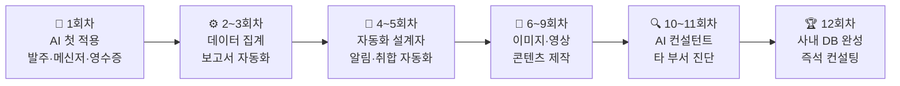

# 1회차_3부

정리일: 2026-10-08 · 교육 에셋 N0820

본문 수집·공개 편집. 도구 실행·최신 기능 재검증은 미실시. 고객·참여자 정보와 개별 접근 링크, 원본 첨부는 제외했습니다.

---

> **이전 문서:** 1회차 교재 (2부) — 실습 2 · 실습 3<br>**이 문서:** 성과 시연 · 핵심개념 정리 · 심화가이드 · 12회차 여정 · 수업 방향 논의
---
# Before/After 성과 시연 + Q&A + 마무리 (18:05 \~ 18:30)
## Q&A — 자주 나오는 질문
---
**Q1. 회사 업무 데이터를 AI에 입력해도 보안 문제없나요?**
> Claude·Gemini 무료 플랜의 보안 정책:
- 대화 내용이 AI 모델 개선에 활용될 수 있습니다
**오늘 실습 데이터 수준:**
- 품목명, 수량, 날짜 → 대부분 비민감 정보
- 거래처명, 차량번호 → 일반 업무 정보 수준
**주의가 필요한 것:**
- 매출 금액, 임직원 급여, 개인정보 → 입력 자제
- 사무국 결산 데이터 → Claude Pro 기업 플랜(학습 비활용) 권장
구체적 보안 정책은 사무국과 별도 협의 권장.<br>2회차 전 Claude Pro 구독 안내 시 보안 설정 방법도 함께 안내드립니다.
---
**Q2. Claude 무료 한도가 어느 정도인가요?**
> • 하루 메시지 수에 제한 있음 (한도 초과 시 화면에 안내)<br>• 업무보고 1회 처리 = 약 2\~3 메시지 소비<br>• 하루 2회 처리 = 약 5\~6 메시지<br>• 무료 한도는 충분하지만 집중 사용 시 한도 초과 가능
**2회차 전 Claude Pro 구독 안내 메일 발송 예정**
---
**Q3. 품목명 규칙에 없는 새 오타가 나오면?**
> 시스템 프롬프트 설정대로:<br>→ 원문 그대로 표기 + 비고에 "품목확인필요" 자동 표시
처리 방법:
1. 해당 품목 확인 → 올바른 이름 파악
2. 카카오톡 단톡방에 올리면 강사가 라이브러리에 반영
3. 다음 번부터 자동 처리됨
이것이 라이브러리를 꾸준히 업데이트해야 하는 이유입니다.
---
**Q4. 같은 채팅에서 계속 써도 되나요?**
> • 같은 채팅: 이전 규칙 유지 → 그대로 사용 가능<br>• 새 채팅 시작 시: 규칙 초기화 → 시스템 프롬프트 다시 입력 필요
Claude Pro의 "프로젝트" 기능을 사용하면 규칙을 영구 저장 가능합니다.<br>2회차 안내 예정.
---
**Q5. 오늘 배운 것을 동료에게 알려줄 수 있나요?**
> 네, 라이브러리 구글 문서 링크 공유하면 됩니다.<br>더 나아가 "이 프롬프트를 어떻게 쓰는지 설명하는 능력" —<br>이것이 10회차(업무 분석 컨설팅)에서 다룰 내용입니다.<br>오늘이 그 시작입니다.
---
## 2회차 예고


<colgroup>
<col>
<col width="530">
</colgroup>


항목

내용


**주제**

데이터 정제·집계 자동화


**핵심 실습**

프로님 제공 원자재입고양식v2.xlsx 6단계 수동 작업 → 1단계로


**추가 실습**

재고파악v2.xlsx 월총합 시트 집계 자동화


**과제(선택)**

이번 주 라인 메신저 1회분 → ② 프롬프트로 처리해보기


---
## 오늘 만들어진 것들 — 최종 확인


<colgroup>
<col width="377">
<col>
</colgroup>


산출물

확인


① 발주서 OCR 프롬프트

☐


② 메신저 업무보고 시스템 프롬프트 + 규칙 13개 이상

☐


③ 영수증 분류 + 통장 대조 프롬프트

☐


내일 바로 쓸 것 1개 결정

☐


**\[과제\]** 프롬프트 라이브러리 4개 섹션 저장 (2회차 전까지)

☐


---
---
## 핵심 개념 — AI 활용의 올바른 마인드셋
### AI가 잘하는 것 / 못하는 것
오늘 하루 실습을 마쳤습니다. 이제 AI를 앞으로 어떻게 활용할지에 대한 관점을 정리합니다.
**AI가 잘하는 것:**
- 반복적이고 패턴이 명확한 작업 (메신저→업무보고, 영수증 분류)
- 대량의 텍스트를 빠르게 처리하고 구조화
- 코드·수식을 자연어 설명으로 생성
- 여러 선택지 중 초안 제시
**AI가 못하는 것:**
- 판단이 필요한 결정 (이 수량이 실제로 맞는가)
- 내부 시스템 간 자동 연동 (이지포스 ↔ ERP)
- 최신 내부 정보 (어제 바뀐 품목 목록)
- 100% 정확성 보장
### AI 결과를 맹신하면 생기는 문제
실제 사례를 가정해보겠습니다.
```plain text
메신저: "압구정 앞접시 200개 추가"
AI 결과: 압구정 | 앞접시 | 200 | ● (추가)

문제: 앞접시 1박스 = 45개.
      200개는 4박스 + 20개 = 실제로 5박스 주문해야 할 수도 있음.
      또는 매장에서 착각한 수량일 수도 있음.

AI는 이 맥락을 알 수 없습니다.
담당자가 압구정에 확인해야 합니다.
```
AI는 **무엇이 쓰여있는지**는 정확히 옮깁니다. 하지만 **그게 맞는 말인지**는 판단하지 않습니다.
### 반복 작업 자동화의 올바른 접근법
오늘 배운 방식을 앞으로 새로운 업무에 적용할 때의 판단 기준:


질문

예

아니오


이 작업이 매일·매주 반복되는가?

AI 자동화 고려

수동 처리 유지


텍스트·이미지 기반 작업인가?

AI 처리 가능

시스템 개발 필요


결과 패턴이 일정한가?

프롬프트 설계 가능

사람 판단 필요


오류 검수가 가능한가?

안전하게 도입

도입 신중히


카카오톡 단톡방에 "이 업무 AI로 될까요?"라고 올려주시면 다음 회차에서 함께 검토합니다.
---
# 오늘 교육의 핵심 개념 정리 — AI 활용 전문가로 가는 길
## AI와 협업하는 올바른 워크플로우
오늘 하루 실습 4개를 마쳤습니다. 이 경험에서 하나의 패턴이 반복됐습니다.
```plain text
[AI 협업 표준 워크플로우]

① 입력 데이터 준비
   → 사진은 밝고 선명하게 / 텍스트는 전체 복사
   → G.I.G.O.: 좋은 입력이 좋은 결과를 만든다

② 프롬프트 설계 (RCTC)
   → 역할 + 배경 + 작업 + 조건
   → 출력 형식 명시, 예외 처리 조건 포함

③ 결과 검수
   → AI 결과는 항상 초안. 확인필요 항목 우선 확인
   → 수량·금액·이름 등 핵심 수치는 원본 대조

④ 수정 요청 (반복 정제)
   → 틀린 부분만 구체적으로 지적
   → "왜 틀렸는지" 설명 요청 → 프롬프트 개선에 반영

⑤ 저장·자산화
   → 완성된 프롬프트는 라이브러리에 저장
   → 새 오타·규칙 발견 시 즉시 업데이트
```
이 사이클을 반복할수록 ①\~⑤의 각 단계가 빨라지고 정확해집니다.
---
## RAG — 회사 내부 데이터만 아는 AI를 만드는 기술
대기업 AI 교육에서 가장 빠르게 확산되는 개념입니다. <br>10\~11회차에서 다룰 내용이지만, 방향성을 이해하면 오늘 교육의 의미가 더 커집니다.
### RAG(Retrieval-Augmented Generation)란
일반 ChatGPT·Claude는 인터넷 학습 데이터를 기반으로 답합니다. 하지만 "교육기관 거래처 단가"나 "영창점 발주 히스토리"는 모릅니다.
RAG는 이 문제를 해결합니다.
```plain text
일반 AI:
"영창점 이번 달 전골육수 발주량 얼마야?" → 모름

RAG 적용 후:
회사 내부 데이터(엑셀, 발주서, ERP 데이터) → 벡터 DB 저장
→ 질문하면 관련 내부 데이터 검색 후 답변
→ "5월 영창점 전골육수 발주량: 264개"
```
**오늘 만드는 프롬프트 라이브러리와 RAG의 연결:**


<colgroup>
<col>
<col width="370.1437530517578">
</colgroup>


오늘

10\~11회차 이후


프롬프트 라이브러리 (텍스트 파일)

NotebookLM 기반 사내 지식 DB


규칙을 텍스트로 저장

발주 히스토리, 품목 데이터 업로드


매번 시스템 프롬프트 붙여넣기

자동으로 참조해서 답변


2회차 전까지 정리할 라이브러리가 12회차 사내 AI 시스템의 씨앗이 됩니다.
## Human-in-the-Loop — 사람이 루프 안에 있어야 한다
포스코·한국은행·삼성 등 대기업 AI 교육에서 공통으로 강조하는 원칙입니다.
**Human-in-the-Loop:** AI가 처리하더라도 결정적인 단계에서 반드시 사람이 확인하고 승인하는 구조
```plain text
잘못된 AI 활용:
AI 처리 → 자동 확정 → 실행
(오류 발생 시 늦게 발견, 책임 불명확)

올바른 AI 활용 (Human-in-the-Loop):
AI 처리 → 사람 검토 → 승인/수정 → 실행
(오류 조기 발견, 책임 명확)
```
**교육기관 업무에서 Human-in-the-Loop 적용:**


업무

AI 처리

사람 확인 포인트


메신저→업무보고

표 자동 생성

수량확인필요·품목확인필요 항목 검토


발주서 OCR

품목·수량 추출

흘림체 숫자 원본 대조


영수증 분류

자동 분류

매장식대 여부, 차량 배정 확인


엑셀 수식

수식 자동 생성

샘플 데이터 3개 수동 검증


AI 전문가는 Human-in-the-Loop를 설계하는 사람입니다. "어느 단계에서 사람이 확인해야 하는가"를 정의하는 것이 실무 AI 적용의 핵심입니다.
---
## AI 윤리와 책임 — 활용 전문가가 알아야 할 것
AI 활용 전문가는 도구를 잘 쓰는 사람이기도 하지만, **책임 있게 쓰는 사람**이기도 합니다.
### AI 결과의 책임은 사람에게 있다
AI가 틀린 결과를 냈을 때, "AI가 그렇게 했으니까요"는 변명이 되지 않습니다. AI를 선택하고 결과를 검수하지 않은 것은 사람의 결정이기 때문입니다.


상황

책임


AI가 영수증을 잘못 분류했다

검수하지 않고 그대로 기입한 담당자


AI가 메신저 수량을 합산 오류했다

확인하지 않고 보고서를 제출한 담당자


AI가 거래처명을 잘못 인식했다

원본 대조 없이 제출한 담당자


**결론:** AI가 빠르게 처리해주더라도, 최종 판단과 책임은 항상 사람에게 있습니다.
### 저작권과 개인정보


<colgroup>
<col>
<col width="477">
</colgroup>


주의 사항

내용


회사 내부 기밀

계약 단가, 미공개 경영 정보는 AI에 입력하지 않음


개인정보

임직원 주민번호, 급여, 개인 연락처는 입력 금지


AI 생성 콘텐츠

AI가 만든 이미지·글을 그대로 외부에 공개할 때 출처 확인 필요


---
## AI 전문가로 성장하는 3가지 습관
오늘 교육이 끝나도 계속되어야 하는 것들입니다.
**습관 1. 새 업무를 만나면 "AI로 될까?"를 먼저 떠올린다**
모든 반복 업무에 대해 자동으로 이 질문이 떠오르는 것이 Level 2 이상의 증거입니다. 카카오톡 단톡방에 올려주시면 함께 검토합니다.
**습관 2. AI 결과를 그냥 믿지 않는다 — 항상 샘플 검증**
바쁠수록 검수를 생략하고 싶어집니다. 하지만 검수 없는 AI 결과는 오히려 더 큰 수정 비용을 만들 수 있습니다. 핵심 수치 3개만 원본과 대조하는 습관으로 충분합니다.
**습관 3. 발견한 오타·규칙을 즉시 라이브러리에 추가한다**
새 오타를 발견했을 때 "나중에 추가해야지"는 항상 잊어버립니다. 발견하는 즉시 카카오톡 단톡방에 올려주시면 강사가 라이브러리에 반영합니다. 2회차 전 과제로 오늘 프롬프트를 라이브러리에 저장해오시면 함께 점검합니다.
---
# 심화 가이드 — AI를 더 잘 쓰기 위한 5가지 원칙
## 원칙 1. 역할을 먼저 알려줘라
```plain text
❌  "업무보고 만들어줘"

✅  "너는 교육기관 영업관리부 업무보고서 작성 전문가야.
    아래 내용을 업무보고 양식으로 정리해줘."
```
**역할을 주면:** 그 역할에 맞는 언어·판단 기준으로 처리<br>**역할을 안 주면:** 일반적 관점으로 처리 → 업무 맥락 못 살림
---
## 원칙 2. 출력 형식을 명확히 지정해라
```plain text
❌  "이 데이터 정리해줘"

✅  "이 데이터를 아래 표 형식으로만 출력해줘:
    | 날짜 | 거래처 | 분류 | 금액 | 비고 |
    표 외 설명 텍스트는 제외해."
```
---
## 원칙 3. 규칙은 한 번에 완전히 알려줘라
```plain text
❌  첫 메시지: "반팔팁을 반팔티로 바꿔줘"
    다음 메시지: "앞집시를 앞접시로 바꿔줘"
    (매번 나눠서 알려주면 앞 규칙을 덜 중요하게 처리할 수 있음)

✅  처음부터: "아래 규칙을 반드시 따를 것:
    반팔팁 → 반팔티
    앞집시 → 앞접시
    쌈장기 → 쌈장접시
    이 규칙 이해했으면 준비 완료라고 답해줘."
```
---
## 원칙 4. 결과가 이상하면 이유를 물어봐라
```plain text
❌  "다시 만들어줘" (이유 설명 없이 재시도)

✅  "이 결과에서 발산 L사이즈가 두 행으로 나왔어.
    같은 매장, 같은 품목이면 합산해서 한 행이어야 하는데
    왜 두 행으로 나왔는지 설명하고, 합산해서 다시 만들어줘."
```
---
## 원칙 5. AI를 "완벽해야 하는 도구"로 쓰지 마라
```plain text
현실적인 기대:
AI가 80~90% 처리 → 사람이 10~20% 수정

실제로 일어나는 일:
15~20분 → 40초 AI + 2~3분 검수 = 총 3~4분
→ 여전히 4~5배 빠름

"초안 담당 AI + 최종 검수 사람"
이 역할 분담이 AI 활용의 핵심입니다.
```
---
## Claude vs Gemini — 언제 어떤 도구?


작업

추천

이유


텍스트 정리, 규칙 기반 변환

**Claude**

복잡한 규칙을 정확히 따름


이미지·사진에서 텍스트 추출

**Gemini**

구글 이미지 처리 기술 강점


엑셀 수식·코드 생성

**Claude**

코드·수식 정확도 높음


구글 Drive·Gmail 연동

**Gemini**

구글 서비스 자연 연동


긴 보고서·문서 초안

**Claude**

긴 텍스트 구조화 능력 우수


이미지 생성

**ChatGPT Plus**

DALL-E 3 (6회차에서 다룸)


---
## 단계적으로 요청하면 결과가 좋아진다
한 번에 모든 분석을 요청하면 오류가 생기거나 결과 품질이 낮아집니다.<br>특히 데이터가 많거나 조건이 복잡할수록 단계를 나눠서 요청하세요.
**교육기관 업무보고 분석에 적용하면:**
```plain text
[1단계] 구조 파악
"이 시트에서 열 이름, 행 수, 결측값 현황을 알려줘."

[2단계] 기본 집계
"매장별 추가발주 건수를 세줘."

[3단계] 결과 검증
"결과가 맞는지 확인해줘. 압구정은 2건이어야 해."

[4단계] 시각화
"이 집계 결과를 막대그래프로 보여줘."

[5단계] 인사이트
"오늘 업무보고에서 주목할 패턴이 있으면 설명해줘."
```
**왜 단계를 나누나:**
- 한 번에 요청: "그래프 그려줘" → 어떤 데이터로? 어떤 형식으로? AI가 임의로 결정
- 단계로 요청: 각 단계 결과 확인 → 다음 단계 진행 → 최종 결과 정확도 높음
## 오류 유형별 즉시 해결법


<colgroup>
<col>
<col>
<col width="369">
</colgroup>


오류 상황

원인

해결


결과가 너무 짧거나 불완전

조건 모호

"더 자세하게", "모든 항목 포함" 추가


품목명 계속 틀림

규칙 사전에 없는 오타

규칙 추가 → 라이브러리 업데이트


표가 아닌 텍스트로 출력

출력 형식 미지정

"반드시 표 형식으로만" 명시


동일 품목 합산 안 됨

합산 조건 불명확

"동일 매장·품목은 수량 합산해서 한 행으로"


엑셀 수식 #REF! 오류

참조 범위 문제

오류 메시지 그대로 Claude에 주기


Gemini 이미지 못 읽음

파일 크기·화질

밝은 곳 재촬영, 1MB 이하 압축


Claude 한도 초과

무료 일일 한도 초과

Gemini로 대체 or 잠시 후 재시도


---
---
---
## 오늘을 마치며 — 1회차에서 배운 것의 의미
오늘 실습한 것들이 단순한 "편의 기능"이 아닌 이유를 정리합니다.


오늘 배운 것

실제 의미


Gemini로 발주서 OCR

비정형 데이터를 정형 데이터로 변환하는 파이프라인의 시작


Claude로 메신저→업무보고

반복적 텍스트 변환 작업의 자동화 + 규칙 사전의 자산화


영수증 분류·통장 대조

데이터 검증(Reconciliation) 자동화


수식 AI 생성

자연어-코드 번역 능력의 실무 적용


프롬프트 라이브러리

암묵지의 형식지화 + 조직 지식 자산 1호


12회차가 끝나면 오늘 만든 라이브러리는 훨씬 두꺼워져 있을 것입니다. 그것이 이 교육이 만들어내는 가장 중요한 결과물입니다.
---
---
# 앞으로의 12회차 여정


회차

주제

오늘과의 연결


**1회차 (오늘)**

AI 도구 감각 + 교육기관 맞춤 실습 3종

— 기초 완성


**2회차**

데이터 정제·집계 자동화

원자재입고·재고파악 6단계 수동 → 1단계로


**3회차**

시각화·보고서 자동 초안

월말 차량유지비 그래프 자동 생성


**4회차**

Make.com 자동화 기초

미발주 매장 → 매일 14:30 자동 알림


**5회차**

Make.com 심화 + GAS

야간 추가발주 자동 취합 (야간 모니터링 제거)


**6회차**

이미지 생성 기초

메뉴·매장 사진 AI로 고품질 변환


**7회차**

인테리어 시각화

매장 사진 → 인테리어 시안 10초 완성


**8회차**

포스터·카드뉴스·영상

홍보 콘텐츠 전 과정 AI 제작


**9회차**

블로그·SNS 자동화

1개월 콘텐츠 캘린더 자동 설계


**10회차**

업무 분석 컨설팅 사고법

다른 부서 업무도 AI 적용 여부 직접 진단


**11회차**

사무국 결산 자동화

월간 결산 보고서 자동 완성 + 인수인계


**12회차**

지식 자산화 + 즉석 컨설팅 PT

12회차 결과물 전체 사내 DB화


---
**12회차 동안의 성장 단계**

> **5회차**와 **10회차**가 핵심 전환점입니다.
---
## 12회차 커리큘럼의 기업 교육 맥락
이 커리큘럼은 국내 주요 대기업 AI 교육 사례를 참고해서 설계했습니다. 각 회차가 어떤 맥락에서 배치됐는지 이해하면 학습 동기가 높아집니다.


우리 회차

대기업 교육 동일 주제

주요 적용 기업


1회차 (오늘)

생성형 AI 기초·프롬프트·실무 적용

삼성·포스코·한화·현대 등 전 산업군


2\~3회차

ADA 데이터 분석·보고서 자동화

금융권(한국은행·투자사)·제조업


4\~5회차

Make.com 자동화·GAS

IT·스타트업·유통·서비스업


6\~9회차

이미지 생성·영상 제작·SNS 자동화

마케팅·리테일·외식업


10회차

GPTs/Gems 에이전트 제작

전 산업군 공통 심화 과정


11회차

RAG·사내 지식 DB·결산 자동화

금융·공공기관


12회차

AI 컨설팅·사내 전파

대기업 FT(Facilitator) 양성 과정


> **FT(Facilitator)란:** 사내에서 AI 활용법을 동료에게 전파하는 역할. 삼성·포스코·현대 등 대기업들이 핵심 인재를 FT로 양성하고 있습니다.<br>12회차가 끝나면 여러분이 교육기관의 AI FT가 됩니다.
---
## 과제 (선택 — 의무 아님)
교육 후 이번 주 안에 실제 업무에 써보고 아래를 기록해두세요.<br>다음 회차에서 공유하면 함께 더 좋은 프롬프트를 만들 수 있습니다.
- [ ] 이번 주 라인 메신저 1회분 → ② 프롬프트로 처리하고 결과 캡처
- [ ] 영수증 1장 → Gemini로 분류해보기
- [ ] 새 품목명 오타 발견 → 카카오톡 단톡방에 공유
---
> **이 교재는 교육 후에도 매일 쓰는 참고서입니다.**
프롬프트가 잘 안 될 때 → 해당 실습 섹션 원본 프롬프트 확인<br>오류가 났을 때 → 오류 유형별 해결법 섹션 참고<br>새 업무에 적용하려 할 때 → AI 5가지 원칙 다시 읽기
교육 관련 문의는 강사님께 카카오톡 또는 이메일로 편하게 연락주세요.<br>**교육 종료 후 1개월간 무료 AS 제공 (평일 24시간 내 회신)**
---
---
# 1회차 종료 후 — 수업 방향 논의 체크포인트
> 1회차 교육이 끝나면 강사와 수강생이 함께 앞으로의 교육 방향을 점검합니다.<br>아래 항목을 보면서 솔직하게 이야기해주세요.<br>이 내용이 2\~12회차 커리큘럼 조정의 기준이 됩니다.
---
## ① 난이도 체크


질문

답변


오늘 전체 진행 속도는?

☐ 너무 빠름 / ☐ 적당함 / ☐ 더 빨라도 됨


프롬프트 직접 작성이 어려웠나요?

☐ 어려웠음 / ☐ 보통 / ☐ 수월했음


AI 결과 이해가 어려웠나요?

☐ 어려웠음 / ☐ 보통 / ☐ 수월했음


가장 막혔던 단계는?

_____________________________


---
## ② 실습 내용 체크


실습

내 업무 관련도

내일 바로 쓸 수 있나요?


실습 1 — 발주서 사진 → 엑셀

☐ 높음 / ☐ 보통 / ☐ 낮음

☐ 예 / ☐ 아직


실습 2 — 메신저 → 업무보고

☐ 높음 / ☐ 보통 / ☐ 낮음

☐ 예 / ☐ 아직


실습 3 — 영수증 → 차량유지비

☐ 높음 / ☐ 보통 / ☐ 낮음

☐ 예 / ☐ 아직


오늘 중 가장 유용했던 실습: _________________________________
오늘 중 내 업무와 덜 관련된 실습: _________________________________
---
## ③ 주제 우선순위 논의
앞으로 남은 11회차에서 어떤 주제를 더 다뤄주면 좋겠나요?


주제

우선도


데이터 집계·시각화·보고서 자동화 (2\~3회차)

☐ 높음 / ☐ 보통 / ☐ 낮음


Make.com 자동화 — 미발주 알림·추가발주 취합 (4\~5회차)

☐ 높음 / ☐ 보통 / ☐ 낮음


이미지 생성·인테리어 시각화 (6\~7회차)

☐ 높음 / ☐ 보통 / ☐ 낮음


홍보 포스터·카드뉴스·영상 제작 (8\~9회차)

☐ 높음 / ☐ 보통 / ☐ 낮음


업무 분석 컨설팅·사무국 결산 자동화 (10\~11회차)

☐ 높음 / ☐ 보통 / ☐ 낮음


2회차에 꼭 다뤄주면 좋겠는 것: _________________________________
---
## ④ 실제 데이터 수집 확인


질문

답변


카카오톡 단톡방 참여 완료

☐ 예 / ☐ 아직


다음 회차 전 준비 가능한 자료

_____________________________


AI에 올리기 어려운 민감 데이터

_____________________________


---
## ⑤ 자유 의견
오늘 가장 인상 깊었던 것:
>
앞으로 교육에서 꼭 해주었으면 하는 것:
>
강사에게 전달하고 싶은 것:
>
---
> **논의 결과는 강사가 단톡방으로 공유하고, 2회차 커리큘럼에 반영합니다.**
---
*교육기관 AI 실무 전문가 양성 과정 \| 1회차 교재2026년 5월 29일 \| 강사 심지 프로님 (심지)*
