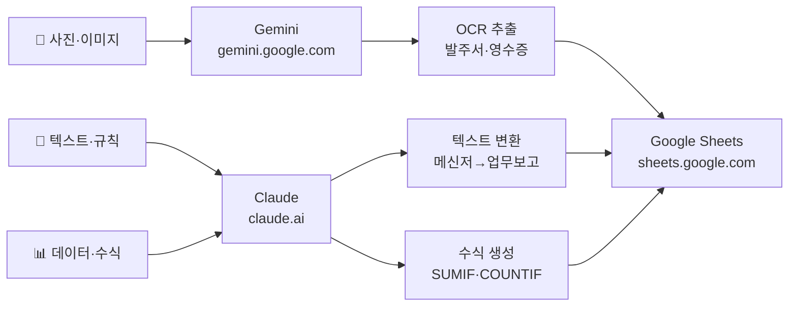
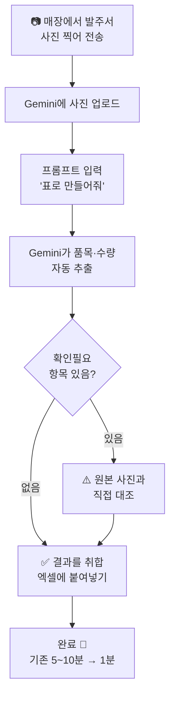

# 1회차_1부

정리일: 2026-10-08 · 교육 에셋 N0824

본문 수집·공개 편집. 도구 실행·최신 기능 재검증은 미실시. 고객·참여자 정보와 개별 접근 링크, 원본 첨부는 제외했습니다.

---

# 교육기관 × 심지 — AI 실무 교육 1회차 교재 (1부)
> **일시:** 2026년 5월 29일(금) 13:30 \~ 18:30 (5시간)<br>**강사:** 심지 프로님<br>**도구:** Claude (무료) · Gemini (무료) · Google Sheets (무료)<br>**구독 결제 없이 전부 무료로 진행합니다**
---
> **OT 교재를 먼저 읽어주세요:**<br>60시간 전체 커리큘럼 안내, 실제 데이터 수집 방법, 구독 비용 안내는<br>**\[교육기관 OT 교재\]** 문서를 참고하세요.<br>*(강사가 별도 노션 링크로 공유 예정)*
---
## 이 교재를 쓰는 방법
- 강사 설명을 들으면서 해당 섹션을 함께 보세요
- 프롬프트 코드블록은 **그대로 복사 → AI에 붙여넣기** 하면 됩니다. 외울 필요 없습니다
- 모르면 즉시 손들어 주세요. 넘어가지 않습니다
- **교육 후에도 이 문서는 매일 쓰는 참고서**입니다. 북마크해두세요
---
## 오늘 전체 타임테이블


시각

내용

시간

도구


13:30 \~ 13:50

오프닝 · 브리핑 · 환경 점검

20분

—


13:50 \~ 14:40

**실습 1** 매장 발주서 사진 → 엑셀 자동 변환

50분

Gemini


14:40 \~ 15:30

**실습 2** 라인 메신저 → 업무보고 엑셀 자동 작성

50분

Claude


15:30 \~ 15:45

휴식

15분

—


15:45 \~ 16:35

**실습 3** 영수증 → 차량유지비 자동 기입 + 통장 대조

50분

Gemini + Claude


16:35 \~ 17:25

**실습 4** 엑셀 수식 AI로 만들기 (직무별 맞춤)

50분

Claude + Sheets


17:25 \~ 18:00

Before/After 성과 시연 · Q&A · 마무리

35분

—


---
**오늘 5시간 타임라인**

```mermaid
gantt
    title 1회차 교육 타임라인 (13:30 ~ 18:30)
    dateFormat HH:mm
    axisFormat %H:%M
    section 오프닝
    브리핑 · 환경 점검     :done, 13:30, 20m
    section 오전 실습
    실습 1 — 발주서 사진 → 엑셀    :active, 13:50, 50m
    실습 2 — 메신저 → 업무보고     :active, 14:40, 50m
    section 휴식
    휴식                            :crit, 15:30, 15m
    section 오후 실습
    실습 3 — 영수증 → 차량유지비   :active, 15:45, 50m
    실습 4 — 수식 AI로 만들기      :active, 16:35, 50m
    section 마무리
    성과 시연 · Q&A                :done, 17:25, 35m
```

---
## 오늘 사용하는 도구 — 무료 계정 접속 방법
> **오늘은 전부 무료 계정으로 진행합니다. 로그인 정보와 접속 주소를 지금 확인하세요.**


실습

도구

접속 주소

무료 모델

유료와 차이


실습 1

**Gemini**

gemini.google.com

Gemini 2.0 Flash (무료)

무료로 충분. 이미지 업로드 가능


실습 2

**Claude**

claude.ai

Claude 3.5 Sonnet (무료)

하루 메시지 수 제한 있음. 오늘 교육분은 충분


실습 3

**Gemini**

gemini.google.com

Gemini 2.0 Flash (무료)

무료로 충분


실습 3 (통장 대조)

**Claude**

claude.ai

Claude 3.5 Sonnet (무료)

텍스트 처리만이라 무료로 충분


실습 4

**Claude**

claude.ai

Claude 3.5 Sonnet (무료)

수식 생성은 무료로 충분


실습 4 (시트 적용)

**Google Sheets**

sheets.google.com

무료

—


### 각 도구별 무료 로그인 방법
**Claude (claude.ai)**
```plain text
1. claude.ai 접속
2. "Sign up" 또는 "Log in" 클릭
3. 구글 계정으로 로그인 (가장 빠름)
4. 무료 플랜으로 시작 — 신용카드 불필요
5. 접속 확인: 화면 중앙에 입력창이 보이면 OK
```
**Gemini (gemini.google.com)**
```plain text
1. gemini.google.com 접속
2. 구글 계정 자동 로그인 (Gmail 로그인 상태이면 바로 사용 가능)
3. 접속 확인: 입력창 하단에 📎 이미지 업로드 아이콘이 보이면 OK
   → 이 아이콘이 없으면 로그인이 안 된 것
```
**Google Sheets / Google Docs**
```plain text
구글 계정으로 로그인된 상태이면 자동으로 사용 가능.
강사 드라이브 공유 링크로 바로 열 수 있습니다.
```
### 무료 플랜 한도 안내


도구

무료 한도

오늘 실습에서 영향


Claude 무료

하루 약 20\~30회 메시지

오늘 5회차 실습 전부 충분


Gemini 무료

이미지 처리 포함 하루 충분

오늘 실습 충분


Google Sheets

무제한

제한 없음


---
**도구 역할 한눈에 보기**

> **핵심 원칙:** 사진이 있으면 Gemini / 텍스트·규칙·수식이면 Claude
> **Claude 한도 초과 시 대처법:**<br>"지금은 Claude를 사용할 수 없습니다" 메시지가 나오면<br>→ Gemini로 동일한 실습 전환 가능 (강사가 안내)<br>→ 또는 잠시 후 (1\~2시간) 재시도
오늘 교육 범위에서는 한도 초과될 가능성이 낮습니다.
---
---
# 오프닝 (13:30 \~ 13:50, 20분)
## 오늘 해결하는 문제 vs 나중에 해결할 문제


구분

고충

해결 시점


**오늘 즉시**

라인 메신저 → 업무보고 수기 작성 (15\~20분 × 2회/일)

실습 2


**오늘 즉시**

발주서 사진 → 수기 엑셀 입력 (5\~10분/장)

실습 1


**오늘 즉시**

영수증 분류·기입 + 통장 대조 수기 작업

실습 3


**오늘 즉시**

엑셀 수식 모를 때마다 검색·포기

실습 4


**4회차**

미발주 매장 전화 독촉 (매일 14:30 반복)

Make.com 자동 알림


**5회차**

야간 추가발주 카카오톡 모니터링

Make.com + MacroDroid


**5회차**

차량별 발주 인쇄물 수동 분류·출력

GAS 버튼 자동화


**시스템적 문제**

이지포스 ↔ ERP ↔ 엑셀 3단계 수동 연계

임원 의사결정 필요


**시스템적 문제**

ERP 재고 오차 날짜별 수동 수정

시스템 개선 필요


---
---
## 1분 복습 — 1차 교육 핵심 3가지


개념

한 줄 복습

오늘 어디서 씀


**RCTC**

역할·배경·작업·조건 순서로 쓰면 AI가 정확히 이해

모든 실습 프롬프트 구조


**환각**

AI가 모르는 것을 지어낼 수 있음 → 사람이 최종 확인 필수

실습 1, 2, 3 검수 단계


**AI 3대 도구**

Claude(텍스트·분석) / Gemini(이미지·구글 연동) / ChatGPT(이미지 생성)

실습별 도구 선택 기준


---
## 환경 점검 체크리스트 (지금 확인하세요)
- [ ] 노트북 켜짐 + 와이파이 연결됨
- [ ] 구글 계정 로그인 (Gmail이 열리면 OK)
- [ ] **Claude 접속:** claude.ai → 무료 계정 로그인
- [ ] **Gemini 접속:** gemini.google.com → 자동 로그인 확인
- [ ] **강사 공유 드라이브 링크** (카카오톡으로 발송) 열기 → 아래 파일 8개 확인:


<colgroup>
<col width="357.27232360839844">
<col width="368.2901916503906">
</colgroup>


파일명

용도


`가상_발주서_평창_1.jpg`

실습 1 기본


`대관령 토종한우_발주서.jpg`

실습 1 심화


`예시_매장_사진_발주_취합.xlsx`

실습 1 결과 붙여넣기


`메신저_가상텍스트_5월27~28일.txt`

실습 2 입력 자료


`업무보고_빈양식.xlsx`

실습 2 결과 붙여넣기


`다이소_영수증_실물.jpg`

실습 3


`가상_영수증_민들레.jpg`

실습 3


`가상_영수증_주유소.jpg`

실습 3


`차량정비비_5월_빈양식.xlsx`

실습 3 결과 기입


`실습4_업무보고_연습.xlsx`

실습 4


---
---
---

# Part 1. 기초 개념 — 실습 전 반드시 알아야 할 것들
> 이 파트는 오늘 실습뿐 아니라 **12회차 60시간 전체 교육의 토대**가 되는 내용입니다.<br>처음 듣는 개념이어도 괜찮습니다. 지금 완전히 이해하지 않아도 됩니다.<br>실습을 거치면서 자연스럽게 체득됩니다.
---
## 1-1. AI 전문가가 되기 위한 로드맵 — AX 인재란 무엇인가
### AI 시대의 새로운 인재 유형
지금 기업에서 가장 필요로 하는 인재는 "AI를 개발하는 사람"이 아닙니다.<br>\*\*"AI를 실무에 연결하는 사람"\*\*입니다. 이를 AX(AI Transformation) 인재라고 합니다.


유형

설명

현실적 필요성


AI 개발자

AI 모델을 만드는 사람

소수 / 고도 전문직


AI 연구자

AI 알고리즘을 연구하는 사람

극소수 / 학계·연구소


**AX 인재**

AI를 실무에 연결하고 활용하는 사람

**모든 조직에서 필요**


여러분이 이 교육을 통해 되어야 할 것은 세 번째입니다.
### AX 인재의 4가지 역량
```plain text
Level 1. 도구 감각      → AI 도구를 두려워하지 않고 써볼 수 있다
Level 2. 활용 역량      → 내 업무에 AI를 연결해서 실제 효율을 낸다
Level 3. 설계 역량      → 반복 업무를 자동화 파이프라인으로 설계한다
Level 4. 컨설팅 역량    → 타인의 업무에 AI를 진단하고 솔루션을 제시한다
```
1회차 오늘은 **Level 1 → Level 2**의 전환이 목표입니다.<br>5회차가 끝나면 Level 3, 10회차가 끝나면 Level 4에 도달합니다.
### 지금 기업들은 어떤 AI 교육을 받고 있나
이 교육을 설계하면서 국내 주요 대기업(제조·금융·건설·법무·투자 등)이 최근 진행한 AI 교육 커리큘럼 수십 개를 분석했습니다. 공통적으로 등장하는 흐름이 있습니다.


<colgroup>
<col>
<col>
<col width="155">
</colgroup>


교육 단계

내용

해당 회차


**1단계 기초**

프롬프트 엔지니어링, 도구 생태계 이해, 환각 방지

1회차 (오늘)


**2단계 데이터**

데이터 분석 자동화, 보고서 자동화, 엑셀 AI 연동

2\~3회차


**3단계 자동화**

반복 업무 자동화 파이프라인 설계, Make.com/GAS

4\~5회차


**4단계 에이전트**

노코드 AI 에이전트 제작, 사내 지식 DB 구축

10\~11회차


**5단계 컨설팅**

Pain Point 진단, AI 적용 기획서 작성, 사내 전파

12회차


대기업들이 이 교육에 투자하는 이유는 명확합니다. AI 전문가를 외부에서 채용하는 것보다, <br>**현업을 아는 내부 인재가 AI를 쓸 줄 아는 것**이 훨씬 빠르고 효과적이기 때문입니다.
여러분은 지금 국내 주요 기업 임직원들과 동일한 수준의 교육을 받고 있습니다.
### Quick Win이란 — 단기 성과를 먼저 만드는 전략
대기업 AI 교육에서 공통적으로 강조하는 개념입니다.
> **Quick Win:** 2주 이내에 실행 가능하고, 즉각적인 효과가 체감되는 업무 개선
AI 교육이 실패하는 가장 큰 이유는 너무 큰 것을 한 번에 바꾸려 하기 때문입니다. 이지포스-ERP 자동 연동처럼 시스템 개발이 필요한 것을 먼저 생각하면 아무것도 못 합니다.
반면 성공하는 교육의 패턴은 이렇습니다.
```plain text
오늘 → 메신저→업무보고 40초로 단축 (Quick Win)
2주 후 → 이 습관이 자리를 잡음
1개월 후 → 다른 반복 업무도 같은 방식으로 해결
3개월 후 → 부서 전체 AI 활용 문화 형성
```
오늘 교육은 교육기관 영업관리부의 첫 번째 Quick Win을 만드는 날입니다.
### 12회차 동안 마스터하는 AI 도구 지형도
이 교육에서 다루는 도구들을 역할별로 정리하면 아래와 같습니다.


역할

도구

회차


텍스트·분석·수식 생성

Claude

1회차\~


이미지 처리·OCR·구글 연동

Gemini

1회차\~


이미지 생성

ChatGPT Plus / Canva AI

6\~8회차


반복 업무 자동화

Make.com

4\~5회차


스크립트 자동화

Google Apps Script

5회차


인테리어 시각화

Interior AI, Homestyler

7회차


영상 제작·자막

캡컷, 브루(Vrew)

8\~9회차


지식 DB 구축

NotebookLM

10\~12회차


문서·디자인

Canva Pro

6\~9회차


오늘은 이 중 **Claude와 Gemini**만 사용합니다. 나머지는 회차가 진행되면서 하나씩 추가됩니다.
---
## 1-2. AI 도구 생태계 이해 — Claude·Gemini·ChatGPT는 무엇이 다른가
"AI"라고 하면 ChatGPT만 떠올리는 경우가 많습니다. 하지만 지금 시장에는 여러 AI 서비스가 있고, 각각 강점이 다릅니다.
### 주요 AI 서비스 비교


서비스

만든 회사

핵심 강점

약점


**Claude**

Anthropic

긴 문서 처리, 규칙 기반 텍스트 변환 정확도, 안전성

이미지 생성 불가


**Gemini**

Google

구글 서비스 연동, 이미지·영상 처리, 실시간 검색

복잡한 규칙 처리 시 Claude보다 약함


**ChatGPT**

OpenAI

이미지 생성(DALL-E), 방대한 생태계, 플러그인

유료 플랜 가격이 높음


**Microsoft Copilot**

Microsoft

Office(Word·Excel·PPT) 직접 연동

Office 365 구독 필요


**Perplexity**

Perplexity AI

실시간 웹 검색 + 출처 제공

긴 문서 작업에 약함


### 같은 회사의 서비스인데 왜 모델명이 다른가
같은 Claude 안에도 모델 버전이 여러 개 있습니다.
```plain text
Claude 계열 (Anthropic)
  ├── Claude Opus     → 가장 강력, 가장 느림, 가장 비쌈
  ├── Claude Sonnet   → 균형형, 일반 업무용 (오늘 사용)
  └── Claude Haiku    → 가장 빠름, 간단한 작업용

Gemini 계열 (Google)
  ├── Gemini Ultra    → 최고 성능
  ├── Gemini Pro      → 일반 업무용
  └── Gemini Flash    → 빠른 처리 (오늘 사용)

GPT 계열 (OpenAI)
  ├── GPT-4o          → 최고 성능, 이미지 생성 포함
  ├── GPT-4o mini     → 빠른 처리
  └── o1, o3          → 수학·논리 특화
```
오늘 실습에서 사용하는 모델: **Claude 3.5 Sonnet (무료)** / **Gemini 2.0 Flash (무료)**
### 언제 어떤 도구를 쓰는가 — 업무별 최적 도구
이것이 실무에서 가장 중요한 판단 기준입니다.


업무 상황

최적 도구

이유


라인 메신저 → 업무보고 변환

Claude

복잡한 규칙을 정확히 따르는 능력


수기 발주서·영수증 사진 읽기

Gemini

이미지 처리 + OCR


엑셀·구글 시트 수식 생성

Claude

코드·수식 생성 정확도


홍보 이미지·포스터 생성

ChatGPT Plus / Canva

이미지 생성 특화


실시간 정보가 필요한 검색

Gemini / Perplexity

웹 검색 연동


Word·PPT·Excel 직접 편집

Copilot

Office 직접 연동


구글 드라이브·캘린더 연동

Gemini

구글 서비스 연동


### 노코드 AI 에이전트 — 코딩 없이 만드는 나만의 AI
대기업 교육에서 최근 가장 많이 등장하는 주제입니다. AI를 단순히 "쓰는" 것에서 "만드는" 것으로 진화합니다.


에이전트 도구

플랫폼

특징

배우는 회차


**GPTs**

ChatGPT

코딩 없이 목적별 AI 챗봇 제작

10회차


**Gemini Gems**

Google

구글 서비스와 연동되는 AI 에이전트

10회차


**Claude Projects**

Claude

문서·규칙 기반 AI 어시스턴트

10회차


**Copilot Studio**

Microsoft

Office 365와 연동하는 기업용 에이전트

참고


에이전트와 일반 AI 채팅의 차이:
```plain text
일반 AI 채팅:
매번 채팅창 열기 → 역할 설명 → 규칙 설명 → 질문 → 답변

AI 에이전트:
저장된 역할·규칙·지식 기반으로 → 바로 질문 → 바로 답변
→ 프롬프트 라이브러리를 에이전트로 만들면 더 편리
```
**프롬프트 라이브러리**는 AI 에이전트의 전 단계입니다. 2회차 전까지 오늘 만든 프롬프트를 정리해두면, 10회차에서 정식 에이전트로 발전시킵니다.
### 바이브코딩 — 비개발자도 코드를 만드는 시대
최근 대기업 개발자 교육에서 급부상한 개념입니다. 직접적으로 오늘 실습과 관련은 없지만, AI 전문가로 성장하는 방향으로 알아두면 좋습니다.
**바이브코딩(Vibe Coding):** `자연어`로 요청하면 AI가 코드를 생성하고, 사람은 결과를 확인하며 방향만 잡는 개발 방식
```plain text
기존 개발:
문법 공부 → 코드 작성 → 디버깅 → 배포 (수개월)

바이브코딩:
"이런 기능 만들어줘" → AI 코드 생성 → 테스트 → 배포 (수시간)
```
대표 도구: Claude Code, Cursor AI, ChatGPT Codex<br>교육기관에서는 당장 필요하지 않지만, **5회차 Google Apps Script**가 바이브코딩의 첫 경험이 됩니다.
---
## 1-3. LLM의 작동 원리 — AI는 어떻게 글을 이해하고 생성하는가
### 대규모 언어 모델(LLM)이란
Claude, Gemini, ChatGPT는 모두 **대규모 언어 모델(LLM, Large Language Model)** 기반입니다. 이름이 어렵지만 핵심 원리는 단순합니다.
> "수천억 개의 문장을 읽고, 다음에 어떤 단어가 오면 가장 자연스러운지를 학습한 모델"
예를 들어 "메신저 내용을 업무보고 양식으로"라고 쓰면, LLM은 학습 데이터에서 비슷한 패턴을 찾아 가장 그럴듯한 결과를 생성합니다.
### 일반 프로그램과의 결정적 차이


비교 항목

일반 프로그램 (예: 엑셀 매크로)

LLM (Claude·Gemini)


동작 방식

정해진 명령어만 수행

자연어로 의도를 이해하고 처리


규칙 변경

코드 수정 필요

프롬프트 수정으로 즉시 반영


새 케이스

코드 추가 필요

비슷한 패턴 유추해서 처리


틀렸을 때

오류(에러) 메시지 출력

**틀린 내용을 자신 있게 출력**


마지막 행이 가장 중요합니다. <br>LLM은 모를 때 "모른다"고 말하는 것이 아니라 **그럴듯한 내용을 만들어냅니다.** <br>이것이 환각(Hallucination)입니다.
### 토큰(Token) — AI가 텍스트를 처리하는 단위
AI는 글자 단위가 아니라 **토큰** 단위로 텍스트를 처리합니다. <br>토큰은 단어나 단어의 일부입니다.
```plain text
"안녕하세요"       → [안녕] [하세요]                 = 2토큰
"발주서"           → [발주] [서]                     = 2토큰
"GP290-2400ml"    → [GP] [290] [-] [24] [00] [ml]  = 6토큰
이미지(사진 1장)   →                                = 수백~수천 토큰
```
**실무에서 토큰이 중요한 이유:**
- 무료 플랜의 사용 한도는 토큰 기준으로 제한됩니다
- 사진(이미지)은 텍스트보다 훨씬 많은 토큰을 소비합니다
- 대화가 길어질수록 AI가 앞 내용을 "잊기" 시작합니다 → 컨텍스트 윈도우 한계
### 컨텍스트 윈도우(Context Window) — AI의 기억 한계
AI는 대화 전체를 기억하는 것이 아니라 **한 번에 처리할 수 있는 분량(컨텍스트 윈도우)** 안의 내용만 참조합니다.
```plain text
컨텍스트 윈도우 = AI가 한 번에 읽을 수 있는 최대 분량

Claude Sonnet:  약 200,000 토큰 (A4 약 300장 분량)
Gemini Flash:   약 1,000,000 토큰
ChatGPT-4o:     약 128,000 토큰
```
오늘 실습 범위에서는 한계에 닿을 일이 없습니다. <br>하지만 대화가 매우 길어지거나 파일을 많이 올리면 앞 내용을 참조하지 못하는 현상이 생깁니다. 그럴 때는 **새 채팅을 시작하고 시스템 프롬프트를 다시 붙여넣는** 것이 해결책입니다.
### 환각(Hallucination) — AI가 틀리는 이유와 대처법
환각은 AI가 모르는 것을 지어내는 현상입니다. 왜 생기는가?
LLM은 "가장 자연스러운 다음 단어"를 예측합니다. 정답을 모를 때도 예측을 멈추지 않고 그럴듯하게 들리는 내용을 생성합니다.
**오늘 실습에서 환각이 나타날 수 있는 케이스:**


상황

환각 예시

대처법


발주서 흘림체 숫자

`264`를 `64`로 읽음

(확인필요) 표시 요청 + 원본 대조


규칙에 없는 품목명

임의로 비슷한 품목명으로 변환

규칙에 없으면 원문 그대로 + "품목확인필요" 표시 지시


영수증 거래처 분류

내부 규칙을 모르고 임의 분류

분류 기준을 프롬프트에 직접 명시


**핵심 원칙:**
> AI = 빠른 초안 작성자 / 사람 = 최종 판단자<br>이 역할 분담이 AI를 안전하게 쓰는 유일한 방법입니다.
---
## 1-4. 프롬프트 엔지니어링 — AI를 제대로 쓰는 기술
### 프롬프트란
프롬프트(Prompt)는 AI에게 보내는 지시문입니다. 같은 AI라도 프롬프트를 어떻게 쓰느냐에 따라 결과가 완전히 달라집니다. 프롬프트를 잘 쓰는 것이 AI 활용의 핵심 역량입니다.
### 나쁜 프롬프트 vs 좋은 프롬프트


<colgroup>
<col>
<col>
<col width="224.00000762939453">
</colgroup>


나쁜 프롬프트

좋은 프롬프트

핵심 차이


"정리해줘"

"아래 메신저 내용을 매장명·품명·수량·추가/누락/취소 열로 나눠서 표로 정리해줘"

출력 형식 명시


"품목명 바꿔줘"

"흰색반팔팁 → u42(M)반팔티(흰색)으로 바꿔줘. 이 규칙을 항상 따를 것"

규칙 명시


"업무보고 써줘"

"너는 교육기관 영업관리부 업무보고서 작성 담당자야. 아래 내용을 정리해줘"

역할 부여


"이상한 거 찾아줘"

"통장내역에는 있지만 영수증 목록에 없는 항목을 '영수증수집필요'로 표시해줘"

조건 구체화


"다시 해줘"

"발산 L사이즈가 두 행으로 나왔어. 같은 매장·품목은 수량 합산해서 한 행으로 수정해줘"

오류 원인 설명


### RCTC 프레임워크 — 좋은 프롬프트의 4가지 요소
좋은 프롬프트는 4가지 요소를 포함합니다. 1차 교육에서 배운 내용의 실전 적용입니다.


요소

의미

교육기관 실습 예시


**R** — Role (역할)

AI에게 어떤 역할을 할지 지정

"너는 교육기관 영업관리부 업무보고서 작성 전문가야"


**C** — Context (배경)

상황과 맥락 설명

"배송 후 라인 단톡방 메시지를 읽고 정리해야 해"


**T** — Task (작업)

구체적으로 무엇을 해야 하는지

"업무보고 양식에 맞게 표로 정리해줘"


**C** — Constraints (조건)

지켜야 할 규칙·제한

"동일 품목은 합산, 발주 무관 메시지는 무시"


### 프롬프트 기법 3가지 — 실무에서 바로 쓰는 것들
**기법 1. 제로샷(Zero-shot) — 예시 없이 지시만**
가장 기본적인 방식. 규칙과 조건만 설명합니다.
```plain text
너는 영업관리부 업무보고 담당자야.
아래 메신저 내용을 | 매장명 | 품명 | 수량 | 추가 | 취소 | 형식의 표로 정리해줘.
```
**기법 2. 퓨샷(Few-shot) — 예시를 2\~3개 보여주고 패턴 학습**
AI가 원하는 형식을 정확히 이해하지 못할 때 효과적입니다.
```plain text
아래 메신저 내용을 업무보고 양식으로 변환해줘.

[예시 입력]
발산 - 고구마 2개 추가

[예시 출력]
| 발산 | 고구마 | 2 | ● | | |

[실제 입력]
압구정 - 앞집시 200개 추가 부탁드립니다
```
**기법 3. cot 체인오브쏫(Chain-of-Thought) — "단계적으로 생각해줘"**
복잡한 판단이 필요할 때, AI가 스스로 논리를 전개하게 합니다.
```plain text
이 통장내역과 영수증 목록을 비교해서 누락을 찾아줘.

1단계: 통장내역 목록 정리
2단계: 영수증 처리 완료 목록과 대조
3단계: 불일치 항목 목록화
4단계: 결론 요약

단계별로 생각해서 답해줘.
```
### 시스템 프롬프트 — 규칙을 한 번에 고정하는 방법
오늘 실습 2에서 사용할 핵심 기법입니다. 규칙과 역할을 **첫 번째 메시지**로 미리 입력해두면, 이후 대화에서는 내용만 붙여넣으면 됩니다.
```plain text
[일반 대화 방식 — 매번 설명 반복]
메시지 1: "흰색반팔팁을 반팔티로 바꿔줘. 앞집시는 앞접시로..."
메시지 2: "아 그리고 쌈장기는 쌈장접시로 바꿔줘..."
→ 규칙이 많을수록 관리 불가, 누락 발생

[시스템 프롬프트 방식 — 규칙을 한 번에 고정]
메시지 1: "역할 + 규칙 13개 포함 시스템 프롬프트" → "준비 완료"
메시지 2: 메신저 내용만 붙여넣기 → 자동으로 모든 규칙 적용
```
**주의:** Claude는 새 채팅을 시작하면 이전 규칙을 기억하지 않습니다.<br>시스템 프롬프트는 **프롬프트 라이브러리**에 저장해두면 다음에도 복사·붙여넣기로 바로 쓸 수 있습니다. 라이브러리 정리는 2회차 전 과제로 진행합니다.
---
## 1-5. 데이터 이해 — 정형·비정형·OCR
### 정형 데이터 vs 비정형 데이터
AI를 업무에 연결하려면 먼저 내 데이터가 어떤 형태인지 파악해야 합니다.


구분

정형 데이터

비정형 데이터


형태

행·열로 구성된 표

자유 형식


예시

발주 취합 엑셀, 업무보고 양식, 차량유지비 시트

영수증 사진, 라인 메신저, 수기 발주서


AI 처리

직접 분석·집계 가능

**구조화 과정 필요**


교육기관 예시

원자재입고양식.xlsx, 재고파악v2.xlsx

라인 단톡방, 영수증 사진, 평창 발주서


**핵심 흐름:**
```plain text
비정형 (사진·텍스트)  →  [AI 구조화]  →  정형 (표·엑셀)  →  집계·분석
      실습 1, 2, 3                              실습 4 / 2회차~
```
오늘 실습 1\~3은 모두 **비정형을 정형으로 바꾸는** 과정입니다.
### OCR이란
OCR(Optical Character Recognition)은 이미지 속 글자를 텍스트로 변환하는 기술입니다.
```plain text
전통 OCR (스캐너 소프트웨어)
  → 인쇄체만 인식
  → 고정 레이아웃 전제
  → 틀리면 빈칸 출력

멀티모달 AI (Gemini)
  → 손글씨·흘림체 처리 가능
  → 자유 레이아웃 이해
  → 맥락을 파악하고 구조화 출력
  → 틀려도 그럴듯하게 출력 (검수 필요)
```
오늘 평창 발주서의 흘림체를 Gemini가 읽는 것이 OCR입니다.
---
## 1-6. AI 보안 — 무엇을 올리면 안 되는가
AI 도구를 업무에 쓸 때 반드시 알아야 할 보안 원칙입니다.
### 무료 플랜 vs 유료 플랜의 보안 차이


구분

Claude 무료

Claude Pro

기업용 API


대화 내용 학습 활용

가능

**설정으로 비활용 선택 가능**

비활용


데이터 저장 기간

30일

30일

계약에 따라


### 올려도 되는 것 / 올리면 안 되는 것


<colgroup>
<col>
<col width="377.2857208251953">
</colgroup>


올려도 되는 것

올리면 안 되는 것


품목명, 수량, 날짜

거래처 단가·계약 금액


매장명 (공개 정보)

임직원 개인정보 (주민번호, 급여)


업무 프로세스 설명

미공개 경영 정보


가상 또는 마스킹된 데이터

원본 재무제표·결산 데이터


**실용적 원칙:**
> "이 내용이 경쟁사에 노출되어도 괜찮은가?" → 괜찮으면 올려도 됨<br>민감한 데이터는 금액을 가리거나 가상 데이터로 대체 후 사용
오늘 실습에서 사용하는 데이터(품목명·수량·날짜·차량번호 수준)는 일반적으로 비민감 정보에 해당합니다.
---
## 1-7. AI로 할 수 있는 업무 유형 분류
12회차 동안 다룰 업무들을 미리 분류해두면 각 회차의 의미가 더 명확해집니다.
### 업무 자동화 가능성 판단 기준
새 업무를 만났을 때 AI 적용 여부를 판단하는 4가지 질문입니다.


질문

예 →

아니오 →


이 작업이 매일·매주 반복되는가?

AI 적용 검토

수동 처리 유지


텍스트·이미지 기반 작업인가?

AI 처리 가능

시스템 개발 필요


결과 패턴이 일정한가?

프롬프트 설계 가능

사람 판단 필요


최종 결과를 사람이 검수할 수 있는가?

안전하게 도입

도입 신중히


### 교육기관 업무 유형별 AI 적용 분류


업무 유형

AI 적용

방법

회차


반복 텍스트 변환

즉시 가능

Claude 프롬프트

1회차


이미지에서 데이터 추출

즉시 가능

Gemini OCR

1회차


데이터 집계·시각화

즉시 가능

Claude + Sheets

2\~3회차


반복 알림·공지 발송

자동화 가능

Make.com

4회차


메시지 자동 취합

자동화 가능

Make.com + MacroDroid

5회차


이미지·영상 콘텐츠 제작

가능

Canva·캡컷·ChatGPT

6\~9회차


이지포스 ↔ ERP 자동 연동

**불가** (시스템 개발 필요)

—

—


ERP 재고 오차 자동 수정

**불가** (시스템 개발 필요)

—

—


---
## 1-8. AI 활용의 올바른 마인드셋
### AI를 쓰는 사람이 반드시 갖춰야 할 관점
**① AI는 도구이지 판단자가 아니다**
AI가 만든 결과는 항상 "가능성이 높은 초안"입니다. 정답이 보장되지 않습니다.<br>"AI가 그렇게 했으니 맞겠지"라는 생각이 가장 위험합니다.
**② 검수 능력이 AI 활용 능력이다**
AI를 잘 쓰는 사람은 결과를 빠르게 검수하는 사람입니다. <br>오늘 실습에서 "(확인필요)" 항목을 발견하고 원본과 대조하는 습관이 이것입니다.
**③ 프롬프트는 자산이다**
프롬프트 라이브러리는 쓸수록 정교해지는 자산입니다. 2회차 전까지 오늘 실습한 프롬프트들을 구글 문서에 정리해오시면, 2회차 시작 때 함께 점검합니다.
**④ AI가 못하는 걸 사람이 한다**
AI로 80%를 처리하면 나머지 20%의 판단에 더 집중할 수 있습니다. AI가 반복 작업을 가져갈수록 사람은 더 중요한 일에 집중하게 됩니다.
---
# Part 2. 실습 — 교육기관 실제 업무 데이터로 직접 해보기
> Part 1에서 배운 개념들이 아래 실습에서 어떻게 적용되는지 확인합니다.<br>**LLM → 실습 1·2의 결과 원리 / OCR → 실습 1 / 프롬프트 → 실습 2 / 보안 → 데이터 처리 방식**
# 실습 1 — 매장 발주서 사진 → 엑셀 자동 변환
> **⏰ 13:50 \~ 14:40 (50분)도구:** Gemini \| **모델:** Gemini 2.0 Flash (무료) \| **📍 접속:** gemini.google.com
---
## 배경: 지금 어떻게 하고 있나요
교육기관 영업관리부는 이지포스로 발주를 받지만, 일부 매장은 **수기로 쓴 종이 발주서를 사진으로 찍어 보냅니다.**
```plain text
현재 프로세스:
매장 종이 발주서 작성 → 사진 촬영 → 카카오톡·라인으로 전송
→ 담당자: 사진 열기 → 품목 눈으로 보며 엑셀에 수기 입력
→ 소요 시간: 5~10분/장
```
---
**실습 1 — Gemini OCR 적용 후 흐름**

**평창 발주서 실제 내용 (5월 27일 기준):**
```plain text
┌────────────────────────────────────┐
│      평창 발주서         월    일   │
├────────────────────────┬───────────┤
│ 종류                   │ 발주      │
├────────────────────────┼───────────┤
│ 김치전골               │ 100       │
│ 전골육수               │ 264  ← 흘림체! │
│ 삼겹살(독일산)         │ 10        │
│ 홍고추(kg)             │           │ ← 빈칸 = 미발주
│ 청양고추(kg)           │           │
│ 풋고추(kg)             │           │
│ 대파(10단)             │           │
│ 당근(봉)5개            │ 2         │
│ 부추(단)               │ 3         │
│ 감자                   │ 5         │
│ 콩나물                 │ 30        │
│ 콩나물무침가루         │ 8         │
│ 쌀                     │ 8         │
│ 기장쌀                 │ 3         │
│ 참기름                 │ 3         │
│ 찜용마이산김치(20kg)   │           │
│ GP290-2400ml(50개)     │ 2         │
│ G-2002(50개)           │           │
│ GP-170(50개)           │           │
│ 포장봉투(대)           │           │
│ 포장봉투(중)           │           │
└────────────────────────┴───────────┘
```
**교육기관 발주 취합 엑셀 양식 구조** (`예시_매장_사진_발주_취합.xlsx`):
취합 양식에는 전체 품목명이 이미 등록되어 있고, **수량 칸만 비어있습니다.**
```plain text
품목         수량 │ 품목           수량 │ 품목           수량
─────────────────┼───────────────────┼──────────────────
무우              │ 된장육수           │ 오이절임
부추              │ 된장우거지         │ 무채나물
대추              │ 김치전골           │ 고등어
대파              │ 전골육수           │ 고등어조림다데기
오이              │ 쌈용다데기         │ 쌀
당근              │ 땅콩가루           │ 기장쌀
상추              │ 샐러드야채         │ 참기름
쌈배추            │ 샐러드소스         │ 통깨
적겨자            │ 초무침소스         │ G-2002
배               │ 굵은고추분         │ GP-170
피양파            │ 고운고추분         │ GP-290
알배기            │ 돌판김치           │ 포스감열지
마늘소            │ 거당갈비탕         │
고추              │ 계란지단           │
홍고추            │ 볶음소금           │
청야고추          │ 콩나물무침가루     │
실고추            │ 파무침양념가루     │
미나리            │ 냉면               │
새송이            │ 냉면육수           │
무청우거지        │ 냉면다데기         │
콩나물            │ 냉면참깨가루       │
깍두기            │ 냉면무             │
```
---
## 실습 1-A. Gemini 접속
1. gemini.google.com 접속 → 구글 계정 자동 로그인 확인
2. 왼쪽 상단 **"+ 새 채팅"** 클릭
---
## 실습 1-B. 직접 해보기
### STEP 1. 사진 파일 다운로드
강사 드라이브에서 `가상_발주서_평창_1.jpg` 다운로드
### STEP 2. Gemini에 사진 업로드
**방법 A (드래그):** 저장된 사진 파일을 마우스로 Gemini 입력창에 드래그 앤 드롭
**방법 B (버튼):** 입력창 하단 📎 클릭 → 파일 선택
> ✅ 사진 썸네일이 입력창에 나타나면 업로드 성공
### STEP 3. 아래 프롬프트 복사 → 붙여넣기 → 전송
```plain text
[역할]
너는 교육기관 영업관리부 발주 데이터 정리 담당자야.

[작업]
첨부한 발주서 사진을 읽고 아래 형식으로 표를 만들어줘.

[출력 형식]
| 품목명 | 발주 수량 |
|--------|---------|

[처리 조건]
- 수량이 적혀 있지 않은 빈칸 항목은 반드시 제외해
- 흘림체로 써서 숫자가 불확실한 경우 → 해당 항목에 (확인필요) 표시
- 품목명에 규격이 붙어있으면 그대로 유지해 (예: 당근(봉)5개, GP290-2400ml(50개))
- 표 아래에 "⚠️ 확인이 필요한 항목" 목록을 따로 정리해줘
- 정확히 읽힌 항목은 (확인필요) 없이 그냥 수량만 적어줘

```
### STEP 4. 예상 결과와 비교
Gemini가 아래와 비슷하게 출력되면 성공입니다.


품목명

발주 수량


김치전골

100


전골육수

264


삼겹살(독일산)

10


당근(봉)5개

2


부추(단)

3


감자

5


콩나물

30


콩나물무침가루

8


쌀

8


GP290-2400ml(50개)

2


기장쌀

3


참기름

3


**✅ 자동으로 처리된 것 확인하기:**


처리 내용

결과


홍고추·청양고추·풋고추·대파·찜용마이산김치 (빈칸 항목)

자동 제외 ✅


G-2002·GP-170·포장봉투 (빈칸 항목)

자동 제외 ✅


GP290-2400ml(50개) (복잡한 품목명)

원문 그대로 유지 ✅


---
### STEP 5. 결과 검수 체크리스트
- [ ] 빈칸 항목(홍고추·청양고추 등)이 제외됐는지
- [ ] 전골육수 수량 → 원본 발주서 사진과 직접 대조
- [ ] 품목 수 대략 일치하는지 (발주서 원본 비교)
- [ ] (확인필요) 항목이 별도 목록으로 정리됐는지
> **지금 기억하세요:AI = 초안 담당 / 사람 = 최종 검수**<br>AI가 264를 64로 잘못 읽어도, 이 원칙이 있으면 바로 잡을 수 있습니다.<br>AI를 "완벽해야 하는 도구"로 쓰면 실망합니다.<br>"빠른 초안 작성자"로 쓰면 강력합니다.
---
### STEP 6. 취합 양식에 매핑하기
Gemini 결과를 취합 양식에 바로 붙여넣으면 열이 안 맞습니다.<br>**Claude를 사용해 취합 양식 구조에 맞게 변환합니다.**
claude.ai 새 채팅 열기 → 아래 붙여넣기:

1. 직접 입력하는 법
```plain text
아래 발주 결과를 예시_매장_사진_발주_취합.xlsx 품목 목록에 매핑해줘.

[발주 결과]
김치전골 | 100
전골육수 | 264 (확인필요)
삼겹살(독일산) | 10
당근(봉)5개 | 2
부추(단) | 3
감자 | 5
콩나물 | 30
콩나물무침가루 | 8
쌀 | 8
기장쌀 | 3
참기름 | 3
GP290-2400ml(50개) | 2

[취합 양식 품목 목록 — 이 이름 기준으로 맞춰줘]
무우, 부추, 대추, 대파, 오이, 당근, 상추, 쌈배추, 적겨자, 배, 피양파, 알배기,
마늘소, 고추, 홍고추, 청야고추, 실고추, 미나리, 새송이, 무청우거지, 콩나물, 깍두기,
된장육수, 된장우거지, 김치전골, 전골육수, 쌈용다데기, 땅콩가루, 샐러드야채, 샐러드소스,
초무침소스, 굵은고추분, 고운고추분, 돌판김치, 거당갈비탕, 계란지단, 볶음소금,
콩나물무침가루, 파무침양념가루, 냉면, 냉면육수, 냉면다데기, 냉면참깨가루, 냉면무,
오이절임, 무채나물, 고등어, 고등어조림다데기, 쌀, 기장쌀, 참기름, 통깨,
G-2002, GP-170, GP-290, 포스감열지

[출력]
취합 양식 품목명 기준으로 발주 수량 있는 것만:
| 취합양식_품목명 | 발주수량 | 비고(확인필요 등) |
형식으로 출력해줘.
품목명이 조금 달라도 같은 품목이면 매핑해줘.
(예: 부추(단) → 부추, GP290-2400ml(50개) → GP-290)
```
1. 파일을 넣는 법<br>1) 📎 아이콘 클릭 → `실습1_발주서_취합양식.csv` 업로드<br>2) 아래 프롬프트 복사 → 붙여넣기 → 전송
```javascript
첨부한 CSV 파일은 교육기관 발주 취합 양식이야.
품목명 열에 있는 품목들을 기준으로, 아래 발주 결과를 매핑해서
해당 품목의 수량 열을 채워줘.

[발주 결과]
김치전골 | 100
전골육수 | 264 (확인필요)
삼겹살(독일산) | 10
당근(봉)5개 | 2
부추(단) | 3
감자 | 5
콩나물 | 30
콩나물무침가루 | 8
쌀 | 8
기장쌀 | 3
참기름 | 3
GP290-2400ml(50개) | 2

[처리 조건]
- 품목명이 조금 달라도 같은 품목이면 매핑해줘
  (예: 부추(단) → 부추, GP290-2400ml(50개) → GP-290)
- 취합 양식에 없는 품목(삼겹살 등)은 맨 아래에 따로 정리해줘
- 결과는 | 취합양식 품목명 | 발주수량 | 비고 | 형식으로 출력해줘
```
> **왜 파일을 직접 올리는 게 더 좋은가:**<br>품목 목록을 텍스트로 일일이 붙여넣을 필요 없음<br>품목이 추가·변경되어도 파일만 바꾸면 됨<br>실제 업무 흐름과 동일

**참고: 삼겹살(독일산)이 취합 양식에 없는 이유:**
<br>발주 취합 양식에는 야채·부식류만 포함되고, 육류(삼겹살·등갈비 등)는<br>별도 시트(`생등갈비,수입삼겹살 BOX` 시트)에서 관리됩니다.
**→ 삼겹살·등갈비 등 육류 처리 방법:**
위와 동일하게 진행합니다. Claude에
```plain text
실습1_발주서_취합양식.csv
```
대신 육류 시트 CSV를 업로드하고 같은 프롬프트 사용.<br>단, 취합 양식 파일에서
```plain text
생등갈비,수입삼겹살 BOX
```
시트를 별도 CSV로 저장한 뒤 업로드하세요.
> **반팔티(****`u42(M)반팔티(흰색)`**** 등) 품목에 대해:**<br>발주 취합 양식이나 원자재 파일에는 없는 품목입니다.<br>**실제 5월 28일 업무보고 엑셀(28일_업무보고.xlsx) 14\~16행에 실제로 존재**합니다.<br>발산 매장에서 유니폼(반팔티)을 추가발주한 내역입니다.<br>실습 2 메신저→업무보고 실습에서 품목명 오타 변환 규칙의 실제 예시로 활용됩니다.

---
## 실습 1-C. 두 번째 발주서 처리 (빠른 분 심화)
`2. 대관령 토종한우_발주서.jpg`로 같은 프롬프트 적용해보기
두 발주서를 합쳐서 일자별 취합 데이터 만들기:
```plain text
대관령 토종한우_발주서_2 발주서 1번 결과와 2번 결과를 합쳐서
품목별 총 발주 수량을 계산해줘.

[1번 결과]
(복사 붙여넣기)

[2번 결과]
(복사 붙여넣기)

출력 형식:
| 품목명 | 1번 수량 | 2번 수량 | 합계 |
```

**만약 따로 정리하고 싶다면? **아래 프롬프트를 써보세요

\[핵심 유의사항\]<br>두 발주서를 합치지 말고 매장별로 분리해서 정리해줘.<br><br>\[출력 형식\]<br>## 평창 발주서<br>\| 품목명 \| 발주 수량 \|<br><br>## 대관령 토종한우 발주서<br>\| 품목명 \| 발주 수량 \|<br><br>확인이 필요한 항목도 매장별로 분리해줘.

---
## 실습 1-D. 프롬프트 저장 (5분)
강사 공유 구글 문서 → `① 발주서 OCR 변환용` 섹션에 저장
```plain text
=== ① 발주서 OCR 변환 프롬프트 ===
작성일: 2026.05.29 | 도구: Gemini | 처리시간: 약 1~2분/장 (기존 5~10분)

[사용 방법]
1. Gemini 새 채팅
2. 발주서 사진 드래그앤드롭 업로드
3. 아래 프롬프트 복사 → 붙여넣기 → 전송
4. (확인필요) 항목 원본 발주서와 직접 대조
5. 취합 양식 매핑 필요 시 Claude STEP 6 프롬프트 활용

[메인 프롬프트]
[역할]
너는 교육기관 영업관리부 발주 데이터 정리 담당자야.

[작업]
첨부한 발주서 사진을 읽고 아래 형식으로 표를 만들어줘.

[출력 형식]
| 품목명 | 발주 수량 |
|--------|---------|

[처리 조건]
- 수량이 적혀 있지 않은 빈칸 항목은 반드시 제외해
- 흘림체로 써서 숫자가 불확실한 경우 → (확인필요) 표시
- 품목명에 규격이 붙어있으면 그대로 유지해
- 표 아래에 확인이 필요한 항목 목록 따로 정리

[자주 오독되는 항목]
- 전골육수 수량: 흘림체 264 → 64·164 오독 빈번 → 반드시 원본 대조
- 촬영 팁: 밝은 곳, 평평하게, 그림자 없이 정면 촬영
```
---
## 실습 1 완료 체크
- [ ] Gemini에 발주서 사진 업로드 성공
- [ ] 프롬프트 전송 → 표 결과 출력 확인
- [ ] (확인필요) 항목 원본 사진과 대조 완료
- [ ] Claude로 취합 양식 매핑 완료
---
---
---
> **이어지는 문서:** 1회차 교재 (2부) — 실습 2 · 실습 3
---
*교육기관 1회차 교재 (1부) \| 오프닝 · 기초개념 · 실습 12026년 5월 29일 \| 강사 심지 프로님 (심지)*
