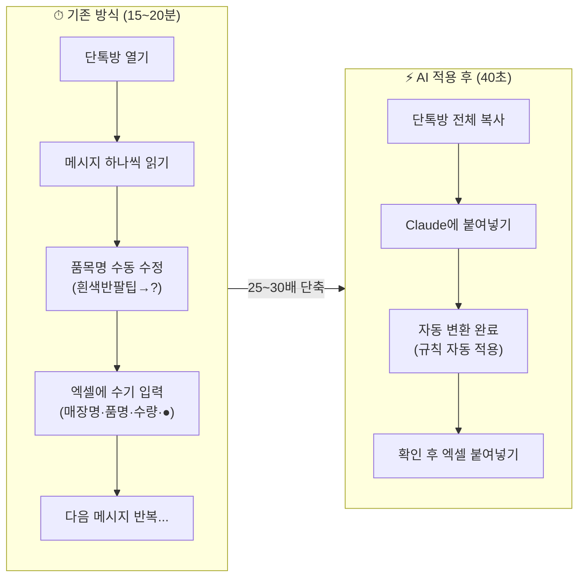
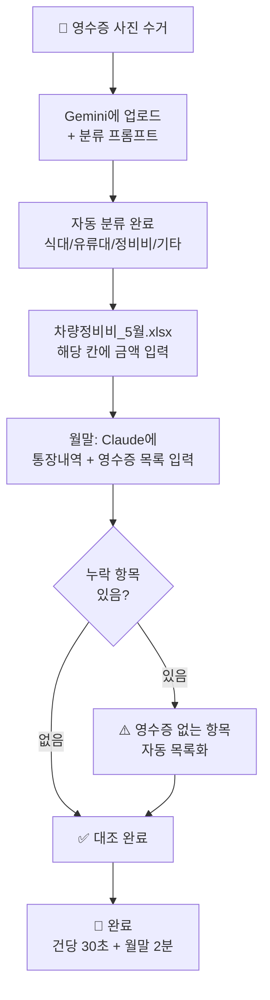
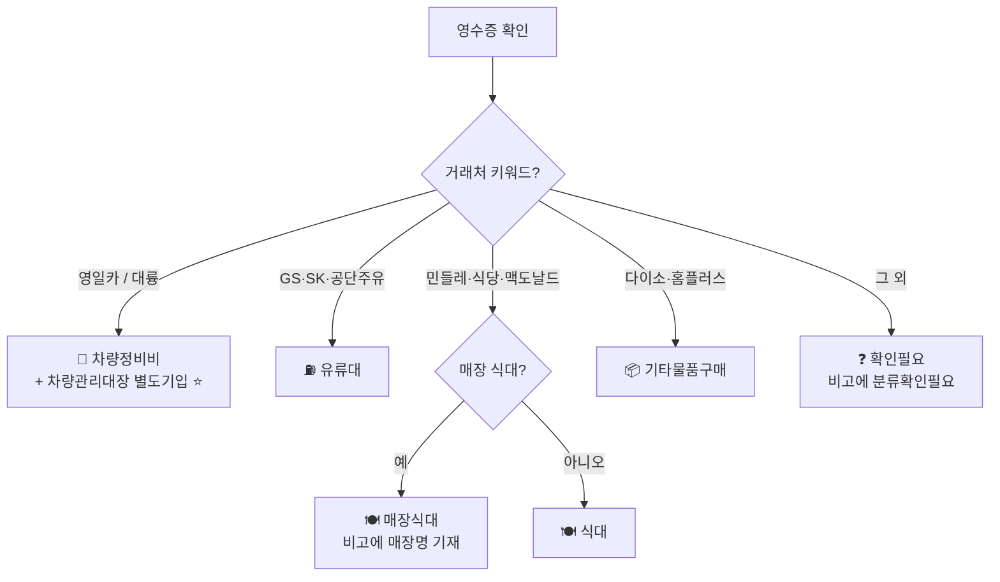
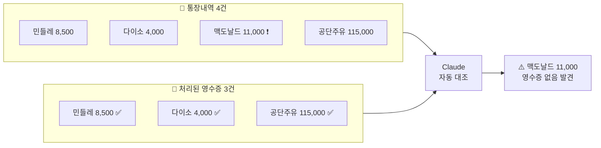

# 1회차_2부

정리일: 2026-10-08 · 교육 에셋 N0828

본문 수집·공개 편집. 도구 실행·최신 기능 재검증은 미실시. 고객·참여자 정보와 개별 접근 링크, 원본 첨부는 제외했습니다.

---

# 교육기관 × 심지 — AI 실무 교육 1회차 교재 (2부)
> **이전 문서:** 1회차 교재 (1부) — 오프닝 · 기초개념 · 실습 1<br>**이 문서:** 실습 2 (메신저→업무보고) · 휴식 · 실습 3 (영수증·통장 대조)
---
# 실습 2 — 라인 메신저 → 업무보고 엑셀 자동 작성
> **⏰ 14:40 \~ 15:30 (50분)도구:** Claude \| **모델:** Claude 3.5 Sonnet (무료) \| **📍 접속:** claude.ai
---
## 배경: 지금 어떻게 하고 있나요
녹취록에서 직접 확인한 내용입니다.
> *"이거를 이제 저희가 1:1 업무 일지라고 해서, 오전 오후 두 개를 나눠서 하는데...오전에 어떤 물품이 추가적으로 나갔는지 취소됐는지 이런 것들을 파악을 하고요.이거를 다 사람이 수기로 하고 있어 가지고..."*<br>— 2026.05.28 녹취 중
**매일 두 번 반복되는 수기 업무보고 작성:**
```plain text
오전 배송 완료
    ↓
라인 발주전달사항 단톡방 열기
    ↓
메시지 하나씩 읽으며 내용 파악
    ↓
업무보고 엑셀 열기 → 매장명·품명·수량·추가/누락/반품/취소·비고 수기 입력
    ↓
부서장 결재 → 사무국에 전달 (거래명세서 발행 기준이 됨)
    ↓
(오후 배송 후 같은 과정 반복)
→ 소요 시간: 15~20분/회 × 하루 2회 = **매일 30~40분**
```
> **업무보고 오작성 시 연쇄 오류 발생:**<br>업무보고 잘못 → 거래명세서 오발행 → 매장 항의 → 재발행<br>이 오류 고리를 AI의 자동 처리 + 명확한 검수 기준으로 끊어냅니다.
---
## 실습 2-A. 핵심 질문에 먼저 답하기
> **프로님 질문:***"품목명이 제각각인데 AI가 취합을 제대로 할 수 있나요?"*
**답: 가능합니다. 방법은 이것입니다.**
AI는 스스로 학습하거나 기억하지 않습니다.<br>하지만 **프롬프트에 규칙을 명시하면 어떤 변형이 와도 반드시 따릅니다.**
```plain text
예시:
프롬프트에 이렇게 한 번 적어두면:
  "흰색반팔팁, 반팔팁, 반발티, 반팔치 → 반팔티"

이후 어떤 오타가 와도 자동으로:
  흰색반팔팁(M) → u42(M)반팔티(흰색) ✅
  반발티 → 반팔티 ✅
  핸팔티미디엄 → u42(M)반팔티(흰색) ✅
  (규칙에 없으면) → 원문 그대로 + "품목확인필요" 표시
```
---
## 실습 2-B. 실제 메신저 내용 미리 보기
**오늘 실습에서 처리할 실제 단톡방 내용:**
```plain text
━━━━━━━━━━━━━━━━━━━━━━━━━━━━━━━━━━━━━━
[라인 발주전달사항 단톡방 — 5월 27~28일]
━━━━━━━━━━━━━━━━━━━━━━━━━━━━━━━━━━━━━━

발산
추가발주
흰색반팔팁(M)  3
흰색반팔팁(L)  2
흰색반팔팁(XL) 2

영업관리부
발산
추가발주
흰색반팔팁(L)  1
흰색반팔팁(XL) 1

압구정입니다
내일 앞집시200개
쌈장기 30개 추가 부탁드립니다

도곡
무1 콩나물1
취소해주세요

영업관리부
오전 재고반영 완료입니다

구리
부우갈비탕 2 추가요청드립니다

주안
고구마 1 과일소스 1 추가
━━━━━━━━━━━━━━━━━━━━━━━━━━━━━━━━━━━━━━
```
**이 메신저를 눈으로 보면서 지금 바로 보이는 문제들:**


메신저 원문

문제

올바른 처리


`흰색반팔팁(L)`

오타

`u43(L)반팔티(흰색)`


`흰색반팔팁(XL)`

오타

`u44(2L)반팔티(흰색)`


`앞집시200개`

오타

`앞접시 200개` + 1박스=45개 비고


`쌈장기`

약어

`쌈장접시`


`부우갈비탕`

오타

`거당갈비탕`


`무1 콩나물1`

수량 붙여쓰기

무 1개, 콩나물 1개 분리


발산 메시지 2번

중복

L사이즈 2+1=3, XL사이즈 2+1=3 합산


`오전 재고반영 완료`

발주 무관 메시지

무시


---
## 실습 2-C. 업무보고 양식 구조 확인
`업무보고_빈양식.xlsx` 열기 (강사 드라이브에서 다운로드)
**5월 28일 업무보고(오전) 실제 파일 기반 양식:**


매장명

품명

수량

추가

누락

반품

수정

취소

비고


주안

고구마

1

●


주안

과일소스

1

●


범계

등갈비

2

●


도곡

거당갈비탕

3

●


평창

김치찌개 앞접시

1

●


발산

u42(M)반팔티(흰색)

3

●


발산

u43(L)반팔티(흰색)

3

●


발산

u44(2L)반팔티(흰색)

3

●


압구정

앞접시

4

●


한박스 45개


압구정

쌈장접시

30

●


오늘 Claude가 이 양식 구조에 맞게 메신저 내용을 자동으로 정리해줍니다.
---
## 실습 2-D. Claude 새 채팅 열기
claude.ai → 왼쪽 상단 **"+ 새 채팅"** 클릭
---
## 실습 2-E. 시스템 프롬프트 입력 (첫 번째 메시지)
아래를 **첫 번째 메시지**로 입력합니다.<br>이것이 Claude에게 역할·규칙·출력 형식을 알려주는 것입니다.
```plain text
[역할]
너는 교육기관 영업관리부 업무보고서 작성 전문가야.
배송 후 라인 단톡방에 올라온 메시지를 읽고 업무보고 양식에 맞게 정리하는 게 네 임무야.

[품목명 통일 규칙 — 반드시 이 규칙을 따를 것]
흰색반팔팁, 반팔팁, 반발티, 반팔치, 핸팔티 → 반팔티
u42M, u42(M), 42M → u42(M)반팔티(흰색)
u43L, u43(L), 43L → u43(L)반팔티(흰색)
u44(2L), u442L, 44(2L), 흰색반팔팁(XL), u44XL, 44XL → u44(2L)반팔티(흰색)
앞집시, 앞졉시, 앞저시, 압접시 → 앞접시
쌈장기, 쌈장그릇 → 쌈장접시
전골, 전골수, 전골육슈 → 전골육수
삼겹독, 삼겹살독, 독일삼겹 → 삼겹살(독일산)
오나이도, 캐나이도, 오나이, 캐나이 → 삼겹살(캐나다산)
갈비탕, 갈비땅, 거당갈비, 부우갈비탕 → 거당갈비탕
고구마야채, 고구야채 → 고구마
볶소금 → 볶음소금
김치젼골 → 김치전골

[매장 유형별 품목 기준]
일반 매장 → 삼겹살(독일산) 기본
돌판 매장 → 삼겹살(캐나다산) 기본
바베큐 매장 → 바베큐포장봉투 사용

[출력 양식 — 반드시 아래 순서로 출력]

1. 업무보고 표
| 매장명 | 품명 | 수량 | 추가 | 누락 | 반품 | 수정 | 취소 | 비고 |

2. 오전 전달사항 (메신저에서 해당 내용 있을 경우)
* 서류전달 :
* 서류수령 :
* 물품전달(물품내용) :
* 물품수령(물품내용) :

3. 오후 전달사항 (메신저에서 해당 내용 있을 경우)
* 서류전달 :
* 서류수령 :
* 물품전달(물품내용) :
* 물품수령(물품내용) :

4. ⚠️ 담당자 최종 확인 필요 항목 (AI가 판단하기 어려운 내용 목록)

[처리 기준]
추가발주, 추가요청, 더 주세요, 추가 → 추가 열에 ●
못 받았다, 빠졌다, 누락, 없었어요 → 누락 열에 ●
돌려보낸다, 반품, 돌려드림 → 반품 열에 ●
수정, 수량 변경, 다시 해주세요 → 수정 열에 ●
취소, 필요없어요, 취소해주세요 → 취소 열에 ●
동일 매장 + 동일 품목 여러 건 → 수량 합산해서 한 행으로
동일 매장 + 다른 품목 → 각각 별도 행
특이사항·맥락 정보 (예: 앞접시 1박스=45개) → 비고에 기재
서류전달·서류수령·물품전달·물품수령 내용 → 오전/오후 전달사항에 분류해서 기재
차량 출발 메시지, 재고반영 완료 등 발주와 관계없는 메시지 → 처리 안 함

[중요 제한]
위 규칙에 없는 품목명 → 원문 그대로 + 비고에 "품목확인필요"
수량 불명확 → 비고에 "수량확인필요"
매장명 불명확 → 비고에 "매장명확인필요"
오전/오후 구분 불명확한 전달사항 → 오전 전달사항에 기재 후 "확인필요" 표시

이 규칙 이해했으면 "준비 완료. 단톡방 내용을 붙여넣어 주세요."라고만 답해줘.
```
> ✅ Claude가 **"준비 완료. 단톡방 내용을 붙여넣어 주세요."** 라고 답하면 다음으로
---
## 실습 2-F. 메신저 내용 붙여넣기 (두 번째 메시지)
**방법 :** `메신저_가상텍스트_5월27~28일.txt` → 전체 선택(Ctrl+A) → 복사(Ctrl+C) or 파일 자체 첨

```plain text
아래 라인 단톡방 내용을 업무보고 양식으로 정리해줘.

[단톡방 내용]
발산
추가발주
흰색반팔팁(M)  3
흰색반팔팁(L)  2
흰색반팔팁(XL) 2

영업관리부
발산
추가발주
흰색반팔팁(L)  1
흰색반팔팁(XL) 1

압구정입니다
내일 앞집시200개
쌈장기 30개 추가 부탁드립니다

도곡
무1 콩나물1
취소해주세요

영업관리부
오전 재고반영 완료입니다

구리
부우갈비탕 2 추가요청드립니다

주안
고구마 1 과일소스 1 추가
```
---
## 실습 2-G. 결과 분석 — 한 줄씩 확인하기
**올바른 결과 예시:**


매장명

품명

수량

추가

누락

반품

수정

취소

비고


발산

u42(M)반팔티(흰색)

3

●


발산

u43(L)반팔티(흰색)

3

●


2건 합산 (2+1)


발산

u44(2L)반팔티(흰색)

3

●


2건 합산 (2+1)


압구정

앞접시

200

●


수량확인필요: 1박스=45개, 실제 필요 수량 담당자 확인


압구정

쌈장접시

30

●


도곡

무

1


●


도곡

콩나물

1


●


구리

거당갈비탕

2

●


주안

고구마

1

●


주안

과일소스

1

●


**✅ 자동으로 처리된 것 — 하나씩 확인:**


메신저 원문

AI 처리 결과

처리 원리


`흰색반팔팁(M) 3`

u42(M)반팔티(흰색) 3

품목명 규칙 적용


`흰색반팔팁(L) 2` + `흰색반팔팁(L) 1`

u43(L)반팔티(흰색) **3**

동일 품목 수량 합산


`흰색반팔팁(XL) 2` + `흰색반팔팁(XL) 1`

u44(2L)반팔티(흰색) **3**

동일 품목 수량 합산


`앞집시`

앞접시

오타 자동 수정


`쌈장기`

쌈장접시

약어 자동 변환


`부우갈비탕`

거당갈비탕

오타 자동 수정


`무1 콩나물1`

무 1, 콩나물 1

수량 붙여쓰기 분리


`오전 재고반영 완료`

처리 안 함

발주 무관 메시지 무시


앞접시 1박스=45개 맥락

비고에 자동 기재

맥락 정보 처리


---
**실습 2 Before / After**

**반드시 확인할 항목:**


항목

이유

처리 방법


압구정 앞접시 200개

1박스=45개인데 200개는 4박스+20개 → 실제 필요량 확인 필요

압구정에 직접 확인 후 수정


비고에 `수량확인필요` 표시 항목

AI가 판단 불가한 영역

담당자가 매장 확인 후 처리


비고에 `품목확인필요` 표시 항목

규칙 사전에 없는 새 품목명

아래 규칙 추가 실습 진행


---
## 실습 2-H. 수정 요청 실습
AI 결과가 예상과 다를 때 수정하는 방법을 직접 해봅니다.
### 케이스 1: 매장명이 틀렸을 때
```plain text
결과에서 "발산점"이 "발산"으로 나와야 해.
우리는 매장명에 "점"을 붙이지 않아. 모두 수정해줘.
```
### 케이스 2: 합산이 안 됐을 때
```plain text
발산 u43(L)반팔티(흰색)가 두 행으로 나왔어.
같은 매장, 같은 품목이니까 수량을 합산해서 한 행으로 만들어줘.
```
### 케이스 3: 새 오타를 발견했을 때
```plain text
"등갈피"라는 품목이 나왔는데
우리 품목명으로는 "등갈비"야.
앞으로 "등갈피" = "등갈비"로 처리해줘.

그리고 이 규칙이 추가된 현재 시스템 프롬프트 전체를 다시 출력해줘.
(라이브러리에 저장할 거야)
```
> **케이스 3이 가장 중요합니다:**<br>새 오타를 발견할 때마다 규칙에 추가하면<br>시간이 지날수록 AI가 더 정확해집니다.<br>6인이 함께 발견하고 추가하면 더 빠르게 완성됩니다.
---
## 실습 2-I. 규칙 추가 실습 (5분)
각자 알고 있는 오타나 약어를 직접 추가합니다.
Claude에게:
```plain text
품목명 규칙을 추가할게.
아래를 기존 규칙에 추가하고 "규칙 업데이트 완료"라고 답해줘.

(각자 발견하거나 알고 있는 오타 직접 입력)
예시:
파채 → 파
야채쌈 → 쌈채소
등갈피 → 등갈비
```

이번에는 이걸 한 번에 붙여넣으세요 (수정 요청 + 규칙 추가)
두 가지 수정해줘.
1. 흰색반팔팁(XL) → u44(2L)반팔티(흰색)으로 규칙 추가해서 다시 처리해줘.
2. 비고 열에서 날짜(5/27 오후, 5/28 오후 등) 표시 제거해줘.<br>날짜 외 다른 비고 내용(합산, 품목확인필요 등)은 유지해.
수정된 전체 표로 다시 출력해줘.

---
## 실습 2-J. 업무보고 양식에 붙여넣기
Claude 결과를 엑셀에 직접 붙여넣기 하면 병합셀 구조 때문에 열이 맞지 않습니다.<br>대신 Claude에게 파일을 직접 채워달라고 요청합니다.
**STEP 1.** 같은 Claude 채팅에서 📎 클릭 → `실습2_업무보고_빈양식.xlsx` 업로드
**STEP 2.** 아래 입력 후 전송
`첨부한 업무보고 빈양식 파일에 위 결과 데이터를 채워서<br>완성된 엑셀 파일로 만들어줘.<br><br>매장명은 A열, 품명은 D열, 수량은 H열,<br>추가·누락·반품·수정·취소는 I~M열, 비고는 N열이야.<br>데이터는 9행부터 시작해.`
**STEP 3.** Claude가 완성 파일을 생성하면 다운로드
> **Claude 무료 플랜 주의:**<br>무료 플랜은 파일 생성·다운로드가 지원되지 않을 수 있습니다.<br>안 될 경우 강사에게 요청하면 완성 파일을 드라이브로 공유해드립니다.
**STEP 4.** 완성 파일 열어서 확인 후 `수량확인필요` / `품목확인필요` 항목 노란색 강조

> **어떤 방법을 쓸지 먼저 확인하세요:**
- 양식에 병합셀·색깔·서식이 있다면 → **아래 방법 (파일 업로드 후 Claude에 요청)**
- 단순한 표 형식이라면 → Claude 결과 복사 후 A열 첫 행에 **바로 붙여넣기 (Ctrl+V)**
Claude 결과를 엑셀에 직접 붙여넣기 하면 병합셀 구조 때문에 열이 맞지 않습니다. 대신 Claude에게 파일을 직접 채워달라고 요청합니다.
**STEP 1.** 같은 Claude 채팅에서 📎 클릭 → `실습2_업무보고_빈양식.xlsx` 업로드
**STEP 2.** 아래 입력 후 전송
`첨부한 업무보고 빈양식 파일에 위 결과 데이터를 채워서<br>완성된 엑셀 파일로 만들어줘.<br><br>매장명은 A열, 품명은 D열, 수량은 H열,<br>추가·누락·반품·수정·취소는 I~M열, 비고는 N열이야.<br>데이터는 9행부터 시작해.`
`대신 지금 병합셀이나 색깔이 다 다르므로, 이 양식들이 규칙대로 변경없이 유지가 되어야 해.`
**STEP 3.** Claude가 완성 파일을 생성하면 다운로드
> **Claude 무료 플랜 주의:**<br>무료 플랜은 파일 생성·다운로드가 지원되지 않을 수 있습니다.<br>안 될 경우 강사에게 요청하면 완성 파일을 드라이브로 공유해드립니다.
**STEP 4.** 완성 파일 열어서 확인 후 `수량확인필요` / `품목확인필요` 항목 노란색 강조

---
## 실습 2-K. 프롬프트 저장
구글 문서 \*이름 예시:`② 메신저 업무보고용` 섹션에 저장
```plain text
=== ② 메신저 업무보고 자동 작성 프롬프트 ===
작성일: 2026.05.29 | 도구: Claude | 처리시간: 약 40초 (기존 15~20분)

[사용 방법]
1. Claude 새 채팅 시작
2. 시스템 프롬프트 전체 복사 → 붙여넣기 → 전송
3. "준비 완료" 확인 후 다음 메시지 전송
4. "아래 단톡방 내용을 업무보고 양식으로 정리해줘." + 내용 붙여넣기
5. 결과 확인 → 확인필요 항목 수동 처리
6. 업무보고 양식에 붙여넣기

[중요 주의사항]
- 새 채팅 시작마다 시스템 프롬프트 다시 입력 필요
  (같은 채팅 안에서는 규칙 유지, 새 채팅이면 초기화됨)
- 비고의 "확인필요" 항목은 반드시 수동 검토
- 새 오타 발견 → 즉시 규칙 추가 → 라이브러리 업데이트

[시스템 프롬프트]
(위 실습 2-E 내용 전체 붙여넣기)

[품목명 규칙 업데이트 이력]
2026.05.29 최초 작성: 흰색반팔팁·앞집시·쌈장기·갈비탕·오나이도 등 13개
(이후 추가 시 날짜와 함께 기록)
```
---
## 실습 2 완료 체크
- [ ] 시스템 프롬프트 입력 → "준비 완료" 확인
- [ ] 메신저 텍스트 붙여넣기 → 업무보고 표 출력
- [ ] 발산 L·XL사이즈 수량 합산 (각 3개) 확인
- [ ] 압구정 앞접시 비고 처리 확인
- [ ] `오전 재고반영 완료` 메시지가 결과에 없는지 확인 (무시 처리됨)
- [ ] 새 오타 규칙 1개 이상 추가 완료
- [ ] 업무보고 양식에 붙여넣기 완료
---
---
---
> **다음 내용:** 실습 3 영수증·통장 대조 → 실습 4 수식 → 성과 시연 → 수업 방향 논의
---
*교육기관 1회차 교재 (상반부) \| 오프닝 · 실습 1 · 실습 22026년 5월 29일 \| 강사 심지 프로님 (심지)*
---
---
# 휴식 (15:30 \~ 15:45, 15분)
> **이 시간에 생각해볼 것:**<br>실습 1, 2 중 내가 내일 아침에 바로 쓸 수 있는 것이 무엇인지 정해두세요.
---
---
# 실습 3 — 영수증 → 차량유지비 자동 기입 + 통장 대조
> **⏰ 15:45 \~ 16:35 (50분)**
**도구 1 (영수증 분류):** Gemini \| **모델:** Gemini 2.0 Flash (무료) \| **📍 접속:** gemini.google.com<br>**도구 2 (통장 대조):** Claude \| **모델:** Claude 3.5 Sonnet (무료) \| **📍 접속:** claude.ai
---
## 핵심 개념 — 데이터 유형과 AI의 처리 방식
### 정형 데이터 vs 비정형 데이터
AI를 업무에 활용할 때 가장 먼저 파악해야 할 것이 "내 데이터가 어떤 형태인가"입니다.


구분

정형 데이터

비정형 데이터


정의

행·열로 구성된 표 형태

구조가 없는 자유 형식


예시

발주 취합 엑셀, 업무보고 양식, 차량유지비 시트

영수증 사진, 메신저 텍스트, 발주서 사진


AI 처리

직접 분석·집계 가능

텍스트 추출 또는 구조화 과정 필요


교육기관 예시

재고파악v2.xlsx, 원자재입고양식.xlsx

라인 메신저, 영수증 사진, 수기 발주서


**핵심:** 비정형 데이터는 AI가 바로 분석할 수 없습니다. 먼저 **정형화(구조화)** 과정이 필요합니다.
오늘 실습 1·2·3이 모두 이 과정입니다.
```plain text
비정형 데이터                정형 데이터
(사진·텍스트)    →  AI 처리  →  (표·엑셀)  →  집계·분석
  실습 1, 2, 3                              실습 4, 2회차
```
### AI가 영수증을 읽는 원리
영수증은 정해진 양식이 없습니다. 다이소 영수증과 주유소 영수증의 레이아웃은 완전히 다릅니다. 그런데 어떻게 Gemini가 둘 다 읽을 수 있을까요?
Gemini는 영수증 "양식"을 학습한 것이 아니라, 수억 장의 다양한 문서를 학습하면서 "영수증처럼 생긴 문서에서 날짜·금액·거래처가 어디에 위치하는 경향이 있는가"를 파악합니다.
따라서:
- 일반적인 영수증 → 높은 정확도
- 특수한 형식(수기 메모, 외국어 혼재) → 낮은 정확도 + 확인 필요
- 품질이 나쁜 사진(흐림, 접힘, 역광) → 오독 가능성 증가
### 왜 분류 기준을 프롬프트에 직접 써야 하는가
"영일카는 차량정비비"라는 것을 AI가 왜 모를까요? Gemini는 "영일카"라는 회사가 교육기관 협력 정비소라는 사실을 알 수 없습니다. AI는 여러분의 회사 내부 정보를 학습한 적이 없습니다.
이것이 **분류 기준을 매번 프롬프트에 직접 써야 하는 이유**입니다.
```plain text
프롬프트 없이:
"영일카 → AI가 판단 → 자동차 관련이니 "정비비" 추측 (맞을 수도, 틀릴 수도)

분류 기준 명시 후:
"영일카 = 차량정비비, 차량관리대장 기입 필요" → 항상 일관된 결과
```
---
### G.I.G.O. — AI 결과 품질은 입력 품질에 달려 있다
AI를 쓰다 보면 "왜 결과가 이상하지?"라고 느끼는 순간이 옵니다. <br>대부분의 경우 원인은 AI가 아니라 **입력 데이터의 품질**에 있습니다.
컴퓨터 과학에서 오래된 원칙이 있습니다.
> **G.I.G.O. — Garbage In, Garbage Out**<br>쓰레기를 넣으면 쓰레기가 나온다
AI도 동일합니다.


입력 품질

결과 품질

교육기관 예시


흐릿한 발주서 사진

OCR 오독 빈번

전골육수 264 → 64로 오독


오타 규칙 없는 프롬프트

품목명 제각각

앞집시·앞졉시 제각각 출력


분류 기준 미명시

AI 임의 판단

영일카를 "정비"로 추측


사진 역광·접힘

인식 불가

숫자 판독 불가


**실무 적용:** 오늘 실습에서 영수증 사진을 찍을 때, 밝은 곳에서 평평하게 놓고 정면에서 찍는 것이 G.I.G.O. 원칙의 적용입니다. 좋은 입력이 좋은 결과를 만듭니다.
### 자동화 파이프라인 사고법 — 업무를 단계로 분해하라
AI 활용 전문가가 되려면 업무를 "단계의 흐름"으로 보는 훈련이 필요합니다.
지금은 수동으로 하는 일도, 단계로 분해하면 어느 단계를 AI가 대체할 수 있는지 보입니다.
**교육기관 차량유지비 처리를 단계로 분해하면:**

```plain text
[현재]
① 영수증 수거 (사람)
② 거래처 확인·분류 판단 (사람 — 오늘부터 AI)
③ 차량유지비 시트 해당 칸 입력 (사람)
④ 월말 통장 대조 (사람 — 오늘부터 AI)
⑤ 분류별 합계 집계 (사람 — 2~3회차에 AI)
⑥ 보고서 작성 (사람 — 3회차에 AI)

[AI 적용 후 목표]
① 영수증 수거 (사람, 불변)
② 거래처 확인·분류 판단 → Gemini 자동 (오늘)
③ 시트 입력 → GAS 자동 연결 (5회차)
④ 통장 대조 → Claude 자동 (오늘)
⑤ 집계 → 수식 자동화 (오늘·2회차)
⑥ 보고서 → Claude 초안 생성 (3회차)
```
이렇게 단계를 분해하면 "어느 단계가 자동화 가능한가"와 "어느 단계는 사람이 꼭 해야 하는가"가 명확해집니다.
**AI 전문가의 사고방식:** 새 업무를 만나면 먼저 단계를 분해하고, 각 단계를 AI·자동화·사람 중 어디에 배정할지 설계합니다. 이것이 10회차에서 배울 "업무 분석 컨설팅"의 핵심입니다.
---
---
## 배경: 지금 어떻게 하고 있나요
```plain text
현재 프로세스:
영수증 수거
    ↓
거래처 확인 → 분류 판단
    영일카·대륭 = 차량정비비 (+ 차량관리대장 별도 기입)
    주유소 = 유류대
    식당·패스트푸드 = 식대
    다이소·기타 = 기타물품
    ↓
차량정비비_5월.xlsx → 차량유지비 시트 → 날짜 행 → 차량번호 열 → 분류 열에 금액 수기 입력
    ↓
[월말] 통장내역 엑셀 열기 → 영수증과 눈으로 대조 → 누락 찾기
    ↓
차량정비·식대·매장식대·유류비 분류별 합계 → 그래프 → 보고
→ 소요: 건당 3~5분 + 월말 대조 20~30분
```
---

**실습 3 — Gemini + Claude 적용 후 흐름**

---
## 실습 3-A. 차량유지비 시트 구조 파악
`차량정비비_5월_빈양식.xlsx` 열기
**실제 파일 헤더 구조 (1\~4행):**
```plain text
[행 1] 차량 유지비 현황 (5월)

[행 2] 일 │ [차량번호 비공개] (5t) │────│ [차량번호 비공개] (5t) │────│ [차량번호 비공개] (5t) │────│ [차량번호 비공개] (5t) │
[행 3]    │ 식대 │유류대│ 정비금액 │ 식대 │유류대│ 정비금액 │ 식대 │유류대│ 정비금액 │ 식대 │유류대│ 정비금액 │
[행 4]    │      │      │영일카│대륭│기타 │      │      │영일카│대륭│기타 │      │      │영일카│대륭│기타 │
```
**오늘 기입 대상 (5월 27일, 27행):**
```plain text
27행에서 해당 차량번호 열 찾기
→ 분류에 맞는 열에 금액 입력
```
**운행 차량 5대:**


차량번호

적재량

담당 운전자


[차량번호 비공개]

5t

박현우


[차량번호 비공개]

5t

프로님


[차량번호 비공개]

5t

프로님


85기1149

5t

—


[차량번호 비공개]

5t

정회영


---
## 실습 3-B. 기입 기준표 — 지금 읽어두세요


거래처 키워드

분류

기입 열

차량관리대장 추가 기입 여부


영일카센타, 영일카, 영일

차량정비비

정비금액 \> 영일카센타 열

**필수**


대륭냉동, 대륭

차량정비비

정비금액 \> 대륭냉동 열

**필수**


GS주유소, SK, 알뜰주유, 직영주유, 공단주유

유류대

유류대 열

—


민들레, 순대국, 설렁탕, 해장국 등 식당

식대

식대 열

—


맥도날드, 버거킹, KFC, 롯데리아

식대

식대 열

—


아성다이소, 다이소, 홈플러스

기타물품구매

기타정비 열

—


**매장에서 쓴 식대**

매장식대

식대 열

비고에 **매장명 필수**


> **차량정비비(영일카·대륭) → 반드시 두 곳에 기입:**
---
**영수증 분류 결정 트리 — 한눈에 보기**

> `차량정비비_5월.xlsx` 차량유지비 시트`2026년_영업관리부_차량_관리_대장.xlsx` 해당 차량 시트
---
## 실습 3-C. 오늘 처리할 영수증 4건
**실제 통장내역 (****`통장내역_비교.xlsx`**** 기반):**


번호

날짜

거래처 (통장 표기)

출금액

예상 분류

영수증


1

2026-05-27

민들레

8,500원

식대

`영수증_민들레.jpg`


2

2026-05-27

아성다이소

4,000원

기타물품구매

`다이소_영수증_실물.jpg`


3

2026-05-27

맥도날드

11,000원

식대

**없음 ← 오늘 발견 목표**


4

2026-05-27

직영 공단1주유소

115,000원

유류대

`_영수증_주유소.jpg`


---
## 실습 3-D. Gemini로 영수증 분류 처리 (25분)
### STEP 1. Gemini 새 채팅 시작
gemini.google.com → 새 채팅
### STEP 2. 다이소 영수증 업로드
`다이소_영수증_실물.jpg` 다운로드 → Gemini에 업로드
**이 영수증의 실제 내용:**
```plain text
"국민가게, 다이소"  (주)아성다이소 경기광주본점
2026.05.27  11:18:41

C TO C 케이블 1.0    2,000 × 2 = 4,000원

판매 합계: 4,000원
카드결제: 비씨카드(체크카드)  944003**
```
### STEP 3. 프롬프트 복사 → 붙여넣기 → 전송
```plain text
[역할]
교육기관 영업관리부 차량유지비 관리 담당자

[배경]
업무용으로 결제한 영수증을 확인하고 차량유지비 현황 시트에 기입할 내용을 정리해야 해.
차량 5대 운행 중이며 아래 분류 기준에 따라 처리해.

[분류 기준 — 반드시 이 기준으로]
영일카센타, 영일카, 영일 → 분류: 차량정비비, 차량관리대장추가기입: ●
대륭냉동, 대륭 → 분류: 차량정비비, 차량관리대장추가기입: ●
GS, SK, 알뜰주유, 공단주유, 직영주유, 주유소 → 분류: 유류대
식당, 민들레, 순대국, 설렁탕, 해장국, 칼국수 → 분류: 식대
맥도날드, 버거킹, KFC, 롯데리아, 맘스터치 → 분류: 식대
아성다이소, 다이소, 홈플러스, 이마트 → 분류: 기타물품구매
분류 불명확 → 분류: 확인필요

[출력 형식]
| 날짜 | 거래처명 | 분류 | 금액(원) | 차량관리대장추가기입 | 비고 |

[처리 조건]
- 날짜는 영수증의 날짜 그대로 (YYYY-MM-DD)
- 매장에서 쓴 식대로 보이면 비고에 "매장식대_확인필요" 기재
- 차량정비비인 경우 차량관리대장추가기입 열에 ●
- 여러 품목이면 총합계 금액으로
- 분류 불확실하면 비고에 "분류확인필요"
- 카드번호, 주소, 바코드 등 불필요 정보 제외

위 영수증 사진을 읽고 위 형식으로 정리해줘.
```
### STEP 4. 다이소 결과 확인
**예상 결과:**


날짜

거래처명

분류

금액(원)

차량관리대장추가기입

비고


2026-05-27

아성다이소

기타물품구매

4,000


C TO C 케이블 1.0 × 2개


### STEP 5. 나머지 영수증 2종 처리
`가상_영수증_민들레.jpg`, `가상_영수증_주유소.jpg` 각각 같은 프롬프트로 처리
### STEP 6. 3건 결과 합치기
```plain text
방금 영수증 3건을 각각 정리했어.
3개 결과를 하나의 표로 합쳐줘.

[1건 - 다이소]
| 2026-05-27 | 아성다이소 | 기타물품구매 | 4,000 | | C TO C 케이블 1.0 × 2개 |

[2건 - 민들레]
(2번 결과 붙여넣기)

[3건 - 주유소]
(3번 결과 붙여넣기)

합친 후 맨 아래에:
1. 차량관리대장 추가 기입 필요한 항목 목록
2. 분류별 소계: 식대 합계 / 유류대 합계 / 기타물품 합계 / 전체 합계
도 정리해줘.
```
**예상 합산 결과:**


날짜

거래처명

분류

금액(원)

차량관리대장

비고


2026-05-27

민들레

식대

8,500


2026-05-27

아성다이소

기타물품구매

4,000


C TO C 케이블 × 2


2026-05-27

직영 공단1주유소

유류대

115,000


분류별 소계:
- 식대: 8,500원
- 유류대: 115,000원
- 기타물품: 4,000원
- **전체: 127,500원**
차량관리대장 추가 기입 필요: 없음 (차량정비비 항목 없음)
---
## 실습 3-E. Claude로 통장내역 vs 영수증 대조 (7분)
### 상황 정리
오늘 처리한 영수증: **3건** (다이소·민들레·주유소)<br>5월 27일 통장내역: **4건** (민들레·다이소·**맥도날드**·주유소)
→ **맥도날드 11,000원 영수증이 없습니다.** Claude가 찾아냅니다.
### Claude 새 채팅 → 아래 입력
```plain text
아래 통장내역과 오늘 처리한 영수증을 비교해서
누락 및 불일치를 찾아줘.

[2026년 5월 27일 통장내역]
1. 2026-05-27 | 민들레 | 출금 8,500원
2. 2026-05-27 | 아성다이소 | 출금 4,000원
3. 2026-05-27 | 맥도날드 | 출금 11,000원
4. 2026-05-27 | 직영 공단1주유소 | 출금 115,000원

[오늘 영수증으로 처리 완료한 내역]
1. 2026-05-27 | 아성다이소 | 기타물품구매 | 4,000원
2. 2026-05-27 | 민들레 | 식대 | 8,500원
3. 2026-05-27 | 직영 공단1주유소 | 유류대 | 115,000원

아래 4가지를 정리해줘:
1. ✅ 처리 완료 (통장 + 영수증 모두 있음)
2. ⚠️ 통장에는 있지만 영수증 없음 → "영수증 수집 필요" 표시
3. ⚠️ 영수증은 있지만 통장에 없음 → "통장내역 확인 필요" 표시
4. 📊 처리 완료 건수 / 미처리 건수 요약
```
### 예상 결과
```plain text
✅ 처리 완료 (3건)
- 아성다이소 4,000원 → 기타물품구매 처리 완료
- 민들레 8,500원 → 식대 처리 완료
- 직영 공단1주유소 115,000원 → 유류대 처리 완료

⚠️ 영수증 없음 — 수집 필요 (1건)
- 맥도날드 11,000원 → 영수증 보관 여부 확인 필요
  → 담당자에게 확인: 영수증 분실, 미수령, 또는 매장식대 가능성

📊 요약: 4건 중 3건 처리 완료 / 1건 영수증 누락
```
---
**통장 대조 핵심 원리**

---
### 1회차 실습3 (재진행) 및 이어서 진행
## 실습 3-D. Gemini로 영수증 분류 처리 (25분)
### STEP 1. Gemini 새 채팅 시작
gemini.google.com → 새 채팅
### STEP 2. 첫 번째 영수증 업로드
`[1회차_실습3] 영수증_민들레.pdf` 업로드
### STEP 3. 프롬프트 복사 → 붙여넣기 → 전송

\[역할\]<br>교육기관 영업관리부 차량유지비 관리 담당자<br><br>\[배경\]<br>업무용으로 결제한 영수증을 확인하고 차량유지비 현황 시트에 기입할 내용을 정리해야 해.<br>아래 분류 기준에 따라 처리해.<br><br>\[분류 기준 — 반드시 이 기준으로\]<br>영일카센타, 영일카, 영일 → 분류: 차량정비비, 차량관리대장추가기입: ●<br>대륭냉동, 대륭 → 분류: 차량정비비, 차량관리대장추가기입: ●<br>GS, SK, 알뜰주유, 공단주유, 직영주유, 주유소 → 분류: 유류대<br>식당, 민들레, 순대국, 설렁탕, 해장국, 칼국수 → 분류: 식대<br>맥도날드, 버거킹, KFC, 롯데리아, 맘스터치 → 분류: 식대<br>아성다이소, 다이소, 홈플러스, 이마트 → 분류: 기타물품구매<br>분류 불명확 → 분류: 확인필요<br><br>\[출력 형식\]<br>\| 날짜 \| 거래처명 \| 분류 \| 금액(원) \| 차량관리대장추가기입 \| 차량번호 \| 비고 \|<br><br>\[처리 조건\]<br>- 날짜는 영수증의 날짜 그대로 (YYYY-MM-DD)<br>- 영수증 하단 수기 메모에 차량번호(예: 1139, 3014)가 있으면 차량번호 열에 기재<br>- 수기 메모에 이름만 있고 차량번호가 없으면 차량번호 열에 "담당자확인필요" 기재<br>- 매장에서 쓴 식대로 보이면 비고에 "매장식대_확인필요" 기재<br>- 차량정비비인 경우 차량관리대장추가기입 열에 ●<br>- 여러 품목이면 총합계 금액으로<br>- 카드번호, 주소, 바코드 등 불필요 정보 제외<br><br>위 영수증 사진을 읽고 위 형식으로 정리해줘.

### STEP 4. 민들레 결과 확인
**예상 결과:**


날짜

거래처명

분류

금액(원)

차량관리대장

차량번호

비고


2026-05-27

민들레

식대

8,500


[차량번호 비공개]


> 수기 메모 "1139 프로님" → 차량번호 [차량번호 비공개] 확인
### STEP 5. 나머지 영수증 2건 처리
같은 프롬프트로 나머지 2건을 각각 처리합니다.
`6. 다이소 영수증 사진.jpg` → 같은 프롬프트 전송
**예상 결과:**


날짜

거래처명

분류

금액(원)

차량관리대장

차량번호

비고


2026-05-27

아성다이소

기타물품구매

4,000


**담당자확인필요**

수기: 프로님 (번호 미기재)


> **여기서 오류 발견:** 수기 메모에 "프로님" 이름만 있고 차량번호가 없습니다.<br>이것이 영수증 처리에서 가장 자주 발생하는 누락 케이스입니다.<br>→ 프로님에게 직접 확인해야 합니다. (프로님 = [차량번호 비공개])
`[1회차_실습3] 영수증_공단주유소.pdf` → 같은 프롬프트 전송
**예상 결과:**


날짜

거래처명

분류

금액(원)

차량관리대장

차량번호

비고


2026-05-27

직영 공단1주유소

유류대

115,000


[차량번호 비공개]


### STEP 6. 3건 결과 합치기

방금 영수증 3건을 각각 정리했어.<br>3개 결과를 하나의 표로 합쳐줘.<br><br>\[1건 - 민들레\]<br>(1번 결과 붙여넣기)<br><br>\[2건 - 다이소\]<br>(2번 결과 붙여넣기)<br><br>\[3건 - 공단주유소\]<br>(3번 결과 붙여넣기)<br><br>합친 후 맨 아래에:<br>1. 차량관리대장 추가 기입 필요한 항목 목록<br>2. 차량번호 확인이 필요한 항목 목록<br>3. 분류별 소계: 식대 / 유류대 / 기타물품 / 전체 합계

**예상 합산 결과:**


날짜

거래처명

분류

금액(원)

차량관리대장

차량번호

비고


2026-05-27

민들레

식대

8,500


[차량번호 비공개]


2026-05-27

아성다이소

기타물품구매

4,000


담당자확인필요

수기: 프로님


2026-05-27

직영 공단1주유소

유류대

115,000


[차량번호 비공개]


분류별 소계:
- 식대: 8,500원
- 유류대: 115,000원
- 기타물품: 4,000원
- **전체: 127,500원**
차량관리대장 추가 기입 필요: 없음<br>차량번호 확인 필요: 아성다이소 4,000원 (프로님 → [차량번호 비공개])
---
## 실습 3-E. Claude로 통장내역 vs 영수증 대조 (7분)
### 상황 정리
오늘 처리한 영수증: **3건** (다이소·민들레·주유소)<br>5월 27일 통장내역: **4건** (민들레·다이소·**맥도날드**·주유소)
→ **맥도날드 11,000원 영수증이 없습니다.** Claude가 찾아냅니다.
### Claude 새 채팅 → 아래 입력

아래 통장내역과 오늘 처리한 영수증을 비교해서<br>누락 및 불일치를 찾아줘.<br><br>\[2026년 5월 27일 통장내역\]<br>1. 2026-05-27 \| 민들레 \| 출금 8,500원<br>2. 2026-05-27 \| 아성다이소 \| 출금 4,000원<br>3. 2026-05-27 \| 맥도날드 \| 출금 11,000원<br>4. 2026-05-27 \| 직영 공단1주유소 \| 출금 115,000원<br><br>\[오늘 영수증으로 처리 완료한 내역\]<br>1. 2026-05-27 \| 아성다이소 \| 기타물품구매 \| 4,000원<br>2. 2026-05-27 \| 민들레 \| 식대 \| 8,500원<br>3. 2026-05-27 \| 직영 공단1주유소 \| 유류대 \| 115,000원<br><br>아래 4가지를 정리해줘:<br>1. ✅ 처리 완료 (통장 + 영수증 모두 있음)<br>2. ⚠️ 통장에는 있지만 영수증 없음 → "영수증 수집 필요" 표시<br>3. ⚠️ 영수증은 있지만 통장에 없음 → "통장내역 확인 필요" 표시<br>4. 📊 처리 완료 건수 / 미처리 건수 요약

### 예상 결과

`✅ 처리 완료 (3건)<br>-` 아성다이소 4,000원 → 기타물품구매 처리 완료<br>- 민들레 8,500원 → 식대 처리 완료<br>- 직영 공단1주유소 115,000원 → 유류대 처리 완료<br><br>⚠️ 영수증 없음 — 수집 필요 (1건)<br>- 맥도날드 11,000원 → 영수증 보관 여부 확인 필요<br>  → 담당자에게 확인: 영수증 분실, 미수령, 또는 매장식대 가능성<br><br>📊 요약: 4건 중 3건 처리 완료 / 1건 영수증 누락

---
**통장 대조 핵심 원리**
🧾 처리된 영수증 3건민들레 8,500 ✅다이소 4,000 ✅공단주유 115,000 ✅🏦 통장내역 4건민들레 8,500다이소 4,000맥도날드 11,000 ❗공단주유 115,000
Claude자동 대조
⚠️ 맥도날드 11,000영수증 없음 발견
---
## 실습 3-F. 분류 결과 → 차량유지비 엑셀 입력 (10분)
Gemini 분류 결과를 `[1회차_실습3] 차량유지비_가상데이터.xlsx` → **차량유지비 시트 → 27행**에 직접 입력합니다.
### 왜 우리가 직접 채우는 것이 좋은가
AI가 엑셀 파일을 읽고 값을 넣어서 새 파일로 저장할 수는 있습니다. <br>하지만 차량정비비 파일처럼 수식과 서식이 복잡한 경우 AI가 파일을 저장하는 과정에서 아래 것들이 손상됩니다.


항목

AI 직접 저장 시

사람이 직접 입력 시


기존 수식 (합계·일치여부 등)

재계산 캐시 손실, 일부 깨짐

완벽 유지


셀 병합 구조

일부 손실

완벽 유지


열 너비·행 높이

근사치만 복원

완벽 유지


조건부 서식 (색깔 규칙)

손실

완벽 유지


차트

손실

완벽 유지


**결론:** AI는 "어느 셀에 어떤 값을 넣어라"는 **지시**를 정확하게 해주는 역할이고, 실제 입력은 원본 파일 서식을 유지하기 위해 사람이 합니다. 입력 자체는 30초면 끝납니다.
- AI 역할:   영수증 읽기 → 분류 → 차량번호 확인 → 입력 위치 안내
- 사람 역할:  원본 파일 열기 → 27행 찾기 → 금액 입력 (30초)
- 5회차 이후: GAS로 원본 파일 수식·서식 그대로 자동 입력
<details>
<summary>상세 설명</summary>
**왜 AI가 수식·서식까지 완벽하게 유지한 채로 값을 넣어줄 수 없는가**
엑셀 파일 내부는 수식·서식·데이터가 하나의 XML 코드 안에 복잡하게 얽혀 있습니다. AI가 데이터만 건드리려 해도 저장하는 과정에서 나머지 구조가 깨집니다. 마치 워드 파일을 메모장으로 열어서 수정하고 저장하면 파일이 망가지는 것과 같은 원리입니다.


방식

결과


AI가 파일 통째로 저장

수식·조건부서식·병합·차트 손상


사람이 원본에 직접 입력

수식·서식 완벽 유지


GAS (5회차)

구글 시트 내부에서 직접 동작 → 수식·서식 건드리지 않고 원하는 셀에만 값 삽입 가능


**GAS(Google Apps Script)란?**<br>구글이 만든 자동화 도구입니다. 구글 시트 안에서 직접 동작하기 때문에 "B31 셀에 8,500 넣어라"라는 명령만 실행하고 나머지는 전혀 건드리지 않습니다. 버튼 하나로 실행할 수 있으며 5회차에서 직접 만들어봅니다.
`지금 (1회차):  AI가 입력 위치 안내 → 사람이 원본 파일에 직접 입력 (30초)<br>5회차 이후:    버튼 1개 → GAS가 원본 수식·서식 그대로 유지하면서 자동 입력`
`GAS 동작 방식:<br>  구글 시트를 열어둔 채로<br>  "B31 셀에 8500 넣어라" 명령만 실행<br>  → 나머지 수식·서식 전혀 영향 없음<br>  → 버튼 하나로 실행 가능`
쉽게 비유하면 이렇습니다.


<colgroup>
<col>
<col width="457">
</colgroup>


방식

비유


AI가 파일 저장

집 전체를 헐고 새로 짓는 것 (원본 설계도 사라짐)


사람이 직접 입력

방 하나에 가구만 넣는 것


GAS

로봇 팔이 방에 들어가서 가구만 정확히 배치


</details>
---
**차량번호-담당자 매핑표 (입력 전 확인):**


차량번호

적재량

담당 운전자


[차량번호 비공개]

5t

박현우


[차량번호 비공개]

5t

프로님


[차량번호 비공개]

5t

**프로님**


[차량번호 비공개]

5t

정회영


[차량번호 비공개]

3.5t

—


> 다이소 영수증의 "프로님" = **[차량번호 비공개]** 담당<br>이 매핑표를 라이브러리에 저장해두면 매번 확인할 필요가 없습니다.
**27행 입력 위치:**


영수증

분류

차량번호

입력 열

금액


민들레

식대

[차량번호 비공개]

[차량번호 비공개] → 식대 열

8,500


공단주유소

유류대

[차량번호 비공개]

[차량번호 비공개] → 유류대 열

115,000


아성다이소

기타정비

[차량번호 비공개]

[차량번호 비공개] → 기타정비 열

4,000


**입력 완료 후 확인:**
- 27행 해당 열에 금액이 정확히 들어갔는지
- 기존 수식(합계·일치여부)이 자동으로 계산되는지 확인
## 실습 3-G. 월말 결산 대조 방법 (참고)
**실제 월말 보고에 들어가는 항목 (****`월말_보고_시_필요한_내용.xlsx`**** 기반):**

5월 결제금액 확인<br>──────────────────────────────────────────────<br>[차량번호 비공개]:<br>  식대: 120,000원 / 매장식대: 38,000원<br>  유류비: 420,000원 / 차량정비: 50,000원<br>  소계: 628,000원<br><br>[차량번호 비공개]:<br>  식대: 60,000원 / 매장식대: 84,000원<br>  유류비: 221,000원 / 차량정비: 0원<br>  소계: 365,000원<br><br>[차량번호 비공개]:<br>  식대: 40,000원 / 매장식대: 20,000원<br>  유류비: 100,000원 / 차량정비: 50,000원<br>  소계: 210,000원<br><br>전체 합계: 2,117,000원<br>──────────────────────────────────────────────

이 집계 및 그래프 자동 제작은 3회차(시각화·보고서)에서 다룹니다.
**월말 전체 대조 프롬프트 (참고):**

아래 5월 한 달 통장내역 전체와 영수증 처리 목록을 비교해서<br>영수증 없는 항목 전체 목록을 만들어줘.<br><br>\[5월 통장내역\]<br>(거래내역조회 시트 전체 복사 붙여넣기)<br><br>\[5월 영수증 처리 완료 목록\]<br>(처리된 내역 붙여넣기)<br><br>금액 큰 순으로 정렬하고, 분류별 합계도:<br>- 식대 합계 / 매장식대 합계 / 유류대 합계 / 차량정비비 합계 / 기타 합계 / 전체 합계

---
## 실습 3-G. 프롬프트 저장

=== ③ 영수증 차량유지비 자동 처리 프롬프트 ===<br>작성일: 2026.05.29 \| 도구: Gemini(분류) + Claude(통장 대조)<br>처리시간: 분류 30초/건, 통장 대조 2분/월 (기존 건당 3\~5분 + 월말 30분)<br><br>\[분류 기준 요약\]<br>영일카·대륭 → 차량정비비 + 차량관리대장 별도 기입 ⭐<br>주유소(GS·SK·알뜰·공단) → 유류대<br>식당류·패스트푸드 → 식대<br>다이소·마트 → 기타물품<br>매장식대 → 식대 + 비고에 매장명 필수<br><br>\[Gemini 분류 프롬프트\]<br>(위 실습 3-D STEP 3 내용)<br><br>\[Claude 통장 대조 프롬프트\]<br>(위 실습 3-E 내용)<br><br>\[주의사항\]<br>- 차량정비비(영일카·대륭): 차량관리대장에 반드시 추가 기입<br>- 민들레 등 일반 식당: 매장식대 여부 담당자 확인 필요<br>- 맥도날드 등 패스트푸드: 가끔 매장 접대용일 수 있음 → 확인

---
## 실습 3 완료 체크
- [x] 민들레 영수증 → Gemini 분류 완료 (식대 8,500원 / [차량번호 비공개])
- [x] 다이소 영수증 → Gemini 분류 완료 (기타물품구매 4,000원 / 차량번호 확인 필요)
- [x] 공단주유소 영수증 → Gemini 분류 완료 (유류대 115,000원 / [차량번호 비공개])
- [x] 3건 결과 합치기 + 분류별 소계 확인 (전체 127,500원)
- [x] 통장내역 대조 → 맥도날드 11,000원 영수증 누락 발견
- [ ] 차량유지비 엑셀 27행 입력 완료 (민들레·공단주유소·다이소)
---
---
---
> **이어지는 문서:** 1회차 교재 (3부) — 실습 4 · 성과 시연 · 마무리 · 심화가이드
---
*교육기관 1회차 교재 (2부) \| 실습 2 · 실습 32026년 5월 29일 \| 강사 심지 프로님 (심지)*
