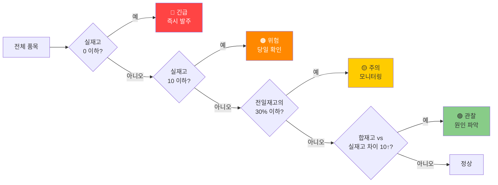

# 2. 2회차_2부

정리일: 2026-10-08 · 교육 에셋 N0832

본문 수집·공개 편집. 도구 실행·최신 기능 재검증은 미실시. 고객·참여자 정보와 개별 접근 링크, 원본 첨부는 제외했습니다.

---

> **이전 문서:** 2회차 교재 (1부) — 오프닝 · 실습 1<br>**이 문서:** 실습 2 (재고파악 분석)<br>**이어지는 문서:** 2회차 교재 (3부) — 실습 3 · 실습 4 · 마무리
---
# 실습 2 — 재고파악 날짜별 현황 분석 + 재고 부족 탐지
---
## 오늘 해결하는 문제
```plain text
[재고파악 확인 — 매일]

196개 품목 × 날짜별 시트를 눈으로 하나씩 확인
        ↓
특정 품목 재고 흐름 파악 (98열 가로 스크롤)
        ↓
합재고 vs 실재고 불일치 수동 조사
        ↓
재고 부족 품목 파악 → 발주 여부 판단

→ 소요 시간: 매일 20~30분
→ 놓치는 품목 발생 위험 상존
```
**오늘 달라지는 것:**


<colgroup>
<col width="206">
<col width="278.80625915527344">
<col width="398.2062530517578">
</colgroup>


업무

현재

오늘 이후


매장출고·입고 현황 파악

196품목 수동 스크롤

날짜 지정 → 즉시 표 생성


합재고 vs 실재고 불일치

수동 조사 (누락 위험)

AI 자동 탐지


재고 부족 품목 파악

육안 확인

4단계 자동 분류


담당자 알림 문구

수기 작성

AI 자동 생성


---
## 실습 전 개념 — 재고 공식 이해
AI에게 재고 분석을 시키기 전에 이 공식을 이해해야 합니다. AI는 이 공식을 자동으로 알지 못합니다. 판단 기준을 프롬프트에 명시해줘야 합니다.
```plain text
합재고 = 전일재고 + 입고 - 매장출고 - 생산투입 + 매장추가

실재고 = 실제로 세어본 수량

합재고 ≠ 실재고 → 분실 또는 오입력 가능성
```
**이 공식이 왜 중요한가:**
합재고는 장부상 수량입니다. 실재고는 실물 수량입니다. 두 값이 다르면 반드시 원인이 있습니다. 입고 검수 누락, 출고 기록 오류, 실제 분실 — 이 중 하나입니다. AI는 두 값의 차이를 탐지하고, 원인 파악은 담당자가 합니다.
---
## 실습 전 개념 — AI가 분석한 결과의 숫자를 어떻게 읽어야 하는가
실습을 시작하기 전에 반드시 알아야 할 것이 있습니다. **AI가 출력하는 숫자가 실제 업무 단위와 다를 수 있습니다.**
재고파악 파일의 수량 단위는 파일마다 다릅니다.
```plain text
예시:
  삼겹살-BOX: BOX 단위 (1BOX = 약 10~15kg)
  마늘: kg 단위
  용기류: 개 단위
  포장봉투: 장 단위
```
따라서 AI가 "마늘.소-중국산 입고 수량: 2,636"이라고 하면 2,636kg을 의미합니다. 숫자만 보고 "2,636개"라고 오해하면 안 됩니다.
> **실습 팁:** 결과가 나왔을 때 숫자가 이상하다 싶으면 바로 아래 질문을 던지세요.
```plain text
"이 수량의 단위가 뭐야? 어느 열에서 가져온 값이야?"
```
---
## 파일 구조


<colgroup>
<col>
<col>
<col width="297">
</colgroup>


시트

내용

크기


수주전

이지포스 출고 데이터 + 매장출고 열

94행 × 11열


원자재입고

최종 끌어오기 열 + 날짜별 연결

1,066행 × 20열


월총합

품목별 월간 집계

1,308행 × 98열


1\~31 (날짜별)

품목·전일재고·매장출고·입고·합재고·실재고

각 196행 × 9열


---
## 실습 2-A. 날짜별 현황 집계 (15분)
### 왜 이 실습을 하는가
매일 오전 "어제 뭐가 얼마나 나갔고 들어왔는가"를 파악하는 것이 구매부 첫 번째 업무입니다. 지금은 196개 품목 열을 가로 스크롤하면서 눈으로 확인합니다. AI를 쓰면 날짜를 지정하는 것만으로 출고·입고 현황이 정렬된 표로 즉시 나옵니다.
---
**STEP 1.** claude.ai **새 채팅** 열기
**STEP 2.** 📎 `[2회차_실습3] 재고파악_가상데이터.xlsx` 업로드 → 아래 프롬프트 전송
```plain text
[D] 첨부한 파일은 교육기관 구매부 재고파악 파일이야.
    '27' 시트는 5월 27일의 품목별
    전일재고·매장출고·매장추가·생산투입·입고·합재고·실재고 데이터야.

[S] 5월 27일의 매장출고·입고 현황을 파악하고 싶어.

[R] 아래 두 표를 만들어줘:

    [표 1] 매장출고가 있는 품목
    | 품목명 | 전일재고 | 매장출고 | 합재고 | 실재고 |
    매장출고 기준 내림차순.

    [표 2] 입고가 있는 품목
    | 품목명 | 전일재고 | 입고 수량 | 합재고 |

    각 표 아래에 품목 수·합계 표시.

[F] 매장출고·입고 모두 0이거나 빈 칸인 품목 제외.
    품목명 앞 코드 제거.
```
---
### 결과 나오면 — 숫자 단위 확인
결과 표에서 수량이 예상보다 크거나 작으면 단위를 확인합니다.
```plain text
"이 결과에서 ~~~ 매장출고가 27,878이야.
 이 수량의 단위가 뭐야? kg인지 개인지 확인해줘."
```
> **왜 확인하는가:** 재고파악 파일은 품목마다 단위가 다릅니다. AI는 단위를 자동으로 변환하지 않고 파일에 있는 숫자를 그대로 읽습니다. 담당자가 단위를 알고 있어야 결과를 올바르게 해석할 수 있습니다.
---
---
## 실습 2-A 결과 후 — 데이터 분석 3단계
AI가 출고·입고 현황을 정리했습니다. 여기서 AI의 역할과 사람의 역할을 구분합니다.


단계

질문

담당

예시


**1. 현황 파악 (What)**

지금 어떤 상태인가?

AI

"된장육수 합재고 1개"


**2. 원인 분석 (Why)**

왜 그런 상태인가?

사람

"매장 행사로 소비 급증?"


**3. 의사결정 (So What)**

어떻게 할 것인가?

사람

"오늘 긴급 발주"


AI는 1단계를 빠르게 처리합니다. 2·3단계는 현장을 아는 담당자만 할 수 있습니다.
---
## 실습 2-B. 합재고 vs 실재고 불일치 탐지 (15분)
### 왜 이 실습을 하는가
합재고와 실재고가 다르다는 것은 장부와 실물이 다르다는 뜻입니다. 이 차이가 누적되면 발주 계획이 틀어지고, 매장에 물건이 없는 상황이 발생합니다. 지금은 담당자가 눈으로 확인하거나 월말에야 발견합니다. AI를 쓰면 매일 즉시 탐지할 수 있습니다.
---
같은 채팅에서 이어서 요청합니다.
```plain text
[D] 재고파악 27일 시트야.

[S] 합재고와 실재고가 다른 품목을 찾고 싶어.

[R] 불일치 품목을 아래 표로 만들어줘:
    | 품목명 | 합재고 | 실재고 | 차이 | 비고 |
    차이 = 합재고 - 실재고
    플러스면 "실재고 부족", 마이너스면 "실재고 초과"로 표시.
    차이 절대값 기준 내림차순 정렬.

[F] 합재고·실재고 모두 0인 품목 제외.
    품목명 코드 제거.
```
---
### 결과 나오면 — 불일치 원인 분류
불일치 품목이 나왔을 때 원인은 세 가지입니다. AI가 탐지하고, 원인 판단은 사람이 합니다.


<colgroup>
<col>
<col>
<col width="322.109375">
</colgroup>


원인

특징

조치


입고 검수 오류

대량 입고 품목에서 큰 차이 발생

입고 기록 vs 실물 재확인


출고 기록 누락

출고는 됐는데 기록 안 됨

출고 일지 재확인


실제 분실·파손

반복적으로 같은 품목에서 발생

보관 방식·담당자 확인


---
## 실습 2-B 결과 후 — 컨설팅 사고의 시작 정리
결과를 보다가 이런 생각이 드셨을 겁니다.
> *"품목이 너무 많고 코드 체계도 복잡하다. 정리된 마스터 표가 있으면 관리가 훨씬 쉬울 텐데."*
이 생각이 떠오른 순간이 중요합니다. 주어진 프롬프트를 따라 하는 것이 아니라, **업무의 불편함을 발견하고 AI에게 해결을 요청**하는 것 — 이것이 AI 컨설팅 사고의 시작입니다.
같은 데이터를 보고 어떤 생각을 하느냐에 따라 요청이 이렇게 달라집니다.
---
**생각 1. "일단 품목 목록이라도 깔끔하게 정리해두자"**
가장 단순한 시작입니다. 지금 재고파악 파일 순서 그대로 품목 목록만 뽑습니다.
```plain text
재고파악 원자재입고 시트에 있는 품목 목록을
순서 그대로 표로 정리해줘.

| 순번 | 품목명 |

엑셀 파일로 만들어줘.
파일명: 품목_목록.xlsx
```
**→ 이게 왜 필요한가:** 두 파일 품목명 불일치 확인 기준, 신규 품목 등록 기준, 담당자 인수인계 기준 목록이 됩니다.
---
**생각 2. "카테고리로 묶어서 보면 관리가 쉬울 텐데"**
목록을 보다 보면 곡물·채소·포장재·조미료가 뒤섞여 있다는 게 보입니다.
```plain text
재고파악 품목 목록을 카테고리별로 분류해서 표로 만들어줘.

| 카테고리 | 품목명 | 단위 |

카테고리 예시:
곡물·면류 / 육류 / 채소·과일 / 양념·조미료 /
포장용기 / 식기·집기 / 소모품 / 김치류 / 기타

분류가 애매한 건 '확인필요'로 표시.
엑셀 파일로 만들어줘.
```
**→ 이게 왜 필요한가:** "오늘 채소류 중 위험 품목"만 따로 뽑는 카테고리별 분석이 가능해집니다.
---
**생각 3. "코드도 같이 관리해야 나중에 자동화가 된다"**
실습 1-C에서 만든 품목 매핑표를 떠올립니다. c37·c38 같은 코드가 두 파일 연결의 핵심이었습니다.
```plain text
재고파악 품목 목록에서
품목코드·품목명·카테고리·단위를 모두 포함한
마스터 관리표를 만들어줘.

| 품목코드 | 품목명 | 카테고리 | 단위 | 비고 |

코드가 없는 품목은 비고에 '코드없음'으로 표시.
엑셀 파일로 만들어줘.
파일명: 품목_마스터_관리표.xlsx
```
**→ 이게 왜 필요한가:** 이 마스터 표가 있으면 5회차 GAS 자동화에서 두 파일을 자동으로 연결하는 설계 기반이 됩니다. 지금 만들어두지 않으면 나중에 처음부터 다시 해야 합니다.
---
**생각 4. "분석을 매번 하기 번거롭다. 자동으로 위험 품목이 뜨면 어떨까" —\> 이후 실습으로 연결**
오늘 실습 2-C에서 할 4단계 분류를 매일 자동으로 받을 수 있으면 어떨까라는 생각으로 이어집니다.
```plain text
재고파악 파일을 기반으로
매일 아침 담당자에게 보낼 재고 현황 요약 양식을 만들어줘.

포함할 내용:
1. 긴급·위험 품목 목록
2. 전일 대비 재고 급감 TOP 5
3. 담당자 조치 필요 사항 3줄 요약

이 양식을 매일 재사용할 수 있는 프롬프트 템플릿으로도 정리해줘.
```
**→ 이게 왜 필요한가:** 이 양식이 완성되면 4·5회차 Make.com 자동화와 연결됩니다. 매일 아침 자동으로 재고 현황이 카카오톡으로 오는 구조의 시작점입니다.
---
### 핵심 메시지
```plain text
단순 사용자:    주어진 프롬프트로 결과를 뽑는다
AI 활용자:      결과를 보고 다음 질문을 스스로 만든다
AI 컨설턴트:    데이터 구조의 문제를 발견하고
                그 해결책을 AI와 함께 설계한다
```
오늘 재고파악 파일을 보면서 품목 관리가 불편하다는 것을 느낀 순간, 여러분은 이미 컨설팅 사고를 시작한 겁니다. 이 능력이 10회차에서 다루는 업무 분석 컨설팅의 씨앗입니다.
---
## 실습 2-C. 재고 부족 4단계 분류 + 알림 문구 생성 (20분)
### 왜 이 실습을 하는가
재고 부족을 발견했으면 담당자에게 알려야 합니다. 지금은 담당자가 파일을 열어서 확인하고, 수기로 알림 문구를 작성합니다. AI를 쓰면 재고 부족 분류와 알림 문구 생성이 한 번의 요청으로 끝납니다.
그리고 이것이 곧 **생각 4에서 말한 "매일 아침 자동으로 담당자에게 재고 현황이 전송되는 구조"의 첫 번째 단계**입니다. 지금은 사람이 결과를 보고 수동으로 보내지만, 4\~5회차에서 이게 자동화됩니다.
---
**재고 부족 4단계 분류 기준:**

---
**프롬프트:**
```plain text
[D] 재고파악 27일 시트야.

[S] 재고 부족이 우려되는 품목을 단계별로 분류하고 싶어.

[R] 아래 기준으로 분류해서 표로 만들어줘:
    [긴급] 실재고 0 이하
    [위험] 실재고 10 이하
    [주의] 실재고가 전일재고의 30% 이하로 감소
    [관찰] 합재고와 실재고 차이가 10 이상

    | 등급 | 품목명 | 전일재고 | 실재고 | 권장 조치 |
    긴급 → 위험 → 주의 → 관찰 순서로 정렬.

    표 아래에 오늘 담당자가 반드시 확인해야 할 항목을
    3줄 이내로 요약해줘.

[F] 매장출고·실재고 모두 0인 품목 제외.
    품목명 코드 제거.
    한 품목이 여러 등급 해당하면 가장 높은 등급만 표시.
```
---
### 결과 나오면 — 알림 문구 생성
재고 부족 분류가 나오면 같은 채팅에서 이어서 알림 문구를 요청합니다.
```plain text
위 재고 부족 분류에서 [긴급]과 [위험] 등급 품목에 대해
담당자에게 보낼 카카오톡 알림 메시지를 작성해줘.

[형식]
[재고 긴급 알림] 날짜

즉시 확인 필요:
- 품목명: 실재고 n개

위험 품목 (오늘 발주 필요, 실재고 5개 이하):
- 품목명: 실재고 n개
...

빠른 확인 부탁드립니다.

핵심 품목만, 불필요한 설명 제외.
위험 품목이 많으면 실재고 5개 이하인 것만 포함하고
나머지는 "외 n개 품목 추가 확인 필요"로 표시.
```
> **150자 제한을 두지 않는 이유:** 위험 품목이 15개 이상인 경우 150자로 압축하면 내용이 손상됩니다. 핵심만 담되 필요한 내용은 다 담겠습니다.
---
## 실습 2-D. 데이터에서 업무 인사이트 뽑기 (10분)
### 분석이 끝난 후 진짜 질문이 시작된다
오늘 실습 2-A\~2-C에서 한 것은 **현황 파악**입니다. 여기서 멈추면 AI는 편리한 도구입니다. 한 단계 더 나아가면 AI가 의사결정 도구가 됩니다.
```plain text
현황 파악 (What):    "긴급 1개, 위험 24개야"
인사이트 (Why):      "왜 된장육수가 매번 위험 등급에 드는 걸까?"
의사결정 (So What):  "된장육수 발주 주기를 3일에서 1일로 바꿔야 한다"
```
AI는 현황 파악까지 도와줍니다. Why와 So What은 데이터를 이해하는 사람이 질문을 던져야 합니다.
---
### 좋은 인사이트 질문을 만드는 방법
좋은 분석 질문은 이 순서로 만들어집니다.
```plain text
1단계. 데이터를 보며 궁금한 것을 적는다
       "이번 달 가장 많이 출고된 품목 TOP 10이 뭘까?"

2단계. 이 정보를 알면 뭘 할 수 있는가를 묻는다
       → 발주량 조정 기준이 된다
       → 재고 적정 수량 설정 근거가 된다
       → 공급업체 협상 자료가 된다

3단계. 어떤 형태로 뽑아야 가장 유용한가를 결정한다
       → 품목명 + 총출고량 + 평균 재고 수준
```
**2단계가 없으면 데이터를 뽑아도 어디에 쓸지 모릅니다.** <br>2단계를 먼저 생각하는 것이 컨설팅 사고입니다.
---
### 같은 데이터, 다른 질문, 다른 활용


질문

뽑는 데이터

업무 활용


이번 달 출고량 TOP 10은?

품목별 총출고량 순위

발주 우선순위 설정, 적정재고 기준 수립


매주 위험 등급에 반복 등장하는 품목은?

주별 위험 품목 누적

발주 주기 단축 필요 품목 파악


입고 대비 출고가 가장 빠른 품목은?

품목별 재고 회전율

보관 공간 효율화, 긴급 발주 기준


합재고 vs 실재고 차이가 반복되는 품목은?

불일치 누적 목록

입고 검수 강화 대상 품목 선정


월말에 재고가 급감하는 패턴이 있는가?

날짜별 재고 변화 추이

월말 집중 발주 계획 수립


---
### 나중에 직접 해보기 \*과제
오늘 본 재고파악 데이터에서 **본인 업무에서 알면 유용할 질문 1개**를 만들어봅니다.
```plain text
1.[내가 알고 싶은 것]

2. 뽑는 데이터

3. [이걸 알면 어디에 쓸 수 있는가]:


[프롬프트]
[D] 재고파악 27일 시트야.
[S] (위에서 정한 질문)
[R] (어떤 형식으로)
[F] (제외할 것)
```
결과를 단톡방에 공유해주세요. 서로의 질문을 보면서 "이런 것도 됩니다"를 확인합니다.
---
### 핵심 메시지
```plain text
단순 사용자:    주어진 프롬프트로 결과를 뽑는다
AI 활용자:      결과를 보고 다음 질문을 스스로 만든다
AI 컨설턴트:    데이터에서 업무 개선 포인트를 발견하고
                그것을 조직의 의사결정에 연결한다
```
오늘 실습에서 "된장육수 재고가 1개밖에 안 남았네"라고 느낀 순간, "그럼 발주 주기를 어떻게 바꿔야 하지?"라는 질문으로 이어졌다면 여러분은 이미 컨설팅 사고를 시작한 겁니다. 이 능력이 10회차에서 다루는 업무 분석 컨설팅의 핵심입니다.
---
## 실습 2 완료 체크
- [ ] 재고파악 파일 업로드 → 27일 매장출고·입고 현황 집계 완료
- [ ] 수량 단위 확인 완료
- [ ] 분석 품목 수 검증 완료
- [ ] 합재고 vs 실재고 불일치 탐지 완료
- [ ] 불일치 원인 1\~2개 담당자 확인
- [ ] 재고 부족 4단계 분류 완료
- [ ] 담당자 알림 문구 자동 생성 완료
- [ ] 인사이트 질문 1개 직접 작성 + 결과 공유 완료
---
> **이어지는 문서:** 2회차 교재 (3부) — 실습 3 · 실습 4 · 마무리
---
*교육기관 2회차 교재 (2부) \| 실습 2강사 심지 프로님 (심지)*
