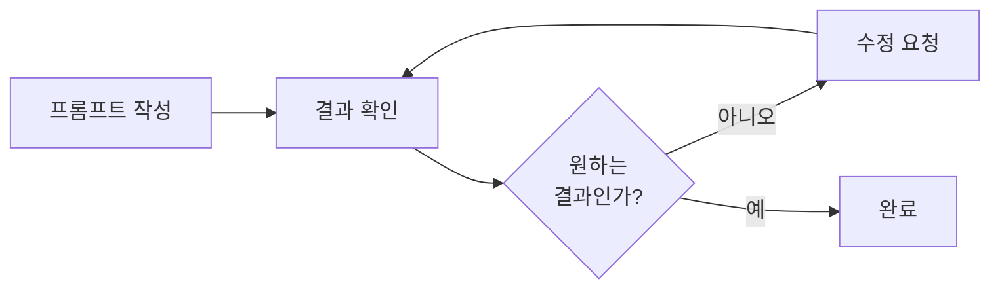

# 1. 2회차_1부

정리일: 2026-10-08 · 교육 에셋 N0833

본문 수집·공개 편집. 도구 실행·최신 기능 재검증은 미실시. 고객·참여자 정보와 개별 접근 링크, 원본 첨부는 제외했습니다.

---

# 교육기관 × 심지 — AI 실무 교육 2회차 교재 (1부)
> **수강생:** 프로님 · 프로님 · 프로님 · 프로님 · 본부장님 · 사무국 부장님<br>**강사:** 심지 프로님<br>**도구:** Claude Pro<br>**이 문서:** 오프닝 · 실습 1 (원자재입고 분석 + 품목 매핑)
---
> **이전 문서:** 1회차 교재 1\~3부<br>**이어지는 문서:** 2회차 교재 (2부) — 실습 2 · 실습 3
---
## 오늘 전체 타임테이블


시각

내용

부서

시간


시작 \~ +25분

오프닝 — 라이브러리 점검 · Q&A

전체

25분


+25 \~ +90분

**실습 1** — 원자재입고 오입력 탐지 + 집계 + 품목 매핑

구매부

65분


+90 \~ +150분

**실습 2** — 재고파악 날짜별 분석 + 재고 부족 탐지

구매부

60분


+150 \~ +165분

휴식

—

15분


+165 \~ +225분

**실습 3** — 수식 AI로 만들기 (엑셀 집계 자동화)

전체

60분


+225 \~ +285분

**실습 4** — DSRF 직접 작성 (각자 직무 데이터)

전체

60분


+285 \~ +300분

마무리 · 과제 · 수업 방향 논의

—

15분


> **오늘 도구:** Claude Pro. 단순 데이터 파일은 파일 생성·다운로드 가능. 수식·서식이 복잡한 원본 파일은 원본 서식 보존을 위해 사람이 직접 입력.
---
## 오늘 사용하는 실습 파일


<colgroup>
<col width="315">
<col>
<col width="205">
</colgroup>


파일

실습

구분


`[2회차_실습1] 원자재입고양식_가상데이터.xlsx`

실습 1

Claude에 업로드


`[2회차_실습3] 재고파악_가상데이터.xlsx`

실습 1·2

Claude에 업로드


`[2회차_실습1] 원자재입고_가이드.xlsx`

실습 1

참고용


`[2회차_실습2] 재고파악_가이드.xlsx`

실습 2

참고용


`[1회차_실습4] 업무보고_연습용.xlsx`

실습 3

Claude에 업로드


`[2회차_실습4] DSRF_연습템플릿.xlsx`

실습 4

참고용


> **실습 파일:** Claude에 직접 업로드해서 분석하는 파일<br>**가이드 파일:** 수강생이 화면으로 참고하는 파일 (Claude 업로드 불필요)
---
---
# 오프닝 — 라이브러리 점검 + Q&A (25분)
## 라이브러리 점검 (15분)
강사 공유 구글 문서 → 각 섹션 확인


섹션

핵심 확인 내용

완료


① 발주서 OCR

Gemini 프롬프트 + 한 장씩 올리기 메모 있는지

☐


② 메신저 업무보고

`흰색반팔팁(XL), u44XL → u44(2L)반팔티(흰색)` 규칙 있는지

☐


③ 영수증 차량정비비

Gemini 분류 프롬프트 + 차량번호-담당자 매핑표 있는지

☐


> ② 섹션에 XL 규칙 없으면 지금 바로 추가하세요. 없으면 다음 회차에서도 같은 실수가 반복됩니다.
---
## Q&A (10분)
지난 회차 이후 실제로 써보다가 생긴 질문을 공유합니다.
**Q1. 새 채팅을 열면 규칙이 사라져요.**<br>AI는 새 채팅에서 이전 대화를 기억하지 않습니다. 라이브러리 ②에서 시스템 프롬프트를 복사해서 첫 메시지로 보내는 것이 라이브러리를 쓰는 이유입니다. 오늘 실습에서도 같은 채팅을 이어서 쓰는 방법을 직접 연습합니다.
**Q2. 엑셀 수식 오류가 났어요.**<br>HSTACK·QUERY·FILTER는 구버전 엑셀에서 지원이 제한됩니다. Claude에 수식 요청 시 항상 아래를 추가하세요.
```plain text
엑셀용 수식이야. COUNTIF·SUMIF·SUMIFS 기본 함수만 써줘.
HSTACK·QUERY·FILTER는 쓰지 마.
```
**Q3. Claude Pro를 쓰면 뭐가 달라지나요?**<br>가장 큰 차이는 파일 생성·다운로드입니다. 1회차에서는 결과를 복사해서 붙여넣어야 했지만, 오늘부터는 분석 결과를 엑셀 파일로 직접 받을 수 있습니다. 단 수식·서식이 복잡한 원본 파일(차량정비비 등)은 AI가 저장 시 수식이 손상되므로 사람이 직접 입력하는 것이 맞습니다.
**Q4. 1회차 때 배운 것을 실제로 써봤나요?**<br>경험을 공유합니다. 잘 된 것, 막혔던 것 모두 이야기해 주세요. 오늘 실습에 반영합니다.
---
---
# 실습 1 — 원자재입고 분석 + 품목명 매핑
> **시간:** 65분<br>**부서:** 구매부 중심 (전원 참여)<br>**도구:** Claude Pro \| claude.ai<br>**파일:** `[2회차_실습1] 원자재입고양식_가상데이터.xlsx`
---
## 오늘 해결하는 문제
프로님이 매일 반복하는 업무를 직접 분석해서 확인한 내용입니다.
```plain text
[원자재입고 입력 — 매일 반복]

원자재입고양식에 수량 기입 (180개 품목)
        ↓
수량 열 복사
        ↓
재고파악 원자재입고 시트 붙여넣기
        ↓
최종 끌어오기 열 복사
        ↓
해당 일자 시트로 이동 (1~31 중 해당 날짜)
        ↓
입고 열 붙여넣기

→ 소요 시간: 매일 30~60분 (6단계 반복)
```
6단계 중 1\~4단계(데이터 입력·복사)는 담당자만 할 수 있는 업무입니다. <br>AI가 도울 수 있는 지점은 **입력된 데이터의 오류를 탐지하고, 집계하고, 두 파일 간 불일치를 찾아내는 것**입니다.
**오늘 실습 목표:**


실습

목표

소요 시간


1-A

오입력 자동 탐지

20분


1-B

날짜별 입고 현황 집계

20분


1-C

두 파일 품목명 매핑 문제 발견

25분


---
## 실습 전 개념 — G.I.G.O: 데이터 품질이 분석 품질을 결정한다
> **G.I.G.O: Garbage In, Garbage Out**<br>잘못된 데이터를 넣으면 잘못된 결과가 나온다.
원자재입고양식을 실제로 분석해보면 수량 칸에 숫자 대신 'o' 문자가 입력된 경우가 실제로 8건 존재합니다. 입고가 있었다는 표시로 'ㅇ'이나 'o'를 넣은 것으로 보이는데, 이것이 합계 계산 오류의 원인입니다.
```plain text
수량 칸에 숫자가 있는 경우:  합계 수식이 정상 계산
수량 칸에 'o' 문자가 있는 경우: 수식이 TEXT 값을 무시 → 합계에서 빠짐
                                 → 실제보다 입고량이 적게 집계됨
```
이 오류를 눈으로 찾으려면 180개 품목 × 31일 열을 전부 확인해야 합니다. AI는 이것을 즉시 탐지합니다.
**실무 원칙:**
```plain text
AI 분석 전:  오입력·오류값 먼저 탐지
AI 분석 중:  오류값 제외 조건을 [F]에 명시
AI 분석 후:  샘플 검증으로 결과 확인
```
---
## 실습 전 개념 — DSRF 프레임워크
오늘 모든 프롬프트는 이 4가지 구조로 작성합니다.


요소

의미

왜 필요한가


**D** — Data

어떤 파일인지, 어떤 시트인지

AI는 파일을 처음 봅니다. 배경을 알려줘야 의도대로 분석합니다


**S** — Scope

무엇을 분석할지

범위가 모호하면 AI가 임의로 결정합니다


**R** — Result

어떤 형식으로 출력할지

표인지 글인지 명시하지 않으면 형식이 매번 달라집니다


**F** — Filter

제외할 것, 주의사항

합계 행·오류값 처리 조건을 명시하지 않으면 결과가 왜곡됩니다


**나쁜 프롬프트 vs 좋은 프롬프트:**


나쁜 프롬프트

문제점

좋은 프롬프트


"분석해줘"

무엇을 분석할지 AI가 임의로 결정

\[D\]\[S\]\[R\]\[F\] 모두 명시


"오류 찾아줘"

어떤 오류인지 기준이 없음

"숫자가 아닌 값(o·x·- 등)을 오입력으로 분류해줘"


"정리해줘"

어떤 형식인지 불명확

"표로 정리하고 금액 기준 내림차순 정렬"


---
## Before / After


현재 (Before)

AI 적용 후 (After)


**오입력 탐지**

180품목 × 31일 육안 확인

AI 즉시 탐지


**날짜별 집계**

스크롤하며 수동 집계

날짜 지정 → 즉시 표 생성


**두 파일 불일치**

발견 자체가 어려움

AI가 매핑표로 정리


---
## 실습 1-A. 파일 업로드 + 오입력 탐지 (20분)
### 왜 이 실습을 하는가
180개 품목 × 31일 = 5,580개 셀 중에서 오입력을 눈으로 찾는 것은 현실적으로 불가능합니다. <br>실제로 매달 이 오입력이 발견되지 않으면 합계 금액이 잘못 집계되고, 그 오류가 재고파악 파일로 이어집니다. AI는 이 5,580개 셀을 수초 내에 전수 검사합니다.
---
**STEP 1.** claude.ai 새 채팅 열기
**STEP 2.** 파일 첨부 먼저 → 그 다음 프롬프트 입력
> 반드시 파일을 첨부한 후 프롬프트를 입력하세요. 순서가 바뀌면 AI가 파일 없이 답변합니다.
📎 `[2회차_실습1] 원자재입고양식_가상데이터.xlsx` 업로드 → 아래 프롬프트 전송
```plain text
[D] 첨부한 파일은 교육기관 구매부 5월 원자재 입고 관리 파일이야.

[S] 파일의 전체 구조를 파악하고,
    수량 칸에 오입력 값을 찾고 싶어.

[R] 아래 두 가지를 정리해줘:

    [표 1] 전체 현황
    - 전체 품목 수 (합계·소계 행 제외)
    - 수량 데이터가 있는 날짜 수
    - 수량 칸에 숫자가 아닌 값 여부

    [표 2] 오입력 목록
    | 품목명 | 날짜 | 입력값 | 오입력 유형 | 권장 조치 |

[F] 합계·소계 행은 품목 수에서 제외해줘.
    오입력 유형: 문자 입력(o·x·- 등) / 음수 / 비정상적으로 큰 값.
    품목명 앞 숫자 코드는 제거해줘.
```
---
### 결과 나오면 — 데이터 검증 1단계
결과가 나왔다고 끝이 아닙니다. 반드시 확인합니다.
```plain text
분석에 사용된 전체 품목 수가 몇 개야?
```
> **왜 이걸 확인하는가:** AI가 합계 행을 품목으로 포함했거나, 반대로 일부 품목을 누락했을 수 있습니다. 우리가 파악한 실제 품목 수(약 176\~180개)와 맞는지 확인하는 것이 AI 결과를 안전하게 쓰는 첫 번째 습관입니다.
---
### 결과 나오면 — Human-in-the-Loop
AI가 오입력을 탐지했습니다. 여기서 역할을 명확히 구분해야 합니다.
```plain text
AI 역할:   오입력 탐지 → 목록 제시
사람 역할:  실제로 어떤 값이었는지 확인 → 수정 여부 결정
```
"AI가 발견했으니 AI가 수정해라"는 잘못된 접근입니다. <br>실제 입고 수량은 담당자만 알고 있습니다. <br>31일에 'o'가 입력된 8개 품목이 실제로 입고가 있었는지, 아니면 단순 오입력인지는 담당자만 알 수 있습니다.
---
## 실습 1-B. 날짜별 입고 현황 집계 (20분)
### 왜 이 실습을 하는가
매월 말 "이번 달 어떤 품목이 얼마나 들어왔는가"를 파악하는 것은 구매부의 핵심 업무입니다. 지금은 담당자가 해당 날짜 열을 찾아서 수동으로 집계합니다. AI를 쓰면 날짜를 지정하는 것만으로 정렬된 표가 즉시 나옵니다.
**향후 활용:** 오늘 만드는 프롬프트에서 날짜만 바꾸면 "5월 1일\~10일 입고 총량", "이번 달 가장 비싼 품목 TOP 10" 등을 즉시 뽑을 수 있습니다. 3회차에서 이 결과를 월말 보고서 형태로 자동 생성하는 것과 연결됩니다.
---
실습 1-A와 **같은 채팅**에서 이어서 요청합니다. 파일을 다시 올릴 필요가 없습니다.
```plain text
[D] 같은 원자재입고 파일이야.

[S] 오입력(o 등 문자값) 제외한 실제 숫자 수량 기준으로
    27일 입고 현황을 집계하고 싶어.

[R] 아래 표로 만들어줘:
    | 품목명 | 규격 | 수량 | 금액(원) |
    금액 기준 내림차순 정렬.
    상위 20개 품목만.
    맨 아래에 총 입고 품목 수·총 금액 합계.

[F] 문자 입력값(o 등) 제외.
    수량 0이거나 빈 칸 제외.
    합계·소계 행 제외.
    품목명 앞 숫자 코드 제거.
```
---
### 결과 나오면 — 샘플 검증
결과 표에서 임의의 품목 1\~2개를 직접 원본 파일에서 찾아서 수량·금액이 일치하는지 확인합니다.
```plain text
[품목명]의 27일 수량이 [숫자]로 나왔는데
원본 파일에서 이 값이 어느 열에서 가져온 건지 설명해줘.
```
> **왜 샘플 검증이 필요한가:** AI가 날짜 열을 잘못 참조했거나 금액 계산 방식이 다를 수 있습니다. 전체를 다 확인할 필요 없이 2\~3개만 맞으면 나머지도 맞을 가능성이 높습니다.
---
### 결과 나오면 — 수정 요청 방법
첫 결과가 완벽하지 않아도 됩니다. 구체적으로 어떤 부분이 문제인지 말하면 AI가 수정합니다.

**좋은 수정 요청의 3가지 원칙:**


<colgroup>
<col>
<col>
<col width="464">
</colgroup>


원칙

나쁜 예

좋은 예


구체적으로

"다시 해줘"

"합계 행이 포함됐어. 제외하고 다시 해줘"


근거를 제시

"틀렸어"

"도토리수제비가 1,534,500원인데 원본 확인하니 단가 85,250원에 수량 18이면 1,534,500원이 맞아. 다른 항목도 이렇게 계산된 거야?"


한 번에 하나씩

"전부 다시"

가장 중요한 오류 하나씩 수정


---
## 실습 1-C. 두 파일 품목명 매핑 문제 발견 (25분)
### 왜 이 실습을 하는가
원자재입고양식과 재고파악 파일은 매일 함께 써야 하는 파일입니다. <br>그런데 오늘 처음으로 두 파일을 나란히 놓고 보면 문제가 하나 발견됩니다. 같은 품목인데 이름이 다릅니다.
`원자재입고양식: 기장쌀 / 보리냉면 / 도토리수제비<br>재고파악:       c28 기장쌀 2kg(중국산) / c37 냉면 / c44 수제비`
지금까지는 담당자가 두 파일을 눈으로 대조하며 수동으로 연결했습니다. <br>이 불일치가 해결되지 않으면 두 파일을 자동으로 연결하는 것이 불가능합니다.
**이 매핑표가 왜 중요한가:**
지금 당장 업무를 줄여주는 실습은 아닙니다. <br>하지만 이 매핑표를 한 번 만들어두면 두 가지가 달라집니다.
첫째, 확인 필요 항목을 담당자가 검토해서 정리하면 두 파일 간 기준이 통일됩니다. <br>둘째, 이 매핑표가 5회차 GAS 자동화의 핵심 설계 자료가 됩니다. **오늘 만드는 매핑표가 미래 완전 자동화의 설계도**입니다.
---
**새 채팅**을 열고 두 파일을 동시에 업로드합니다.
📎 `[2회차_실습1] 원자재입고양식_가상데이터.xlsx` + `[2회차_실습1] 재고파악_가상데이터.xlsx` **동시 업로드**
> 이번에는 새 채팅을 씁니다. 두 파일을 처음부터 함께 올려야 AI가 두 파일의 관계를 정확히 파악합니다.

\[D\] 첨부한 파일은 교육기관 구매부 5월 원자재 입고 관리 파일이야.<br>\[S\] 파일의 전체 구조를 파악하고,<br>수량 칸에 오입력 값을 찾고 싶어.<br>\[R\] 아래 두 가지를 정리해줘:<br>\[표 1\] 전체 현황<br>- 전체 품목 수 (합계·소계 행 제외)<br>- 수량 데이터가 있는 날짜 수<br>- 수량 칸에 숫자가 아닌 값 여부<br>\[표 2\] 오입력 목록<br>\| 품목명 \| 날짜 \| 입력값 \| 오입력 유형 \| 권장 조치 \|<br>\[F\] 합계·소계 행은 품목 수에서 제외해줘.<br>오입력 유형: 문자 입력(o·x·- 등) / 음수 / 비정상적으로 큰 값.<br>품목명 앞 숫자 코드는 제거해줘.

**예상 결과:**
- 매핑 성공: 109개
- 확인필요: 7건
- 원자재입고 전용 (재고파악 미등록): 59개
---
### 결과 나오면 — 확인 포인트
**1. 확인필요 항목 검토**<br>AI가 '확인필요'로 표시한 항목들을 담당자가 직접 검토합니다.
**2. 한쪽에만 있는 품목**<br>원자재입고에만 있고 재고파악에 없는 품목은 재고파악에 등록이 필요하거나, 원자재입고 파일에서 정리가 필요한 품목입니다.
**3. 매핑표 엑셀 파일로 저장**
`오늘 만든 매핑표 전체를 엑셀 파일로 만들어줘.<br>파일명: 품목명_매핑표_5월.xlsx`
이 파일을 라이브러리에 저장합니다. 5회차 자동화 실습에서 직접 활용합니다.
---
## 실습 1 완료 후 — 오늘 실습의 의미
실습 1을 마쳤습니다. 오늘 한 것들이 어디로 연결되는지 정리합니다.
`실습 1-A 오입력 탐지<br>        ↓<br>실습 1-B 정확한 집계 (오입력 제외)<br>        ↓<br>실습 2 재고파악 분석 (오늘)<br>        ↓<br>실습 3 보고서 초안 (오늘)<br>        ↓<br>3회차 보고서 자동화<br><br>실습 1-C 매핑표 작성<br>        ↓<br>5회차 GAS 자동화 (설계 자료)`
**지금 바로 쓸 수 있는 것:**
- 매월 초 원자재입고양식 전수 오입력 검사
- 특정 날짜 입고 현황 즉시 집계
**나중에 연결되는 것:**
- 매핑표 → 5회차 GAS로 두 파일 자동 연결
---
## 실습 1 완료 체크
- [x] 파일 업로드 → 전체 구조 파악 완료
- [x] 오입력 8건 탐지 완료
- [x] 검증: "분析에 사용된 전체 품목 수가 몇 개야?" 확인 (176개)
- [x] 27일 입고 현황 집계 완료 (18개 품목 / 3,928,010원)
- [x] 샘플 검증 (임의 품목 1\~2개 원본 대조) 완료
- [x] 품목명 매핑표 작성 완료 (109개 성공 / 7건 확인필요)
- [x] 확인필요 항목 담당자 검토 완료
- [x] 매핑표 엑셀 파일 저장 완료
