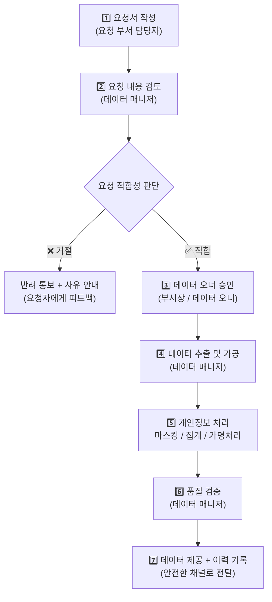
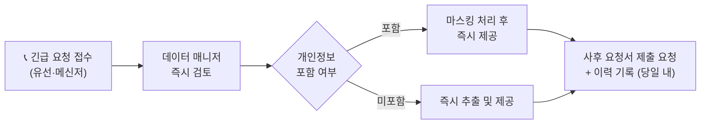

# 📓 9.[이론] 데이터 활용 지원 프로세스 설계

정리일: 2026-10-08 · 교육 에셋 N1537

본문 수집·공개 편집. 도구 실행·최신 기능 재검증은 미실시. 고객·참여자 정보와 개별 접근 링크, 원본 첨부는 제외했습니다.

---

💡 **본 강의는 MySQL 을 기준으로 진행됩니다.**
**\[수업 목표\]**
- 데이터 매니저의 활용 지원 역할과 요청 유형을 이해합니다.
- 데이터 활용 요청·승인 7단계 프로세스를 설명할 수 있습니다.
- 개인정보 마스킹 처리 기준과 방법을 이해합니다.
- 거절된 요청 사례를 통해 승인 기준을 판단할 수 있습니다.
- 긴급 요청과 일반 요청의 처리 방식 차이를 이해합니다.
- 부서 간 데이터 협업 구조를 이해하고 설계할 수 있습니다.
**\[목차\]**

---
## 01. 데이터 활용 지원이란?
> ⏱ 예상 소요: 약 25분
💡 **데이터 매니저는 데이터를 직접 분석하는 사람이 아니라, 분석이 가능하도록 돕는 사람입니다.**
- **☑️ 데이터 활용 지원의 의미**
도서관 사서를 떠올려 보세요. 🙂
사서는 직접 책을 쓰지 않습니다. 하지만 이용자가 필요한 책을 찾을 수 있도록 안내하고, 대출 절차를 관리하며, 자료가 올바르게 분류·보관되도록 운영합니다.
**데이터 매니저도 이와 같습니다.**
**데이터 활용 지원이란, 조직 내 다른 부서·담당자가 데이터를 올바르게 사용할 수 있도록데이터 추출·가공·검토·제공을 도와주는 활동입니다.**
데이터 매니저는 모든 업무 분석을 혼자 수행하지 않습니다. 오히려 다른 부서가 데이터를 잘 활용할 수 있는 환경을 만들고, 필요할 때 지원하는 역할입니다.

역할 비교

설명

**직접 분석가**

데이터를 직접 추출·분석하여 결과를 도출하는 역할

**데이터 매니저**

데이터 품질 관리·표준화·제공 체계를 운영하며, 현업의 활용을 지원하는 역할

실제 업무에서 데이터 매니저는 다음과 같은 상황에 자주 마주하게 됩니다. 😊

상황

데이터 매니저의 역할

경영팀이 지역별 열 사용량 통계를 요청함

데이터 추출 기준 정의, 정제된 데이터 제공

설비팀이 특정 설비의 이상 알람 이력을 요청함

데이터 범위 확인, 보안 검토 후 제공

고객팀이 반복 민원 고객 목록을 요청함

개인정보 처리 기준 확인, 마스킹 후 제공

안전팀이 사고 발생 패턴 분석을 의뢰함

분석에 필요한 데이터 구조 안내, 데이터 추출 지원

- **☑️ 만약 데이터 활용 지원 체계가 없다면?**
“그냥 요청하면 바로 주면 되지 않나요?” 라고 생각하실 수 있습니다. 실제로 체계 없이 데이터를 제공하면 어떤 일이 생기는지 살펴보겠습니다.

상황

발생 문제

경영팀과 영업팀이 각자 열 사용량을 추출

집계 기준이 달라 보고서 수치가 서로 다름

고객 명단을 요청받아 즉시 제공

개인정보가 무분별하게 유통, 법적 리스크 발생

이력 관리 없이 데이터 제공

감사 시 “누가 어떤 데이터를 가져갔는지” 알 수 없음

요청 목적 확인 없이 원시 데이터 제공

잘못된 분석으로 의사결정 오류 발생

**데이터는 아무에게나, 아무 때나 줄 수 없습니다.올바른 절차와 기준이 있어야 신뢰할 수 있는 데이터 활용이 가능합니다.**
- **☑️ 데이터 활용 요청 유형 분류**
현업에서 들어오는 데이터 활용 요청은 크게 다음과 같이 분류할 수 있습니다. 유형을 파악해두면 요청별로 적절한 처리 절차를 적용할 수 있습니다.

요청 유형

설명

예시

**현황 조회**

특정 기간·조건의 데이터 현황 확인

이번 달 지역별 열 사용량

**분석 지원**

분석에 필요한 데이터 추출 및 가공 지원

최근 3년 민원 건수 추이

**보고서용 데이터**

보고서·대시보드 작성에 필요한 집계 데이터

분기 KPI 달성 현황

**시스템 연계 데이터**

타 시스템에 제공할 데이터 추출

외부 감사 제출용 데이터

**AI·예측 모델 데이터**

모델 학습·검증용 데이터 준비

수요 예측 모델 학습 데이터

- **☑️ 데이터 매니저가 갖춰야 할 지원 역량**
데이터 활용 지원을 잘하기 위해서는 다음 역량이 필요합니다.

역량

설명

데이터 구조 이해

어떤 테이블에 어떤 데이터가 있는지 알고 있어야 합니다.

SQL 활용 능력

요청에 맞는 데이터를 정확히 추출할 수 있어야 합니다.

보안·개인정보 이해

제공 가능한 데이터와 보호해야 할 데이터를 구분할 수 있어야 합니다.

소통 능력

현업의 요청 의도를 정확히 파악하고, 결과를 이해하기 쉽게 전달해야 합니다.

품질 판단 능력

제공하는 데이터에 오류가 없는지 사전에 검증해야 합니다.

---
## 02. 데이터 활용 요청·승인 7단계 프로세스
> ⏱ 예상 소요: 약 40분
💡 **요청부터 제공까지의 흐름을 표준화하면 혼선을 줄이고 책임을 명확히 할 수 있습니다.**
- **☑️ 왜 요청·승인 프로세스가 필요한가요?**
음식점 조리를 생각해보세요. 🙂
손님이 “아무거나 주세요”라고 해도 주방에서는 주문서를 씁니다. 재료 확인, 조리 방식, 알레르기 여부를 먼저 체크한 뒤 요리를 시작하죠. 데이터 제공도 마찬가지입니다.
**요청의 의도를 확인하고, 제공 가능한지 검토하고, 품질을 확인한 뒤 제공해야 합니다.**
아무 확인 없이 바로 제공하면 어떤 문제가 생길까요?
- 동일한 데이터를 여러 기준으로 추출해 보고서마다 수치가 달라집니다.
- 개인정보나 민감정보가 포함된 데이터가 무분별하게 제공될 수 있습니다.
- 추출 이력이 없어 감사 시 책임 소재가 불명확해집니다.
- 요청 의도를 잘못 파악해 불필요한 데이터를 추출하게 됩니다.
**데이터 활용 요청·승인 프로세스는 이런 문제를 예방하고데이터 제공의 투명성을 확보하기 위한 체계입니다.**
- **☑️ 7단계 요청·승인 프로세스 흐름**

> 💡 **Tip:** 7단계 중 **2단계(검토)**와 **5단계(개인정보 처리)**가 데이터 매니저의 핵심 역할입니다.
**각 단계별 담당자와 주요 활동을 정리하면 다음과 같습니다.**

단계

담당자

주요 활동

핵심 질문

1️⃣ 요청서 작성

요청 부서 담당자

목적·기간·항목·활용 방법 명시

무엇을, 왜, 어떻게 쓸 것인가?

2️⃣ 요청 검토

데이터 매니저

요청 내용 파악, 데이터 존재 여부 확인, 보안 검토

제공 가능한 요청인가?

3️⃣ 승인

데이터 오너

보안·필요성 판단 후 승인 또는 반려

조직 차원에서 허용되는가?

4️⃣ 추출 및 가공

데이터 매니저

SQL로 데이터 추출, 필요 시 집계 처리

요청 기준에 정확히 맞는가?

5️⃣ 개인정보 처리

데이터 매니저

마스킹·집계·가명 처리 적용

개인 식별 가능 정보가 남아 있는가?

6️⃣ 품질 검증

데이터 매니저

추출 결과 오류·누락 여부 확인

데이터에 오류는 없는가?

7️⃣ 제공 + 이력 기록

데이터 매니저

안전한 채널로 전달, 요청·제공 내역 기록

추적 가능한 형태로 전달되었는가?

- **☑️ 요청서에 반드시 포함되어야 할 항목**
표준 요청서가 있어야 데이터 매니저가 빠짐없이 검토할 수 있습니다. 다음 항목이 빠지면 검토 자체가 불가능하므로, 요청서 반려 사유가 됩니다. ⚠️

항목

설명

예시

**요청 목적**

데이터를 왜 필요로 하는가

분기 열 공급 실적 보고서 작성

**요청 데이터 범위**

어떤 테이블·컬럼·기간인가

열사용량 테이블, 2023년 1\~3월, 지역·사용량·고객번호

**활용 방법**

데이터를 어떻게 사용할 것인가

내부 보고서용 집계 (외부 반출 없음)

**요청자 정보**

이름·부서·연락처

프로님 / 에너지사업팀 / 내선 1234

**제출 기한**

언제까지 필요한가

2023년 4월 10일까지

> 💡 **Tip:** 요청서 항목이 불명확할 경우, 데이터 매니저는 보완 요청을 먼저 합니다. 바로 추출에 들어가는 것이 아니라, **“무엇을 왜 원하는가”부터 명확히 하는 것**이 좋은 데이터 매니저의 첫 번째 습관입니다.
- **☑️ 보안·개인정보 검토 포인트 (2단계 상세)**
**데이터를 제공하기 전 반드시 다음 항목을 확인해야 합니다.데이터 매니저는 보안의 첫 번째 방어선입니다.**

확인 항목

질문

**개인정보 포함 여부**

이름, 연락처, 주소, 생년월일 등 개인 식별 정보가 포함되어 있는가?

**민감정보 포함 여부**

계약 금액, 사고 기록, 직원 개인 정보 등 민감한 내용이 있는가?

**활용 목적 적합성**

요청한 목적에 필요한 범위의 데이터인가? 과도하게 많지는 않은가?

**외부 반출 여부**

데이터가 조직 외부로 나가는가? 외부 반출 기준을 충족하는가?

**접근 권한 확인**

요청자가 해당 데이터에 접근할 권한이 있는가?

---
## 03. 마스킹과 개인정보 보호
> ⏱ 예상 소요: 약 35분
💡 **개인정보가 포함된 데이터는 반드시 마스킹 처리 후 제공해야 합니다. 이것은 선택이 아닌 의무입니다.**
- **☑️ 마스킹이란 무엇인가요?**
주민등록증을 복사할 때를 떠올려 보세요. 🙂
주민번호 뒷자리는 검정 스티커로 가려서 복사하죠? 이처럼 **개인을 식별할 수 있는 정보를 가리거나 대체하는 것**을 **마스킹(Masking)**이라고 합니다.
데이터에서도 동일한 원리가 적용됩니다. 분석에 꼭 필요하지 않은 개인 식별 정보는 가려야 합니다.
- **☑️ 마스킹 처리 전/후 비교**
**\<마스킹 전\>***개인을 특정할 수 있는 정보가 그대로 노출됨*

고객번호

이름

전화번호

주소

열사용량(Gcal)

C001

프로님

[연락처 비공개]

서울시 강남구 테헤란로 123

45.2

C002

김영희

[연락처 비공개]

경기도 성남시 분당구 판교로 45

38.7

C003

이철수

[연락처 비공개]

서울시 송파구 올림픽로 200

52.1

**\<마스킹 후\>***개인 식별 정보를 가리고, 분석에 필요한 정보만 남김*

고객번호

이름

전화번호

주소

열사용량(Gcal)

C001

홍\*\*

***-***\*-5678

서울시 강남구 \*\*\*\*

45.2

C002

김\*\*

***-***\*-5432

경기도 성남시 \*\*\*\*

38.7

C003

이\*\*

***-***\*-1111

서울시 송파구 \*\*\*\*

52.1

> 💡 **Tip:** 열사용량은 분석 목적 데이터이므로 마스킹하지 않습니다. **분석에 필요한 값은 남기고, 개인을 특정할 수 있는 값만 가립니다.**
- **☑️ 항목별 마스킹 기준표**

개인정보 항목

마스킹 방법

마스킹 전 예시

마스킹 후 예시

**이름**

성씨 제외, 이름 부분 `**` 처리

프로님

홍\*\*

**전화번호**

국번·중간번호 `***` 처리, 끝 4자리만 노출

[연락처 비공개]

***-***\*-5678

**주소**

시·구 단위만 노출, 상세주소 `****` 처리

서울시 강남구 테헤란로 123

서울시 강남구 \*\*\*\*

**이메일**

`@` 앞 일부만 노출

[이메일 비공개]

ho\*\*@kdhc.co.kr

**생년월일**

연도만 노출 또는 전체 마스킹

1985-03-15

1985-**-**

**계좌번호**

앞 4자리·뒷 4자리만 노출

123-456-789012

123-\***-**9012

- **☑️ 마스킹 없이 제공하면 어떤 일이 생기나요?**
**개인정보 보호법 위반 리스크를 살펴보겠습니다.**
개인정보 보호법(제18조)은 개인정보를 수집 목적 이외의 용도로 제공하거나, 정보 주체의 동의 없이 제3자에게 제공하는 것을 금지합니다.

위반 사례

법적 리스크

고객 명단(이름+전화번호)을 마스킹 없이 타 부서에 제공

개인정보 보호법 제18조 위반, 과태료 최대 3,000만 원

직원 개인정보를 업무 목적 외로 조회·제공

개인정보 보호법 제59조 위반, 형사처벌(5년 이하 징역)

외부 감사 자료에 개인정보 무더기 포함

정보 유출 사고 → 기관 이미지 손상, 손해배상 청구 가능

퇴직 직원이 고객 DB를 USB에 저장 후 반출

개인정보 보호법 제59조 위반 + 업무상 배임

⚠️ **데이터 매니저는 “일단 주고 나중에 확인”이 아니라,“먼저 확인하고 안전하게 제공”을 원칙으로 합니다.**
- **☑️ 마스킹 외 개인정보 처리 방법**
마스킹 외에도 상황에 따라 다음 방법을 적용합니다.

처리 방법

설명

적합한 상황

**마스킹**

개인 식별 가능 정보를 가림

개인별 데이터를 일부 제공해야 할 때

**집계 제공**

개인 단위가 아닌 집계값만 제공

개별 고객 명단 대신 지역별 고객 수만 필요할 때

**가명 처리**

실제 값을 다른 값(코드)으로 대체

AI 모델 학습 등 개인 식별 불필요한 분석 시

**익명 처리**

개인을 특정할 수 없도록 완전히 변환

외부 공개 또는 연구 목적 데이터 제공 시

---
## 04. 거절된 요청 사례와 승인 기준
> ⏱ 예상 소요: 약 30분
💡 **“거절”은 데이터 매니저의 중요한 역할입니다. 모든 요청을 들어주는 것이 좋은 지원이 아닙니다.**
- **☑️ 거절이 필요한 이유**
좋은 의사(醫師)는 환자가 원하는 약을 무조건 처방하지 않습니다. 처방이 적절한지 판단하고, 부작용이 있으면 거절합니다.
**데이터 매니저도 마찬가지입니다.** 요청이 들어왔을 때, 그 요청이 적절한지를 판단하고, 문제가 있는 요청은 명확한 사유와 함께 거절해야 합니다.
거절하지 못하면 어떤 일이 생길까요?
- 불필요한 데이터가 무분별하게 유통됩니다.
- 개인정보 보호법 위반 리스크가 증가합니다.
- 데이터 보안 사고 발생 시 책임을 피할 수 없습니다.
- **☑️ 실제 거절 사례 — 과도한 개인정보 요청**
### 📋 사례 1: 고객 전체 명단 요청
**요청 내용:** \> “민원 분석을 위해 올해 민원을 접수한 고객 전체 명단을 주세요. \> 이름, 전화번호, 주소, 민원 내용 모두 포함해서요.”
**문제점:**

문제 항목

내용

과도한 개인정보 요청

이름·전화번호·주소가 모두 포함된 개인식별 데이터

목적 대비 과잉 제공

민원 분석에 개인 식별 정보가 반드시 필요하지 않음

외부 반출 가능성

전체 명단이 부서 내 공유 폴더에 저장될 경우 통제 불가

**거절 사유 및 대안 제시:** \> “고객 개인 식별 정보(이름·전화번호·주소)는 민원 분석 목적에 필수적이지 않습니다. \> 대신 고객번호·민원유형·접수일자·처리결과를 제공해 드리겠습니다. \> 특정 고객의 상세 정보가 필요한 경우, 개별 건에 대해 별도 승인 절차를 진행해야 합니다.”
- **☑️ 실제 거절 사례 — 목적 불명확**
### 📋 사례 2: 목적 없는 전체 테이블 요청
**요청 내용:** \> “열사용량 테이블 전체 다운로드 부탁드립니다.”
**문제점:**

문제 항목

내용

목적 불명확

왜 전체 데이터가 필요한지 설명 없음

범위 과다

수년치 전체 데이터를 목적 없이 요청

활용 방법 미제시

어디에 저장하고 어떻게 쓸지 미기재

**거절 사유 및 대안 제시:** \> “데이터 활용 목적과 필요 기간, 활용 방법이 기재된 요청서를 먼저 제출해 주세요. \> 목적에 맞는 범위를 확인한 후 추출해 드리겠습니다.”
- **☑️ 실제 거절 사례 — 권한 없는 요청자**
### 📋 사례 3: 접근 권한 없는 데이터 요청
**요청 내용:** \> “감사팀에서 요청했다고 하는데, 직원 급여 및 인사 데이터를 뽑아서 보내주세요.”
**문제점:**

문제 항목

내용

구두 요청

공식 요청서 없이 구두·메신저로 요청

민감정보 포함

급여·인사 데이터는 HR 부서 소관 민감정보

권한 미확인

요청자가 해당 데이터에 접근 권한이 있는지 확인 불가

**거절 사유 및 대안 제시:** \> “인사·급여 데이터는 HR 부서 데이터 오너의 승인이 필요합니다. \> 공식 요청서를 작성하여 HR 부서를 통해 공식 채널로 요청해 주세요.”
- **☑️ 거절 기준 한눈에 보기**

거절 기준

판단 질문

거절 사유

**과도한 개인정보**

분석 목적에 개인 식별 정보가 꼭 필요한가?

목적 대비 과잉 데이터 요청

**목적 불명확**

왜 필요한지, 어떻게 쓸 것인지 설명이 있는가?

활용 목적 미기재

**권한 없는 요청자**

요청자가 해당 데이터에 접근할 권한이 있는가?

접근 권한 미충족

**외부 반출 기준 미충족**

외부 제공 시 기준 절차를 따르고 있는가?

외부 반출 승인 없음

**데이터 존재 불가**

요청하는 데이터가 실제로 존재하는가?

해당 데이터 미보유

> 💡 **Tip:** 거절 시에는 반드시 **이유**와 **대안**을 함께 안내합니다. “안 됩니다” 만으로 끝내는 것이 아니라, “이렇게 하면 가능합니다”를 함께 제시하는 것이 좋은 데이터 매니저의 자세입니다. 😊
---
## 05. 긴급 vs 일반 요청 처리 방식
> ⏱ 예상 소요: 약 20분
💡 **모든 요청이 같은 속도로 처리될 수는 없습니다. 긴급 요청에는 별도 트랙이 필요합니다.**
- **☑️ 긴급 요청이란?**
일반적인 데이터 요청은 요청서 작성 → 검토 → 승인 → 추출 → 제공의 흐름을 따릅니다. 그런데 현실에서는 다음과 같은 상황이 발생합니다.
> “오늘 오후 2시에 국회의원실에서 현장 방문을 한다고 합니다. 지난달 열 공급 현황 데이터를 지금 바로 뽑아주세요!”
이런 경우, 일반 절차를 그대로 따르면 시간이 부족합니다. **긴급 요청은 빠른 처리를 위한 별도 트랙을 운영해야 합니다.**
- **☑️ 긴급 vs 일반 요청 비교**

구분

🔴 긴급 요청

🔵 일반 요청

**처리 기한**

당일 또는 수 시간 내

1\~5영업일

**요청 방식**

유선·메신저 먼저 → 사후 요청서 제출

요청서 선제출

**승인 방식**

구두 승인 → 사후 서면 확인

서면 승인

**이력 기록**

즉시 처리 후 당일 내 이력 기록

처리 완료 시 기록

**보안 검토**

간소화하되, 개인정보 여부는 반드시 확인

전체 체크리스트 확인

**해당 상황**

감사·국감·긴급 보고·장애 대응

정기 보고, 분석 지원, 연구 자료

⚠️ **주의할 점:** 긴급 요청이라도 **개인정보 마스킹은 절대 생략할 수 없습니다.** 빠른 처리를 위해 범위를 좁히되, 보안 기준은 동일하게 적용합니다.
- **☑️ 긴급 요청 처리 절차**

- **☑️ 긴급 요청 시 데이터 매니저의 체크 포인트**
시간이 없어도 반드시 확인해야 할 3가지가 있습니다.
- 1️⃣ **개인정보 포함 여부** — 마스킹 없이는 절대 제공 불가
- 2️⃣ **요청자 신원 확인** — 구두라도 부서·이름 확인
- 3️⃣ **사후 요청서 제출 약속** — 당일 내 공식 요청서를 받겠다는 확인
---
## 06. 부서 간 데이터 협업 구조 설계
> ⏱ 예상 소요: 약 30분
💡 **데이터는 여러 부서가 함께 만들고, 함께 활용합니다. 협업 구조가 잘 갖춰져야 합니다.**
- **☑️ 부서 간 데이터 협업의 필요성**
오케스트라를 떠올려 보세요. 🙂
바이올린, 첼로, 트럼펫이 각자 따로 연주하면 소음이 됩니다. 지휘자가 박자와 조화를 맞춰줄 때 아름다운 음악이 만들어지죠.
**데이터 협업도 같습니다.** 공사 업무 데이터는 한 부서만의 것이 아닙니다.
- 열 수요 분석을 위해서는 에너지사업팀, 시설관리팀, IT팀의 데이터가 함께 필요합니다.
- 민원 개선을 위해서는 고객지원팀, 운영팀, 데이터 매니저가 함께 협력해야 합니다.
**데이터 매니저는 이 오케스트라의 지휘자 역할을 합니다.**

업무

관련 부서

필요한 데이터

겨울철 수요 대응 계획

에너지사업팀, 시설관리팀, 안전팀

열 사용량, 설비 상태, 기상 데이터

반복 민원 개선

고객지원팀, 운영팀, 데이터 매니저

민원 이력, 처리 이력, 시설 점검 이력

설비 예방 정비

시설관리팀, 안전팀, IT팀

설비 센서 데이터, 고장 이력, 점검 결과

- **☑️ 데이터 협업 체계 설계 요소**
부서 간 데이터 협업이 잘 되려면 다음 요소들이 갖춰져야 합니다.

요소

설명

필요한 이유

**공통 데이터 언어**

용어, 코드, 지표 정의를 통일

같은 말을 다르게 이해하는 혼란 방지

**데이터 허브**

각 시스템의 데이터를 한 곳에서 조회

흩어진 데이터를 통합하여 분석 가능

**데이터 카탈로그**

어떤 데이터가 어디 있는지 목록화

데이터를 찾는 시간 절약

**요청·승인 프로세스**

표준화된 데이터 제공 절차

무분별한 데이터 공유 방지

**정기 협업 회의**

데이터 이슈를 부서 간에 주기적으로 논의

문제를 조기에 발견하고 공동 해결

- **☑️ 교육기관 10 — 부서 간 협업 사례**
### 👤 상황
에너지사업팀에서 내년 겨울철 열 공급 계획 수립을 위해 지역별 수요 예측 분석을 진행하려 합니다. 필요한 데이터가 여러 부서에 분산되어 있습니다.
### ⭕ 필요한 데이터와 보유 부서

데이터

보유 부서

지역별 열 사용량 이력

에너지사업팀

설비 가동 현황

시설관리팀

기상 데이터

외부 기상청 데이터 연계

신규 세대 수 증가 계획

사업개발팀

과거 고장·공급 중단 이력

시설관리팀, 안전팀

### 🔑 협업 구조 설계 포인트
- 에너지사업팀 데이터 매니저가 협업 코디네이터 역할을 수행합니다.
- 각 부서의 데이터 제공 기준(기간·형식·집계 단위)을 사전에 통일합니다.
- 공통 연결 키(지역코드, 날짜 기준)를 확인합니다.
- 제공 데이터에 개인정보 포함 여부를 사전에 확인합니다.
- **☑️ 데이터 전달 방식 기준**
데이터를 전달하는 방법도 보안을 고려하여 기준을 마련해야 합니다.

전달 방식

적합한 상황

주의사항

내부 공유 드라이브

내부 직원 간 공유, 민감도 낮은 데이터

접근 권한 설정 필요

내부 메신저·메일

소규모 데이터, 즉시 전달 필요 시

개인정보 포함 시 암호화 필요

데이터 포털·시스템

반복 제공 데이터, 대시보드 연동

접근 로그 관리 필요

직접 시스템 접근 권한 부여

정기적으로 조회 권한이 필요한 경우

권한 범위 최소화 원칙 적용

**어떤 방식이든 데이터 제공 이력은 반드시 기록해야 합니다.**
- **☑️ 협업 시 자주 발생하는 문제와 해결 방법**

문제

원인

해결 방법

부서마다 수치가 다름

집계 기준·지표 정의가 다름

공통 지표 정의서 작성

데이터를 어디서 받아야 할지 모름

데이터 위치 정보 부재

데이터 카탈로그 구축

요청이 너무 막연함

요청 양식 없음

표준 요청서 양식 배포

제공된 데이터 품질이 낮음

품질 검증 없이 제공

제공 전 품질 점검 절차 의무화

같은 데이터를 여러 번 중복 요청

이력 관리 없음

데이터 제공 이력 기록 및 공유

---
## 07. 요약
> ⏱ 예상 소요: 약 10분
💡 **금일 수업내용을 복기해 보겠습니다.**
- 데이터 매니저는 직접 분석을 수행하기보다 현업이 데이터를 잘 활용할 수 있도록 지원하는 역할입니다.
- 데이터 활용 요청 유형은 현황 조회·분석 지원·보고서용·시스템 연계·AI 모델 데이터로 구분됩니다.
- 체계 없이 데이터를 즉시 제공하면 수치 불일치, 개인정보 유출, 감사 추적 불가 등의 문제가 발생합니다.
- 요청·승인 프로세스는 7단계로 구성됩니다: 요청서 작성 → 검토 → 승인 → 추출·가공 → 개인정보 처리 → 품질 검증 → 제공 및 이력 기록.
- 데이터 제공 전 개인정보·민감정보·접근 권한·활용 목적 적합성을 반드시 검토해야 합니다.
- 개인정보가 포함된 경우 마스킹·집계·가명 처리 후 제공해야 하며, 이는 선택이 아닌 의무입니다.
- 마스킹은 이름·전화번호·주소·이메일 등 개인 식별 정보를 가리되, 분석에 필요한 값은 남기는 처리입니다.
- 마스킹 없이 개인정보를 제공하면 개인정보 보호법 위반으로 과태료 또는 형사처벌을 받을 수 있습니다.
- 거절이 필요한 요청 유형은 과도한 개인정보 요청·목적 불명확·권한 없는 요청자·외부 반출 기준 미충족입니다.
- 거절 시에는 반드시 거절 사유와 대안을 함께 안내하는 것이 좋은 데이터 매니저의 자세입니다.
- 긴급 요청은 구두 승인 후 즉시 처리하되, 개인정보 마스킹과 사후 이력 기록은 반드시 수행해야 합니다.
- 부서 간 데이터 협업에서는 공통 데이터 언어, 표준 요청 절차, 데이터 카탈로그가 핵심 요소입니다.
- 협업 시 가장 흔한 문제는 지표 정의 불일치와 데이터 위치 불명확으로, 공통 지표 정의서와 카탈로그로 해결합니다.
- 데이터 매니저는 부서 간 데이터 협업의 코디네이터 역할을 하며, 오케스트라의 지휘자에 비유할 수 있습니다.
