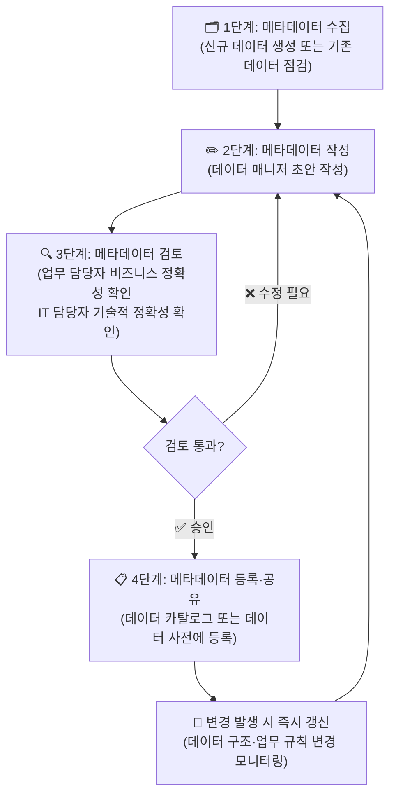

# 📓 13.[이론] 메타데이터 개념 및 표준 정의

정리일: 2026-10-08 · 교육 에셋 N1543

본문 수집·공개 편집. 도구 실행·최신 기능 재검증은 미실시. 고객·참여자 정보와 개별 접근 링크, 원본 첨부는 제외했습니다.

---

💡 **본 강의는 MySQL 을 기준으로 진행됩니다.**
**\[수업 목표\]**
- 메타데이터의 정의와 유형을 이해합니다.
- 메타데이터가 데이터 자산 관리에서 수행하는 역할을 설명할 수 있습니다.
- Dublin Core / ISO 11179 / DCAT 표준의 특징과 공사 적합성을 판단할 수 있습니다.
- 기술적·관리적·비즈니스 메타데이터가 충돌하는 사례를 이해합니다.
- 조직 내 메타데이터 유지보수 프로세스를 설계할 수 있습니다.
**\[목차\]**

---
## 01. 메타데이터란 무엇인가요?
> ⏱ 예상 소요: 약 50분
💡 **“데이터에 대한 데이터”입니다. 데이터를 설명하는 정보 자체가 메타데이터입니다.**
- **☑️ 먼저, 비유로 시작해 볼게요**
도서관에 가서 책을 찾아야 한다고 상상해 보세요. 📚
서가에 책이 수만 권 꽂혀 있는데, 제목도 저자도 분류도 표시가 없다면 어떻게 될까요?
원하는 책을 찾으려면 **한 권 한 권 직접 펼쳐봐야 합니다.**
이때 우리를 구해 주는 것이 바로 **목록 카드(도서 카탈로그)** 입니다.
> 💡 **Tip:** 목록 카드 = 책 제목, 저자, 출판사, 출판연도, 분류번호, ISBN… 이것이 바로 메타데이터입니다.
데이터베이스에서도 똑같습니다.
테이블에 숫자와 코드가 수십만 행 쌓여 있어도,
그 **숫자가 무엇을 의미하는지, 어디서 왔는지, 단위가 무엇인지** 기록해 두지 않으면
데이터가 있어도 활용할 수 없는 “쓸모없는 데이터 창고”가 됩니다.
**메타데이터 없이는 데이터를 찾아야 하고,데이터 없이는 내용을 찾아야 합니다.** 😊
- **☑️ 메타데이터의 정의**
**메타데이터(Metadata)란 데이터의 의미, 구조, 출처, 관리 방법을 설명하는 정보입니다.**
“Meta”는 그리스어로 “\~에 대한(about)”을 뜻합니다.
즉, 메타데이터는 **데이터에 대한 데이터(Data about Data)** 입니다.
공사 업무 예시로 바로 살펴보겠습니다.


데이터 (실제 값)

메타데이터 (설명 정보)


`1200.50`

컬럼명: `열사용량` / 단위: Gcal / 의미: 해당 월 열 공급 사용량 / 출처: 계량기 자동 집계


`C000123`

컬럼명: `고객ID` / 형식: 영문+숫자 7자리 / 의미: 고객 고유 식별자


`202601`

컬럼명: `기준년월` / 형식: YYYYMM / 의미: 집계 기준 연월


`BD01`

컬럼명: `지역코드` / 의미: 열 공급 관리 지역 표준코드


**메타데이터가 없으면 ****`1200.50`****이라는 값이 Gcal인지 Mcal인지, 월 합계인지 일 평균인지**
**전혀 알 수 없습니다.**
- **☑️ 만약 메타데이터가 없다면? — 실제 발생 문제 시나리오**
공사에 신입 데이터 매니저가 부임했다고 가정해 보겠습니다.
인수인계를 받았지만 메타데이터가 없는 상황입니다. 🤔
**\[시나리오 1: 단위 오류로 인한 집계 사고\]**
> 신입 매니저가 `heat_amount` 컬럼을 **Mcal** 단위로 잘못 이해하고<br>수요 예측 보고서를 작성했습니다.<br>실제 단위는 **Gcal**이었기 때문에 수치가 1,000배 차이가 나는<br>오류 보고서가 경영진에게 제출되었습니다.
**\[시나리오 2: 중복 작업으로 인한 리소스 낭비\]**
> 에너지사업팀이 `고객_열사용_월별.csv` 파일을 만들어 사용하고 있었습니다.<br>그런데 운영팀도 같은 데이터를 별도로 집계해서 `월별열사용현황.xlsx` 파일을 관리하고 있었습니다.<br>메타데이터로 어떤 데이터가 어디에 있는지 공유되지 않아<br>두 팀이 수개월 동안 같은 작업을 반복하고 있었던 것입니다.
**\[시나리오 3: 감사 대응 실패\]**
> 외부 감사에서 “2025년 3월 공급량 집계 수치의 근거를 제시하라”는 요청이 들어왔습니다.<br>담당자가 퇴사한 상황에서 어느 테이블의 어느 컬럼을 어떻게 집계했는지<br>추적할 방법이 없었습니다.
이 세 가지 시나리오는 **메타데이터가 없는 조직에서 실제로 빈번하게 발생하는 문제들** 입니다.
**꺼진 불도 다시 봐야 하듯, 이미 쌓인 데이터도 메타데이터로 다시 점검해야 합니다.**
- **☑️ 메타데이터가 있으면 달라지는 것들**


상황

메타데이터 없을 때

메타데이터 있을 때


신입 담당자 데이터 파악

전임자에게 문의하거나 직접 추측 (수주 소요)

데이터 카탈로그에서 즉시 확인 (수분 이내)


두 시스템 데이터 연계

어떤 컬럼이 무슨 의미인지 회의로 협의

메타데이터 매핑 기준으로 즉시 확인


AI 모델 학습 데이터 준비

각 컬럼 의미를 수작업으로 재파악

비즈니스 메타데이터로 학습 데이터 구성 즉시 가능


감사·컴플라이언스 대응

데이터 출처·변경 이력 추적 불가

관리적 메타데이터로 즉시 추적 가능


중복 데이터 판별

어느 것이 최신·공식 데이터인지 모름

갱신일·담당 부서 메타데이터로 즉시 판별


---
## 02. 메타데이터의 세 가지 유형
> ⏱ 예상 소요: 약 55분
💡 **기술적·관리적·비즈니스 메타데이터, 세 유형이 모두 갖춰졌을 때 데이터를 완전히 이해하고 활용할 수 있습니다.**
- **☑️ 세 가지 유형 한눈에 보기**
메타데이터는 크게 세 가지 유형으로 나눌 수 있습니다.


유형

정의

주요 관리 항목

주로 담당하는 사람


**기술적 메타데이터**

데이터의 구조·형식·크기를 설명

컬럼명, 데이터 타입, 테이블명, 레코드 수, NULL 허용 여부

IT / DBA


**관리적 메타데이터**

데이터의 생성·수정·접근·보존 이력

생성일, 최종 수정일, 작성자, 접근 권한, 보존 기간

IT / 데이터 매니저


**비즈니스 메타데이터**

업무 관점에서의 의미와 규칙

지표 정의, 계산식, 업무 용어, 관련 부서, 활용 목적

업무 담당자 / 데이터 매니저


**세 유형이 함께 있을 때 비로소 완전한 메타데이터가 됩니다.**
공사의 `열사용량` 컬럼을 예시로 모두 채워보겠습니다.


메타데이터 유형

`열사용량` 컬럼 예시


**기술적**

컬럼명: `heat_amount` / 타입: `DECIMAL(10,2)` / NULL 불가 / 기본값 없음


**관리적**

생성일: 2025-01-01 / 최종 수정: 2026-04-30 / 담당: 에너지사업팀 / 보존기간: 10년


**비즈니스**

의미: 해당 월 열 공급 사용량 / 단위: Gcal / 출처: 계량기 자동 집계 / 활용: 수요 예측·요금 산정


- **☑️ 기술적 메타데이터 상세 살펴보기**
기술적 메타데이터는 **데이터베이스, 테이블, 컬럼 수준의 구조 정보** 를 담습니다.
IT 담당자나 DBA가 주로 작성하며, 시스템이 자동으로 수집하기도 합니다.
**\[공사 ****`heat_usage`**** 테이블 — 기술적 메타데이터 예시\]**


항목

내용


테이블명

`heat_usage`


스키마

`kdhc_prod`


레코드 수

약 120만 건 (2026-06 기준)


파티션 기준

`기준년월`


인덱스

`고객ID`, `지역코드`, `기준년월`


생성일

2023-01-01


**\[주요 컬럼 기술적 메타데이터\]**


컬럼명

영문명

타입

NULL

PK/FK


지역코드

`region_code`

VARCHAR(10)

N

FK


고객ID

`customer_id`

VARCHAR(20)

N

FK


기준년월

`base_ym`

VARCHAR(6)

N

-


열사용량

`heat_amount`

DECIMAL(10,2)

N

-


요금

`charge`

DECIMAL(12,2)

Y

-


- **☑️ 관리적 메타데이터 상세 살펴보기**
관리적 메타데이터는 **데이터의 생애 주기(Life Cycle) 정보** 를 담습니다.
“이 데이터는 언제 만들어졌고, 누가 마지막으로 수정했으며, 언제까지 보존해야 하는가?”
를 기록하는 것입니다.
**\[****`heat_usage`**** 테이블 — 관리적 메타데이터 예시\]**


항목

내용


데이터 오너

에너지사업팀장


데이터 스튜어드

에너지사업팀 데이터 매니저


최초 생성일

2023-01-01


최종 수정일

2026-05-31


갱신 주기

월 1회 (매월 5일 배치)


보존 기간

10년 (공공기관 데이터 관리 기준)


보안 등급

내부 (개인정보 미포함)


접근 가능 부서

에너지사업팀, 경영기획팀, 데이터분석팀


백업 여부

매일 오전 2시 자동 백업


- **☑️ 비즈니스 메타데이터 상세 살펴보기**
비즈니스 메타데이터는 **업무 담당자만 알 수 있는 의미와 맥락** 을 담습니다.
IT 담당자가 작성하기 어렵고, **반드시 업무 담당자가 직접 검토해야 합니다.**
> 💡 **Tip:** 비즈니스 메타데이터가 가장 중요하지만, 가장 관리하기 어렵습니다. 업무 담당자의 참여 없이는 채울 수 없는 항목들이기 때문입니다.
**\[****`열사용량`**** 컬럼 — 비즈니스 메타데이터 예시\]**


항목

내용


업무 정의

해당 월에 고객에게 공급된 열에너지의 총량


단위

Gcal (기가칼로리)


계산 방식

계량기 일별 측정값의 월 합계


원천 시스템

계량기 자동 수집 시스템 (AMR)


활용 업무

수요 예측, 요금 산정, 공급 계획 수립


관련 지표

지역별 열 공급량, 고객 유형별 소비 패턴


주의사항

계량기 오류 발생 시 추정값이 입력될 수 있음 (비고 컬럼 확인 필요)


관련 용어

공급열량, 소비열량, 열손실량과 구분 필요


- **☑️ 세 유형이 충돌하는 사례 — 실제 업무에서 이런 일이 생깁니다**
기술적·관리적·비즈니스 메타데이터가 서로 일치하지 않는 상황이 발생할 수 있습니다.
**자, 여기서 문제!** 아래 상황에서 어떤 정보를 믿어야 할까요? 🤔
**\[충돌 사례 1: 단위 불일치\]**


출처

내용


기술적 메타데이터 (DB 컬럼 주석)

단위: Gcal


비즈니스 메타데이터 (업무 정의서)

단위: Mcal


실제 데이터 범위

500 \~ 2,000 사이 값 분포


→ 실제 데이터 범위를 보면 Gcal로 볼 때 합리적인 수치입니다.<br>→ **비즈니스 메타데이터 정의서가 오래전 작성 후 갱신되지 않은 것으로 판단.**<br>→ 업무 담당자에게 확인 후 비즈니스 메타데이터를 수정해야 합니다.
**\[충돌 사례 2: 갱신 주기 불일치\]**


출처

내용


관리적 메타데이터

갱신 주기: 월 1회 (매월 5일)


실제 배치 스케줄러

매월 3일 실행


업무 담당자 인식

“매월 초에 갱신되는 것 같은데요…”


→ 세 정보가 모두 다릅니다.<br>→ **관리적 메타데이터가 시스템 변경 후 갱신되지 않은 것으로 판단.**<br>→ IT 담당자에게 확인 후 관리적 메타데이터를 수정해야 합니다.
💡 **충돌이 발견되면 반드시 원천(실제 시스템 또는 업무 담당자)을 확인하고 메타데이터를 수정해야 합니다. 충돌을 방치하면 메타데이터 자체의 신뢰도가 떨어집니다.**
- **☑️ 데이터 계보(Data Lineage) — 메타데이터의 확장**
**데이터 계보는 데이터가 어디서 만들어져서 어떤 과정을 거쳐 현재의 값이 되었는지를**
**추적하는 정보입니다.** 메타데이터는 이 계보를 기록하는 역할을 합니다.
```plain text
계량기 측정 (현장)
    → AMR 시스템 자동 수집 (매일 0시)
    → 일별 집계 테이블 저장 (heat_daily)
    → 월별 집계 배치 처리 (매월 3일, heat_usage 테이블)
    → 수요 예측 모델 입력 데이터로 활용
    → 경영 대시보드 수치 표출
```
계보가 기록되어 있으면, **분석 결과에 문제가 생겼을 때 어느 단계에서 오류가 발생했는지**
**즉시 추적할 수 있습니다.**
> 💡 **Tip:** 데이터 계보는 관리적 메타데이터의 일부로 볼 수 있지만, 최근에는 별도 항목으로 관리하는 조직이 늘고 있습니다.
---
## 03. 메타데이터 표준 비교 및 공사 적합성 판단
> ⏱ 예상 소요: 약 45분
💡 **메타데이터도 표준이 없으면 부서마다 다른 방식으로 관리되어 혼란이 생깁니다. 어떤 표준을 참고해야 할지 함께 살펴보겠습니다.**
- **☑️ 메타데이터 표준이 왜 필요한가요?**
표준이 없는 상태에서 메타데이터를 관리하면 이런 일이 생깁니다.
**\<표준화 전\>***같은 항목인데 부서마다 다른 이름으로 기록되고 있어 통합이 불가능합니다.*


부서

컬럼 설명 항목명

단위 표기 방식

담당자 기록 방식


에너지사업팀

컬럼설명

Gcal

프로님 (에너지사업팀)


운영팀

설명

gcal

프로님/010-xxxx-xxxx


경영기획팀

Column Description

GCal

에너지사업팀 프로님


**\<표준화 후\>**


표준 항목명

정의

형식

예시


컬럼설명

컬럼의 업무적 의미를 한 문장으로 기술

한국어 서술형

해당 월 열 공급 사용량


단위

데이터 값의 측정 단위

국제 표준 단위 기호

Gcal


데이터오너

해당 데이터의 관리 책임자

부서명+이름

에너지사업팀 프로님


- **☑️ 주요 메타데이터 국제 표준 비교**
국제적으로 많이 사용되는 세 가지 표준을 살펴보겠습니다.


구분

🔵 Dublin Core

🟠 ISO 11179

🟢 DCAT


**정식 명칭**

Dublin Core Metadata Initiative

ISO/IEC 11179 MDR

Data Catalog Vocabulary


**제정 기관**

DCMI (국제 컨소시엄)

ISO/IEC JTC 1

W3C


**초점**

문서·콘텐츠 메타데이터

데이터 항목(Data Element) 메타데이터

데이터 카탈로그·데이터셋 메타데이터


**구성**

15개 기본 항목

데이터 요소·표현·개념 등 체계적 구조

Dataset, Distribution, Catalog 클래스


**장점**

단순하고 배우기 쉬움

데이터 표준화에 특화, 체계적

오픈데이터·공공데이터 연계에 강함


**단점**

항목이 적어 DB 관리에 부족

복잡하고 도입 비용이 높음

DB 수준 메타데이터 관리엔 부족


**주 사용 분야**

도서관, 콘텐츠 관리

데이터베이스, 데이터 사전

공공 데이터 포털, 오픈 데이터


- **☑️ Dublin Core 상세 — 15개 핵심 항목**
Dublin Core는 가장 단순한 메타데이터 표준입니다.
1994년 도서관 커뮤니티에서 시작되어 지금은 웹 문서, 콘텐츠 관리에 널리 쓰입니다.


번호

항목명

의미

데이터 관리 적용 예시


1

Title

자원의 이름

테이블명: heat_usage


2

Creator

자원을 만든 주체

생성 부서: 에너지사업팀


3

Subject

주제·키워드

태그: 열사용량, 수요예측


4

Description

자원의 설명

테이블 설명: 월별 열 공급 사용량 데이터


5

Publisher

배포 주체

담당 부서: 에너지사업팀


6

Contributor

기여자

검토자: 경영기획팀


7

Date

날짜

생성일: 2023-01-01


8

Type

자원 유형

유형: Dataset


9

Format

형식·미디어 타입

형식: MySQL Table


10

Identifier

고유 식별자

식별자: kdhc.heat_usage


11

Source

원천 자원

원천: AMR 시스템


12

Language

언어

언어: ko


13

Relation

관련 자원

관련: customers, region_code


14

Coverage

적용 범위

범위: 2023-01 \~ 현재


15

Rights

권리·접근 제한

접근: 내부 인가자만


- **☑️ ISO 11179 상세 — 데이터 항목 표준화에 특화**
ISO 11179는 **데이터베이스의 컬럼(데이터 항목, Data Element) 메타데이터**에 특화된 표준입니다.
컬럼 하나를 등록할 때 다음 구조로 정의합니다.


ISO 11179 구성 요소

설명

`열사용량` 컬럼 적용 예시


**Object Class**

데이터가 설명하는 실체

고객 공급 계약


**Property**

실체의 어떤 속성인가

월 열 사용량


**Representation Class**

데이터 표현 방식

양(Quantity)


**Data Type**

저장 형식

DECIMAL(10,2)


**Unit of Measure**

측정 단위

Gcal


**Definition**

공식 정의문

해당 월에 고객에게 공급된 열에너지 총량(Gcal 단위)


> 💡 **Tip:** ISO 11179는 **데이터 표준화(Data Standardization)** 작업에 가장 적합한 표준입니다. 공사 내부 데이터 사전(Data Dictionary)을 만들 때 이 구조를 참고하면 체계적으로 관리할 수 있습니다.
- **☑️ DCAT 상세 — 공공 데이터 카탈로그에 최적화**
DCAT(Data Catalog Vocabulary)은 W3C가 권고하는 표준으로,
**데이터셋(Dataset) 단위로 메타데이터를 기록** 하는 방식입니다.
공공 데이터 포털(data.go.kr)에서 사용하는 방식이 DCAT을 기반으로 합니다.


DCAT 주요 클래스

설명


`dcat:Catalog`

데이터셋의 모음 (데이터 카탈로그 전체)


`dcat:Dataset`

하나의 데이터셋 (테이블 단위)


`dcat:Distribution`

데이터 배포 형식 (CSV, API, DB 등)


`dcat:DataService`

데이터 접근 API


- **☑️ 공사에 맞는 표준 선택 기준**
세 가지 표준을 모두 도입할 필요는 없습니다. 🙂
공사의 상황에 맞는 현실적인 선택 기준을 제시합니다.


상황

권장 참고 표준

이유


**내부 데이터 사전(Data Dictionary) 구축**

✅ ISO 11179

컬럼 단위 메타데이터 표준화에 가장 적합


**데이터 카탈로그 시스템 도입**

✅ DCAT

테이블/데이터셋 단위 검색·공유에 적합


**문서·보고서 메타데이터 관리**

✅ Dublin Core

단순하고 배우기 쉬워 빠른 도입 가능


**전사 통합 메타데이터 관리 체계**

✅ 세 표준 원칙 참고 + 내부 표준 제정

국제 표준을 그대로 쓰기보다 원칙만 차용


💡 **공사에서는 국제 표준을 그대로 적용하기보다는, 표준의 원칙을 참고하여 조직 실정에 맞는 내부 메타데이터 표준을 만드는 것이 현실적입니다. 중요한 것은 표준 자체가 아니라, 조직 전체가 동일한 방식으로 기록한다는 합의입니다.**
---
## 04. 조직 내 메타데이터 관리 구조
> ⏱ 예상 소요: 약 45분
💡 **메타데이터는 한 번 만들고 끝이 아닙니다. 누가, 언제, 어떻게 갱신하는지 명확히 정해야 살아있는 메타데이터가 됩니다.**
- **☑️ 메타데이터 관리 흐름 — 전체 프로세스**
메타데이터 관리는 크게 네 단계로 이루어집니다.

- **☑️ 메타데이터 관리 조직 구조**
메타데이터를 잘 관리하려면 역할이 명확히 구분되어야 합니다.


역할

담당자

주요 책임


**데이터 오너 (Data Owner)**

업무 부서장

해당 데이터 메타데이터의 최종 승인 책임


**데이터 스튜어드 (Data Steward)**

데이터 매니저

메타데이터 초안 작성, 갱신 관리, 이력 기록


**비즈니스 검토자**

업무 담당자

비즈니스 메타데이터 정확성 검토


**기술 검토자**

IT 담당자 / DBA

기술적 메타데이터 정확성 검토


**메타데이터 시스템 운영자**

IT 담당

메타데이터 저장·검색 시스템 운영


**데이터 매니저(여러분)는 데이터 스튜어드 역할을 담당합니다.**
메타데이터의 초안을 작성하고, 관련 담당자들과 협력하여 갱신을 이끌어가는 핵심 역할입니다.
- **☑️ 메타데이터 갱신이 필요한 시점 — 트리거 목록**
다음 상황이 발생하면 **반드시 메타데이터를 갱신해야 합니다.**


트리거 상황

갱신이 필요한 메타데이터 유형

담당자


새로운 테이블·컬럼 추가

기술적 + 비즈니스 메타데이터

IT + 데이터 매니저


컬럼명·타입 변경

기술적 메타데이터

IT + 데이터 매니저


업무 규칙·계산식 변경

비즈니스 메타데이터

업무 담당자 + 데이터 매니저


배치 스케줄 변경

관리적 메타데이터

IT + 데이터 매니저


담당 부서·담당자 변경

관리적 메타데이터

데이터 매니저


보안 등급 변경

관리적 메타데이터

IT + 데이터 오너


데이터 품질 오류 발견

비즈니스 메타데이터 (주의사항 항목)

데이터 매니저


> ⚠️ **데이터 변경이 발생했는데 메타데이터가 갱신되지 않으면, 메타데이터가 오히려 혼란을 유발하는 “잘못된 안내판”이 됩니다.**
- **☑️ 메타데이터 이력 관리 — 변경 이력 기록 방식**
메타데이터도 변경될 때마다 **무엇이, 언제, 왜, 누가 바꿨는지** 기록해야 합니다.
**\[변경 이력 기록 예시\]**


변경일

변경 항목

변경 전

변경 후

변경 이유

변경자


2026-04-01

`열사용량` 단위

Mcal

Gcal

시스템 단위 기준 변경 (AMR 시스템 업그레이드)

프로님


2026-05-03

갱신 주기

매월 5일

매월 3일

배치 스케줄 조정

이철수


2026-06-01

데이터 오너

에너지사업팀장 박○○

에너지사업팀장 김○○

팀장 교체

프로님


- **☑️ 교육기관 10 — 핵심 데이터 메타데이터 등록 예시**
공사의 대표적인 두 테이블 메타데이터를 예시로 완성해 보겠습니다.
**\[테이블 메타데이터: ****`heat_usage`****\]**


항목

내용


테이블명

`heat_usage`


한글명

열사용량


업무 설명

지역별·고객별 월간 열 공급 사용량 및 요금 데이터


업무 영역

에너지 공급 관리


데이터 원천

공급 계량기 자동 수집 시스템 (AMR)


갱신 주기

월 1회 (매월 3일 배치)


담당 부서

에너지사업팀


데이터 오너

에너지사업팀장


보안 등급

내부 (개인정보 미포함)


주요 활용

수요 예측, 요금 산정, 공급 계획 수립


관련 테이블

`customers`, `region_code`, `facilities`


**\[컬럼 메타데이터: ****`heat_usage`**** 주요 컬럼\]**


컬럼명

영문명

타입

NULL

의미

단위

예시값

주의사항


지역코드

`region_code`

VARCHAR(10)

N

열 공급 관리 지역 표준코드

-

BD01

`region_code` 테이블 참조


고객ID

`customer_id`

VARCHAR(20)

N

고객 고유 식별자

-

C000123

`customers` 테이블 FK


기준년월

`base_ym`

VARCHAR(6)

N

집계 기준 연월

YYYYMM

202601

월 단위 집계 기준


열사용량

`heat_amount`

DECIMAL(10,2)

N

해당 월 열 사용량

Gcal

1200.50

계량기 오류 시 추정값 입력 가능


요금

`charge`

DECIMAL(12,2)

Y

해당 월 열 요금

원

150000.00

NULL = 요금 미산정 상태


- **☑️ 메타데이터 유지 관리 5가지 핵심 원칙**


원칙

내용

실패하면 생기는 문제


**1️⃣ 즉시 갱신**

데이터 변경 시 메타데이터도 함께 수정

메타데이터와 실제 데이터가 불일치


**2️⃣ 업무 담당자 검토**

비즈니스 메타데이터는 업무 담당자가 직접 검토

의미 오류, 단위 오류 등 품질 문제


**3️⃣ 이력 관리**

변경 이력을 일자·이유·담당자와 함께 기록

감사 대응 실패, 원인 추적 불가


**4️⃣ 접근 용이성**

누구나 쉽게 찾을 수 있는 데이터 카탈로그에 등록

신입 담당자 파악 지연, 중복 작업 발생


**5️⃣ 정기 검토**

연 1회 이상 전체 메타데이터 정확성 점검

장기간 갱신 누락으로 신뢰도 하락


---
## 05. 요약
> ⏱ 예상 소요: 약 10분
💡 **금일 수업내용을 복기해 보겠습니다.**
- 메타데이터는 “데이터에 대한 데이터”로, 데이터의 의미·구조·출처·관리 방법을 설명하는 정보입니다.
- 메타데이터가 없으면 데이터가 있어도 의미와 활용 방법을 알기 어렵고, 단위 오류·중복 작업·감사 대응 실패 등 실제 업무 문제가 발생합니다.
- 메타데이터는 기술적·관리적·비즈니스 세 가지 유형으로 나뉘며, 세 유형이 모두 갖춰졌을 때 데이터를 완전히 이해하고 활용할 수 있습니다.
- 기술적 메타데이터는 컬럼 구조와 형식, 관리적 메타데이터는 생성·수정 이력과 접근 권한, 비즈니스 메타데이터는 업무 의미와 계산 규칙을 담습니다.
- 세 유형의 메타데이터가 서로 충돌할 때는 반드시 원천(실제 시스템 또는 업무 담당자)을 확인하고 수정해야 합니다.
- 데이터 계보(Data Lineage)는 데이터가 생성부터 활용까지 거친 전 과정을 추적하는 정보로, 오류 발생 시 원인 추적에 필수적입니다.
- Dublin Core는 단순하고 배우기 쉬운 15개 항목 표준으로 문서·콘텐츠 관리에 적합합니다.
- ISO 11179는 데이터 항목(컬럼) 메타데이터 표준화에 특화되어 데이터 사전 구축 시 참고하기에 가장 적합합니다.
- DCAT은 W3C 권고 표준으로 공공 데이터 포털·오픈 데이터 연계에 강점이 있습니다.
- 공사에서는 국제 표준을 그대로 적용하기보다 원칙을 참고하여 조직 실정에 맞는 내부 표준을 제정하는 것이 현실적입니다.
- 메타데이터 관리는 수집 → 작성 → 검토 → 등록·공유 → 갱신의 순환 프로세스로 운영됩니다.
- 데이터 매니저는 데이터 스튜어드로서 메타데이터 초안 작성과 갱신을 주도하는 핵심 역할을 담당합니다.
- 비즈니스 메타데이터는 반드시 업무 담당자가 직접 검토해야 하며, IT 담당자만으로는 채울 수 없습니다.
- 데이터가 변경될 때마다 메타데이터도 즉시 갱신해야 하며, 변경 이력을 날짜·이유·담당자와 함께 기록해야 합니다.
- 메타데이터를 누구나 쉽게 찾을 수 있는 데이터 카탈로그로 공유하면 조직 전체의 데이터 활용 수준이 향상됩니다.
