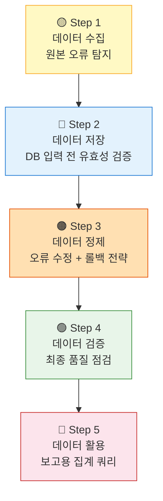

# 🏋️ 11.[실습] 데이터 관리 End-to-End 종합 실습

정리일: 2026-10-08 · 교육 에셋 N1550

본문 수집·공개 편집. 도구 실행·최신 기능 재검증은 미실시. 고객·참여자 정보와 개별 접근 링크, 원본 첨부는 제외했습니다.

---

💡 **본 강의는 MySQL 을 기준으로 진행됩니다.**
**\[수업 목표\]**
- 데이터 수집·저장·정제·검증·활용의 5단계 생애주기를 통합적으로 이해합니다.
- 각 단계에서 발생하는 오류를 SQL로 탐지하고 처리할 수 있습니다.
- DELETE와 UPDATE를 상황에 맞게 구분하여 사용할 수 있습니다.
- 정제 전 백업 테이블을 생성하여 롤백 전략을 적용할 수 있습니다.
- 데이터 관리 체계 설계서를 직접 작성할 수 있습니다.
**\[목차\]**

---
## 01. 실습 개요 및 데이터 생애주기
> ⏱ 예상 소요: 약 15분
💡 **데이터가 태어나서 활용되기까지, 전 과정을 한 번에 경험합니다.**
- **☑️ 오늘 실습의 핵심 질문**
여러분이 교육기관 10의 데이터 매니저라고 상상해 보세요. 🙂
현장 점검 담당자가 오늘 아침 설비 점검 기록 7건을 제출했습니다.<br>그런데 이 데이터를 그냥 DB에 올려도 될까요?
**답은 “아니오” 입니다.**
날짜 형식이 제각각이고, 없는 설비 ID가 들어 있고, 중복 행도 있습니다.<br>이 데이터를 그대로 경영 보고에 쓰면 어떻게 될까요?<br>집계 숫자가 틀리고, 위험 설비를 놓칠 수 있습니다.
오늘 실습은 이 문제를 처음부터 끝까지 직접 해결해 보는 시간입니다.
- **☑️ 데이터 생애주기 — 5단계 흐름**
마치 음식이 농장에서 식탁까지 오는 과정처럼,<br>데이터도 생성에서 활용까지 단계별 관리가 필요합니다.

각 단계는 **독립적이지 않습니다.**<br>이전 단계의 품질이 다음 단계에 직결됩니다.<br>수집 단계에서 오류를 잡지 못하면 정제 단계의 작업량이 폭증합니다.
- **☑️ 실습 테이블 구조 확인**
오늘 실습에서 사용할 두 개의 테이블을 먼저 확인합니다.
**설비 마스터 테이블 (****`facilities`****) — 기준 정보**
```sql
-- 설비 마스터 테이블: 설비의 고정 정보를 관리합니다.
-- 이미 생성되어 있는 테이블이므로, 구조 확인만 합니다.
DESCRIBE facilities;
```


컬럼명

타입

설명


facility_id

VARCHAR(20)

설비 고유 ID (기준키)


facility_name

VARCHAR(100)

설비명


facility_type

VARCHAR(50)

설비 유형 (열교환기, 유량계 등)


region

VARCHAR(50)

설치 지역


install_date

DATE

설치일


status

VARCHAR(20)

현재 상태 (정상/주의/위험)


**설비 점검 이력 테이블 (****`inspection_log`****) — 점검 기록**
```sql
-- 점검 이력 테이블: 현장 점검 결과를 기록합니다.
-- inspect_date와 next_inspect가 VARCHAR인 이유: 날짜 형식 정제 실습을 위해 의도적으로 설정했습니다.
DESCRIBE inspection_log;
```


컬럼명

타입

설명


log_id

VARCHAR(20)

점검 기록 ID (기본키)


facility_id

VARCHAR(20)

설비 ID (facilities 참조)


inspect_date

VARCHAR(20)

점검일 (VARCHAR — 형식 불일치 가능)


inspector

VARCHAR(50)

점검자 이름


result

VARCHAR(20)

점검 결과 (정상/주의/위험)


note

TEXT

비고


next_inspect

VARCHAR(20)

다음 점검 예정일


> 💡 **Tip:** `inspect_date`가 DATE가 아닌 VARCHAR인 이유가 있습니다.<br>현장 담당자들이 날짜를 ‘2026-04-30’, ‘2026.04.30’, ‘26/04/30’ 등 제각각 입력하는 현실을 반영했습니다.<br>실습에서 이 오류를 직접 정제하는 과정을 경험합니다.
---
## 02. Step 1 — 데이터 수집: 원본 오류 탐지
> ⏱ 예상 소요: 약 20분
💡 **데이터를 받으면 가장 먼저 “이 데이터를 믿을 수 있는가?”를 확인합니다.**
- **☑️ 원본 데이터 현황**
현장 담당자들이 오늘 아침 제출한 설비 점검 기록 7건입니다.<br>아래 데이터를 꼼꼼히 살펴보세요. 🔍


log_id

facility_id

inspect_date

inspector

result

note

next_inspect


L001

F006

2026-05-30

강수민

**이상없음**


2026-08-30


L002

F008

**2026.04.30**

이영희

정상


2026-07-30


L003

F015

**2026-12-01**

박민준

정상


2027-03-01


L004

**F099**

2026-04-25

정호진

정상


2026-07-25


L005

F005

2026-04-12

정호진

정상


2026-07-12


L006

**F005**

**2026-04-12**

**정호진**

**정상**


**2026-07-12**


L007

F020

2026-05-10

강수민

정상


**2026-05-05**


**자, 여기서 문제!** 🤔<br>위 7건 중 신뢰할 수 없는 데이터가 여러 건 있습니다.<br>어떤 문제인지 찾을 수 있으신가요?
- **☑️ 오류 유형 분류표**
**\<오류 탐지 전\>***직접 채워보세요 — 예시 답안은 아래 토글에서 확인할 수 있습니다.*


오류 유형

발견된 문제 (log_id)

데이터를 그대로 쓰면?


- **예시 답안**
**\<오류 탐지 후\>**


오류 유형

발견된 문제 (log_id)

데이터를 그대로 쓰면?


코드값 불일치

L001: result = ‘이상없음’ (표준은 ‘정상/주의/위험’)

결과 집계 시 ‘이상없음’ 건수가 누락됨


날짜 형식 불일치

L002: inspect_date = ‘2026.04.30’ (점 구분자)

기간 조회 시 이 행이 제외됨


미래 날짜

L003: inspect_date = ‘2026-12-01’ (현재 날짜 기준 미래)

실제 점검 전 데이터 선입력 의심


참조무결성 위반

L004: F099가 facilities 테이블에 없는 ID

JOIN 시 이 행이 사라짐 (유령 데이터)


중복 데이터

L005·L006: 동일 설비·날짜·점검자 2건

점검 건수가 부풀려짐


날짜 논리 오류

L007: next_inspect(05-05) \< inspect_date(05-10)

점검 스케줄이 과거를 가리킴


> 💡 **Tip:** 오류 6가지를 모두 찾으셨나요? 실무에서는 수천 건 중에 이런 오류를 찾아야 합니다.<br>SQL로 탐지 쿼리를 만들어 두면 자동으로 잡아낼 수 있습니다. 다음 단계에서 해봅니다!
- **☑️ 수집 단계에서 배운 것**
**“데이터를 받으면 일단 의심하라”** — 이것이 데이터 매니저의 첫 번째 습관입니다.
만약 Step 1을 건너뛰고 바로 DB에 올렸다면?<br>위 6가지 오류가 모두 살아있는 채로 경영 보고에 사용됩니다.<br>**한 건의 오류가 전체 분석 결과를 뒤집을 수 있습니다.**
---
## 03. Step 2 — 데이터 저장: DB 입력 전 유효성 검증
> ⏱ 예상 소요: 약 25분
💡 **DB에 넣기 전에 SQL로 먼저 확인합니다. 들어가고 나면 꺼내기가 훨씬 어렵습니다.**
- **☑️ 유효성 검증이란?**
마트에서 계산대를 통과하기 전에 영수증을 확인하는 것처럼,<br>데이터도 DB에 들어가기 전에 “이 데이터, 괜찮은가?” 체크를 합니다.
아래 4가지 검증 쿼리를 순서대로 실행해 보겠습니다.
- **☑️ 검증 1 — 참조무결성: 설비 마스터에 없는 ID 찾기**
**지금 무엇을 왜 하는가:** `inspection_log`에 입력된 `facility_id`가 `facilities` 테이블에 실제로 존재하는지 확인합니다.<br>마스터에 없는 ID는 ’유령 설비’로, 나중에 JOIN할 때 이 행이 통째로 사라집니다.
```sql
-- 검증 1: 참조무결성 — facilities에 없는 facility_id 탐지
SELECT
    i.log_id        AS 점검기록ID,
    i.facility_id   AS 문제_설비ID,
    i.inspect_date  AS 점검일,
    i.inspector     AS 점검자
FROM inspection_log i
LEFT JOIN facilities f ON i.facility_id = f.facility_id
WHERE f.facility_id IS NULL;
```
- 정답화면


점검기록ID

문제_설비ID

점검일

점검자


L004

F099

2026-04-25

정호진


- **☑️ 검증 2 — 미래 날짜: 아직 오지 않은 날짜 찾기**
**지금 무엇을 왜 하는가:** 점검일이 오늘 이후인 행은 아직 점검이 이루어지지 않은 것입니다.<br>선입력이거나 오타일 가능성이 높습니다.
```sql
-- 검증 2: 미래 날짜 탐지 (VARCHAR이므로 STR_TO_DATE로 변환 후 비교)
SELECT
    log_id        AS 점검기록ID,
    facility_id   AS 설비ID,
    inspect_date  AS 문제_점검일,
    inspector     AS 점검자
FROM inspection_log
WHERE STR_TO_DATE(inspect_date, '%Y-%m-%d') > CURDATE();
```
- 정답화면


점검기록ID

설비ID

문제_점검일

점검자


L003

F015

2026-12-01

박민준


- **☑️ 검증 3 — 코드값: 표준 코드 외 값 찾기**
**지금 무엇을 왜 하는가:** `result` 컬럼은 ‘정상’, ‘주의’, ‘위험’ 세 가지만 허용됩니다.<br>이 외의 값이 들어 있으면 집계 시 해당 건이 어느 그룹에도 포함되지 않습니다.
```sql
-- 검증 3: 비표준 코드값 탐지
SELECT
    log_id        AS 점검기록ID,
    facility_id   AS 설비ID,
    result        AS 문제_결과값,
    inspect_date  AS 점검일
FROM inspection_log
WHERE result NOT IN ('정상', '주의', '위험');
```
- 정답화면


점검기록ID

설비ID

문제_결과값

점검일


L001

F006

이상없음

2026-05-30


- **☑️ 검증 4 — 중복: 동일 설비·날짜 2건 이상 찾기**
**지금 무엇을 왜 하는가:** 같은 설비를 같은 날 두 번 점검 기록하는 것은 이상합니다.<br>의도적인 재점검이 아니라면 중복 입력으로 봅니다.
```sql
-- 검증 4: 중복 탐지 — 동일 설비 + 동일 날짜 기준
SELECT
    facility_id   AS 설비ID,
    inspect_date  AS 점검일,
    COUNT(*)      AS 중복건수,
    GROUP_CONCAT(log_id ORDER BY log_id) AS 해당_기록ID목록
FROM inspection_log
GROUP BY facility_id, inspect_date
HAVING COUNT(*) > 1;
```
- 정답화면


설비ID

점검일

중복건수

해당_기록ID목록


F005

2026-04-12

2

L005,L006


> 💡 **Tip:** `GROUP_CONCAT`은 같은 그룹 내 값들을 콤마로 연결해 줍니다.<br>어떤 log_id가 중복인지 한눈에 볼 수 있어서 실무에서 자주 씁니다.
- **☑️ 검증 4 실습 과제**
**✏️ 실습 과제:** 날짜 논리 오류(next_inspect \< inspect_date)를 탐지하는 쿼리를 작성하세요.
```sql
-- 날짜 논리 오류 탐지 쿼리를 여기에 작성하세요.
```
- **예시 답안**
```sql
-- 날짜 논리 오류: 다음 점검일이 점검일보다 이전인 행
SELECT
    log_id        AS 점검기록ID,
    facility_id   AS 설비ID,
    inspect_date  AS 점검일,
    next_inspect  AS 다음점검일
FROM inspection_log
WHERE next_inspect < inspect_date;
```
- 정답화면


점검기록ID

설비ID

점검일

다음점검일


L007

F020

2026-05-10

2026-05-05


---
## 04. Step 3 — 데이터 정제: 오류 수정과 롤백 전략
> ⏱ 예상 소요: 약 45분
💡 **정제를 시작하기 전, 반드시 백업 테이블을 만드세요. 되돌릴 수 없는 실수를 방지합니다.**
- **☑️ DELETE vs UPDATE — 언제 삭제하고 언제 수정하는가?**
정제 작업에서 가장 많이 헷갈리는 것이 바로 이 질문입니다.<br>틀린 데이터를 발견했을 때, 지워야 할까요? 고쳐야 할까요? 🤔


상황

권장 처리

이유


중복 행 (완전히 동일한 데이터)

✅ **DELETE**

한 건만 남기고 나머지는 불필요


마스터에 없는 참조 ID

✅ **DELETE**

연결할 수 없는 유령 데이터


코드값 오타 (‘이상없음’ → ‘정상’)

✅ **UPDATE**

내용은 맞고 표현만 잘못된 것


날짜 형식 불일치 (‘2026.04.30’)

✅ **UPDATE**

날짜 자체는 맞고 형식만 다른 것


미래 날짜 (확인 불가)

⚠️ **UPDATE(메모)**

삭제 전 담당자 확인 필요


날짜 논리 오류 (확인 필요)

⚠️ **UPDATE(메모)**

재점검일 경우 정상일 수도 있음


> 💡 **핵심 원칙:** 삭제는 되돌릴 수 없습니다. 확신이 없으면 UPDATE로 메모를 달고 담당자 확인 후 결정하세요.
- **☑️ 롤백 전략 — 정제 전 백업 테이블 만들기**
정제를 시작하기 전, 원본을 복사해 두는 것이 **데이터 매니저의 필수 습관**입니다.<br>마치 중요한 문서를 수정하기 전에 ’다른 이름으로 저장’을 하는 것과 같습니다.
```sql
-- 정제 전 백업 테이블 생성 (원본 그대로 복사)
-- 테이블명에 날짜를 붙이면 언제 백업했는지 알 수 있어요.
CREATE TABLE inspection_log_backup_20260614
AS SELECT * FROM inspection_log;

-- 백업이 제대로 됐는지 확인
SELECT COUNT(*) AS 백업건수 FROM inspection_log_backup_20260614;
```
- 정답화면백업건수7
---
---
**만약 정제 작업을 잘못했다면?** 아래 쿼리로 되돌릴 수 있습니다.
```sql
-- 롤백: 원본 테이블을 삭제하고 백업에서 복원
-- ⚠️ 주의: 이 쿼리는 정제 작업이 잘못됐을 때만 사용합니다!
-- (실습에서는 실행하지 마세요)
-- TRUNCATE TABLE inspection_log;
-- INSERT INTO inspection_log SELECT * FROM inspection_log_backup_20260614;
```
> 💡 **Tip:** 백업 테이블명에 날짜(`_20260614`)를 붙이는 것이 실무 관례입니다.<br>여러 번 정제를 반복하면 `_v1`, `_v2`처럼 버전을 붙이기도 합니다.
- **☑️ 정제 1 — 코드값 표준화: ‘이상없음’ → ‘정상’**
**지금 무엇을 왜 하는가:** ‘이상없음’과 ’정상’은 같은 의미지만, 집계 쿼리에서는 다른 값으로 취급됩니다.<br>표준 코드(’정상’)로 통일해야 집계 결과가 정확해집니다.
```sql
-- 정제 1: 비표준 코드값 표준화
UPDATE inspection_log
SET result = '정상'
WHERE result = '이상없음';

-- 정제 결과 확인
SELECT log_id, facility_id, result
FROM inspection_log
WHERE log_id = 'L001';
```
- 정답화면


log_id

facility_id

result


L001

F006

정상


- **☑️ 정제 2 — 날짜 형식 표준화: ‘.’ 구분자 → ‘-’ 구분자**
**지금 무엇을 왜 하는가:** `inspect_date`가 VARCHAR이므로 날짜 형식이 섞여 있습니다.<br>`STR_TO_DATE`로 파싱한 뒤 `DATE_FORMAT`으로 표준 형식(`YYYY-MM-DD`)으로 변환합니다.
```sql
-- 정제 2: 날짜 형식 표준화 ('2026.04.30' → '2026-04-30')
-- LIKE '____.__.__': 4자리.2자리.2자리 패턴을 찾습니다.
UPDATE inspection_log
SET inspect_date = DATE_FORMAT(
        STR_TO_DATE(inspect_date, '%Y.%m.%d'),
        '%Y-%m-%d'
    )
WHERE inspect_date LIKE '____.__.__';

-- 정제 결과 확인
SELECT log_id, facility_id, inspect_date
FROM inspection_log
WHERE log_id = 'L002';
```
- 정답화면


log_id

facility_id

inspect_date


L002

F008

2026-04-30


- **☑️ 정제 3 — 중복 데이터 삭제: 먼저 들어온 행(MIN)만 남기기**
**지금 무엇을 왜 하는가:** L005, L006은 완전히 동일한 내용이 두 번 입력된 중복입니다.<br>먼저 입력된 L005(MIN log_id)를 정본으로 보고 L006을 삭제합니다.
```sql
-- 정제 3: 중복 삭제 — MIN(log_id)만 남기고 나머지 삭제
DELETE FROM inspection_log
WHERE log_id NOT IN (
    SELECT min_id
    FROM (
        SELECT MIN(log_id) AS min_id
        FROM inspection_log
        GROUP BY facility_id, inspect_date
    ) AS t
);

-- 정제 결과 확인: 중복이 사라졌는지 체크
SELECT facility_id, inspect_date, COUNT(*) AS 건수
FROM inspection_log
GROUP BY facility_id, inspect_date
HAVING COUNT(*) > 1;
```
- 정답화면 (결과가 없어야 성공입니다)


facility_id

inspect_date

건수


(행 없음)


> ⚠️ **주의:** MySQL에서는 `DELETE ... WHERE IN (SELECT ... FROM 같은 테이블)` 구문이 오류를 발생시킵니다.<br>서브쿼리를 한 번 더 감싸는 `FROM (...) AS t` 패턴으로 우회합니다.
- **☑️ 정제 4 — 참조무결성 위반 삭제: 마스터에 없는 ID 제거**
**지금 무엇을 왜 하는가:** F099는 `facilities` 테이블에 등록되지 않은 설비입니다.<br>이 행은 어떤 설비인지 확인할 방법이 없으므로 삭제합니다.
```sql
-- 정제 4: 참조무결성 위반 행 삭제
DELETE FROM inspection_log
WHERE facility_id NOT IN (
    SELECT facility_id FROM facilities
);

-- 정제 결과 확인
SELECT COUNT(*) AS 남은건수 FROM inspection_log;
```
- 정답화면남은건수5
---
---
- **☑️ 정제 5 — 확인 필요 항목: 메모 처리 후 담당자 확인**
**지금 무엇을 왜 하는가:** 미래 날짜(L003)와 날짜 논리 오류(L007)는 삭제 여부를 즉시 결정하기 어렵습니다.<br>담당자가 “선입력이다” 또는 “재점검이다”라고 확인해 줄 때까지 메모를 달아 보류합니다.
```sql
-- 정제 5-1: 미래 날짜 행에 메모 표시
UPDATE inspection_log
SET note = CONCAT(IFNULL(note, ''), ' [미래날짜 검토 필요]')
WHERE STR_TO_DATE(inspect_date, '%Y-%m-%d') > CURDATE();

-- 정제 5-2: 날짜 논리 오류 행에 메모 표시
UPDATE inspection_log
SET note = CONCAT(IFNULL(note, ''), ' [다음점검일 오류 검토]')
WHERE next_inspect < inspect_date;

-- 메모가 달린 행 확인
SELECT log_id, facility_id, inspect_date, next_inspect, note
FROM inspection_log
WHERE note LIKE '%검토 필요%'
   OR note LIKE '%오류 검토%';
```
- 정답화면


log_id

facility_id

inspect_date

next_inspect

note


L003

F015

2026-12-01

2027-03-01

\[미래날짜 검토 필요\]


L007

F020

2026-05-10

2026-05-05

\[다음점검일 오류 검토\]


- **☑️ 정제 전/후 비교 요약**
**\<정제 전\>**


오류 유형

해당 행

상태


코드값 불일치

L001 (이상없음)

❌ 오류


날짜 형식 불일치

L002 (2026.04.30)

❌ 오류


참조무결성 위반

L004 (F099)

❌ 오류


중복 데이터

L006 (F005 중복)

❌ 오류


미래 날짜

L003

⚠️ 확인 필요


날짜 논리 오류

L007

⚠️ 확인 필요


**\<정제 후\>**


오류 유형

처리 방법

상태


코드값 불일치

UPDATE → ‘정상’

✅ 완료


날짜 형식 불일치

UPDATE → ‘2026-04-30’

✅ 완료


참조무결성 위반

DELETE

✅ 완료


중복 데이터

DELETE (L006 삭제)

✅ 완료


미래 날짜

note에 메모, 담당자 확인 대기

⏳ 보류


날짜 논리 오류

note에 메모, 담당자 확인 대기

⏳ 보류


---
## 05. Step 4 — 데이터 검증: 최종 품질 점검
> ⏱ 예상 소요: 약 20분
💡 **정제가 끝났다고 끝이 아닙니다. “제대로 고쳐졌는가?” 를 다시 확인합니다.**
- **☑️ 왜 검증을 또 하는가?**
정제 → 검증 → 또 정제 → 또 검증…<br>이 과정을 반복하는 것이 데이터 품질 관리입니다.
자동차 수리 후 시운전을 하는 것처럼,<br>정제 후에는 반드시 다시 한 번 전체 품질을 점검해야 합니다.
- **☑️ 통합 품질 점검 쿼리**
**지금 무엇을 왜 하는가:** 정제 작업이 모두 완료됐는지 한 번의 쿼리로 확인합니다.<br>모든 항목의 오류 건수가 0이어야 정제가 완료된 것입니다.
```sql
-- 최종 통합 품질 점검 쿼리
SELECT
    COUNT(*)                                                        AS 전체건수,
    SUM(CASE WHEN facility_id IS NULL
              OR facility_id = ''       THEN 1 ELSE 0 END)         AS 설비ID_결측,
    SUM(CASE WHEN inspect_date IS NULL  THEN 1 ELSE 0 END)         AS 점검일_결측,
    SUM(CASE WHEN inspector IS NULL
              OR inspector = ''         THEN 1 ELSE 0 END)         AS 점검자_결측,
    SUM(CASE WHEN result NOT IN ('정상', '주의', '위험')
                                        THEN 1 ELSE 0 END)         AS 비표준_결과,
    SUM(CASE WHEN next_inspect < inspect_date
                                        THEN 1 ELSE 0 END)         AS 날짜논리_오류
FROM inspection_log;
```
- 정답화면 (비표준_결과와 설비ID_결측이 0이 되어야 합니다)


전체건수

설비ID_결측

점검일_결측

점검자_결측

비표준_결과

날짜논리_오류


5

0

0

0

0

1


> 💡 **날짜논리_오류가 1인 이유:** L007(F020)은 담당자 확인 중인 보류 건으로,<br>삭제하지 않고 메모를 달아 두었기 때문입니다. 이 건은 담당자 확인 후 최종 처리합니다.
- **☑️ 실습 과제: 정제 후 현황 집계**
**✏️ 실습 과제:** 정제가 완료된 데이터의 결과(정상/주의/위험)별 건수를 집계하는 쿼리를 작성하세요.
```sql
-- 결과별 건수 집계 쿼리를 여기에 작성하세요.
```
- **예시 답안**
```sql
SELECT
    result      AS 점검결과,
    COUNT(*)    AS 건수
FROM inspection_log
GROUP BY result
ORDER BY 건수 DESC;
```
- 정답화면


점검결과

건수


정상

5


---
## 06. Step 5 — 데이터 활용: 보고용 집계 쿼리
> ⏱ 예상 소요: 약 35분
💡 **깨끗해진 데이터로 경영 보고에 바로 쓸 수 있는 쿼리를 만들어 봅니다.**
- **☑️ 활용 1 — 설비 유형별 점검 결과 현황**
**지금 무엇을 왜 하는가:** 어떤 유형의 설비에서 주의·위험 판정이 많이 나오는지 파악합니다.<br>경영진은 이 정보로 어느 설비에 예산을 집중할지 결정합니다.
```sql
-- 설비 유형별 점검 결과 집계 (2026년 상반기)
SELECT
    f.facility_type     AS 설비유형,
    COUNT(*)            AS 점검건수,
    SUM(CASE WHEN i.result = '정상' THEN 1 ELSE 0 END) AS 정상,
    SUM(CASE WHEN i.result = '주의' THEN 1 ELSE 0 END) AS 주의,
    SUM(CASE WHEN i.result = '위험' THEN 1 ELSE 0 END) AS 위험,
    ROUND(
        SUM(CASE WHEN i.result = '정상' THEN 1 ELSE 0 END)
        / COUNT(*) * 100, 1
    )                   AS 정상률_퍼센트
FROM inspection_log i
JOIN facilities f ON i.facility_id = f.facility_id
WHERE i.inspect_date BETWEEN '2026-04-01' AND '2026-06-30'
GROUP BY f.facility_type
ORDER BY 위험 DESC, 주의 DESC;
```
- 정답화면


설비유형

점검건수

정상

주의

위험

정상률_퍼센트


열교환기

2

2

0

0

100.0


유량계

1

1

0

0

100.0


순환펌프

1

1

0

0

100.0


- **☑️ 활용 2 — 설비 현재 상태 vs 최근 점검 결과 비교**
**지금 무엇을 왜 하는가:** `facilities.status`(현재 상태)와 가장 최근 점검 결과가 다른 설비를 찾습니다.<br>불일치 설비는 마스터 데이터가 최신화되지 않은 것이므로, 업데이트가 필요합니다.
```sql
-- 설비별 최근 점검 결과 vs 마스터 현재 상태 비교
SELECT
    f.facility_id       AS 설비ID,
    f.facility_name     AS 설비명,
    f.status            AS 마스터_현재상태,
    latest.result       AS 최근_점검결과,
    latest.inspect_date AS 최근_점검일,
    CASE
        WHEN f.status = latest.result THEN '✅ 일치'
        ELSE '⚠️ 불일치'
    END                 AS 상태일치여부
FROM facilities f
JOIN (
    -- 설비별 가장 최근 점검 기록을 서브쿼리로 추출
    SELECT i1.facility_id, i1.result, i1.inspect_date
    FROM inspection_log i1
    WHERE i1.inspect_date = (
        SELECT MAX(i2.inspect_date)
        FROM inspection_log i2
        WHERE i2.facility_id = i1.facility_id
    )
) latest ON f.facility_id = latest.facility_id
ORDER BY 상태일치여부 DESC, f.facility_id;
```
- 정답화면


설비ID

설비명

마스터_현재상태

최근_점검결과

최근_점검일

상태일치여부


F005

수원 열교환기 1호

정상

정상

2026-04-12

✅ 일치


F006

이태원 유량계 1호

정상

정상

2026-05-30

✅ 일치


F008

옹산 순환펌프 B

정상

정상

2026-04-30

✅ 일치


> 💡 **데이터 관리 인사이트:** 마스터 상태와 점검 결과가 다르다면 마스터 데이터가<br>최신화되지 않은 것입니다. 이런 불일치를 주기적으로 탐지하는 것이<br>데이터 매니저의 핵심 역할입니다. 😊
- **☑️ 실습 과제: 위험 설비 목록 조회** 👿 💣💥
**✏️ 실습 과제:** 지역별 ‘위험’ 판정 설비 목록을 다음 조건에 맞게 조회하세요.
조건:
- `inspection_log`와 `facilities`를 JOIN합니다.
- `result = '위험'` 조건을 적용합니다.
- 지역, 설비ID, 설비명, 점검일, 비고, 다음점검일을 출력합니다.
- 지역별·점검일 순으로 정렬합니다.
```sql
-- 여기에 쿼리를 작성하세요.
```
- **예시 답안**
```sql
SELECT
    f.region        AS 지역,
    f.facility_id   AS 설비ID,
    f.facility_name AS 설비명,
    i.inspect_date  AS 점검일,
    i.note          AS 비고,
    i.next_inspect  AS 다음점검일
FROM inspection_log i
JOIN facilities f ON i.facility_id = f.facility_id
WHERE i.result = '위험'
ORDER BY f.region, i.inspect_date;
```
- 정답화면 (실습 데이터에 위험 건이 없을 경우 행 없음으로 나옵니다)


지역

설비ID

설비명

점검일

비고

다음점검일


(위험 판정 데이터 없음)


---
## 07. 데이터 관리 체계 설계서 작성
> ⏱ 예상 소요: 약 30분
💡 **실습으로 경험한 내용을 문서로 정리합니다. 문서화가 완료될 때 데이터 관리가 완성됩니다.**
- **☑️ 왜 설계서를 작성해야 하는가?**
지금까지 SQL로 정제·검증·집계를 해봤습니다.<br>그런데 이 작업을 6개월 뒤 다른 담당자가 이어받는다면?
문서가 없으면 처음부터 다시 해야 합니다.<br>**데이터 관리 체계 설계서**는 이 모든 규칙과 절차를 담은 인수인계서입니다.
- **☑️ 실습 과제: 설비 점검 데이터 관리 체계 설계서 작성**
오늘 실습한 내용을 바탕으로 아래 설계서를 완성하세요.
**\[설비 점검 데이터 관리 체계 설계서\]**


항목

내용


**데이터명**

설비 점검 이력


**데이터 생성 방법**

(현장 점검 완료 후 어떻게 입력하는지 작성하세요)


**저장 위치 (테이블명)**


**주요 품질 기준**

(오늘 실습에서 탐지한 오류 유형 기준으로 3가지 이상 작성하세요)


**정기 점검 주기**


**담당자 (R&R)**

(데이터 입력 담당자 / 품질 관리 담당자 구분하여 작성하세요)


**보고 활용 방법**


**보안·개인정보 이슈**


**정제 이력 관리 방법**

(백업 테이블 명명 규칙 등)


- **예시 답안**


항목

내용


**데이터명**

설비 점검 이력


**데이터 생성 방법**

현장 점검 완료 후 담당자가 모바일/PC로 `inspection_log` 테이블에 직접 입력


**저장 위치 (테이블명)**

시설관리시스템 DB — `inspection_log` 테이블


**주요 품질 기준**

① `facility_id`는 `facilities` 테이블에 존재해야 함 ② `result`는 ‘정상/주의/위험’ 세 가지만 허용 ③ `next_inspect` ≥ `inspect_date` 조건 준수 ④ 동일 설비·날짜 중복 입력 금지


**정기 점검 주기**

데이터 입력 시마다 자동 검증 + 월 1회 전체 품질 점검 쿼리 실행


**담당자 (R&R)**

데이터 입력: 현장 점검 담당자 / 품질 검증: 시설관리팀 데이터 매니저 / 이상 확인: 현장 점검 담당자에게 피드백


**보고 활용 방법**

분기별 설비 유형별 점검 결과 현황 보고 / 위험 설비 목록 즉시 보고 / 마스터 상태 불일치 설비 월 1회 보고


**보안·개인정보 이슈**

`inspector`(점검자 이름) 포함 — 내부 공유 가능, 외부 제공 시 마스킹 처리 필요


**정제 이력 관리 방법**

정제 전 백업 테이블 생성: `inspection_log_backup_YYYYMMDD` 형식 / 정제 내용은 주석으로 기록


---
## 08. 셀프 체크리스트
> ⏱ 예상 소요: 약 10분
💡 **오늘 실습 내용을 스스로 점검해 보겠습니다.**
- **☑️ 나는 오늘 실습에서…**


항목

확인


원본 데이터에서 6가지 오류 유형을 모두 찾을 수 있다

☐


LEFT JOIN으로 참조무결성 위반 행을 탐지하는 쿼리를 작성할 수 있다

☐


GROUP BY + HAVING으로 중복 데이터를 탐지하는 쿼리를 작성할 수 있다

☐


DELETE와 UPDATE 중 상황에 맞는 처리 방법을 선택할 수 있다

☐


정제 전 백업 테이블을 만들고 롤백 전략을 설명할 수 있다

☐


STR_TO_DATE와 DATE_FORMAT으로 날짜 형식을 표준화할 수 있다

☐


CONCAT(IFNULL())로 기존 note에 메모를 추가하는 이유를 설명할 수 있다

☐


CASE WHEN으로 여러 조건별 건수를 한 쿼리로 집계할 수 있다

☐


JOIN + 서브쿼리로 설비별 최근 점검 결과를 조회할 수 있다

☐


데이터 관리 체계 설계서 8개 항목을 모두 채울 수 있다

☐


수집→저장→정제→검증→활용의 5단계 흐름을 순서대로 설명할 수 있다

☐


---
## 09. 요약
> ⏱ 예상 소요: 약 10분
💡 **금일 수업내용을 복기해 보겠습니다.**
- 데이터는 수집→저장→정제→검증→활용의 5단계 생애주기를 거칩니다.
- 각 단계는 독립적이지 않으며, 이전 단계의 품질이 다음 단계에 직접 영향을 줍니다.
- 수집 단계에서 발견할 수 있는 대표적인 오류 유형은 코드값 불일치, 날짜 형식 불일치, 미래 날짜, 참조무결성 위반, 중복 데이터, 날짜 논리 오류 6가지입니다.
- LEFT JOIN + WHERE IS NULL 패턴으로 참조무결성 위반 행을 탐지합니다.
- GROUP BY + HAVING COUNT(\*) \> 1 패턴으로 중복 데이터를 탐지합니다.
- 정제 작업을 시작하기 전에는 반드시 백업 테이블(`테이블명_YYYYMMDD`)을 생성합니다.
- DELETE는 데이터가 불필요할 때(중복, 유령 데이터), UPDATE는 내용은 맞고 형식만 잘못됐을 때 사용합니다.
- 확인이 필요한 오류는 즉시 삭제하지 않고 note에 메모를 달아 보류합니다.
- CASE WHEN을 활용하면 여러 오류 유형의 건수를 한 쿼리로 한꺼번에 점검할 수 있습니다.
- 정제 후에는 동일한 검증 쿼리를 다시 실행하여 오류 건수가 0이 됐는지 확인합니다.
- 마스터 테이블 상태(status)와 최근 점검 결과를 비교하면 데이터 불일치 설비를 발견할 수 있습니다.
- 데이터 관리 체계 설계서는 데이터 품질 기준, 담당자 R&R, 정제 이력 관리 방법을 포함해야 합니다.
- 문서화가 완료될 때 비로소 데이터 관리 체계가 완성됩니다.
