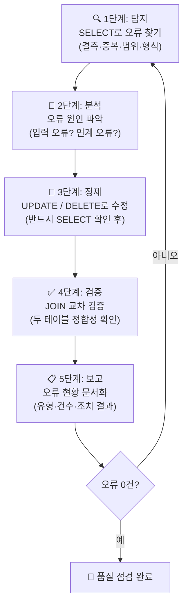

# 🏋️ 6.[실습] 데이터 정제·검증 실무 실습

정리일: 2026-10-08 · 교육 에셋 N1560

본문 수집·공개 편집. 도구 실행·최신 기능 재검증은 미실시. 고객·참여자 정보와 개별 접근 링크, 원본 첨부는 제외했습니다.

---

---

💡 **본 강의는 MySQL 을 기준으로 진행됩니다.**

**실습파일**

[첨부 원본 제외: 파일 권리·개인정보 확인 전입니다.]


[첨부 원본 제외: 파일 권리·개인정보 확인 전입니다.]


[첨부 원본 제외: 파일 권리·개인정보 확인 전입니다.]


[첨부 원본 제외: 파일 권리·개인정보 확인 전입니다.]


---
**\[수업 목표\]**
- 오류 탐지 SQL을 작성하여 결측·중복·범위 초과·형식 오류 데이터를 찾을 수 있습니다.
- SELECT → UPDATE 순서의 안전한 데이터 수정 원칙을 이해하고 적용할 수 있습니다.
- 품질 점검 프로세스(탐지 → 분석 → 정제 → 검증 → 보고) 5단계를 설계할 수 있습니다.
- JOIN을 활용한 교차 검증으로 테이블 간 데이터 정합성을 확인할 수 있습니다.
**\[목차\]**
1. 실습 목표 및 시나리오
2. 실습 1 — 오류 탐지 SQL 작성
3. 실습 2 — 데이터 정제 SQL 작성
4. 실습 3 — 품질 점검 프로세스 설계
5. 실습 4 — 정합성 검증 (JOIN 교차 검증)
6. 셀프 체크리스트 및 과제 제출
7. 요약
---
## 01. 실습 목표 및 시나리오
> ⏱ 예상 소요: 약 15분
💡 **실제 업무 데이터에서 오류를 탐지하고, 정제하고, 검증하는 전 과정을 실습합니다.**
- **☑️ 오늘 실습의 핵심 흐름**
데이터 품질 관리는 단순히 SQL 한 줄로 끝나는 작업이 아닙니다.
마치 병원에서 건강검진을 받을 때처럼,
**“찾기 → 원인 파악 → 치료 → 완치 확인 → 기록”** 순서가 있습니다. 🏥
오늘 실습에서는 이 흐름 전체를 직접 손으로 경험해 봅니다.

- **☑️ 오늘 실습의 목표**


<colgroup>
<col>
<col width="458">
</colgroup>


목표

설명


**오류 탐지**

SQL로 결측·중복·범위 초과·형식 오류를 찾을 수 있습니다.


**데이터 정제**

UPDATE, CASE WHEN 구문으로 오류 데이터를 수정할 수 있습니다.


**프로세스 설계**

품질 점검 순서와 체크리스트를 직접 설계할 수 있습니다.


**정합성 검증**

JOIN을 활용해 두 테이블 간 데이터를 교차 검증할 수 있습니다.


- **☑️ 실습 시나리오**
교육기관 10 데이터 매니저로 부임한 여러분은
이번 달 **열 사용량 데이터**와 **민원 데이터**를 분석하려고 합니다.
그런데 데이터를 열어보니 여러 문제가 발견되었습니다. 😨
> 💡 **Tip:** 실제 업무에서도 이런 상황은 매우 자주 발생합니다.<br>데이터 매니저의 핵심 역할 중 하나가 바로 이 오류를 찾고 고치는 것입니다.
**오늘 실습에서 발견하게 될 오류 목록:**


<colgroup>
<col>
<col>
<col width="273.9771728515625">
</colgroup>


오류 유형

발생 테이블

예시


**결측값(NULL)**

heat_usage, complaints

열 사용량 누락, 민원 유형 누락


**음수 값**

heat_usage

열 사용량 -50 Gcal


**비표준 지역명**

heat_usage

`이태원지사`, `파주지사`


**날짜 형식 불일치**

heat_usage

`2024.01.15` (점 구분자)


**정합성 오류**

complaints

customer_id가 없는 민원 행


- **☑️ 실습에 사용하는 테이블 구조**
```sql
-- 열 사용량 테이블 (heat_usage)
-- 공급지역별 고객의 열 사용 내역을 기록합니다.
CREATE TABLE 열사용량 (
    usage_id    VARCHAR(10),   -- 사용량 고유 ID
    region      VARCHAR(50),   -- 공급지역명
    usage_date  VARCHAR(20),   -- 사용일자 (일부러 VARCHAR로 설정 — 형식 오류 실습용)
    heat_amount DECIMAL(10,2), -- 열 사용량 (Gcal)
    customer_id VARCHAR(20)    -- 고객 ID
);

-- 민원 테이블 (complaints)
-- 고객이 접수한 민원 내역을 기록합니다.
CREATE TABLE 민원 (
    complaint_id   VARCHAR(10),
    receipt_date   DATE,        -- 민원 접수일
    complaint_type VARCHAR(50), -- 민원 유형 (난방불량/요금문의/공급중단/시설점검)
    region         VARCHAR(50),
    customer_name  VARCHAR(50),
    customer_phone VARCHAR(20),
    status         VARCHAR(20), -- 처리상태 (처리완료/처리중/접수)
    close_date     DATE,        -- 처리 완료일 (미완료 시 NULL)
    customer_id    VARCHAR(20)  -- 고객 ID (일부 누락 존재)
);

-- 고객 테이블 (customers)
-- 공사와 계약한 고객 정보를 관리합니다.
CREATE TABLE 고객 (
    customer_id   VARCHAR(20),
    customer_name VARCHAR(50),
    region        VARCHAR(50),
    customer_type VARCHAR(50)   -- 고객유형 (공동주택/업무시설/상업시설/공공시설)
);
```
---
## 02. 실습 1 — 오류 탐지 SQL 작성
> ⏱ 예상 소요: 약 50분
💡 **먼저 데이터에 어떤 오류가 있는지 SQL로 찾아보겠습니다. 고치기 전에 반드시 찾기 먼저입니다!**
오류 탐지의 원칙을 먼저 짚겠습니다.
집을 청소하기 전에 어디가 더러운지 먼저 살펴봐야 하듯이,
데이터도 **수정 전에 반드시 어떤 오류가 얼마나 있는지 파악**해야 합니다.
무작정 UPDATE부터 하면 안 됩니다! ⚠️
---
### 결측값(NULL) 탐지
**결측값이란 무엇인가요?**
엑셀에서 셀이 비어 있는 것을 떠올려 보세요. 😊
SQL에서는 이 빈 값을 `NULL`이라고 부릅니다.
필수 항목에 NULL이 있으면 **집계에서 해당 행이 자동으로 제외**됩니다.
예를 들어 열 사용량이 NULL인 행은 `SUM(heat_amount)` 계산에 포함되지 않아
**실제보다 적은 사용량으로 집계**되는 문제가 생깁니다.
> 💡 **Tip:** MySQL에서 `IS NULL`은 빈 값(NULL)을 찾고, `= ''`는 빈 문자열을 찾습니다. 둘 다 체크하는 습관을 가지세요!
- **☑️ 문제1: heat_usage 테이블 결측값 현황 요약**
**지금 무엇을 하는가:** 열 사용량 테이블의 필수 항목(지역·날짜·사용량·고객ID)에<br>NULL 또는 빈 값이 몇 건이나 있는지 한 번에 요약합니다.
```sql
-- 열사용량 테이블 전체 결측값 현황을 한 번에 요약합니다.
-- CASE WHEN ~ IS NULL THEN 1 ELSE 0END 패턴으로 각 항목별 결측 건수를 셉니다.
SELECT
    COUNT(*)                                                              AS 전체건수,
    SUM(CASE WHEN region      IS NULL OR region      = '' THEN 1 ELSE 0 END) AS 지역누락,
    SUM(CASE WHEN usage_date  IS NULL OR usage_date  = '' THEN 1 ELSE 0 END) AS 날짜누락,
    SUM(CASE WHEN heat_amount IS NULL                     THEN 1 ELSE 0 END) AS 사용량누락,
    SUM(CASE WHEN customer_id IS NULL OR customer_id = '' THEN 1 ELSE 0 END) AS 고객ID누락
FROM 열사용량;
```
- 정답화면


전체건수

지역누락

날짜누락

사용량누락

고객ID누락


122

0

0

1

0


- **🏋️‍♀️  직접 풀어보는 예제**
아래와 같이 사용량이 누락된 행의 상세 내용을 직접 확인하고싶습니다.
필요한 쿼리를 직접 작성해주세요.


usage_id

region

usage_date

heat_amount

customer_id


U012

옹산

2024-01-10

NULL

C008


<details>
<summary>정답코드 (결측 행 직접 확인)</summary>
```sql
-- 사용량이 누락된 행의 상세 내용을 직접 확인합니다.
-- 어떤 고객의, 어느 날짜 데이터가 빠졌는지 파악하기 위함입니다.
SELECT *
FROM 열사용량
WHERE heat_amount IS NULL;
```


usage_id

region

usage_date

heat_amount

customer_id


U012

옹산

2024-01-10

NULL

C008


</details>

- **☑️ 문제2: 민원 테이블 결측값 현황 요약**
**지금 무엇을 하는가:** 민원 테이블에서 민원 유형과 처리 상태가 누락된 건수를 확인합니다.<br>민원 유형이 없으면 유형별 통계를 낼 수 없어 보고서 작성이 불가능해집니다.
```sql
-- complaints 테이블 필수 항목 결측값 현황을 요약합니다.
SELECT
    COUNT(*)                                                                       AS 전체건수,
    SUM(CASE WHEN receipt_date   IS NULL                          THEN 1 ELSE 0 END) AS 접수일누락,
    SUM(CASE WHEN complaint_type IS NULL OR complaint_type = ''   THEN 1 ELSE 0 END) AS 유형누락,
    SUM(CASE WHEN status         IS NULL OR status         = ''   THEN 1 ELSE 0 END) AS 상태누락,
    SUM(CASE WHEN customer_id    IS NULL OR customer_id    = ''   THEN 1 ELSE 0 END) AS 고객ID누락
FROM 민원;
```
- 정답화면


전체건수

접수일누락

유형누락

상태누락

고객ID누락


42

0

1

0

3


- **🏋️‍♀️  직접 풀어보는 예제**
아래와 같이 사용량이 결측치인 행들을 모두\~! 직접 확인하고싶습니다. 필요한 쿼리를 직접 작성해주세요.


complaint_id

receipt_date

region

customer_name

status


CM008

2024-01-10

마포

강호동

처리완료


<details>
<summary>정답코드</summary>
```sql
-- 민원 유형이 누락된 행을 직접 확인합니다.
SELECT *
FROM 민원
WHERE complaint_type IS NULL OR complaint_type = '';
```


complaint_id

receipt_date

region

customer_name

status


CM008

2024-01-10

마포

강호동

처리완료


</details>
---
### 중복 데이터 탐지
**중복이란 무엇인가요?**
같은 고객이 같은 날 같은 지역에서 열을 사용한 기록이 두 번 등록된 상황입니다.
예를 들어 우리가 카카오뱅크 앱에서 이체 버튼을 두 번 눌렀는데
**두 번 모두 출금된다면** 심각한 문제겠죠? 🙂
데이터도 마찬가지입니다. 중복 행은 합계나 평균을 왜곡합니다.
- **☑️ 문제3: heat_usage 중복 데이터 탐지**
**지금 무엇을 하는가:** 동일한 날짜·지역·고객 조합이 두 번 이상 등록된 행을 찾습니다.<br>`GROUP BY`로 묶고 `HAVING COUNT(*) > 1` 조건으로 중복 건만 걸러냅니다.
```sql
-- 같은 날짜·지역·고객 조합의 중복 건을 탐지합니다.
-- HAVING COUNT(*) > 1 : 조합이 2건 이상인 경우만 결과로 보여줍니다.
SELECT
    region,
    usage_date,
    customer_id,
    COUNT(*) AS 중복건수
FROM 열사용량
GROUP BY region, usage_date, customer_id
HAVING COUNT(*) > 1
```
- 정답화면
결과가 0행이면 중복 없음. 행이 나타나면 해당 조합이 중복된 것입니다.
*(실습 데이터에는 의도적 중복이 없으므로 0행이 정상 결과입니다.)*
---
### 범위 초과 오류 탐지
**범위 초과란 무엇인가요?**
한 달에 물을 100L 사용한다고 기록했는데, 실제로는 **-50L** 라고 적혀 있다면?
물리적으로 불가능한 값입니다.
열 사용량도 음수가 될 수 없고, 정상 범위를 크게 벗어난 값은 계량기 오류나<br>입력 실수를 의미합니다.
- **☑️ 문제4: heat_usage 음수·초과값 탐지**
**지금 무엇을 하는가:** 열 사용량(heat_amount)이 음수이거나 업무 기준 최대값 5000을<br>초과한 행을 찾아 이상 데이터를 식별합니다.
```sql
-- 열 사용량이 음수이거나 비정상적으로 큰 값인 행을 탐지합니다.
-- 업무 기준 최대값은 담당자 확인 후 설정합니다. (여기서는 5000 Gcal 기준 사용)
SELECT
    usage_id,
    region,
    usage_date,
    heat_amount,
    customer_id,
    CASE
        WHEN heat_amount < 0     THEN '음수 오류'
        WHEN heat_amount > 5000  THEN '초과값 오류'
    END AS 오류유형
FROM 열사용량
WHERE heat_amount < 0
   OR heat_amount > 5000;
```
- 정답화면


usage_id

region

usage_date

heat_amount

customer_id

오류유형


U047

강남

2024-02-10

-50.00

C023

음수 오류


- **☑️ 문제5: complaints 날짜 논리 오류 탐지**
**지금 무엇을 하는가:** 처리 완료일(close_date)이 접수일(receipt_date)보다<br>앞선 경우를 찾습니다. 처리가 접수 전에 완료될 수는 없으므로 논리 오류입니다.
```sql
-- 처리 완료일이 접수일보다 이전인 논리 오류를 탐지합니다.
-- 시간이 거꾸로 흐를 수는 없으므로, 이 경우는 입력 오류입니다.
SELECT
    complaint_id,
    receipt_date    AS 접수일,
    close_date      AS 처리완료일,
    DATEDIFF(close_date, receipt_date) AS 처리소요일
FROM 민원
WHERE close_date IS NOT NULL
  AND close_date < receipt_date;  -- 처리완료일이 접수일보다 이른 경우

-- 추가: 미래 날짜로 접수된 민원도 탐지합니다. (오늘보다 미래 접수는 불가)
SELECT *
FROM 민원
WHERE receipt_date > CURDATE();
```
- 정답화면
*(실습 데이터에는 해당 오류가 없으므로 0행이 정상 결과입니다.)*
---
### 형식 오류 탐지
- **☑️ 문제6: heat_usage 날짜 형식 비표준 탐지** 👿 💣💥
**지금 무엇을 하는가:** usage_date가 VARCHAR 타입이라 `2024-01-15` 형식과<br>`2024.01.15` 형식이 혼재할 수 있습니다. 두 형식이 섞이면 날짜 비교나<br>정렬이 정확하지 않게 됩니다.
```sql
-- 날짜 형식이 표준(하이픈)이 아닌 행을 탐지합니다.
-- LIKE '____.__.__' : 연도4자리.월2자리.일2자리 패턴 (점 구분자)
SELECT
    usage_id,
    region,
    usage_date           AS 현재날짜형식,
    '비표준(점 구분자)' AS 오류유형
FROM 열사용량
WHERE usage_date LIKE '____.__.__';  -- 2024.01.15 형태 탐지
```
```sql
-- 비표준 지역명도 함께 확인합니다. (이태원지사, 파주지사 등)
SELECT
    usage_id,
    region  AS 현재지역명,
    '비표준 지역명' AS 오류유형
FROM 열사용량
WHERE region NOT IN ('이태원', '옹산', '파주', '수원', '제주', '강남', '마포', '용산');
```
- 정답화면 (날짜 형식 오류)


usage_id

region

현재날짜형식

오류유형


U121

이태원지사

2024.01.15

비표준(점 구분자)


- 정답화면 (비표준 지역명)


usage_id

현재지역명

오류유형


U121

이태원지사

비표준 지역명


U122

파주지사

비표준 지역명


---
### 오류 탐지 결과 종합 요약
오류 탐지 SQL을 모두 실행했다면, 아래 표를 채워보세요. ✏️


오류 유형

발생 테이블

발견 건수

영향


결측값 (heat_amount NULL)

heat_usage

1건

사용량 집계 오류


결측값 (complaint_type NULL)

complaints

1건

유형별 통계 불가


결측값 (customer_id NULL)

complaints

3건

고객 연계 불가


음수 값

heat_usage

1건

합계 과소 집계


비표준 지역명

heat_usage

2건

지역별 집계 오류


날짜 형식 불일치

heat_usage

1건

날짜 정렬·비교 오류


---
## 03. 실습 2 — 데이터 정제 SQL 작성
> ⏱ 예상 소요: 약 55분
💡 **탐지한 오류를 SQL로 수정합니다. 반드시 SELECT로 먼저 확인하고, UPDATE는 나중에 실행하세요! 🔐**
### 🚨 데이터 수정의 황금 원칙
> **“SELECT로 먼저 보고, UPDATE는 나중에”**
의사가 수술 전에 반드시 X-ray로 먼저 확인하듯,
데이터도 UPDATE 전에 반드시 **SELECT로 바뀔 내용을 눈으로 확인**해야 합니다.
만약 이 원칙을 지키지 않으면…


상황

결과


WHERE 조건이 잘못된 경우

의도하지 않은 행까지 전체 수정


CASE WHEN 분기가 누락된 경우

일부 행이 엉뚱한 값으로 변경


트랜잭션 없이 실행한 경우

롤백 불가 → 영구 손상


**\<올바른 수정 순서\>**


단계

SQL

목적


**1단계**

`SELECT` 로 변경 대상 확인

내가 바꾸려는 행이 맞는지 눈으로 검증


**2단계**

`SELECT ... CASE WHEN` 으로 변환 미리보기

바뀐 값이 기대한 대로인지 확인


**3단계**

`UPDATE` 실행

실제 수정


**4단계**

`SELECT` 로 수정 결과 재확인

의도대로 바뀌었는지 검증


---
- **☑️ 문제1: 비표준 지역명 표준화 (CASE WHEN)**
**지금 무엇을 하는가:** `이태원지사`, `파주지사` 처럼 비표준으로 입력된 지역명을<br>표준 코드(`이태원`, `파주`)로 변환합니다.<br>표준화 전에 SELECT로 바뀔 내용을 미리 확인합니다.
**1단계: SELECT로 변환 미리보기**
```sql
-- UPDATE 전, 실제로 어떻게 바뀌는지 SELECT로 먼저 확인합니다.
-- 원본 지역명과 표준화된 지역명을 나란히 보여줍니다.
SELECT
    usage_id,
    region                                              AS 원본지역명,
    CASE
        WHEN region IN ('이태원지사', '이태원사업소') THEN '이태원'
        WHEN region IN ('파주지사',   '파주사업소')   THEN '파주'
        ELSE region                                     -- 이미 표준인 경우 그대로 유지
    END                                                 AS 표준지역명
FROM 열사용량
WHERE region NOT IN ('이태원', '옹산', '파주', '수원', '제주', '강남', '마포', '용산');
```
- 미리보기 결과


usage_id

원본지역명

표준지역명


U121

이태원지사

이태원


U122

파주지사

파주


**2단계: 눈으로 확인 후 UPDATE 실행**
```sql
-- 미리보기에서 확인한 내용이 맞으면 UPDATE를 실행합니다.
-- WHERE 조건을 동일하게 유지하는 것이 핵심입니다.
UPDATE 열사용량
SET region = CASE
    WHEN region IN ('이태원지사', '이태원사업소') THEN '이태원'
    WHEN region IN ('파주지사',   '파주사업소')   THEN '파주'
    ELSE region
END
WHERE region NOT IN ('이태원', '옹산', '파주', '수원', '제주', '강남', '마포', '용산');
```
**3단계: 수정 후 재확인**
```sql
-- 비표준 지역명이 0건으로 줄었는지 확인합니다.
-- 결과가 0행이면 표준화 완료입니다.
SELECT region, COUNT(*) AS 건수
FROM 열사용량
WHERE region NOT IN ('이태원', '옹산', '파주', '수원', '제주', '강남', '마포', '용산')
GROUP BY region;
```
- 정답화면 (수정 후)
*(0행이 출력되면 정상적으로 표준화된 것입니다.)*
- **☑️ 문제2: 날짜 형식 표준화 (STR_TO_DATE)**
**지금 무엇을 하는가:** 점(.) 구분자로 입력된 날짜(`2024.01.15`)를<br>표준 하이픈 형식(`2024-01-15`)으로 변환합니다.
**1단계: SELECT로 변환 미리보기**
```sql
-- 점(.) 구분자 날짜를 표준 형식으로 변환한 결과를 미리 확인합니다.
-- STR_TO_DATE(값, 형식) : 문자열을 날짜로 변환하는 MySQL 함수
-- DATE_FORMAT(날짜, 형식) : 날짜를 원하는 형식의 문자열로 출력
SELECT
    usage_id,
    usage_date                                                          AS 현재날짜,
    DATE_FORMAT(STR_TO_DATE(usage_date, '%Y.%m.%d'), '%Y-%m-%d')       AS 변환후날짜
FROM 열사용량
WHERE usage_date LIKE '____.__.__';  -- 점 구분자 형태만 선택
```
- 미리보기 결과


usage_id

현재날짜

변환후날짜


U121

2024.01.15

2024-01-15


**2단계: UPDATE 실행**
```sql
-- 점 구분자 날짜를 표준 하이픈 형식으로 일괄 변환합니다.
UPDATE heat_usage
SET usage_date = DATE_FORMAT(STR_TO_DATE(usage_date, '%Y.%m.%d'), '%Y-%m-%d')
WHERE usage_date LIKE '____.__.__';
```
**3단계: 수정 후 재확인**
```sql
-- 점 구분자 형태가 0건으로 줄었는지 확인합니다.
SELECT COUNT(*) AS 비표준날짜건수
FROM 열사용량
WHERE usage_date LIKE '____.__.__';
```
- 정답화면 (수정 후)비표준날짜건수0
---
- **☑️ 문제3: 결측값 처리 (NULL → 임시값)**
**지금 무엇을 하는가:** 민원 유형이 NULL인 건을 `'미분류'`로 임시 처리합니다.<br>원천 데이터를 확인할 수 없는 상황에서, NULL보다는 명시적 레이블이 관리에 유리합니다.
> ⚠️ **주의:** 임시값으로 채운 경우, 반드시 원천 데이터 확인 후 실제값으로 교체해야 합니다.<br>`'미분류'` 상태로 방치하면 통계 왜곡이 지속됩니다.
**1단계: 처리 전 현황 확인**
```sql
-- 민원 유형이 NULL인 행의 상세 내용을 먼저 확인합니다.
SELECT complaint_id, receipt_date, region, customer_name, status
FROM 민원
WHERE complaint_type IS NULL OR complaint_type = '';
```
- 확인 결과


complaint_id

receipt_date

region

customer_name

status


CM008

2024-01-10

마포

강호동

처리완료


**2단계: UPDATE 실행**
```sql
-- 민원 유형이 NULL 또는 빈 문자열인 행을 '미분류'로 처리합니다.
UPDATE 민원
SET complaint_type = '미분류'
WHERE complaint_type IS NULL OR complaint_type = '';
```
**3단계: 수정 후 재확인**
```sql
-- 유형별 건수를 조회하여 '미분류'가 정상적으로 반영되었는지 확인합니다.
SELECT complaint_type, COUNT(*) AS 건수
FROM 민원
GROUP BY complaint_type
ORDER BY 건수 DESC;
```
- 정답화면 (수정 후)


complaint_type

건수


난방불량

15


요금문의

14


공급중단

11


시설점검

9


미분류

1


- **☑️ 문제4: 음수 사용량 처리 방안 논의** 👿 💣💥
**지금 무엇을 하는가:** heat_amount가 -50인 이상 행(U047)을 어떻게 처리할지<br>결정합니다. 음수 사용량은 물리적으로 불가능하므로, 세 가지 처리 방안 중<br>업무 판단에 따라 선택합니다.
```sql
-- 먼저 음수 사용량 행의 전체 내용을 확인합니다.
SELECT *
FROM 열사용량
WHERE heat_amount < 0;
```
- 확인 결과


usage_id

region

usage_date

heat_amount

customer_id


U047

강남

2024-02-10

-50.00

C023


**처리 방안별 SQL:**


처리 방안

적용 조건

SQL 예시


**원천 데이터 재확인 후 수정**

계량기 원시 데이터 접근 가능 시

`UPDATE heat_usage SET heat_amount = [정확한값] WHERE usage_id = 'U047'`


**NULL로 표시하여 제외**

원천 확인 불가, 집계 왜곡 방지

`UPDATE heat_usage SET heat_amount = NULL WHERE heat_amount < 0`


**해당 행 삭제**

완전히 신뢰 불가한 행으로 판단 시

`DELETE FROM heat_usage WHERE heat_amount < 0`


> 💡 **Tip:** 실무에서는 **원천 데이터 재확인**을 우선합니다. 계량기 오류인지,<br>입력 실수인지 확인 후 처리 방안을 결정하세요. 삭제는 최후의 수단입니다!
---
## 04. 실습 3 — 품질 점검 프로세스 설계
> ⏱ 예상 소요: 약 35분
💡 **SQL 쿼리만큼 중요한 것이 체계적인 점검 프로세스입니다. 내가 지금 어떤 단계에 있는지 알아야 빠뜨리는 항목이 없습니다.**
데이터 품질 점검은 **매달 반복되는 업무**입니다.
매번 “어디부터 봐야 하더라…” 고민하지 않으려면,
**표준화된 점검 프로세스 문서**를 만들어 두어야 합니다.
병원 체크리스트, 항공기 출발 전 점검 목록처럼요. ✈️
- **☑️ 열 사용량 데이터 품질 점검 프로세스 완성하기**
아래 템플릿의 빈칸을 채워 완성하세요. ✏️


단계

점검 항목

사용 SQL 패턴

임계값

오류 발견 시 조치


**1단계: 결측값 점검**

region, usage_date, heat_amount NULL 여부

`SUM(CASE WHEN ~ IS NULL)`

NULL 0건


**2단계: 음수·범위 점검**

heat_amount 음수·초과 여부


이상값 0건


**3단계: 형식 점검**

usage_date 날짜 형식 통일 여부


비표준 0건


**4단계: 코드 점검**

region 표준 코드 사용 여부


비표준 0건


**5단계: 정합성 점검**

customer_id가 customers 테이블에 존재하는지


미매칭 0건


- 예시 답안


단계

점검 항목

사용 SQL 패턴

임계값

오류 발견 시 조치


**1단계: 결측값 점검**

필수 항목 NULL 여부

`SUM(CASE WHEN ~ IS NULL)`

NULL 0건

원천 데이터 확인 → 보완 입력 또는 미분류 처리


**2단계: 음수·범위 점검**

음수·비정상 수치

`WHERE heat_amount < 0`

이상값 0건

계량기 원시 데이터 재확인 후 수정


**3단계: 형식 점검**

날짜 형식 통일

`WHERE usage_date LIKE '____.__.__'`

비표준 0건

STR_TO_DATE로 표준 형식 변환


**4단계: 코드 점검**

표준 지역 코드 사용

`WHERE region NOT IN (표준목록)`

비표준 0건

CASE WHEN으로 표준 코드 매핑


**5단계: 정합성 점검**

customers 테이블 연계

`LEFT JOIN ~ WHERE IS NULL`

미매칭 0건

고객 마스터 확인 후 customer_id 수정


- **☑️ 점검 주기 및 보고 체계 설계**
**✏️ 실습 과제:** 아래 빈칸을 채워 점검 주기와 보고 체계를 완성하세요.


구분

내용


**점검 주기**

월 1회 (매월 첫째 주 월요일)


**점검 담당자**


**점검 결과 보고 대상**


**오류 임계값 초과 시 에스컬레이션**


**점검 결과 보관 방법**


---
# SQL 문법 : Join
### Join-01. JOIN이란?
💡 **JOIN은 두 테이블을 공통 키(열)로 연결해서 하나의 결과로 합쳐 보는 SQL 구문입니다.**
- **☑️ 왜 JOIN이 필요한가요?**
현실에서 데이터는 하나의 테이블에 모두 담기지 않아요.
예를 들어, 교육기관 10의 데이터는 이렇게 나뉘어 있습니다.


테이블

담긴 정보


`열사용량`

지역별 열 사용량, 날짜, customer_id


`고객`

고객 이름, 연락처, 주소 등 고객 정보


`민원`

민원 내용, 접수일, customer_id


“이 고객이 이번 달에 열을 얼마나 사용했지?” 라는 질문에 답하려면
`heat_usage`의 사용량 정보 + `customers`의 고객 이름을 **함께** 봐야 합니다.
이때 두 테이블을 연결해 주는 것이 바로 **JOIN** 입니다! 🔗
- **☑️ JOIN의 핵심 개념: 공통 키(ON)**
두 테이블을 연결하려면 **공통으로 존재하는 열**이 필요해요.
`열사용량`와 `고객`의 공통 열은 `customer_id`입니다.
```plain text
열사용량 테이블          고객 테이블
┌────────────────────┐    ┌─────────────────────────┐
│ usage_id           │    │ customer_id  ◀──── 공통 키
│ customer_id ───────┼────▶ customer_name            │
│ region             │    │ phone                   │
│ heat_amount        │    │ address                 │
└────────────────────┘    └─────────────────────────┘
```
JOIN 구문에서 이 공통 키는 **ON 절**에 명시합니다.
```sql
FROM 열사용량 h
JOIN 고객 c
  ON h.customer_id = c.customer_id
```
---
### Join-02. JOIN 종류
💡 **JOIN에는 여러 종류가 있지만, 실무에서 가장 많이 쓰는 두 가지만 먼저 익혀봐요.**
- **☑️ INNER JOIN — 양쪽 모두 있는 행만 연결**
두 테이블 모두에 `customer_id`가 있는 행만 결과에 포함돼요.
어느 한쪽에만 있으면 결과에서 제외됩니다.


heat_usage.customer_id

customers.customer_id

결과 포함?


C001

C001

✅ 포함


C002

C002

✅ 포함


C999

(없음)

❌ 제외


```sql
-- INNER JOIN 예시: 양쪽 모두 존재하는 고객의 사용량만 조회
SELECT
    h.region        AS 지역,
    h.usage_date    AS 사용일자,
    h.heat_amount   AS 열사용량,
    c.customer_name AS 고객명
FROM 열사용량 h
INNER JOIN 고객 c
       ON h.customer_id = c.customer_id
;
```
> 💡 **Tip:** `INNER JOIN`은 줄여서 `JOIN`이라고만 써도 동일하게 동작합니다.
- **☑️ LEFT JOIN — 왼쪽 테이블은 모두 포함, 오른쪽은 있으면 연결**
왼쪽 테이블(`FROM` 뒤에 오는 테이블)의 모든 행은 결과에 포함됩니다.
오른쪽 테이블에 일치하는 행이 없으면 해당 열이 **NULL**로 채워져요.


열사용량.customer_id

고객.customer_id

결과 포함?

customers 열 값


C001

C001

✅ 포함

정상 출력


C002

C002

✅ 포함

정상 출력


C999

(없음)

✅ 포함

**NULL**


```sql
-- LEFT JOIN 예시: 고객 정보가 없는 사용량 행도 모두 포함해서 조회
SELECT
    h.region        AS 지역,
    h.usage_date    AS 사용일자,
    h.heat_amount   AS 열사용량,
    c.customer_name AS 고객명   -- 고객 없으면 NULL
FROM 열사용량 h
LEFT JOIN 고객 c
       ON h.customer_id = c.customer_id
;
```
> 💡 **LEFT JOIN이 유용한 경우:** “고객 정보가 없는 사용량 데이터가 있는지 확인할 때” — 이것이 바로 다음 실습에서 배울 **정합성 검증**의 핵심 패턴입니다!
- **☑️ INNER JOIN vs LEFT JOIN 한눈에 비교**


구분

INNER JOIN

LEFT JOIN


포함 기준

양쪽 모두 키가 일치하는 행만

왼쪽 테이블 전체 (오른쪽은 없으면 NULL)


주요 용도

두 테이블 데이터를 합쳐서 분석할 때

한쪽에만 있는 데이터(누락·불일치)를 찾을 때


결과 행 수

작아질 수 있음

왼쪽 테이블 행 수 이상 유지


---
### Join-03. 별칭(Alias) 사용법
💡 **JOIN을 쓸 때는 테이블 이름이 길어지므로, 짧은 별칭(Alias)을 붙여 쓰는 것이 일반적이에요.**
- **☑️ 테이블 별칭 지정하기**
`FROM 테이블명 별칭` 형태로 쓰면 이후 구문에서 별칭을 사용할 수 있습니다.
```sql
FROM 열사용량 h        -- heat_usage 테이블을 h 로 줄임
LEFT JOIN customers c    -- customers 테이블을 c 로 줄임
       ON h.customer_id = c.customer_id
```
컬럼을 지정할 때는 `별칭.컬럼명` 으로 어느 테이블의 열인지 명확히 표시합니다.
```sql
SELECT
    h.region,        -- heat_usage 의 region
    c.customer_name  -- customers 의 customer_name
```
> 💡 **왜 별칭이 필요한가요?** 두 테이블에 같은 이름의 컬럼이 있으면 SQL이 어느 테이블 것인지 알 수 없어 오류가 발생합니다. 별칭으로 구분해 주세요!
---
### Join-04. 직접 해보기
💡 **아래 두 문제를 직접 실행해 보세요. JOIN에 익숙해지면 다음 정합성 검증 실습이 훨씬 쉬워집니다! 😊**
- **☑️ 문제 1: INNER JOIN으로 고객명 + 지역 + 열사용량 조회하기**
`heat_usage`와 `customers`를 `customer_id`로 연결해서
고객명, 지역, 열사용량을 함께 조회해 보세요.
```sql
SELECT
    c.customer_name AS 고객명,
    h.region        AS 지역,
    h.heat_amount   AS 열사용량,
    h.usage_date    AS 사용일자
FROM heat_usage h
INNER JOIN customers c
       ON h.customer_id = c.customer_id
ORDER BY h.usage_date DESC
;
```
- **예시 답안 (실행 결과 형태)**


고객명

지역

열사용량

사용일자


문동은

분당

350.2

2024-12-01


박연진

일산

210.5

2024-12-01


…

…

…

…


- **☑️ 문제 2: LEFT JOIN으로 고객 정보가 없는 사용량 행 찾기**
`heat_usage`에는 있지만 `customers`에는 없는 `customer_id`를 찾아보세요.
결과가 0건이면 정합성이 완벽한 것입니다! ✅
```sql
SELECT
    h.usage_id,
    h.customer_id  AS 사용량테이블_고객ID,
    c.customer_id  AS 고객테이블_고객ID  -- 없으면 NULL
FROM heat_usage h
LEFT JOIN customers c
       ON h.customer_id = c.customer_id
WHERE c.customer_id IS NULL   -- 오른쪽(customers)에서 일치하지 않는 행
;
```
- **예시 답안**
*(실습 데이터에 정합성 오류가 없으면 0건이 정상 결과입니다.)*
이 패턴 — **LEFT JOIN + WHERE 오른쪽키 IS NULL** — 이 다음 실습의 핵심이에요! 🔑
---
### 핵심 정리
💡 **금일 JOIN 내용을 복기해 보겠습니다.**
- **JOIN** 은 두 테이블을 공통 키(ON 절)로 연결하는 SQL 구문입니다.
- **INNER JOIN** 은 양쪽 모두에 키가 존재하는 행만 결과에 포함합니다.
- **LEFT JOIN** 은 왼쪽 테이블 전체를 유지하고, 오른쪽은 없으면 NULL로 채웁니다.
- 테이블 별칭(`h`, `c`)을 사용하면 쿼리가 짧아지고 가독성이 높아집니다.
- 컬럼 앞에 `별칭.컬럼명`을 붙여 어느 테이블의 열인지 명확히 표시합니다.
- **LEFT JOIN + WHERE 오른쪽키 IS NULL** 패턴은 정합성 오류를 찾는 핵심 기법입니다.
- JOIN을 쓸 때는 항상 **ON 조건**을 빠뜨리지 않도록 주의하세요!


---
# 05. 실습 4 — 정합성 검증 (JOIN 교차 검증)
> ⏱ 예상 소요: 약 45분
💡 **두 테이블을 JOIN하여 데이터 간 정합성을 확인합니다. 각 테이블이 따로따로는 맞아도, 서로 연결했을 때 맞지 않는 경우가 생길 수 있습니다.**
**정합성이란 무엇인가요?**
퍼즐 조각을 떠올려 보세요. 🧩
각 조각은 혼자 보면 멀쩡하지만,
**두 조각을 붙였을 때 모양이 맞아야** 완전한 그림이 됩니다.
데이터도 마찬가지입니다.
열 사용량 테이블의 customer_id가 고객 테이블에 **반드시 존재**해야 합니다.
존재하지 않는 customer_id가 있다면, 해당 행은 누구의 사용량인지 알 수 없습니다.
**만약 정합성을 점검하지 않으면?**


상황

발생하는 문제


heat_usage의 customer_id가 customers에 없는 경우

고객 정보 JOIN 불가 → 고객별 분석 오류


complaints의 region이 heat_usage에 없는 경우

지역별 민원·사용량 통합 분석 불가


complaints의 customer_id가 누락된 경우

민원 고객 추적 불가 → 후속 조치 불가


---
- **☑️ 문제1: 열사용량 ↔︎ 고객 정합성 검증**
**지금 무엇을 하는가:** 열 사용량 테이블의 customer_id가 고객 테이블에<br>존재하지 않는 행을 LEFT JOIN으로 찾습니다.<br>`LEFT JOIN` 후 `WHERE c.customer_id IS NULL` 패턴이 핵심입니다.
```sql
-- 열사용량 테이블의 customer_id가 고객 테이블에 없는 행을 찾습니다.
-- LEFT JOIN: 왼쪽(heat_usage) 전체를 유지하고 오른쪽(customers)에서 일치하는 행을 연결
-- WHERE c.customer_id IS NULL: 오른쪽에서 일치하는 행이 없는 경우만 추출
SELECT
    h.usage_id,
    h.region,
    h.usage_date,
    h.heat_amount,
    h.customer_id          AS 사용량테이블_고객ID,
    c.customer_id          AS 고객테이블_고객ID,    -- 없으면 NULL
    c.customer_name        AS 고객명
FROM 열사용량 h
LEFT JOIN 고객 c
       ON h.customer_id = c.customer_id
WHERE c.customer_id IS NULL;  -- 고객 테이블에 없는 customer_id
```
- 정답화면
*(실습 데이터에는 미매칭 건이 없으므로 0행이 정상 결과입니다.)*
- **☑️ 문제2: complaints ↔︎ customers 정합성 검증**
**지금 무엇을 하는가:** 민원 테이블의 customer_id가 NULL인 행(접수 상태인 민원)을<br>확인하고, 고객 테이블과 연계 가능한 민원만 필터링합니다.
```sql
-- 민원 테이블에서 customer_id가 없는 행을 먼저 확인합니다.
-- 이 행들은 고객 정보와 연계할 수 없어 분석에서 제외되거나 별도 처리가 필요합니다.
SELECT
    complaint_id,
    receipt_date,
    complaint_type,
    region,
    customer_name,
    status,
    customer_id       AS 고객ID
FROM 민원
WHERE customer_id IS NULL OR customer_id = '';
```
- 정답화면


complaint_id

receipt_date

complaint_type

region

customer_name

status

고객ID


CM010

2024-01-12

시설점검

옹산

박민준

접수

NULL


CM025

2024-01-27

요금문의

파주

오미래

접수

NULL


CM038

2024-02-11

요금문의

이태원

최신규

접수

NULL


```sql
-- customer_id가 있는 민원 중, 고객 테이블에 없는 customer_id가 있는지 확인합니다.
SELECT
    c.complaint_id,
    c.customer_id      AS 민원테이블_고객ID,
    cust.customer_id   AS 고객테이블_고객ID
FROM 민원 c
LEFT JOIN customers cust
       ON c.customer_id = cust.customer_id
WHERE c.customer_id IS NOT NULL          -- customer_id가 있는 행만
  AND cust.customer_id IS NULL;          -- 고객 테이블에 없는 경우
```
- 정답화면
*(실습 데이터에서 customer_id가 있는 민원은 모두 고객 테이블에 존재합니다. 0행이 정상입니다.)*
- **☑️ 문제3: 지역명 정합성 검증 (심화)** 👿 💣💥
**지금 무엇을 하는가:** 민원 테이블의 region 값 중, 열 사용량 테이블에 없는<br>지역명을 찾습니다. 두 테이블의 지역명이 다르면 지역별 통합 분석이 불가능합니다.
```sql
-- 민원 테이블의 지역명 중 열 사용량 테이블에 없는 지역명을 찾습니다.
-- 서브쿼리로 열 사용량 테이블의 지역명 목록을 만들고, LEFT JOIN으로 비교합니다.
SELECT DISTINCT
    c.region           AS 민원테이블_지역명,
    h.region           AS 사용량테이블_지역명   -- 없으면 NULL
FROM 민원 c
LEFT JOIN (
    SELECT DISTINCT region FROM 열사용량
) h ON c.region = h.region
WHERE h.region IS NULL;                   -- 열 사용량 테이블에 없는 지역명
```
- 정답화면
*(실습 데이터에서는 두 테이블의 지역명이 일치합니다. 0행이 정상입니다.)*
**역방향 검증: 열 사용량에는 있는데 민원에는 없는 지역 확인**
```sql
-- 열 사용량 테이블의 지역명 중 민원 테이블에 없는 지역명을 찾습니다.
-- 해당 지역에 민원이 한 건도 없다는 의미이므로, 데이터 누락인지 실제 0건인지 확인 필요합니다.
SELECT DISTINCT
    h.region           AS 사용량테이블_지역명,
    c.region           AS 민원테이블_지역명   -- 없으면 NULL
FROM 열사용량 h
LEFT JOIN (
    SELECT DISTINCT region FROM complaints
) c ON h.region = c.region
WHERE c.region IS NULL;
```
- 정답화면
*(실습 데이터에서는 두 테이블의 지역명이 일치합니다. 0행이 정상입니다.)*
---
# 06. 셀프 체크리스트 및 과제 제출
> ⏱ 예상 소요: 약 20분
💡 **오늘 실습 내용을 점검해 보겠습니다.**
- **☑️ 셀프 체크리스트**
오늘 배운 내용을 스스로 점검해 보세요. 자신 있으면 ✅, 아직 불확실하면 🔲 표시! 😊


<colgroup>
<col width="386">
<col>
</colgroup>


항목

확인


결측값(NULL) 탐지 SQL을 작성하고 실행할 수 있다

🔲


음수·범위 초과 오류 탐지 SQL을 작성할 수 있다

🔲


날짜 형식 비표준 탐지 SQL(LIKE 패턴)을 작성할 수 있다

🔲


SELECT 미리보기 → UPDATE 실행 순서를 지킬 수 있다

🔲


CASE WHEN으로 비표준 코드값을 표준화할 수 있다

🔲


STR_TO_DATE + DATE_FORMAT으로 날짜 형식을 변환할 수 있다

🔲


품질 점검 프로세스 5단계를 설명할 수 있다

🔲


LEFT JOIN + WHERE IS NULL 패턴으로 정합성 오류를 탐지할 수 있다

🔲


오류 탐지 결과를 표로 정리하여 보고할 수 있다

🔲


- **☑️ 과제 제출 항목**
오늘 실습한 내용을 바탕으로 아래 과제를 완성하여 제출해 주세요. 😊


<colgroup>
<col>
<col width="468">
</colgroup>


과제

내용


**과제 1**

실습 데이터에서 발견한 오류 목록을 유형·테이블·건수·영향 항목으로 정리하세요. (표 형식)


**과제 2**

실습 3에서 설계한 품질 점검 프로세스 5단계를 완성된 표로 제출하세요.


**과제 3**

실습 4의 정합성 검증 쿼리(문제1\~3)를 직접 작성하고 실행 결과를 캡처하여 첨부하세요.


**과제 4 (심화)**

우리 팀/부서의 실제 업무 데이터 한 가지를 선택하여 품질 점검 항목 5가지를 설계하고, 각 항목에 대한 SQL 쿼리를 작성해 보세요.


---
# 07. 요약
> ⏱ 예상 소요: 약 10분
💡 **금일 수업내용을 복기해 보겠습니다.**
- 데이터 품질 점검은 탐지 → 분석 → 정제 → 검증 → 보고의 5단계 흐름으로 진행됩니다.
- 결측값(NULL)이 있는 필수 항목은 집계 함수에서 해당 행이 자동으로 제외되어 통계 오류를 유발합니다.
- `SUM(CASE WHEN ~ IS NULL THEN 1 ELSE 0 END)` 패턴으로 항목별 결측 건수를 한 번에 요약할 수 있습니다.
- 중복 데이터는 `GROUP BY` + `HAVING COUNT(*) > 1` 패턴으로 탐지합니다.
- 음수, 미래 날짜, 논리적 역순 날짜 등의 범위 오류는 `WHERE` 조건으로 직접 필터링하여 탐지합니다.
- 데이터 수정 시 반드시 `SELECT`로 변경 대상과 변환 결과를 먼저 확인한 후 `UPDATE`를 실행합니다.
- `CASE WHEN`을 활용하면 다양한 비표준 코드값을 표준 코드로 일괄 변환할 수 있습니다.
- `STR_TO_DATE`와 `DATE_FORMAT`을 조합하면 다양한 날짜 형식을 표준 형식으로 변환할 수 있습니다.
- `LEFT JOIN` 후 `WHERE 오른쪽테이블.키 IS NULL` 패턴은 두 테이블 간 정합성 오류를 탐지하는 핵심 방법입니다.
- 정합성 검증은 단방향(A → B)뿐 아니라 역방향(B → A)도 함께 확인해야 완전합니다.
- 음수 사용량과 같은 물리적 불가능 값은 원천 데이터 재확인을 우선하고, 삭제는 최후의 수단으로 사용합니다.
- 품질 점검 프로세스를 문서화해 두면 매달 반복되는 점검 업무를 표준화하고 누락 없이 수행할 수 있습니다.
- 오류 탐지 결과는 유형·건수·영향·조치 항목을 포함한 표로 정리하여 보고합니다.
