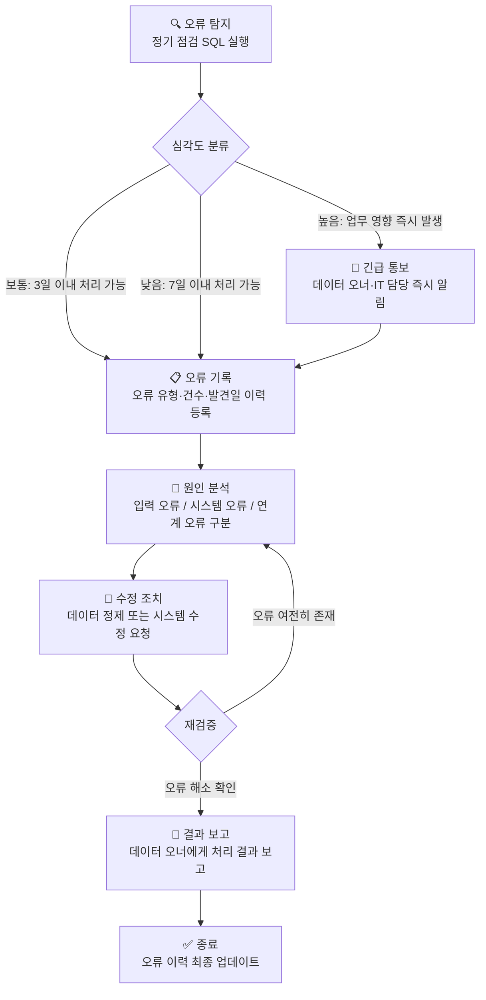

# 🏋️ 8.[선택] 품질 관리 운영 매뉴얼 작성 실습

정리일: 2026-10-08 · 교육 에셋 N1569

본문 수집·공개 편집. 도구 실행·최신 기능 재검증은 미실시. 고객·참여자 정보와 개별 접근 링크, 원본 첨부는 제외했습니다.

---

💡 **본 강의는 MySQL 을 기준으로 진행됩니다.**
**\[수업 목표\]**
- 데이터 품질 체크리스트의 좋은 항목과 나쁜 항목을 구분하고, 측정 가능한 기준으로 직접 설계할 수 있습니다.
- 품질 점검 SQL 자동화 쿼리를 이해하고 작성할 수 있습니다.
- 오류 처리 절차 흐름도를 이해하고 문서화할 수 있습니다.
- 품질 관리 운영 매뉴얼의 구성 요소와 각 섹션의 필요성을 설명할 수 있습니다.
- RACI 매트릭스를 활용한 R&R 정의서를 작성할 수 있습니다.
- 실습파일 경로: [개별 링크 제외]
**\[목차\]**

---
## 01. 실습 목표 및 시나리오
> ⏱ 예상 소요: 약 10분
💡 **이론에서 배운 내용을 실제 문서와 쿼리로 완성합니다.**
- **☑️ 실습 목표**
오늘 실습에서 우리가 만들어낼 결과물은 크게 네 가지입니다.


목표

설명


체크리스트 설계

업무 데이터별 품질 점검 항목을 측정 가능한 기준으로 설계합니다.


SQL 자동화

반복 점검에 활용할 수 있는 품질 점검 쿼리를 작성합니다.


문서 작성

실제 운영에 사용할 수 있는 품질 관리 매뉴얼 양식을 완성합니다.


R&R 정의

RACI 매트릭스를 직접 작성하여 역할과 책임을 명확히 합니다.


- **☑️ 실습 시나리오**
교육기관 10 데이터 매니저로서 이번 달부터 데이터 품질 관리 체계를<br>공식적으로 운영하게 되었습니다.
경영팀에서 품질 관리 운영 매뉴얼과 R&R 정의서 제출을 요청했습니다.
오늘 실습에서는 실제 제출 가능한 문서와 SQL을 함께 완성해 보겠습니다. 😊
**실습 대상 데이터:**


데이터

테이블명

핵심 컬럼


열 사용량

heat_usage

usage_date, region, heat_amount, customer_id


민원 데이터

complaints

complaint_id, receipt_date, complaint_type, status


설비 마스터

facilities

facility_id, facility_name, facility_type, region


> 💡 **Tip:** 실습 데이터는 드라마 세계관을 배경으로 구성되어 있습니다. 컬럼명은 실제 공사 업무 용어를 그대로 사용합니다.
---
## 02. 실습 1. 데이터 품질 체크리스트 설계
> ⏱ 예상 소요: 약 40분
💡 **체크리스트는 품질 점검의 시작점입니다. 명확할수록 실행이 쉬워집니다.**
- **☑️ 좋은 체크리스트 vs 나쁜 체크리스트**
체크리스트를 처음 만들면 자주 이런 실수를 합니다…
“데이터가 정확해야 한다” — 과연 어떻게 확인하죠? 🤔
**좋은 체크리스트**는 누가 봐도 “확인 가능”하고, 기준이 숫자로 명확합니다.<br>**나쁜 체크리스트**는 사람마다 해석이 달라지고, 오류를 발견해도 조치가 애매합니다.
아래 표에서 차이를 직접 비교해 보겠습니다.


구분

🔴 나쁜 체크리스트 (모호)

🟢 좋은 체크리스트 (측정 가능)


**항목 표현**

데이터가 정확해야 한다

`heat_amount` 컬럼 NULL 건수 = 0건


**임계값**

오류가 적어야 한다

결측률 0.1% 이하


**담당자**

팀에서 확인한다

에너지사업팀 데이터 매니저 프로님


**조치 방법**

확인 후 수정한다

원천 계량기 데이터 재확인 후 3일 이내 보완 입력


**점검 주기**

자주 확인한다

매월 1일 오전 9시 정기 실행


**점검 방법**

눈으로 확인한다

품질 점검 SQL 실행 후 결과 0건 확인


> ⚠️ **왜 이 차이가 중요할까요?**<br>나쁜 체크리스트는 담당자가 바뀌는 순간 품질 관리가 멈춥니다.<br>좋은 체크리스트는 누가 담당해도 동일한 기준으로 점검이 이어집니다.
- **☑️ 체크리스트 설계 방법**
품질 체크리스트는 아래 네 가지 질문에 답하면서 작성합니다.
- 1️⃣ **이 데이터에서 어떤 오류가 발생할 수 있는가?**
- 결측, 중복, 범위 초과, 날짜 오류, 형식 불일치 등
- 2️⃣ **그 오류를 어떻게 확인할 수 있는가?**
- SQL 쿼리, 자동 모니터링, 수동 검토 중 어떤 방법인지 명시
- 3️⃣ **어느 수준까지 허용할 것인가?**
- 숫자로 임계값 지정 (예: NULL 0건, 결측률 0.1% 이하)
- 4️⃣ **오류 발견 시 누가 어떻게 처리하는가?**
- 담당자명 + 조치 방법 + 처리 기한까지 구체적으로 기술
- **☑️ 실습 과제: 체크리스트 완성하기**
아래 열 사용량(`heat_usage`) 체크리스트의 빈칸(담당자, 조치 방법)을 채워 완성하세요.
체크리스트를 처음 작성할 때는 **측정 가능한 임계값**과 **구체적인 담당자**를 함께 기재하는 것이 핵심입니다. 😊


번호

점검 항목

점검 내용

임계값

담당자

조치 방법


1

결측값 점검

`region`, `usage_date`, `heat_amount` NULL 여부

NULL 0건


2

중복 점검

동일 날짜·지역·고객 중복 여부

중복 0건


3

범위 유효성

`heat_amount` 음수 또는 비정상 수치 여부

음수 0건


4

날짜 형식

`usage_date` YYYY-MM-DD 형식 준수 여부

비표준 0건


5

지역 코드

`region` 표준 코드 목록 일치 여부

비표준 0건


6

고객 정합성

`customer_id`가 `customers` 테이블에 존재 여부

불일치 0건


- **예시 답안**


번호

점검 항목

담당자

조치 방법


1

결측값 점검

에너지사업팀 데이터 매니저

원천 계량기 데이터 확인 후 3일 이내 보완 입력


2

중복 점검

에너지사업팀 데이터 매니저

원천 데이터 확인 후 중복 행 삭제 처리


3

범위 유효성

에너지사업팀 데이터 매니저

계량기 수치 재확인 후 시스템 수정 요청


4

날짜 형식

IT 담당자

`STR_TO_DATE` 변환 처리 또는 입력 시스템 유효성 검사 강화


5

지역 코드

에너지사업팀 데이터 매니저

`CASE WHEN`으로 표준 코드 매핑 또는 원천 수정 요청


6

고객 정합성

고객지원팀 데이터 매니저

고객 마스터 데이터 확인 후 `customer_id` 수정 또는 신규 등록


---
## 03. 실습 2. 품질 점검 SQL 자동화 쿼리 작성
> ⏱ 예상 소요: 약 55분
💡 **반복되는 점검은 SQL로 만들어두면 매번 새로 작성할 필요가 없습니다. 😊**
- **☑️ 왜 SQL로 자동화하는가?**
가령 매달 1일마다 품질 점검을 해야 한다고 생각해 보겠습니다.
담당자가 매번 데이터를 열어 눈으로 확인한다면… 시간도 오래 걸리고,<br>확인 기준이 사람마다 달라질 수 있습니다.
**SQL 자동화 쿼리**는 마치 “품질 점검 로봇”과 같습니다.<br>한 번 만들어두면 버튼 하나로 동일한 기준의 점검 결과가 나옵니다. 🙂
> ⚠️ **만약 자동화를 안 하면?**<br>담당자 교체 시 점검 방법이 단절됩니다. 같은 데이터도 사람마다 다른 결론을 내릴 수 있습니다.<br>SQL 쿼리는 조직의 품질 기준을 코드로 문서화하는 역할도 합니다.
- **☑️ 통합 품질 점검 쿼리 — 열 사용량 (****`heat_usage`****)**
여러 점검 항목을 **하나의 쿼리로 묶으면** 한 번에 모든 결과를 확인할 수 있습니다.<br>각 `CASE WHEN` 구문이 하나의 점검 항목에 대응됩니다.
```sql
-- =============================================
-- 열 사용량(heat_usage) 통합 품질 점검 쿼리
-- 목적: 결측·음수·미래날짜 오류를 한 번에 확인
-- 실행 주기: 매월 1일 오전 9시
-- =============================================
SELECT
    '열사용량' AS 데이터명,

    -- 전체 행 수: 기준값으로 결측률 계산 시 분모로 활용
    COUNT(*) AS 전체건수,

    -- 지역 결측: region이 없으면 어느 지역 사용량인지 특정 불가
    SUM(CASE WHEN region IS NULL OR region = '' THEN 1 ELSE 0 END) AS 지역결측,

    -- 날짜 결측: usage_date가 없으면 월별 집계 불가
    SUM(CASE WHEN usage_date IS NULL OR usage_date = '' THEN 1 ELSE 0 END) AS 날짜결측,

    -- 사용량 결측: heat_amount가 없으면 요금 계산 불가
    SUM(CASE WHEN heat_amount IS NULL THEN 1 ELSE 0 END) AS 사용량결측,

    -- 음수 사용량: 물리적으로 불가능한 값 — 계량기 오류 가능성
    SUM(CASE WHEN heat_amount < 0 THEN 1 ELSE 0 END) AS 음수사용량,

    -- 고객ID 결측: customer_id 없으면 고객 연결 불가
    SUM(CASE WHEN customer_id IS NULL OR customer_id = '' THEN 1 ELSE 0 END) AS 고객ID결측,

    -- 미래 날짜: 아직 발생하지 않은 사용량이 입력된 경우
    SUM(CASE WHEN usage_date > CURDATE() THEN 1 ELSE 0 END) AS 미래날짜
FROM heat_usage;
```
**예상 결과:**


데이터명

전체건수

지역결측

날짜결측

사용량결측

음수사용량

고객ID결측

미래날짜


열사용량

1250

0

0

3

0

1

0


> 💡 **Tip:** 결과값이 0이 아닌 컬럼이 있다면, 해당 항목에 오류가 존재한다는 신호입니다. 체크리스트의 조치 방법에 따라 바로 후속 처리를 시작하세요.
- **☑️ 통합 품질 점검 쿼리 — 민원 데이터 (****`complaints`****)**
민원 데이터는 **날짜 논리 오류**가 핵심 점검 대상입니다.<br>접수일보다 처리 완료일이 앞서 있다면 — 데이터 입력 실수입니다.
```sql
-- =============================================
-- 민원(complaints) 통합 품질 점검 쿼리
-- 목적: 결측·날짜 논리 오류·미래날짜 한 번에 확인
-- 실행 주기: 매주 월요일 오전 9시
-- =============================================
SELECT
    '민원' AS 데이터명,

    -- 전체 행 수
    COUNT(*) AS 전체건수,

    -- 접수일 결측: 언제 접수됐는지 모르면 처리 기한 계산 불가
    SUM(CASE WHEN receipt_date IS NULL THEN 1 ELSE 0 END) AS 접수일결측,

    -- 민원 유형 결측: 유형 없으면 담당 부서 배분 불가
    SUM(CASE WHEN complaint_type IS NULL OR complaint_type = '' THEN 1 ELSE 0 END) AS 유형결측,

    -- 처리 상태 결측: 진행 중인지 완료됐는지 파악 불가
    SUM(CASE WHEN status IS NULL OR status = '' THEN 1 ELSE 0 END) AS 상태결측,

    -- 날짜 논리 오류: 완료일이 접수일보다 앞선 경우 — 시간이 거꾸로 흐를 수는 없죠!
    SUM(CASE WHEN close_date IS NOT NULL AND close_date < receipt_date THEN 1 ELSE 0 END) AS 날짜논리오류,

    -- 미래 접수일: 아직 오지 않은 날짜에 민원이 접수된 경우
    SUM(CASE WHEN receipt_date > CURDATE() THEN 1 ELSE 0 END) AS 미래날짜
FROM complaints;
```
**예상 결과:**


데이터명

전체건수

접수일결측

유형결측

상태결측

날짜논리오류

미래날짜


민원

430

0

2

0

1

0


- **☑️ 실습 과제: 설비 마스터 품질 점검 쿼리 작성** 👿 💣
이번에는 직접 작성해 봅니다. 아래 요구사항을 참고해 설비 마스터(`facilities`) 품질 점검 쿼리를 완성하세요.
**왜 설비 마스터를 점검해야 할까요?**<br>설비 마스터는 현장 점검, 민원 처리, 유지보수 발주의 기준 데이터입니다.<br>설비명이 중복되거나 지역 코드가 빠지면, 어느 현장에 어떤 설비가 있는지 파악이 안 됩니다.
**점검 항목:**
- 전체 건수
- `facility_id` NULL 건수
- `facility_name` NULL 또는 빈값 건수
- `facility_name` 중복 건수 (서브쿼리 활용)
- `region` NULL 건수
```sql
-- 여기에 쿼리를 작성하세요.
```
- **예시 답안**
```sql
-- =============================================
-- 설비마스터(facilities) 통합 품질 점검 쿼리
-- 목적: ID·설비명 결측 및 중복, 지역 결측 확인
-- 실행 주기: 매월 1일 오전 9시
-- =============================================
SELECT
    '설비마스터' AS 데이터명,

    -- 전체 행 수
    COUNT(*) AS 전체건수,

    -- facility_id 결측: 설비를 식별할 수 없으면 점검 이력 연결 불가
    SUM(CASE WHEN facility_id IS NULL THEN 1 ELSE 0 END) AS ID결측,

    -- facility_name 결측: 어떤 설비인지 이름 자체가 없는 경우
    SUM(CASE WHEN facility_name IS NULL OR facility_name = '' THEN 1 ELSE 0 END) AS 설비명결측,

    -- region 결측: 지역 없으면 어느 현장 설비인지 특정 불가
    SUM(CASE WHEN region IS NULL OR region = '' THEN 1 ELSE 0 END) AS 지역결측,

    -- 설비명 중복: 같은 이름의 설비가 여러 건 존재하는 경우
    -- 서브쿼리로 중복된 facility_name 개수를 별도 계산
    (
        SELECT COUNT(*)
        FROM (
            SELECT facility_name
            FROM facilities
            GROUP BY facility_name
            HAVING COUNT(*) > 1
        ) dup
    ) AS 설비명중복건수
FROM facilities;
```
**예상 결과:**


데이터명

전체건수

ID결측

설비명결측

지역결측

설비명중복건수


설비마스터

85

0

1

0

2


- **☑️ 월별 품질 추이 모니터링 쿼리**
단순히 “지금 오류가 몇 건인가”를 확인하는 것을 넘어,<br>**시간이 흐르면서 품질이 개선되고 있는가**를 추적하는 것이 진짜 품질 관리입니다.
월별 추이를 보면 이런 질문에 답할 수 있습니다.
- “3월에 결측이 갑자기 늘었는데, 그때 무슨 일이 있었나?”
- “우리 개선 조치가 효과를 내고 있나?”
```sql
-- =============================================
-- 월별 열 사용량 결측 추이 모니터링 쿼리
-- 목적: 시간에 따른 품질 수준 변화 추적
-- 활용: 월별 품질 보고서에 첨부
-- =============================================
SELECT
    -- usage_date를 'YYYY-MM' 형식으로 변환하여 월 단위 집계
    DATE_FORMAT(STR_TO_DATE(`usage_date`, '%Y-%m-%d'), '%Y-%m') AS 기준월,

    COUNT(*) AS 전체건수,

    -- 결측 건수: heat_amount가 NULL인 행 수
    SUM(CASE WHEN heat_amount IS NULL THEN 1 ELSE 0 END) AS 결측건수,

    -- 결측률(%): 전체 건수 대비 결측 건수 비율 — 소수 둘째자리까지 표시
    ROUND(
        SUM(CASE WHEN heat_amount IS NULL THEN 1 ELSE 0 END) * 100.0 / COUNT(*), 2
    ) AS 결측률
FROM heat_usage
GROUP BY DATE_FORMAT(STR_TO_DATE(`usage_date`, '%Y-%m-%d'), '%Y-%m')
ORDER BY 기준월;
```
**예상 결과:**


기준월

전체건수

결측건수

결측률


2023-01

420

3

0.71


2023-02

398

1

0.25


2023-03

432

0

0.00


> 💡 **Tip:** 결측률이 월별로 0.71 → 0.25 → 0.00으로 감소하고 있다면 개선 조치가 효과를 내고 있다는 증거입니다. 이 추이 표를 월별 품질 보고서에 첨부하면 경영팀에 품질 개선 현황을 시각적으로 보고할 수 있습니다.
---
## 04. 실습 3. 품질 관리 운영 매뉴얼 양식 작성
> ⏱ 예상 소요: 약 50분
💡 **운영 매뉴얼은 담당자가 바뀌어도 품질 관리가 이어질 수 있게 해줍니다.**
- **☑️ 왜 매뉴얼이 필요한가?**
매뉴얼 없이 품질 관리를 하면 어떤 일이 생길까요?
새로운 데이터 매니저가 부임했을 때, “어떻게 하면 되나요?”라는 질문에 아무도 명확히 답하지 못합니다.<br>전임 담당자의 머릿속에만 있던 기준이 사라지고, 품질 관리는 처음부터 다시 시작됩니다…
**매뉴얼은 조직의 데이터 품질 관리 지식을 문서화하여 지속 가능하게 만드는 도구입니다.**
> 💡 **Tip:** 좋은 매뉴얼은 그 분야를 처음 접한 사람도 읽으면 따라 할 수 있어야 합니다.
- **☑️ 품질 관리 운영 매뉴얼 구성**
운영 매뉴얼은 아래 8개 섹션으로 구성합니다.<br>각 섹션이 없으면 어떤 문제가 생기는지 함께 확인해 보겠습니다.


섹션

내용

없으면 생기는 문제


1. 목적 및 적용 범위

이 매뉴얼의 목적과 대상 데이터·부서

왜 이걸 하는지 모르고 형식적으로 진행됨


2. 품질 관리 원칙

조직의 데이터 품질 관리 기본 방향

담당자마다 다른 기준으로 판단함


3. 관리 대상 데이터 목록

품질 관리 대상 데이터와 우선순위

중요한 데이터를 놓치고 불필요한 데이터에 시간 낭비


4. 데이터별 품질 기준서

항목별 기준·임계값·점검 방법

오류인지 아닌지 기준이 없어 판단 불가


5. 정기 점검 절차

점검 실행 방법 및 결과 보고 절차

언제, 어떻게 해야 하는지 몰라 불규칙 점검


6. 오류 처리 절차

오류 발견 시 보고·수정·재검증 흐름

오류 발견 후 어디 보고할지 몰라 방치됨


7. 역할 및 책임(R&R)

RACI 매트릭스

“그거 내 일 아닌데요”라는 상황이 반복됨


8. 문서 이력

버전·작성일·수정 이력

어떤 버전이 최신인지 몰라 혼선 발생


- **☑️ 오류 처리 절차 흐름도**
오류를 발견했을 때, 어떤 순서로 무엇을 해야 하는지 명확히 정해두지 않으면…<br>“저는 발견만 했는데요”, “저는 보고 받지 못했는데요” 같은 상황이 반복됩니다.
아래 흐름도를 보며 오류 처리의 전체 과정을 파악해 보겠습니다.

> 💡 **Tip:** 심각도 분류 기준은 조직마다 다를 수 있습니다. 교육기관 10에서는 **열 공급 및 요금에 직접 영향을 주는 오류**를 ’높음’으로 분류하는 것이 적절합니다.
- **☑️ 실습 과제: 오류 처리 절차 작성**
위 흐름도를 참고하여, 아래 오류 처리 절차 상세표의 빈칸을 채워 완성하세요.
```plain text
오류 탐지 → [  ] → [  ] → 수정 조치 → 재검증 → 결과 보고
```


단계

활동

담당자

기한


1. 오류 탐지

정기 점검 SQL 실행 중 오류 발견

데이터 매니저

점검 당일


2. 오류 기록


3. 원인 분석


4. 수정 조치


5. 재검증


6. 결과 보고


- **예시 답안**


단계

활동

담당자

기한


1. 오류 탐지

정기 점검 SQL 실행 중 오류 발견

데이터 매니저

점검 당일


2. 오류 기록

오류 유형·건수·발견일을 오류 이력 시트에 기록

데이터 매니저

발견 당일


3. 원인 분석

입력 오류·시스템 오류·연계 오류 중 원인 파악

데이터 매니저

발견 후 1일 이내


4. 수정 조치

원인에 따라 데이터 정제 또는 시스템 수정 요청

데이터 매니저 / IT 담당

발견 후 3일 이내


5. 재검증

수정 후 동일 점검 쿼리 재실행으로 오류 해소 확인

데이터 매니저

수정 완료 후 즉시


6. 결과 보고

오류 처리 결과를 데이터 오너에게 보고

데이터 매니저

처리 완료 후 익일


---
## 05. 실습 4. R&R 정의서 및 RACI 작성
> ⏱ 예상 소요: 약 45분
💡 **직접 RACI를 작성해보면 역할과 책임이 얼마나 중요한지 실감하게 됩니다. 🙂**
- **☑️ RACI 매트릭스란?**
팀에서 일할 때 이런 상황을 경험해본 적 있으신가요?
“그거 누가 하기로 했죠?” 또는 “저는 그 결정을 승인한 적 없는데요…”
RACI는 이런 혼선을 없애기 위한 도구입니다.<br>모든 활동에 대해 누가 **실행(R)**하고, 누가 **최종 책임(A)**지고,<br>누구와 **협의(C)**하고, 누구에게 **보고(I)**할지 미리 정해두는 것입니다.


기호

의미

설명


**R**

Responsible (실행 책임)

실제로 업무를 수행하는 사람


**A**

Accountable (최종 책임)

결과에 최종 책임을 지는 사람 (보통 1명)


**C**

Consulted (협의 대상)

의견을 제공하고 협의하는 사람


**I**

Informed (보고 대상)

결과를 보고받는 사람


> ⚠️ **주의할 점:** A(최종 책임)는 활동당 반드시 1명이어야 합니다.<br>두 명이 A이면 사실상 아무도 책임지지 않는 것과 같습니다.
- **☑️ 실습 과제: 공사 데이터 품질 RACI 매트릭스 작성**
아래 표의 빈칸(?)에 R, A, C, I 중 하나를 채워 RACI 매트릭스를 완성하세요.
**참여자:** 데이터 오너(부서장) / 데이터 매니저 / 데이터 입력자 / IT 담당 / 거버넌스위원회


활동

데이터 오너

데이터 매니저

데이터 입력자

IT 담당

거버넌스위원회


품질 기준서 작성

?

?

?

?

?


정기 품질 점검 실행

?

?

?

?

?


오류 데이터 수정

?

?

?

?

?


시스템 유효성 검사 적용

?

?

?

?

?


품질 보고서 작성

?

?

?

?

?


품질 정책 승인

?

?

?

?

?


데이터 입력 교육 실시

?

?

?

?

?


- **예시 답안**


활동

데이터 오너

데이터 매니저

데이터 입력자

IT 담당

거버넌스위원회


품질 기준서 작성

A

R

C

C

C


정기 품질 점검 실행

I

R

I

C

I


오류 데이터 수정

A

R

R

C

I


시스템 유효성 검사 적용

I

C

I

A/R

I


품질 보고서 작성

I

R

I

I

I


품질 정책 승인

C

R

I

C

A


데이터 입력 교육 실시

A

R

I

C

I


**풀이 포인트:**
- 품질 기준서는 데이터 매니저가 **작성(R)**하고, 데이터 오너가 **최종 책임(A)**을 집니다.
- 시스템 유효성 검사 적용은 IT가 시스템을 직접 바꾸므로 **A/R**이 됩니다.
- 품질 정책 승인은 거버넌스위원회가 **최종 결정(A)**합니다.
- **☑️ R&R 정의서 작성**
RACI 매트릭스를 완성했으면, 각 역할의 세부 책임을 기술한 R&R 정의서를 작성합니다.
R&R 정의서는 인사 이동이 생겼을 때 업무 인수인계 문서로도 활용됩니다. 😊
**✏️ 실습 과제:** 데이터 매니저의 R&R 정의서를 아래 양식에 작성하세요.


항목

내용


**역할명**

데이터 매니저


**담당 부서**


**주요 책임 (R)**


**최종 책임 (A)**


**협의 대상 (C)**


**보고 대상 (I)**


**주요 산출물**


**점검 주기**


- **예시 답안**


항목

내용


**역할명**

데이터 매니저


**담당 부서**

에너지사업팀 (또는 각 업무 부서)


**주요 책임 (R)**

품질 기준서 작성, 정기 점검 실행, 오류 탐지·분석·정제, 보고서 작성


**최종 책임 (A)**

열 사용량·민원 데이터 품질 수준 유지


**협의 대상 (C)**

IT 담당(시스템 개선 시), 거버넌스위원회(기준 변경 시)


**보고 대상 (I)**

데이터 오너(부서장), 경영팀(월별 보고)


**주요 산출물**

품질 기준서, 점검 결과 보고서, 오류 처리 이력, 개선 제안서


**점검 주기**

주 1회(민원), 월 1회(열 사용량·설비)


---
## 06. 셀프 체크리스트 및 과제 제출
> ⏱ 예상 소요: 약 15분
💡 **2회차 전체 내용을 정리하고 마무리합니다.**
- **☑️ 셀프 체크리스트**
아래 항목을 스스로 점검해 보세요. 모든 항목에 ✅가 되면 오늘 실습을 성공적으로 마친 것입니다! 😊


항목

확인


좋은 체크리스트와 나쁜 체크리스트의 차이를 설명할 수 있다

☐


데이터 품질 체크리스트를 5개 항목 이상, 임계값 포함하여 설계할 수 있다

☐


통합 품질 점검 SQL을 작성하고 각 CASE WHEN 구문의 의미를 설명할 수 있다

☐


월별 품질 추이를 집계하는 쿼리를 작성하고 결측률의 의미를 설명할 수 있다

☐


오류 처리 절차 6단계와 mermaid 흐름도를 설명할 수 있다

☐


품질 관리 운영 매뉴얼 8개 섹션과 각 섹션이 없으면 생기는 문제를 설명할 수 있다

☐


RACI 매트릭스를 완성하고 R·A·C·I 각 기호의 의미를 설명할 수 있다

☐


데이터 매니저의 R&R 정의서를 작성할 수 있다

☐


- **☑️ 과제 제출 항목**


과제

내용


**과제 1**

실습 1에서 완성한 열 사용량 품질 체크리스트(담당자·조치 방법 포함)를 제출하세요.


**과제 2**

실습 2에서 작성한 설비 마스터 품질 점검 SQL과 DBeaver 실행 결과 스크린샷을 제출하세요.


**과제 3**

실습 3에서 완성한 오류 처리 절차 상세표(6단계 전체)를 제출하세요.


**과제 4**

실습 4에서 완성한 RACI 매트릭스와 데이터 매니저 R&R 정의서를 제출하세요.


**과제 5 (심화)**

우리 팀/부서의 실제 데이터 1가지를 선택하여, 좋은 체크리스트 기준으로 품질 기준서를 작성해 보세요.


---
## 07. 요약
> ⏱ 예상 소요: 약 10분
💡 **금일 수업내용을 복기해 보겠습니다.**
- 좋은 체크리스트는 누가 봐도 실행 가능한 측정 기준과 담당자, 조치 방법이 명확하게 기재된 것입니다.
- 나쁜 체크리스트는 표현이 모호하고 사람마다 해석이 달라지며, 담당자가 바뀌면 기준도 바뀝니다.
- 품질 체크리스트 설계는 오류 유형 식별 → 확인 방법 → 임계값 → 담당자와 조치 방법의 4단계로 진행합니다.
- SQL 자동화 쿼리는 반복되는 품질 점검을 일관된 기준으로 빠르게 실행하기 위한 도구입니다.
- 각 `CASE WHEN` 구문은 체크리스트의 점검 항목 하나에 대응하며, 결과값이 0이 아니면 오류가 존재합니다.
- 월별 품질 추이 쿼리는 품질 수준이 시간에 따라 개선되고 있는지 추적하기 위해 사용합니다.
- 품질 관리 운영 매뉴얼은 담당자가 바뀌어도 동일한 기준으로 품질 관리가 이어지도록 지식을 문서화한 것입니다.
- 오류 처리 절차는 탐지 → 기록 → 원인 분석 → 수정 조치 → 재검증 → 결과 보고의 6단계로 진행합니다.
- 심각도가 높은 오류는 긴급 통보를 먼저 하고, 이후 기록과 분석 단계로 이어집니다.
- RACI 매트릭스는 모든 활동에 대해 실행·최종 책임·협의·보고 역할을 명확히 정의한 도구입니다.
- A(최종 책임)는 활동당 반드시 1명이어야 하며, 두 명이 되면 실질적으로 책임지는 사람이 없어집니다.
- R&R 정의서는 역할명·주요 책임·최종 책임·협의 대상·보고 대상·산출물·점검 주기를 포함합니다.
- 품질 관리 체계는 체크리스트 → SQL 자동화 → 매뉴얼 → RACI의 순서로 완성되며, 각 요소가 하나의 시스템을 이룹니다.
