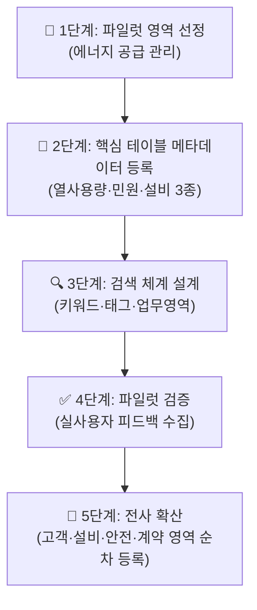

# 🏋️ 14.[실습] 데이터 카탈로그 설계 및 검색 체계 구축

정리일: 2026-10-08 · 교육 에셋 N1588

본문 수집·공개 편집. 도구 실행·최신 기능 재검증은 미실시. 고객·참여자 정보와 개별 접근 링크, 원본 첨부는 제외했습니다.

---

💡 **본 강의는 MySQL 을 기준으로 진행됩니다.**
**\[수업 목표\]**
- 메타데이터 등록 양식을 직접 작성할 수 있습니다.
- 데이터 카탈로그 구조를 설계할 수 있습니다.
- SQL로 메타데이터 관리 테이블을 생성하고 조회할 수 있습니다.
- 데이터 검색 체계 설계 방법을 이해합니다.
- 카탈로그 파일럿 → 전사 확산 단계적 접근법을 이해합니다.
- 실습파일 경로: [개별 링크 제외]
**\[목차\]**

---
## 01. 실습 목표 및 시나리오
> ⏱ 예상 소요: 약 15분
💡 **공사 주요 데이터에 대한 카탈로그를 직접 설계하고 등록합니다.**
- **☑️ 데이터 카탈로그, 왜 필요할까요?**
도서관을 생각해보세요. 🙂
수십만 권의 책이 아무 분류 없이 쌓여 있다면…
원하는 책을 찾는 데 하루 종일 걸릴 거예요.
그래서 도서관에는 **사서(司書)** 가 있고, **도서 분류 시스템**이 있습니다.
책 제목, 저자, 주제어로 검색하면 어느 서가 몇 번째 칸에 있는지 바로 찾을 수 있죠.
**데이터 카탈로그는 데이터의 도서관 사서 시스템입니다.**
“열 사용량 데이터가 어느 테이블에 있지?”, “개인정보가 포함된 데이터는 어떤 건지?” 를
바로 검색해서 찾을 수 있도록 만들어주는 시스템이에요.
---
**만약 데이터 카탈로그가 없다면 어떤 일이 벌어질까요?**


상황

카탈로그 없을 때 😓

카탈로그 있을 때 😊


열 사용량 데이터 찾기

담당자에게 일일이 물어봐야 함

키워드 검색으로 즉시 파악


개인정보 포함 여부 확인

테이블 하나하나 열어봐야 함

is_pii 필드로 즉시 조회


신규 입사자 온보딩

데이터 파악에 몇 달 걸림

카탈로그로 1주일 안에 파악 가능


유사 데이터 중복 방지

같은 데이터를 여러 부서가 따로 관리

카탈로그에서 기존 데이터 검색 후 재사용


데이터 변경 영향 파악

어느 시스템이 영향받는지 모름

연관 테이블 즉시 확인 가능


**카탈로그 없이 일하는 것은 목차 없는 두꺼운 책을 처음부터 끝까지 읽어야 하는 것과 같습니다.**
- **☑️ 실습 목표**


목표

설명


메타데이터 등록

공사 핵심 테이블의 메타데이터를 표준 양식으로 작성합니다.


카탈로그 구조 설계

누구나 데이터를 쉽게 찾을 수 있는 카탈로그 구조를 설계합니다.


SQL 조회 실습

메타데이터 관리 테이블을 SQL로 생성하고 조회하는 방법을 익힙니다.


검색 체계 설계

키워드·업무 영역·태그 기반 검색 체계를 설계합니다.


단계적 접근

1개 영역 파일럿 → 전사 확산 순서로 카탈로그를 구축합니다.


- **☑️ 실습 시나리오**
교육기관 10 데이터 매니저로서 이번에 **사내 데이터 카탈로그 구축 파일럿 프로젝트**를 맡게 되었습니다. 🎯
처음부터 전체 데이터를 모두 등록하려 하면 너무 방대합니다.
그래서 **에너지 공급 관리 영역부터 파일럿으로 시작**하고, 성공 사례를 만든 뒤 전사로 확산합니다.
먼저 주요 데이터 3종(열 사용량·민원·설비 마스터)의 메타데이터를 등록하고,
카탈로그 검색 체계를 설계합니다.
---
**카탈로그 구축 단계적 접근법:**

---
**실습용 메타데이터 관리 테이블 생성:**
지금 무엇을 왜 하는가: 메타데이터를 저장할 그릇(테이블)을 먼저 만듭니다. `meta_tables`는 테이블 단위 정보를, `meta_columns`는 컬럼 단위 정보를 저장합니다.
```sql
-- 테이블 메타데이터 관리 테이블 생성
CREATE TABLE meta_tables (
    table_id       INT AUTO_INCREMENT PRIMARY KEY,
    table_name     VARCHAR(100),   -- 테이블명
    table_desc     TEXT,           -- 테이블 설명
    biz_domain     VARCHAR(50),    -- 업무 영역
    owner_dept     VARCHAR(50),    -- 담당 부서
    update_cycle   VARCHAR(50),    -- 갱신 주기
    security_level VARCHAR(20),    -- 보안 등급
    created_date   DATE,           -- 등록일
    tags           VARCHAR(200)    -- 검색용 태그 (쉼표 구분)
);

-- 컬럼 메타데이터 관리 테이블 생성
CREATE TABLE meta_columns (
    col_id         INT AUTO_INCREMENT PRIMARY KEY,
    table_id       INT,            -- meta_tables 참조
    col_name       VARCHAR(100),   -- 한글 컬럼명
    col_name_en    VARCHAR(100),   -- 영문 컬럼명
    data_type      VARCHAR(50),    -- 데이터 타입
    nullable       VARCHAR(5),     -- NULL 허용 여부 Y/N
    col_desc       TEXT,           -- 컬럼 설명
    col_unit       VARCHAR(50),    -- 단위 (Gcal, 원, % 등)
    sample_value   VARCHAR(100),   -- 샘플 값
    is_pii         VARCHAR(5)      -- 개인정보 포함 여부 Y/N
);
```
> 💡 **Tip:** `meta_columns`의 `table_id`는 `meta_tables`의 `table_id`를 참조합니다. 나중에 JOIN으로 연결해서 조회할 수 있어요!
---
## 02. 실습 1. 메타데이터 등록 양식 작성
> ⏱ 예상 소요: 약 40분
💡 **메타데이터 등록은 데이터 카탈로그 구축의 첫 번째 단계입니다.**
- **☑️ 테이블 메타데이터 등록 실습 — 열 사용량 테이블**
아래 빈칸을 직접 채워 `heat_usage` 테이블의 메타데이터를 완성하세요. ✍️
**테이블 메타데이터:**


항목

내용


테이블명

heat_usage


업무 설명

(작성하세요)


업무 영역

(작성하세요)


담당 부서

(작성하세요)


갱신 주기

(작성하세요)


보안 등급

(작성하세요)


검색 태그

(작성하세요)


**컬럼 메타데이터:**


컬럼명

영문명

타입

NULL

의미

단위

샘플값

개인정보


사용ID

usage_id

INT

N

열 사용 기록 고유번호

-

1001

N


지역코드

region

VARCHAR(50)

N

(작성하세요)

-

서울강남

N


기준년

usage_year

INT

N

(작성하세요)

-

2023

N


기준월

usage_month

INT

N

(작성하세요)

-

7

N


열사용량

heat_amount

DECIMAL(10,2)

N

(작성하세요)

Gcal

1200.50

N


고객ID

customer_id

VARCHAR(20)

N

(작성하세요)

-

C000123

Y


- **예시 답안**
**테이블 메타데이터:**


항목

내용


테이블명

heat_usage


업무 설명

지역별·고객별 월간 열 공급 사용량 데이터


업무 영역

에너지공급관리


담당 부서

에너지사업팀


갱신 주기

월 1회 (매월 5일 배치 처리)


보안 등급

내부 (개인정보 포함 — customer_id)


검색 태그

열사용량, 에너지, 수요예측, 요금, Gcal


**컬럼 메타데이터:**


컬럼명

의미


지역코드

열 공급 관리 지역명 (표준 코드 기준)


기준년

집계 기준 연도


기준월

집계 기준 월 (1\~12)


열사용량

해당 월의 열 공급 사용량 (계량기 자동 집계)


고객ID

고객 고유 식별자 (고객 마스터 테이블 FK)


- **☑️ 실습 과제: 민원 테이블 메타데이터 등록**
민원 테이블(`complaints`)의 테이블·컬럼 메타데이터를 직접 작성해 보세요. 🖊️
(테이블 설명, 업무 영역, 담당 부서, 갱신 주기, 보안 등급, 주요 컬럼 5개 이상)
**테이블 메타데이터:**


항목

내용


테이블명

complaints


업무 설명


업무 영역


담당 부서


갱신 주기


보안 등급


검색 태그


**컬럼 메타데이터 (5개 이상 작성):**


컬럼명

영문명

타입

NULL

의미

단위

샘플값

개인정보


- **예시 답안**
**테이블 메타데이터:**


항목

내용


테이블명

complaints


업무 설명

고객 민원 접수·처리·완료 이력 관리 데이터


업무 영역

고객민원관리


담당 부서

고객서비스팀


갱신 주기

실시간 (민원 접수 즉시 등록)


보안 등급

내부 (고객 연락처 포함)


검색 태그

민원, 고객, 처리율, 접수, 완료, 개인정보


**컬럼 메타데이터:**


컬럼명

영문명

타입

NULL

의미

단위

샘플값

개인정보


민원ID

complaint_id

INT

N

민원 접수 고유번호

-

2001

N


고객ID

customer_id

VARCHAR(20)

N

민원 제기 고객 식별자

-

C000123

Y


접수일시

receipt_dt

DATETIME

N

민원 접수 일시

-

2023-07-15 09:30

N


민원유형

complaint_type

VARCHAR(50)

N

민원 분류 (공급불량·요금·기타)

-

공급불량

N


처리상태

status

VARCHAR(20)

N

처리 진행 상태

-

완료

N


처리완료일

complete_dt

DATETIME

Y

민원 처리 완료 일시

-

2023-07-17 14:00

N


---
## 03. 실습 2. 데이터 카탈로그 구조 설계
> ⏱ 예상 소요: 약 35분
💡 **카탈로그는 “데이터의 도서관”입니다. 찾기 쉽게 구조를 설계하는 것이 핵심입니다.**
- **☑️ 파일럿 → 전사 확산 전략**
처음부터 모든 데이터를 카탈로그에 등록하려 하면 어떻게 될까요?
담당자들의 반발, 등록 부담, 품질 저하…
모든 것이 반쪽짜리로 끝날 위험이 있어요. ⚠️
**성공하는 카탈로그 구축의 비결은 “작게 시작해서 성공 사례를 만들고 확산하는 것”입니다.**


단계

범위

목표

예상 기간


**🔴 1단계 파일럿**

에너지 공급 관리 영역 (3개 테이블)

등록 양식 검증, 검색 체계 수립

2주


**🟡 2단계 확산**

고객·민원 관리 영역 추가

담당 부서 참여 유도, 표준화

4주


**🟢 3단계 전사**

설비·안전·계약 영역 포함 전체

전사 카탈로그 완성

8주


> 💡 **Tip:** 파일럿 단계에서 “이 덕분에 어떤 업무 문제가 해결됐다”는 성공 사례를 꼭 문서화하세요. 전사 확산 때 가장 강력한 설득 도구가 됩니다! 😊
- **☑️ 데이터 카탈로그 구조 설계 원칙**


원칙

설명

공사 적용 예시


**업무 중심 분류**

기술적 분류보다 업무 영역으로 분류

에너지·민원·설비·계약·안전 5개 영역


**검색 최적화**

키워드·태그·영역으로 빠르게 찾기

태그 필드에 업무 핵심 키워드 등록


**최신성 유지**

데이터 변경 시 카탈로그도 갱신

갱신 주기 필드로 관리 주기 명시


**접근 통제**

권한에 따라 메타데이터 접근 제한

보안 등급 필드로 공개/내부/기밀 구분


**담당자 명시**

데이터 오너(owner)를 반드시 지정

owner_dept 필드 필수 입력


- **☑️ 실습 과제: 공사 데이터 카탈로그 구조 설계**
아래 공사 주요 업무 영역별로 카탈로그 구조를 설계하세요.
(이미 채워진 에너지 공급 관리 영역을 참고하여 나머지 4개 영역을 완성하세요!)


업무 영역

포함 데이터

주요 태그

담당 부서


에너지 공급 관리

열 사용량, 공급량, 기상 데이터

열사용량, Gcal, 수요예측

에너지사업팀


고객·민원 관리


설비·자산 관리


안전 관리


계약·예산 관리


- **예시 답안**


업무 영역

포함 데이터

주요 태그

담당 부서


에너지 공급 관리

열 사용량, 공급량, 기상 데이터

열사용량, Gcal, 수요예측

에너지사업팀


고객·민원 관리

민원 이력, 고객 정보, 상담 이력

민원, 고객, 처리율, 개인정보

고객서비스팀


설비·자산 관리

설비 마스터, 점검 이력, 고장 이력

설비, 정비, 점검, 이력

시설관리팀


안전 관리

사고 이력, 위험성평가, 안전점검

사고, 안전, 위험, 아차사고

안전환경팀


계약·예산 관리

계약 정보, 예산, 집행 내역

계약, 예산, 집행, 업체

경영지원팀


---
## 04. 실습 3. SQL로 메타데이터 관리 테이블 조회
> ⏱ 예상 소요: 약 50분
💡 **SQL로 메타데이터를 관리하면 별도 프로그램 없이도 바로 검색하고 활용할 수 있습니다.**
- **☑️ 샘플 데이터 INSERT 실습**
지금 무엇을 왜 하는가: 메타데이터 테이블에 실제 데이터를 넣어봅니다. INSERT를 직접 실행해야 이후 SELECT 조회 실습이 가능합니다.
**1️⃣ 테이블 메타데이터 등록 (meta_tables)**
```sql
-- 테이블 메타데이터 INSERT (3개 테이블 등록)
INSERT INTO meta_tables (
    table_name,
    table_desc,
    biz_domain,
    owner_dept,
    update_cycle,
    security_level,
    created_date,
    tags
)
VALUES
(
    'heat_usage',
    '지역별·고객별 월간 열 공급 사용량',
    '에너지공급관리',
    '에너지사업팀',
    '월 1회',
    '내부',
    '2026-01-01',
    '열사용량,에너지,수요예측,요금,Gcal'
),
(
    'complaints',
    '고객 민원 접수·처리·완료 이력 관리',
    '고객민원관리',
    '고객서비스팀',
    '실시간',
    '내부',
    '2026-01-01',
    '민원,고객,처리율,접수,완료,개인정보'
),
(
    'facilities',
    '열 공급 설비 마스터 정보 및 관리 현황',
    '설비자산관리',
    '시설관리팀',
    '분기 1회',
    '내부',
    '2026-01-01',
    '설비,자산,정비,점검,이력'
);
```
- 정답화면


table_id

table_name

biz_domain

owner_dept


1

heat_usage

에너지공급관리

에너지사업팀


2

complaints

고객민원관리

고객서비스팀


3

facilities

설비자산관리

시설관리팀


**2️⃣ 컬럼 메타데이터 등록 (meta_columns)**
```sql
-- 열사용량 테이블 컬럼 메타데이터 INSERT (table_id = 1)
INSERT INTO meta_columns
    (table_id, col_name, col_name_en, data_type, nullable, col_desc, col_unit, sample_value, is_pii)
VALUES
    (1, '사용ID',   'usage_id',     'INT',            'N', '열 사용 기록 고유번호',              '-',    '1001',      'N'),
    (1, '지역코드', 'region',        'VARCHAR(50)',    'N', '열 공급 관리 지역명 (표준 코드 기준)', '-',    '서울강남',   'N'),
    (1, '기준년',   'usage_year',   'INT',            'N', '집계 기준 연도',                    '-',    '2023',      'N'),
    (1, '기준월',   'usage_month',  'INT',            'N', '집계 기준 월 (1~12)',               '-',    '7',         'N'),
    (1, '열사용량', 'heat_amount',  'DECIMAL(10,2)',  'N', '해당 월 열 공급 사용량 (계량기 집계)', 'Gcal', '1200.50',   'N'),
    (1, '고객ID',  'customer_id',  'VARCHAR(20)',    'N', '고객 고유 식별자 (고객 마스터 FK)',    '-',    'C000123',   'Y');

-- 민원 테이블 컬럼 메타데이터 INSERT (table_id = 2)
INSERT INTO meta_columns
    (table_id, col_name, col_name_en, data_type, nullable, col_desc, col_unit, sample_value, is_pii)
VALUES
    (2, '민원ID',    'complaint_id',   'INT',          'N', '민원 접수 고유번호',           '-', '2001',              'N'),
    (2, '고객ID',    'customer_id',    'VARCHAR(20)',  'N', '민원 제기 고객 식별자',        '-', 'C000123',           'Y'),
    (2, '접수일시',  'receipt_dt',     'DATETIME',     'N', '민원 접수 일시',              '-', '2023-07-15 09:30',  'N'),
    (2, '민원유형',  'complaint_type', 'VARCHAR(50)',  'N', '민원 분류 (공급불량·요금·기타)', '-', '공급불량',          'N'),
    (2, '처리상태',  'status',         'VARCHAR(20)',  'N', '처리 진행 상태',              '-', '완료',              'N'),
    (2, '처리완료일', 'complete_dt',   'DATETIME',     'Y', '민원 처리 완료 일시',         '-', '2023-07-17 14:00',  'N');

-- 설비 테이블 컬럼 메타데이터 INSERT (table_id = 3)
INSERT INTO meta_columns
    (table_id, col_name, col_name_en, data_type, nullable, col_desc, col_unit, sample_value, is_pii)
VALUES
    (3, '설비ID',   'facility_id',   'INT',          'N', '설비 고유 식별번호',         '-', '3001',      'N'),
    (3, '설비명',   'facility_name', 'VARCHAR(100)', 'N', '설비 명칭',                 '-', '열교환기 A1', 'N'),
    (3, '설비유형', 'facility_type', 'VARCHAR(50)',  'N', '설비 분류 (열교환기·펌프 등)', '-', '열교환기',   'N'),
    (3, '설치지역', 'region',        'VARCHAR(50)',  'N', '설비 설치 지역명',           '-', '서울강남',   'N'),
    (3, '설치일자', 'install_date',  'DATE',         'N', '설비 최초 설치 일자',        '-', '2015-03-01', 'N'),
    (3, '점검주기', 'check_cycle',   'VARCHAR(20)',  'N', '정기 점검 주기',             '-', '분기 1회',   'N');
```
- **☑️ 메타데이터 조회 실습**
지금 무엇을 왜 하는가: 등록한 메타데이터를 다양한 방식으로 조회합니다. 실제 카탈로그 검색처럼 활용해봅니다.
**1️⃣ 전체 테이블 목록 조회**
```sql
-- 전체 테이블 목록 조회 (업무 영역 순 정렬)
SELECT table_name, table_desc, biz_domain, owner_dept
FROM meta_tables
ORDER BY biz_domain, table_name;
```
- 정답화면


table_name

table_desc

biz_domain

owner_dept


complaints

고객 민원 접수·처리·완료 이력 관리

고객민원관리

고객서비스팀


heat_usage

지역별·고객별 월간 열 공급 사용량

에너지공급관리

에너지사업팀


facilities

열 공급 설비 마스터 정보 및 관리 현황

설비자산관리

시설관리팀


**2️⃣ 특정 업무 영역 데이터 검색**
```sql
-- 에너지 공급 관리 영역 데이터만 검색
SELECT table_name, table_desc, tags
FROM meta_tables
WHERE biz_domain = '에너지공급관리';
```
- 정답화면


table_name

table_desc

tags


heat_usage

지역별·고객별 월간 열 공급 사용량

열사용량,에너지,수요예측,요금,Gcal


**3️⃣ 개인정보 포함 컬럼 목록 조회 (보안 검토용)**
지금 무엇을 왜 하는가: 개인정보 포함 컬럼을 한 번에 파악해야 마스킹 처리 및 보안 감사 대응이 가능합니다. JOIN으로 테이블명과 컬럼명을 함께 조회합니다.
```sql
-- 개인정보 포함 컬럼 전체 조회 (테이블명 함께 표시)
SELECT
    t.table_name    AS 테이블명,
    c.col_name      AS 컬럼명,
    c.col_name_en   AS 영문컬럼명,
    c.col_desc      AS 컬럼설명,
    t.owner_dept    AS 담당부서
FROM meta_columns c
JOIN meta_tables t ON c.table_id = t.table_id
WHERE c.is_pii = 'Y'
ORDER BY t.table_name;
```
- 정답화면


테이블명

컬럼명

영문컬럼명

컬럼설명

담당부서


complaints

고객ID

customer_id

민원 제기 고객 식별자

고객서비스팀


heat_usage

고객ID

customer_id

고객 고유 식별자 (고객 마스터 FK)

에너지사업팀


- **☑️ 실습 과제: 태그 기반 검색 쿼리 작성**
‘민원’ 키워드가 포함된 테이블을 태그 또는 설명에서 검색하는 쿼리를 작성하세요.
```sql
-- 여기에 쿼리를 작성하세요.
```
- **예시 답안**
```sql
-- 태그 또는 테이블 설명에서 '민원' 키워드 검색
SELECT
    table_name      AS 테이블명,
    table_desc      AS 테이블설명,
    owner_dept      AS 담당부서,
    tags            AS 검색태그
FROM meta_tables
WHERE tags LIKE '%민원%'
   OR table_desc LIKE '%민원%';
```
- 정답화면


테이블명

테이블설명

담당부서

검색태그


complaints

고객 민원 접수·처리·완료 이력 관리

고객서비스팀

민원,고객,처리율,접수,완료,개인정보


---
## 05. 실습 4. 데이터 검색 체계 설계
> ⏱ 예상 소요: 약 45분
💡 **사람들이 실제로 어떻게 데이터를 찾는지 고려하여 검색 체계를 설계합니다.**
- **☑️ 5가지 검색 방식 이해하기**
도서관에서 책을 찾는 방법을 생각해보세요. 📚
제목으로 찾기도 하고, 저자로 찾기도 하고, 주제 분류로 찾기도 하죠.
데이터 카탈로그도 마찬가지입니다. 찾는 사람의 상황에 따라 검색 방식이 달라져요.


검색 방식

비유

SQL 방법

적합한 상황


**키워드 검색**

책 제목으로 찾기

`LIKE '%열사용량%'`

데이터 이름을 대략 알 때


**업무 영역별 검색**

도서 분류(소설/과학)로 찾기

`WHERE biz_domain = '에너지공급관리'`

특정 업무 관련 전체 데이터 파악


**태그 검색**

키워드 태그로 찾기

`WHERE tags LIKE '%Gcal%'`

특정 개념·단위로 데이터를 찾을 때


**담당 부서 검색**

담당 사서별로 찾기

`WHERE owner_dept = '시설관리팀'`

특정 부서 담당 데이터 파악 시


**개인정보 여부 검색**

열람 제한 도서 찾기

`WHERE is_pii = 'Y'` (컬럼 단위)

보안 검토, 마스킹 대상 파악 시


> 💡 **Tip:** 실제 업무에서는 여러 검색 방식을 `AND`/`OR`로 조합해서 사용합니다. 예를 들어 “에너지 영역 중 개인정보가 포함된 테이블”을 찾으려면 두 조건을 AND로 연결하면 됩니다!
- **☑️ 실습 과제: 데이터 검색 체계 설계서 작성**
아래 빈칸을 채워 검색 체계 설계서를 완성하세요. ✍️


검색 방식

설명

예시 쿼리/방법

적합한 상황


키워드 검색

데이터명·설명에서 키워드로 검색

`LIKE '%열사용량%'`

데이터 이름을 대략 알 때


업무 영역별 검색

업무 도메인으로 필터링

`WHERE biz_domain = '에너지공급관리'`

특정 업무 관련 데이터 전체 파악


태그 검색


담당 부서 검색


개인정보 포함 여부 검색


- **예시 답안**


검색 방식

설명

예시 쿼리/방법

적합한 상황


키워드 검색

데이터명·설명에서 키워드로 검색

`LIKE '%열사용량%'`

데이터 이름을 대략 알 때


업무 영역별 검색

업무 도메인으로 필터링

`WHERE biz_domain = '에너지공급관리'`

특정 업무 관련 데이터 전체 파악


태그 검색

등록된 태그 필드에서 키워드 검색

`WHERE tags LIKE '%Gcal%'`

특정 개념·단위로 데이터를 찾을 때


담당 부서 검색

데이터 오너 부서로 필터링

`WHERE owner_dept = '시설관리팀'`

특정 부서 담당 데이터 파악 시


개인정보 포함 여부 검색

개인정보 컬럼 유무로 필터링

`WHERE is_pii = 'Y'` (컬럼 단위)

보안 검토, 마스킹 대상 파악 시


- **☑️ 심화 실습: 복합 조건 검색 쿼리 작성** 👿 💣💥
지금 무엇을 왜 하는가: 실무에서는 단일 조건이 아닌 여러 조건을 조합하여 검색합니다. JOIN과 복합 WHERE 절을 활용해봅니다.
**문제: 에너지공급관리 영역 중 개인정보가 포함된 컬럼을 모두 조회하세요.**
- **문제: 고객민원관리 영역 중 ‘민원’ 태그가 포함된 컬럼을 모두 조회하세요. → 패들릿 업로드**
- 캡쳐안되시면, 쿼리문만 댓글로 작성해주세요!
(테이블명, 컬럼명, 컬럼 설명, 담당 부서를 함께 표시하세요.)
```sql
-- 여기에 쿼리를 작성하세요.
```
- **예시 답안**
```sql
-- 에너지 공급 관리 영역 + 개인정보 포함 컬럼 복합 조건 검색
SELECT
    t.table_name    AS 테이블명,
    c.col_name      AS 컬럼명,
    c.col_desc      AS 컬럼설명,
    t.owner_dept    AS 담당부서
FROM meta_columns c
JOIN meta_tables t ON c.table_id = t.table_id
WHERE t.biz_domain = '에너지공급관리'
  AND c.is_pii = 'Y'
ORDER BY t.table_name, c.col_name;
```
- 정답화면


테이블명

컬럼명

컬럼설명

담당부서


heat_usage

고객ID

고객 고유 식별자 (고객 마스터 FK)

에너지사업팀


---
## 06. 셀프 체크리스트 및 과제 제출
> ⏱ 예상 소요: 약 15분
💡 **오늘 실습 내용을 점검해 보겠습니다.**
- **☑️ 셀프 체크리스트**


항목

확인


테이블 메타데이터 양식을 모든 항목 채워 작성할 수 있다

☐


컬럼 메타데이터를 5개 이상 작성할 수 있다

☐


업무 영역별 카탈로그 구조를 5개 영역으로 설계할 수 있다

☐


INSERT SQL로 메타데이터를 등록할 수 있다

☐


LIKE와 JOIN으로 메타데이터를 검색하는 쿼리를 작성할 수 있다

☐


개인정보 포함 컬럼을 SQL로 조회할 수 있다

☐


5가지 검색 방식의 검색 체계 설계서를 완성할 수 있다

☐


파일럿 → 전사 확산 단계적 접근법을 설명할 수 있다

☐


- **☑️ 과제 제출 항목**


과제

내용


**과제 1**

열 사용량 테이블 메타데이터 등록 양식(테이블+컬럼)을 완성하여 제출하세요.


**과제 2**

민원 테이블(`complaints`) 메타데이터 등록 양식을 완성하여 제출하세요.


**과제 3**

공사 업무 영역별 카탈로그 구조 설계서(5개 영역)를 제출하세요.


**과제 4**

태그 기반 검색 쿼리와 실행 결과를 제출하세요.


**과제 5**

5가지 검색 체계 설계서를 완성하여 제출하세요.


**과제 6 (심화)**

우리 팀/부서에서 관리하는 데이터 1개를 선택하여 전체 메타데이터(테이블+컬럼)를 작성하고, 파일럿 단계에서 어떤 업무 문제가 해결될지 서술하세요.


---
## 07. 요약
> ⏱ 예상 소요: 약 10분
💡 **금일 수업내용을 복기해 보겠습니다.**
- 데이터 카탈로그는 데이터의 도서관 사서 시스템으로, 누가 어떤 데이터를 어디서 찾을 수 있는지 알려줍니다.
- 카탈로그가 없으면 담당자에게 물어보거나 테이블을 하나씩 열어봐야 하는 비효율이 발생합니다.
- `meta_tables`는 테이블 단위 메타데이터를, `meta_columns`는 컬럼 단위 메타데이터를 저장합니다.
- 테이블 메타데이터에는 테이블명, 업무 설명, 업무 영역, 담당 부서, 갱신 주기, 보안 등급, 검색 태그를 등록합니다.
- 컬럼 메타데이터에는 컬럼명, 데이터 타입, NULL 허용 여부, 의미, 단위, 샘플값, 개인정보 포함 여부를 등록합니다.
- 카탈로그 구축은 처음부터 전체 데이터를 등록하는 것이 아니라, 1개 영역 파일럿부터 시작하여 전사로 확산하는 단계적 접근이 효과적입니다.
- 카탈로그 설계 원칙은 업무 중심 분류, 검색 최적화, 최신성 유지, 접근 통제, 담당자 명시 5가지입니다.
- 데이터 검색 방식은 키워드 검색, 업무 영역별 검색, 태그 검색, 담당 부서 검색, 개인정보 포함 여부 검색 5가지입니다.
- `LIKE '%키워드%'` 구문으로 테이블 설명이나 태그에서 키워드를 검색할 수 있습니다.
- `JOIN`으로 `meta_tables`와 `meta_columns`를 연결하면 테이블명과 컬럼 정보를 함께 조회할 수 있습니다.
- 개인정보 포함 컬럼은 `WHERE is_pii = 'Y'` 조건으로 즉시 조회하여 보안 검토에 활용합니다.
- 파일럿 단계에서 성공 사례(어떤 업무 문제가 해결됐는지)를 문서화하면 전사 확산 때 강력한 설득 도구가 됩니다.
