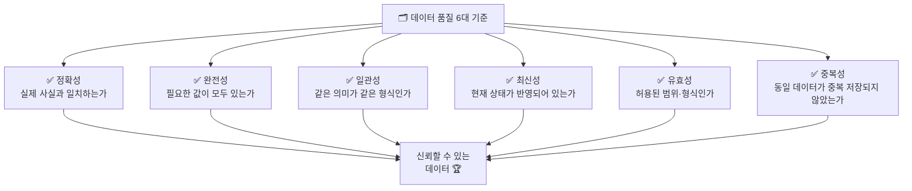
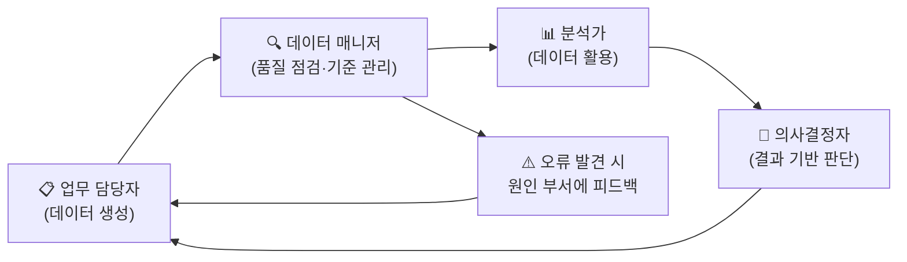

# 📓 5. [이론] 데이터 품질 개념 및 오류 유형 이해

정리일: 2026-10-08 · 교육 에셋 N1603

본문 수집·공개 편집. 도구 실행·최신 기능 재검증은 미실시. 고객·참여자 정보와 개별 접근 링크, 원본 첨부는 제외했습니다.

---

💡 **본 강의는 MySQL 을 기준으로 진행됩니다.**
**\[수업 목표\]**
- 데이터 품질의 개념과 중요성을 이해합니다.
- 데이터 품질 6대 기준(정확성·완전성·일관성·최신성·유효성·중복성)을 설명할 수 있습니다.
- 오류 데이터의 유형과 발생 원인을 분류할 수 있습니다.
- 교육기관 10 업무 맥락에서 품질 문제의 실제 영향을 설명할 수 있습니다.
- 업무별 데이터 품질 기준 정의 방법을 이해합니다.
**\[목차\]**
1. 데이터 품질이란 무엇인가요?
2. 데이터 품질 6대 기준
3. 오류 데이터 유형 및 발생 원인
4. 데이터 품질 관리 기준 정의 방법
5. 요약

---
## 01. 데이터 품질이란 무엇인가요?
> ⏱ 예상 소요: 약 30분
💡 **“데이터가 있다”는 것과 “믿고 쓸 수 있는 데이터가 있다”는 것은 전혀 다른 이야기입니다.**
- **☑️ 데이터 품질, 왜 갑자기 중요해졌을까요?**
데이터를 많이 쌓는 것이 능사가 아닌 시대가 되었습니다.
예전에는 “데이터가 없어서” 분석을 못 했다면, 이제는 “데이터가 있는데 믿을 수가 없어서” 못 쓰는 경우가 더 많습니다.
> 💡 **Tip:** 데이터 분석가들 사이에서는 이런 말이 있습니다.<br>*“분석 시간의 80%는 데이터 정제에 쓴다.”*<br>이 80%를 줄이는 것이 바로 데이터 품질 관리의 목표입니다. 😊
공사에서도 마찬가지입니다.
열 사용량 데이터는 수백만 건이 쌓여 있지만, 일부 달의 수치가 누락되어 있거나,<br>같은 설비 코드가 두 가지 형식으로 혼용된다면… 그 데이터로 내린 결론을<br>과연 임원진에게 자신 있게 보고할 수 있을까요?
**데이터 품질 관리는 “얼마나 많은 데이터를 가지고 있는가”가 아니라,“얼마나 믿을 수 있는 데이터를 가지고 있는가”의 문제입니다.**
- **☑️ 식재료로 이해하는 데이터 품질**
데이터 품질을 가장 쉽게 이해하는 방법은 **요리사의 식재료 관리**에 비유하는 것입니다. 🙂
훌륭한 요리사도 상한 재료로는 좋은 음식을 만들 수 없습니다.<br>아무리 분석 실력이 뛰어난 데이터 분석가라도, 품질이 낮은 데이터로는 신뢰할 수 있는<br>결과를 만들 수 없습니다.


요리의 세계

데이터의 세계


신선한 재료

정확하고 최신 상태의 데이터


유통기한 확인

데이터 최신성 점검


식재료 표준 계량

데이터 형식·단위 통일


상한 재료 제거

오류 데이터 정제


레시피 기준 준수

데이터 입력 기준 준수


냉장 보관 규정

데이터 보안·접근 관리


자, 이렇게 생각하면 데이터 품질 관리가 훨씬 친근하게 느껴지시죠? 😄
- **☑️ 데이터 품질의 정의**
**데이터 품질이란 데이터가 업무 목적에 맞게 사용될 수 있는 정도를 의미합니다.**
단순히 데이터가 존재한다는 것만으로는 충분하지 않습니다.<br>데이터가 정확하고, 완전하고, 일관성 있게 관리되어야<br>실제 업무에서 신뢰하고 활용할 수 있습니다.
아래 표를 통해 낮은 품질과 높은 품질의 데이터 차이를 비교해 보겠습니다.
**\<품질이 낮은 데이터\>***데이터가 존재하지만 신뢰할 수 없는 상태*


품질 기준

문제 있는 데이터 예시


정확성

열 사용량 값이 실제 계량기 수치와 다름


완전성

민원 접수일, 처리 부서가 비어 있음


일관성

분당지사 / 분당사업소 / 분당 혼용


최신성

2년 전 교체된 설비가 여전히 구 정보로 남아 있음


**\<품질이 높은 데이터\>***믿고 분석에 활용할 수 있는 상태*


품질 기준

올바른 데이터 예시


정확성

계량기 측정값과 DB 값이 100% 일치함


완전성

모든 민원에 접수일·처리부서·유형이 입력됨


일관성

전 시스템에서 ’분당사업소’로 통일됨


최신성

설비 교체 즉시 마스터 데이터에 반영됨


- **☑️ 데이터 품질이 낮으면 어떤 일이 벌어질까요?**
품질 문제는 단순히 “데이터가 지저분한 것”으로 끝나지 않습니다.
실제 업무에서는 **연쇄 반응**을 일으킵니다.
공사의 실제 업무 상황을 통해 살펴보겠습니다. 😊


품질 문제

즉각적 영향

최종 피해


열 사용량 누락

월별 통계가 실제보다 낮게 집계됨

공급 계획 오산 → 수급 불안정


설비코드 불일치

같은 설비가 두 건으로 중복 조회됨

정비 이력 추적 불가 → 안전 리스크


날짜 형식 오류

기간별 조회 시 데이터 일부 누락

피크 수요 분석 오류 → 잘못된 설비 증설 결정


민원 유형 미분류

반복 민원 원인 파악 어려움

서비스 개선 과제 미도출 → 민원 지속 증가


고객 정보 중복

고객 수가 실제보다 많게 집계됨

요금 청구 오류 → 고객 민원 발생


**초기에 잡지 못한 오류 데이터는 이후 분석·보고서·의사결정에 계속 영향을 줍니다.**
꺼진 불도 다시 봐야 하듯이, 데이터 매니저는 “당연해 보이는 데이터도” 반드시 확인하는<br>습관을 가져야 합니다. 🙂
- **☑️ 데이터 품질 관리의 목표**
결국 데이터 품질 관리의 궁극적인 목표는 아래 다섯 가지로 정리할 수 있습니다.


<colgroup>
<col>
<col width="405">
</colgroup>


목표

설명


**신뢰성 확보**

분석 결과를 자신 있게 보고할 수 있습니다.


**활용 가능성 향상**

분석·보고·AI 학습에 바로 사용 가능한 상태를 유지합니다.


**의사결정 품질 향상**

데이터 기반 의사결정의 정확도를 높입니다.


**업무 효율 향상**

데이터 정제에 소모되는 반복 작업을 줄입니다.


**리스크 예방**

오류 데이터로 인한 잘못된 판단을 사전에 방지합니다.


---
## 02. 데이터 품질 6대 기준
> ⏱ 예상 소요: 약 55분
💡 **데이터 품질은 한 가지 기준으로 판단할 수 없습니다. 6가지 관점에서 함께 살펴보겠습니다.**
- **☑️ 6대 품질 기준 한눈에 보기**
데이터 품질을 평가하는 대표적인 기준은 6가지입니다.
각 기준이 어떻게 서로 연결되는지 먼저 전체 구조를 살펴보겠습니다.

자, 이제 각 기준을 하나씩 깊이 있게 살펴보겠습니다. 🙂
---
- **☑️ 1️⃣ 정확성 — 사실과 일치하는가**
**정확성이란 데이터 값이 실제 현실과 일치하는 정도를 의미합니다.**
아무리 데이터가 잘 채워져 있어도, 틀린 값이 채워져 있다면 아무 소용이 없습니다.
> **🔍 비유:** 체중계가 항상 5kg 적게 표시된다면, 매일 측정해도 의미가 없겠죠?<br>데이터도 마찬가지입니다. 잘못된 값이 꾸준히 입력되면 오히려 없는 것보다 나쁩니다.
**\[WHY\] 왜 정확성이 중요한가요?**
정확성 문제는 “모르고 쓰는 것”이 가장 무섭습니다.<br>누락된 데이터는 눈에 보이지만, 틀린 데이터는 겉으로는 정상처럼 보이기 때문입니다.
**\[공사 실제 사례\]**


<colgroup>
<col width="213.0729217529297">
<col>
<col>
</colgroup>


상황

문제

결과


계량기 열 사용량이 DB에 오입력됨

실제 325 → DB에는 235로 저장

월간 공급량 집계 오류 → 요금 과소 청구


설비 교체 후 용량 정보 미수정

구형 설비 용량(500kW) 그대로 남아 있음

공급 가능 용량 과대 산정


**\<정확성 before after\>**


<colgroup>
<col>
<col>
<col width="251.0625">
</colgroup>


구분

Before (문제 있음)

After (수정 후)


열 사용량 (Gcal)

235

325


설비 용량 (kW)

500

300


고객 연락처

010-1234-XXXX

[연락처 비공개]


> 💡 **Tip:** 정확성은 원천 데이터(계량기, 계약서, 현장 점검 기록)와 대조하는 방식으로 검증합니다.<br>전수 검증이 어려울 경우 **표본 추출 검증**을 활용하세요.
---
- **☑️ 2️⃣ 완전성 — 필요한 값이 모두 있는가**
**완전성이란 필수 항목의 값이 빠짐없이 입력된 정도를 의미합니다.**
데이터베이스에서 값이 없는 상태를 `NULL`이라고 합니다.<br>필수 항목에 NULL이 있다면 완전성 문제가 발생한 것입니다.
> **🔍 비유:** 주문서에 배송지 주소가 빠져 있으면 물건을 보낼 수 없죠?<br>마찬가지로, 민원 데이터에서 접수일이 NULL이면 기간별 분석 자체가 불가능합니다.
**\[WHY\] 왜 완전성이 중요한가요?**
NULL이 섞인 데이터로 집계를 하면 **COUNT, SUM, AVG 모두 결과가 왜곡**됩니다.<br>특히 필수 항목의 NULL은 해당 레코드 전체를 분석에서 배제하게 만들 수 있습니다.
**\[공사 실제 사례 — 실패 시나리오\]**
```plain text
① 민원 데이터에서 '처리부서' 컬럼에 NULL이 30% 존재
       ↓
② 부서별 민원 처리 현황 보고서 작성
       ↓
③ 전체 민원 1,000건 중 700건만 부서 배분됨
       ↓
④ 특정 부서의 처리 건수가 실제보다 적게 집계
       ↓
⑤ 인력 배치 및 성과 평가 오류 발생
```
**\<완전성 before after\>**
**\<Before: NULL이 있는 민원 데이터\>**


민원번호

접수일

처리부서

민원유형


C001

2024-01-05

고객지원팀

요금문의


C002

NULL

NULL

배관불량


C003

2024-01-07

시설관리팀

NULL


**\<After: 완전성 기준을 적용한 민원 데이터\>**


민원번호

접수일

처리부서

민원유형


C001

2024-01-05

고객지원팀

요금문의


C002

2024-01-06

시설관리팀

배관불량


C003

2024-01-07

시설관리팀

온도불량


---
- **☑️ 3️⃣ 일관성 — 같은 의미가 같은 형식인가**
**일관성이란 같은 의미를 가진 데이터가 모든 시스템에서 동일한 형식으로 관리되는 정도입니다.**
> **🔍 비유:** 서울 본사·부산 지사·대구 지사 직원 명부에서<br>같은 사람이 “프로님”, “Hong Gil-dong”, “홍 길동”으로 각각 달리 표기되어 있다면<br>세 명부를 합쳐도 동일인인지 알 수 없겠죠?
**\[WHY\] 왜 일관성이 중요한가요?**
여러 시스템을 연계하거나 통합 분석을 할 때, 일관성이 없으면 **JOIN이 실패**하거나<br>같은 실체를 서로 다른 항목으로 집계하게 됩니다.
**\[공사 실제 사례 — 실패 시나리오\]**
```plain text
① 민원시스템: 사업소명 = "분당사업소"
   설비시스템: 사업소명 = "분당지사"
       ↓
② 두 시스템을 사업소명으로 JOIN 시도
       ↓
③ 매칭 실패 → 분당 지역 데이터가 통합 분석에서 제외
       ↓
④ 분당 지역 공급 현황·민원 현황 모두 오집계
```
**\<일관성 before after\>**
**\<Before: 시스템마다 다른 사업소 표기\>**


시스템

항목명

실제 입력값


민원시스템

사업소

분당사업소


설비시스템

관할사업소

분당지사


계약시스템

담당부서

분당


요금시스템

지역코드

BD001


**\<After: 표준 코드 통일 후\>**


시스템

항목명

표준값


민원시스템

사업소코드

SB001


설비시스템

사업소코드

SB001


계약시스템

사업소코드

SB001


요금시스템

사업소코드

SB001


> 💡 **Tip:** 일관성 문제를 해결하려면 **공통 코드 체계(표준 코드)** 를 만들고<br>모든 시스템이 이를 참조하도록 설계해야 합니다. 이것이 바로 **데이터 표준화**입니다.
---
- **☑️ 4️⃣ 최신성 — 현재 상태가 반영되어 있는가**
**최신성이란 데이터가 현재의 실제 상태를 제때 반영하고 있는 정도를 의미합니다.**
> **🔍 비유:** 2년 전 지도 앱으로 길을 찾다가 없어진 식당에 도착한 경험 있으신가요? 😊<br>데이터도 마찬가지입니다. 아무리 정확했던 데이터도 현실이 변하면 낡은 데이터가 됩니다.
**\[WHY\] 왜 최신성이 중요한가요?**
설비 운영, 고객 정보, 계약 현황은 수시로 바뀝니다.<br>최신성이 보장되지 않으면 **현재 운영 중이 아닌 설비에 정비를 발주**하거나,<br>**이미 해지된 고객에게 안내문을 발송**하는 황당한 상황이 발생합니다.
**\[공사 실제 사례\]**


상황

문제

결과


설비 교체 후 마스터 데이터 미갱신

구형 설비 사양이 그대로 남아 있음

운전 최적화 계산 오류


고객 이사 후 주소 미수정

구 주소로 고지서 발송

반송 처리·민원 발생


계약 해지 후 DB 미반영

해지 고객이 활성 고객으로 조회됨

고객 수 통계 과대 집계


**\<최신성 before after\>**


항목

Before (업데이트 전)

After (업데이트 후)


설비 상태

가동중 (실제는 2023년 폐기)

폐기


고객 주소

서울시 강남구 (2022년 이사)

경기도 성남시 분당구


담당자

김○○ (2024년 퇴직)

이○○


---
- **☑️ 5️⃣ 유효성 — 허용된 범위·형식인가**
**유효성이란 데이터 값이 사전에 정의된 형식·범위·규칙을 준수하는 정도를 의미합니다.**
> **🔍 비유:** 주민등록번호 입력 칸에 이름을 적어 제출한 서류를 생각해 보세요.<br>값 자체는 있지만, 올바른 형식이 아니라서 처리가 불가능합니다.<br>데이터도 마찬가지입니다.
**\[WHY\] 왜 유효성이 중요한가요?**
형식 오류가 있는 데이터는 **SQL 날짜 함수·집계 함수가 제대로 작동하지 않습니다.**<br>범위 오류(음수 사용량 등)는 **통계 왜곡**으로 이어집니다.
**\[공사 실제 사례 — 실패 시나리오\]**
```plain text
① 열 사용량 데이터에 음수값(-50 Gcal) 존재
       ↓
② SUM(열사용량) 집계 시 음수가 더해져 총량 감소
       ↓
③ 해당 월 공급량 집계가 실제보다 낮게 산출
       ↓
④ 다음 해 공급 계획 수립 시 수요 과소 추정
       ↓
⑤ 공급 부족 → 서비스 장애 리스크
```
**\<유효성 before after\>**


항목

Before (오류값)

유효성 규칙

After (수정값)


열 사용량 (Gcal)

-50

0 이상의 숫자

재측정 후 수정


접수일

2030.01.05

YYYY-MM-DD 형식

2024-01-05


처리 기간 (일)

999999

1\~365 이내

원천 확인 후 수정


고객 연락처

[연락처 비공개]

010-XXXX-XXXX 형식

[연락처 비공개]


> ⚠️ **주의:** 유효성 검사는 **입력 시점**에 적용하는 것이 가장 효율적입니다.<br>이미 저장된 오류를 찾아 수정하는 것보다, 처음부터 입력되지 않도록 막는 것이 비용이 훨씬 적게 듭니다.
---
- **☑️ 6️⃣ 중복성 — 동일한 데이터가 두 번 저장되지 않았는가**
**중복성이란 동일한 실체가 한 번만 저장되어 있는 정도를 의미합니다.**<br>(중복이 없을수록 품질이 높은 것입니다.)
> **🔍 비유:** 같은 사람이 출석부에 두 번 올라가 있다면, 출석 통계가 맞을 수 없겠죠?<br>데이터도 마찬가지입니다. 같은 민원이 두 번 등록되면 처리 건수가 과대 집계됩니다.
**\[WHY\] 왜 중복성이 중요한가요?**
중복 데이터는 **COUNT, SUM 같은 집계 함수 결과를 부풀려** 통계를 왜곡합니다.<br>또한 중복된 고객에게 이중으로 요금을 청구하거나 고지서를 발송하는 실수로 이어질 수 있습니다.
**\[공사 실제 사례\]**


상황

문제

결과


같은 고객이 고객ID 두 개로 등록됨

고객 수 중복 집계

실제 고객 수 파악 불가


동일 설비가 코드 표기 차이로 두 건 등록

정비 이력이 두 건에 분산

설비 이력 추적 불가


시스템 장애로 민원이 두 번 접수됨

처리 건수 과대 집계

성과 지표 왜곡


**\<중복성 before after\>**
**\<Before: 중복 등록된 설비 데이터\>**


설비ID

설비명

설치위치

용량(kW)


HX-001

열교환기 A

분당사업소

300


HX001

열교환기 A

분당사업소

300


HX-002

열교환기 B

일산사업소

500


**\<After: 중복 제거 후\>**


설비ID

설비명

설치위치

용량(kW)


HX-001

열교환기 A

분당사업소

300


HX-002

열교환기 B

일산사업소

500


---
- **☑️ 6대 기준 종합 정리 및 측정 방법**
6가지 기준을 한눈에 비교하고, 실제로 어떻게 수치로 측정하는지 살펴보겠습니다.


품질 기준

핵심 질문

측정 지표

임계값 예시

공사 점검 대상


**정확성**

사실과 일치하는가?

원천 대비 불일치 건수 / 전체 건수

불일치율 1% 이하

열 사용량, 설비 사양


**완전성**

필수값이 있는가?

NULL 건수 / 전체 건수

필수항목 NULL 0%

민원 접수일·처리부서


**일관성**

표현이 통일되어 있는가?

비표준 코드 건수 / 전체 건수

비표준 코드 0%

사업소명, 설비코드


**최신성**

현재 상태인가?

마지막 업데이트 경과일

업무 주기 이내

설비 마스터, 고객 정보


**유효성**

허용 범위·형식인가?

형식·범위 오류 건수 / 전체 건수

오류율 0.5% 이하

날짜, 사용량, 연락처


**중복성**

중복 저장되지 않았는가?

중복 레코드 건수 / 전체 건수

중복율 0%

고객ID, 민원번호


**“데이터가 나쁜 것 같다”는 주관적 판단보다,“필수 항목 NULL 비율이 5%를 초과하고 있다”는 객관적 수치가 훨씬 설득력 있습니다.** 😊
- **☑️ 업무별 품질 기준 우선순위**
모든 데이터에 6가지 기준을 동일하게 적용하기는 어렵습니다.
업무의 중요도와 리스크에 따라 우선순위를 정하는 것이 현실적입니다.


업무 영역

가장 중요한 품질 기준

이유


열 사용량·요금

🔴 정확성, 완전성

요금 청구의 직접적 근거가 됩니다.


설비 운영·정비

🔴 최신성, 일관성

이력 추적과 예방 정비의 기반입니다.


안전·사고 관리

🔴 완전성, 정확성

재발 방지와 원인 분석의 근거입니다.


고객·민원

🔵 유효성, 중복성

정확한 고객 파악과 서비스 개선의 기초입니다.


계약·예산

🔵 정확성, 완전성

감사 대응과 집행 근거가 됩니다.


---
## 03. 오류 데이터 유형 및 발생 원인
> ⏱ 예상 소요: 약 45분
💡 **오류를 고치려면 먼저 어떤 오류가 왜 발생하는지 알아야 합니다. 원인을 모르면 같은 오류가 반복됩니다.**
- **☑️ 오류 데이터의 6가지 유형**
데이터 오류는 크게 6가지 유형으로 나눌 수 있습니다.
유형을 정확히 구분해야 **어떤 도구와 방법으로 해결할지** 결정할 수 있습니다.


오류 유형

설명

공사 데이터 예시


**결측값**

필수 항목의 값이 비어 있음 (NULL)

민원 접수일, 처리부서가 NULL


**중복 데이터**

동일한 레코드가 두 번 이상 저장됨

같은 설비가 HX-001, HX001 두 건으로 등록


**형식 오류**

허용된 형식과 다른 값

날짜가 2024.01.05, 01/05/2024, 20240105 혼용


**범위 초과**

허용 숫자·기간 범위를 벗어난 값

열 사용량이 음수, 미래 날짜 접수


**불일치 오류**

같은 의미인데 다른 표현으로 입력됨

분당, 분당지사, 분당사업소 혼용


**논리적 오류**

개별 값은 정상이지만 상호 관계가 맞지 않음

처리완료일이 접수일보다 이전 날짜


- **☑️ 공사 업무별 오류 유형 매핑**
이제 공사 주요 데이터 영역에서 각 오류 유형이 어떻게 나타나는지 살펴보겠습니다.


데이터 영역

오류 유형

구체적 사례

업무 영향


열 사용량

결측값·범위 초과

특정 달 사용량이 0 또는 음수

수요 예측 오산·요금 오류


설비 마스터

중복·불일치

HX-001과 HX001이 별도 설비로 등록

정비 이력 분산·추적 불가


민원 데이터

형식 오류·결측

접수일 형식 혼용, 민원유형 NULL

반복 민원 원인 분석 불가


고객 정보

중복·논리 오류

같은 고객이 다른 ID로 두 건 등록

요금 청구·서비스 오류


안전 점검

결측·논리 오류

점검 완료일이 점검 시작일보다 이전

점검 이력 신뢰도 저하


계약 정보

형식·논리 오류

계약종료일이 계약시작일보다 이전

계약 유효성 파악 불가


- **☑️ 오류 발생 원인 — 3가지 유형**
오류는 어디서 어떻게 발생하는 걸까요?
원인을 알아야 **근본적인 해결**이 가능합니다.<br>발생 원인은 크게 세 가지로 나눌 수 있습니다.
**1) 입력 오류 — 사람이 직접 입력하는 과정에서 발생합니다.**


<colgroup>
<col>
<col width="374">
</colgroup>


원인

예시


입력 기준이 명확하지 않음

지역명을 자유 입력 → 분당, 분당지사, 분당구 혼용


오타

설비코드 HX-001 → HX0O1 (숫자 0과 알파벳 O 혼동)


필수 항목 인식 부족

담당자가 선택항목으로 인식하여 미입력


복사·붙여넣기 오류

이전 레코드를 복사 후 일부 항목 미수정


**2) 시스템 오류 — 업무 시스템의 설계나 처리 과정에서 발생합니다.**


<colgroup>
<col>
<col width="385.9375">
</colgroup>


원인

예시


입력 유효성 검사 미적용

날짜 필드에 문자 입력 허용


중복 체크 미적용

동일 민원번호로 두 건 등록 가능


시스템 장애

저장 중단으로 일부 값만 저장됨


배치 처리 오류

야간 배치 실행 중 일부 레코드 누락


**3) 연계 오류 — 시스템 간 데이터를 주고받는 과정에서 발생합니다.**


<colgroup>
<col>
<col width="409">
</colgroup>


원인

예시


코드 체계 불일치

A시스템의 설비코드 ≠ B시스템의 설비코드


데이터 형식 불일치

A시스템 날짜(YYYYMMDD) → B시스템(YYYY-MM-DD) 변환 오류


연계 시점 불일치

최신 데이터가 연계되기 전 분석에 사용됨


필드 매핑 오류

연계 설정 시 잘못된 컬럼끼리 연결됨


> 💡 **Tip:** 오류 원인을 파악할 때는 **“이 데이터가 처음 만들어지는 시점”부터 역추적**하는 것이<br>가장 효과적입니다. 오류는 발견되는 곳이 아니라, 발생하는 곳에서 해결해야 합니다.
- **☑️ 오류 유형별 탐지 방법**
오류가 어디 숨어 있는지, 어떻게 찾아낼 수 있을까요?
유형별로 탐지 방법이 다릅니다. 아래 표를 참고하세요.


<colgroup>
<col>
<col width="168.45834350585938">
<col width="393">
</colgroup>


오류 유형

탐지 방법

SQL 힌트


결측값

NULL 건수 집계

`WHERE 컬럼 IS NULL`


중복 데이터

중복 키 건수 집계

`GROUP BY + HAVING COUNT(*) > 1`


형식 오류

정규표현식·형식 패턴 검사

`WHERE 컬럼 NOT REGEXP '정규식'`


범위 초과

최솟값·최댓값 확인

`WHERE 컬럼 < 0 OR 컬럼 > 최대허용값`


불일치 오류

표준 코드 테이블과 비교

`WHERE 컬럼 NOT IN (표준코드목록)`


논리적 오류

관련 컬럼 간 조건 검사

`WHERE 완료일 < 접수일`


---
## 04. 데이터 품질 관리 기준 정의 방법
> ⏱ 예상 소요: 약 40분
💡 **품질 기준은 “내가 생각하는 좋은 데이터”가 아니라, 업무 담당자와 함께 문서로 정의해야 합니다.**
- **☑️ 품질 기준서란 무엇인가요?**
**품질 기준서는 “이 데이터는 어떤 상태여야 좋은 데이터인가”를 문서로 정의한 것입니다.**
품질 기준서가 없으면 어떤 일이 벌어질까요?
```plain text
A 담당자: "이 정도면 괜찮죠?"
B 담당자: "이건 문제가 있는 거 아닌가요?"
C 담당자: "기준이 뭐예요?"
```
**기준이 없으면 품질 관리가 “사람에 따라” 달라집니다.**<br>품질 기준서는 이러한 모호함을 없애고, 누가 담당하든 동일한 기준으로 점검할 수 있게 합니다.
품질 기준서에 포함되어야 하는 항목은 다음과 같습니다.


항목

설명

예시


**데이터명**

품질을 관리할 데이터 항목명

열 사용량


**품질 기준**

어떤 기준을 적용하는지

완전성, 유효성


**측정 방법**

어떻게 측정하는지

NULL 건수 집계, 범위 초과 건수 집계


**임계값**

허용 기준값

NULL 0건, 음수값 0건


**점검 주기**

얼마나 자주 확인하는지

월 1회, 데이터 갱신 시마다


**담당자**

점검 및 수정 책임자

에너지사업팀 데이터 매니저


**조치 방법**

오류 발생 시 어떻게 대응하는지

원천 데이터 확인 후 수정 요청


- **☑️ 품질 기준 정의 4단계**
품질 기준은 다음 4단계로 정의합니다.
- 1️⃣ **1단계: 데이터 항목 목록 확인**
- 어떤 데이터를 관리하는지 파악합니다.
- 시스템별 테이블·컬럼 목록을 정리합니다.
- 2️⃣ **2단계: 업무 중요도 평가**
- 이 데이터가 어떤 의사결정에 사용되는가?
- 오류 발생 시 업무에 미치는 영향은 얼마나 큰가?
- → 영향이 클수록 품질 기준을 더 엄격하게 정의합니다.
- 3️⃣ **3단계: 품질 기준 및 임계값 설정**
- 각 항목에 적용할 품질 기준 결정합니다.
- 허용 가능한 오류 수준(임계값)을 수치로 설정합니다.
- 4️⃣ **4단계: 점검 주기 및 책임자 지정**
- 언제, 누가 점검할 것인지 결정합니다.
- 오류 발생 시 조치 방법도 함께 정의합니다.
- **☑️ 품질 기준 정의 시 주의사항**
처음 품질 기준을 만들 때 흔히 하는 실수들이 있습니다. 함께 살펴보겠습니다.


<colgroup>
<col>
<col width="465">
</colgroup>


주의사항

설명


**현실적인 임계값 설정**

처음부터 너무 엄격한 기준을 세우면 관리가 어렵습니다. 현재 수준을 먼저 파악하고 단계적으로 기준을 높이세요.


**업무 담당자와 협의**

데이터 매니저 혼자 정하면 현업의 동의를 얻기 어렵습니다. 해당 부서와 함께 논의하세요.


**반드시 문서화**

구두로만 공유하면 담당자 변경 시 기준이 사라집니다. 문서로 남기세요.


**주기적인 기준 검토**

업무가 변화하면 품질 기준도 바뀝니다. 연 1회 이상 재검토하세요.


**측정 가능한 기준**

“데이터가 깨끗해야 한다”보다 “NULL 비율 1% 이하”처럼 수치로 표현하세요.


- **☑️ 교육기관 10 — 품질 기준 정의 예시**
공사 주요 데이터에 대한 품질 기준 정의 예시를 살펴보겠습니다.
실제 업무에서 이 표와 같은 형태로 품질 기준서를 작성하게 됩니다. 😊


데이터 항목

적용 기준

임계값

점검 주기

담당 부서

오류 조치


열 사용량

완전성, 유효성

NULL 0건, 음수값 0건

월 1회

에너지사업팀

계량기 원천 재확인


설비코드

일관성, 중복성

비표준 코드 0건, 중복 0건

분기 1회

시설관리팀

표준 코드로 통일 처리


민원 접수일

완전성, 유효성

NULL 0건, 미래 일자 0건

주 1회

고객지원팀

접수 담당자에 수정 요청


민원 유형

완전성, 일관성

NULL 0건, 비표준 유형 0건

월 1회

고객지원팀

표준 유형 코드 재적용


계약 기간

유효성, 논리 일관성

종료일 \< 시작일 0건

계약 등록 시마다

계약관리팀

계약서 원본 재확인


고객 ID

중복성, 완전성

중복 0건, NULL 0건

월 1회

고객지원팀

원천 시스템 중복 제거


- **☑️ 데이터 품질 관리는 혼자 하는 일이 아닙니다**
마지막으로 중요한 점을 짚겠습니다.
데이터 품질 문제는 데이터 매니저 혼자 해결할 수 없습니다.

- **업무 담당자**: 데이터를 처음 생성·입력합니다. 기준에 맞게 입력하는 것이 1차 책임입니다.
- **데이터 매니저**: 품질 기준을 정의하고, 주기적으로 점검하며, 오류 발생 시 관련 부서와 협력합니다.
- **분석가**: 품질이 확보된 데이터를 분석에 활용하고, 이상 징후 발견 시 피드백합니다.
**데이터 품질 관리는 특정 부서만의 일이 아니라,데이터를 생성·활용하는 모든 부서의 공동 책임입니다.**
---
## 05. 요약
> ⏱ 예상 소요: 약 10분
💡 **금일 수업내용을 복기해 보겠습니다.**
- 데이터 품질이란 데이터가 업무 목적에 맞게 사용될 수 있는 정도를 의미합니다.
- 데이터 품질 관리의 핵심은 “얼마나 많은가”가 아니라 “얼마나 믿을 수 있는가”의 문제입니다.
- 데이터 품질 6대 기준은 정확성·완전성·일관성·최신성·유효성·중복성입니다.
- 정확성은 데이터 값이 실제 현실과 일치하는지, 원천 데이터와 비교·검증합니다.
- 완전성은 필수 항목에 NULL이 없는지 확인하며, NULL이 섞이면 집계 결과가 왜곡됩니다.
- 일관성은 같은 의미의 데이터가 모든 시스템에서 동일한 형식으로 관리되는지 확인합니다.
- 최신성은 현재 상태가 데이터에 제때 반영되어 있는지 점검합니다.
- 유효성은 허용된 형식·범위를 벗어난 값이 없는지 확인합니다.
- 중복성은 동일한 실체가 두 번 이상 저장되지 않았는지 점검합니다.
- 오류 데이터 유형은 결측값·중복·형식 오류·범위 초과·불일치·논리적 오류로 구분됩니다.
- 오류 발생 원인은 입력 오류·시스템 오류·연계 오류 세 가지로 나눌 수 있습니다.
- 오류를 고치려면 발견 시점이 아닌 발생 시점으로 역추적하여 근본 원인을 해결해야 합니다.
- 품질 기준서는 측정 방법·임계값·점검 주기·책임자를 수치로 명확하게 정의한 문서입니다.
- 품질 기준은 업무 담당자와 협의하여 현실적으로 설정하고, 업무 변화에 따라 재검토해야 합니다.
- 데이터 품질 관리는 특정 부서만의 일이 아니라 데이터를 생성·활용하는 모든 부서의 공동 책임입니다.
