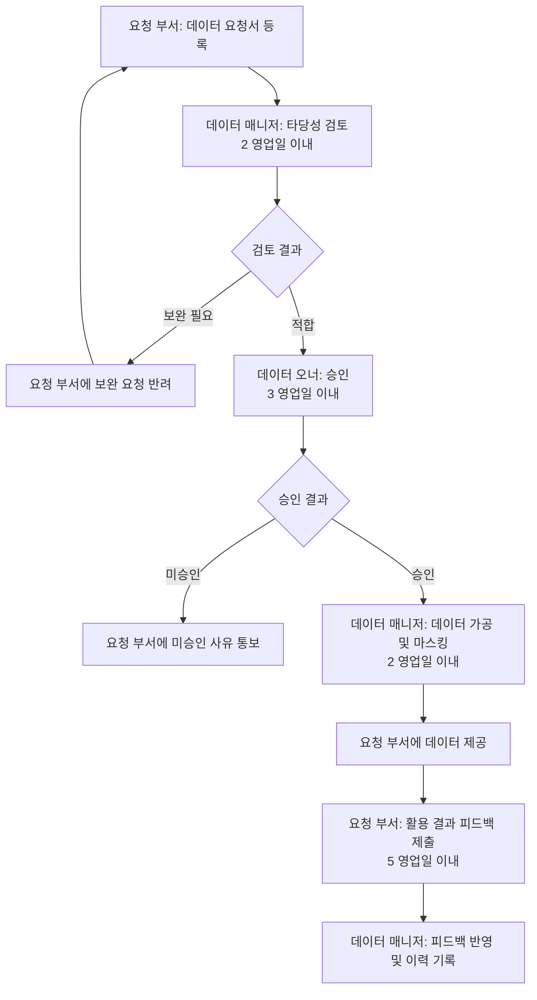
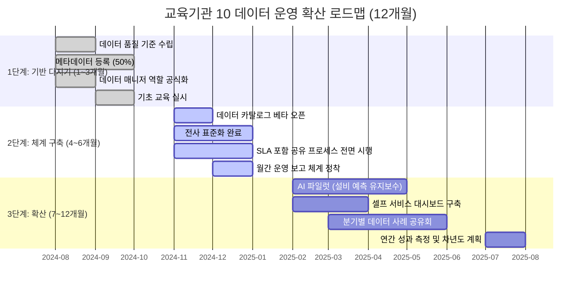

# 🏋️ 20.[실습] 데이터 운영 및 확산 로드맵 수립

정리일: 2026-10-08 · 교육 에셋 N1631

본문 수집·공개 편집. 도구 실행·최신 기능 재검증은 미실시. 고객·참여자 정보와 개별 접근 링크, 원본 첨부는 제외했습니다.

---

💡 **본 강의는 MySQL 을 기준으로 진행됩니다.**
💡 **데이터 매니저 관점:** 5회차의 마지막 실습입니다. 지금까지 배운 모든 내용(표준화, 품질 관리, 메타데이터, AI 데이터 활용)을 조직 전체로 확산하는 전략을 수립합니다. 데이터 매니저의 최종 목표는 조직이 스스로 데이터를 잘 관리하는 문화를 만드는 것입니다.
**\[수업 목표\]**
- 공사 전체 데이터 활용 현황을 As-Is / To-Be 관점으로 분석할 수 있습니다.
- 데이터 문화 성숙도 모델을 기반으로 조직 현황을 진단하고, 영역별로 다른 발전 경로를 설계할 수 있습니다.
- 조직 변화 관리(Change Management) 관점에서 데이터 문화 향상 방안을 도출할 수 있습니다.
- 부서 간 데이터 공유 프로세스와 SLA(처리 시간 기준)를 포함한 협업 체계를 설계할 수 있습니다.
- 단계별 데이터 운영 로드맵과 KPI를 수립할 수 있습니다.
- 실습파일 경로: [개별 링크 제외]
**\[목차\]**

---
## 01. 실습 목표 및 시나리오
> ⏱ 예상 소요: 약 10분
💡 **5회차에 걸친 교육 과정의 마지막 실습입니다. 지금까지 배운 모든 내용을 종합하여 공사 전체 데이터 운영 전략을 수립해 봅니다.**
- **☑️ 실습 목표**


#

실습 목표

산출물


1

데이터 활용 확산 전략 수립

As-Is / To-Be 분석 워크시트


2

데이터 문화 구축 방안 설계

성숙도 진단표 및 조직 변화 관리 계획


3

데이터 기반 협업 체계 운영

부서 간 SLA 포함 협업 체계 설계서


4

지속 가능한 데이터 운영 로드맵 작성

12개월 로드맵 (mermaid 타임라인) 및 KPI 표


- **☑️ 오늘의 시나리오**
> 여러분은 교육기관 10 데이터 매니저입니다.<br>5회차 전체 교육 과정을 마무리하며, 공사 전체 데이터 운영 전략과 조직 문화 확산 계획을 수립하는 임무를 부여받았습니다.<br>현재까지 구축한 데이터 거버넌스, 품질 관리, 메타데이터, 표준화, AI 활용 역량을 바탕으로 향후 12개월간의 실행 가능한 로드맵을 작성합니다.
- **☑️ 전체 교육 과정 되돌아보기**


회차

핵심 주제

주요 학습 내용


1회차

데이터 매니저 역할 및 기초

거버넌스 체계 이해, 데이터 구조·유형, DB·SQL 기초 조회


2회차

데이터 품질 관리

품질 개념·오류 유형, 정제·검증 실습, 품질 관리 프로세스·R&R 설계


3회차

데이터 활용 지원

활용 지원 프로세스 설계, 업무 기반 협업, End-to-End 통합 실습


4회차

메타데이터 및 표준화

메타데이터 개념·표준 정의, 데이터 카탈로그 설계, 표준화·명명 규칙


5회차

AI 활용 및 확산 전략

AI 데이터 활용, 플랫폼·파이프라인 이해, 데이터 운영 로드맵 수립


---
## 02. 실습 1. 데이터 활용 As-Is / To-Be 분석
> ⏱ 예상 소요: 약 50분
💡 **현재 공사의 데이터 운영 수준(As-Is)을 진단하고, 앞으로 달성할 목표 상태(To-Be)를 구체적으로 정의합니다. 현재를 냉정하게 보는 것이 좋은 전략의 출발점입니다.**
- **☑️ As-Is / To-Be 분석이란?**
As-Is / To-Be 분석은 현재 상태와 미래 목표 상태의 차이(Gap)를 명확히 파악하여<br>개선 과제를 도출하는 전략 분석 기법입니다.
일상적인 비유로 설명하면 이렇습니다. 🙂<br>여행을 떠날 때 “지금 내가 어디 있는지(현재 위치)”를 알아야<br>“목적지까지 어떤 길로 갈지(경로)”를 정할 수 있죠.<br>As-Is가 현재 위치라면, To-Be는 목적지입니다.<br>그리고 그 사이의 거리가 바로 **해결해야 할 과제(Gap)**입니다.
> 💡 **Tip:** As-Is를 파악할 때는 “좋게 보이고 싶은 마음”을 내려놓는 것이 중요합니다.<br>현재 문제를 직시해야 진짜 개선이 시작됩니다.
**만약 As-Is / To-Be 분석을 하지 않는다면?**
목표도, 기준도 없이 “그냥 데이터를 잘 관리하자”는 막연한 구호에 머물게 됩니다.<br>어느 날 갑자기 “우리 데이터 품질이 왜 이렇죠?”라는 질문이 쏟아져도<br>누구도 명확한 답을 내놓기 어렵습니다.
- **☑️ 영역별 As-Is / To-Be 비교 표 (예시)**
아래는 교육기관 10 맥락에서 작성한 예시입니다.<br>각 영역의 현재 문제점과 목표 상태, 그리고 그 사이를 채울 과제를 함께 확인합니다.
**\<As-Is (현재 상태) 진단\>***현재 운영 수준에서 실제로 발생하고 있는 문제 상황입니다.*


영역

As-Is (현재 상태)

주요 문제점


**거버넌스**

데이터 관리 주체 불명확, 비공식 담당

책임 소재가 모호해 오류 발생 시 처리가 지연됨


**품질**

오류 발생 시 사후 대응, 품질 기준 미비

같은 오류가 반복 발생해도 근본 원인을 파악하기 어려움


**표준화**

부서별 용어·코드 상이, 메타데이터 부재

“고객번호”와 “회원번호”가 같은 데이터인지 다른 데이터인지 혼란


**AI 활용**

AI 활용 경험 부족, 학습 데이터 정비 미흡

분석 모델을 만들고 싶어도 데이터 품질이 낮아 신뢰할 수 없음


**플랫폼**

시스템별 데이터 분산, 통합 조회 불가

단순 현황 파악도 3개 시스템을 수작업으로 취합해야 함


**\<To-Be (목표 상태) 설계\>***12개월 후 달성하고자 하는 목표 상태입니다.*


영역

To-Be (목표 상태)

주요 과제


**거버넌스**

데이터 거버넌스 위원회 운영, 데이터 매니저 공식 지정

거버넌스 조직 구성 및 역할 정의 문서화


**품질**

품질 기준 수립 및 정기 점검 체계 운영

품질 관리 프로세스 제도화 및 자동 점검 쿼리 운영


**표준화**

전사 데이터 표준 적용, 데이터 카탈로그 운영

표준 용어 사전 및 명명 규칙 확립


**AI 활용**

정제된 데이터 기반 AI 시범 사업 추진

학습용 데이터셋 준비 및 파일럿 운영


**플랫폼**

데이터 플랫폼 구축, 셀프 서비스 분석 환경 제공

플랫폼 도입 및 단계적 데이터 통합


- **☑️ 현재 데이터 활용 현황 파악 쿼리**
As-Is를 파악하는 첫 번째 단계는 **데이터를 직접 들여다보는 것**입니다.<br>아래 쿼리로 공사 DB의 현재 상태를 객관적으로 확인합니다.
**1️⃣ 테이블별 데이터 규모 및 최근 갱신 현황 확인**
지금 우리 DB에 어떤 테이블이 있고, 각 테이블이 얼마나 많은 데이터를 가지고 있는지,<br>그리고 마지막으로 데이터가 갱신된 시점이 언제인지 파악합니다.<br>오래된 갱신일자는 곧 “방치된 데이터”일 가능성이 높습니다.
```sql
-- 데이터베이스 내 테이블별 레코드 수 및 최근 갱신 시각 조회
SELECT
    TABLE_NAME          AS 테이블명,
    TABLE_ROWS          AS 추정_레코드수,
    DATA_LENGTH / 1024  AS 데이터크기_KB,
    CREATE_TIME         AS 생성일시,
    UPDATE_TIME         AS 최근_갱신일시
FROM information_schema.TABLES
WHERE TABLE_SCHEMA = 'kdhc_db'   -- 실습 DB명으로 변경
ORDER BY TABLE_ROWS DESC;
```
- 정답화면


테이블명

추정_레코드수

데이터크기_KB

생성일시

최근_갱신일시


heat_usage

12840

1024.00

2024-01-10

2024-06-01


customers

4320

384.00

2024-01-10

2024-05-28


complaints

2100

192.00

2024-01-10

2024-06-03


facilities

980

96.00

2024-01-10

2024-04-15


inspection_log

540

48.00

2024-01-10

2024-03-22


> 💡 **Tip:** `UPDATE_TIME`이 수개월 전에 멈춰 있는 테이블은 데이터가 제대로 수집되고 있는지 담당 부서에 확인이 필요합니다.
**2️⃣ 핵심 테이블의 NULL 비율 확인 (데이터 활용도 간접 파악)**
NULL이 많다는 것은 데이터가 제대로 입력되지 않았다는 신호입니다.<br>활용도가 낮거나 입력 기준이 불명확한 컬럼을 파악할 수 있습니다.
```sql
-- heat_usage 테이블의 주요 컬럼별 NULL 비율 확인
SELECT
    '사용량'      AS 컬럼명,
    COUNT(*)      AS 전체_건수,
    SUM(CASE WHEN `사용량` IS NULL THEN 1 ELSE 0 END)      AS NULL_건수,
    ROUND(SUM(CASE WHEN `사용량` IS NULL THEN 1 ELSE 0 END)
          * 100.0 / COUNT(*), 1)                           AS NULL_비율
FROM heat_usage
UNION ALL
SELECT
    '요금',
    COUNT(*),
    SUM(CASE WHEN `요금` IS NULL THEN 1 ELSE 0 END),
    ROUND(SUM(CASE WHEN `요금` IS NULL THEN 1 ELSE 0 END)
          * 100.0 / COUNT(*), 1)
FROM heat_usage
ORDER BY NULL_비율 DESC;
```
- 정답화면


컬럼명

전체_건수

NULL_건수

NULL_비율


요금

12840

642

5.0


사용량

12840

128

1.0


**3️⃣ 월별 데이터 누적 현황 (시계열 파악)**
데이터가 꾸준히 쌓이고 있는지, 아니면 특정 월에 공백이 있는지 확인합니다.<br>데이터 공백은 수집 프로세스에 문제가 있다는 신호일 수 있습니다.
```sql
-- 월별 열사용량 데이터 등록 건수 추이
SELECT
    DATE_FORMAT(`기준일자`, '%Y-%m') AS 연월,
    COUNT(*)                          AS 등록건수
FROM heat_usage
GROUP BY DATE_FORMAT(`기준일자`, '%Y-%m')
ORDER BY 연월 ASC;
```
- 정답화면


연월

등록건수


2023-10

1284


2023-11

1284


2023-12

1284


2024-01

1284


2024-02

1284


✏️ **실습 과제 1:**<br>\> 아래 표를 참고하여 **내 부서 또는 팀의 As-Is → To-Be 분석표**를 작성하세요.<br>\> 5개 영역(거버넌스, 품질, 표준화, AI 활용, 플랫폼) 중 **2개 이상** 영역에 대해 현재 상태와 목표 상태, 주요 과제를 구체적으로 기술합니다.


영역

As-Is (현재 상태)

To-Be (목표 상태)

주요 과제


- **예시 답안**
- 거버넌스 영역 예시
- As-Is: 배관 설비 데이터는 현장 담당자가 개별 엑셀로 관리하며, 전산 등록이 불규칙하게 이루어지고 있습니다.
- To-Be: 설비 데이터 입력 기준을 표준화하고, 데이터 매니저가 월 1회 정기 검증을 수행합니다.
- 주요 과제: 설비 데이터 입력 가이드라인 작성 및 전산 시스템 필수 입력 항목 설정
- 품질 영역 예시
- As-Is: 민원 데이터에 접수 경로가 누락된 건이 약 12% 존재하나, 발견되어도 수작업으로 개별 보완합니다.
- To-Be: 민원 시스템 입력 시 접수 경로를 필수 항목으로 지정하고, 월 1회 자동 품질 점검 쿼리를 실행합니다.
- 주요 과제: 시스템 필수 항목 설정 요청, 품질 점검 쿼리 작성 및 자동화 검토
---
## 03. 실습 2. 데이터 문화 성숙도 진단 및 향상 방안
> ⏱ 예상 소요: 약 55분
💡 **데이터 기반 의사결정이 일상화되려면 기술·시스템만으로는 부족합니다. 조직 구성원 모두가 데이터를 신뢰하고 활용하는 문화가 함께 만들어져야 합니다. 그리고 그 문화는 한 번에 완성되지 않습니다.**
- **☑️ 데이터 문화 성숙도 모델 — 5단계**
데이터 문화 성숙도는 마치 운전 실력과 비슷합니다. 🙂<br>처음엔 “핸들 잡는 것”조차 낯설지만(1단계: 인식),<br>연습을 거듭하면 어느 순간 “고속도로도 자연스럽게 달리는”(4단계: 최적화) 수준이 됩니다.<br>그리고 최고 수준에서는 “자율주행 시스템까지 설계”(5단계: 혁신)하게 되죠.
중요한 것은, **모든 영역이 동시에 같은 속도로 올라가지 않는다**는 점입니다.<br>품질 관리는 3단계인데 AI 활용은 1단계일 수 있습니다.<br>이것이 바로 **비선형 발전 경로**입니다. 각 영역을 별도로 진단해야 하는 이유입니다.


단계

명칭

특징

주요 현상


1단계

**인식**

데이터의 필요성은 느끼지만 활용 경험 없음

직관·경험 중심 의사결정, 데이터 신뢰도 낮음


2단계

**시작**

일부 부서·개인이 데이터 활용을 시도

엑셀 분석, 산발적 리포트, 비공식 데이터 공유


3단계

**체계화**

전사 차원의 데이터 관리 기준과 프로세스 수립

데이터 거버넌스 조직 운영, 품질 기준·카탈로그 운영


4단계

**최적화**

데이터 기반 의사결정이 일상화, 지속적 개선

KPI 대시보드 운영, 데이터 품질 자동 모니터링


5단계

**혁신**

AI·예측 분석 등 고도화된 데이터 활용

예측 모델 운영, 데이터 플랫폼 기반 셀프 서비스 분석


- **☑️ 영역별 성숙도 진단 (비선형 발전 경로 반영)**
동일한 조직이라도 영역마다 성숙도가 다를 수 있습니다.<br>아래 표로 영역별 현재 단계를 진단하고, 각 영역의 목표 단계를 설정합니다.


영역

현재 단계

목표 단계 (12개월 후)

비고


거버넌스

2단계 (시작)

3단계 (체계화)

데이터 매니저 역할 비공식 상태


품질 관리

2단계 (시작)

4단계 (최적화)

품질 점검 쿼리 일부 운영 중


표준화

1단계 (인식)

3단계 (체계화)

부서별 용어 불일치 심각


AI 활용

1단계 (인식)

2단계 (시작)

AI 활용 경험 전무


데이터 공유

2단계 (시작)

3단계 (체계화)

이메일·USB 기반 비공식 공유


> 💡 **Tip:** 모든 영역을 한꺼번에 5단계로 올리려 하면 오히려 아무것도 달성하지 못합니다.<br>영역별로 “다음 단계 하나씩 올리기”가 현실적인 전략입니다.
- **☑️ 공사 데이터 문화 수준 자가 진단 체크리스트**
아래 항목에 해당하면 ✅ 체크하세요. 체크 개수에 따라 현재 성숙도 단계를 파악할 수 있습니다.


#

진단 항목

해당 여부


1

우리 부서의 주요 데이터가 어디에 있는지 구성원 모두가 알고 있다.

☐


2

데이터를 요청하거나 공유할 때 공식적인 절차(프로세스)가 있다.

☐


3

데이터 품질 문제를 발견했을 때 누구에게 보고해야 하는지 명확하다.

☐


4

주요 업무 지표(KPI)를 데이터로 측정하고 정기적으로 확인한다.

☐


5

회의나 보고 시 데이터를 근거로 의사결정이 이루어진다.

☐


6

데이터 관련 교육이 정기적으로 제공되고 있다.

☐


7

부서 간 데이터 공유가 원활하게 이루어지고 있다.

☐


8

데이터 활용 우수 사례가 공유되는 채널이나 행사가 있다.

☐


9

데이터 오류 발생 시 원인 분석 및 재발 방지 대책을 수립한다.

☐


10

신규 입사자에게 데이터 관리 가이드가 제공된다.

☐


> **진단 결과 해석**
- 0\~2개: 1단계 (인식) — 데이터 문화의 출발점입니다. 기초 교육부터 시작하세요.
- 3\~4개: 2단계 (시작) — 개별적 노력이 있으나 체계화가 필요합니다.
- 5\~6개: 3단계 (체계화) — 전사 표준과 프로세스를 강화할 단계입니다.
- 7\~8개: 4단계 (최적화) — 데이터 기반 조직으로 발전하고 있습니다.
- 9\~10개: 5단계 (혁신) — AI 활용 등 고도화를 추진할 준비가 되어 있습니다.
- **☑️ 조직 변화 관리(Change Management) 관점 — 왜 중요한가?**
아무리 좋은 데이터 시스템을 도입해도<br>**사람이 바뀌지 않으면 시스템은 유명무실**해집니다.<br>데이터 카탈로그를 만들어도 아무도 안 쓰고,<br>품질 기준을 세워도 현장에서 지키지 않는 상황…<br>이것이 바로 기술만 앞선 조직에서 흔히 발생하는 문제입니다.
조직 변화 관리란, 새로운 방식(데이터 기반 업무)으로의 전환을 돕기 위해<br>구성원의 **인식 → 이해 → 수용 → 실천**을 단계적으로 지원하는 활동입니다.
**\<변화 저항 유형과 대응 전략\>**


저항 유형

주요 언어

대응 전략


**인식 부족**

“데이터가 왜 필요해요?”

실제 업무 개선 사례 공유, 체험 교육


**역량 부족**

“SQL을 어떻게 써요?”

단계별 교육 제공, 데이터 매니저 지원


**시간 부족**

“업무도 바쁜데요…”

반복 작업 자동화로 실제 시간 절감 보여주기


**불신**

“어차피 안 되던데요…”

작은 성공 사례(Quick Win) 먼저 만들기


**문화 저항**

“원래 이렇게 해왔는데요.”

경영진 지지 확보, 인센티브 연계


- **☑️ 데이터 문화 향상 방안 설계 워크시트**


영역

현재 수준

향상 방안

기대 효과

담당 부서


**교육**

비정기 외부 교육 위주

분기별 사내 데이터 역량 교육 운영

구성원 데이터 리터러시 향상

인사·교육팀


**인센티브**

데이터 활용 성과 인정 제도 없음

데이터 활용 우수 직원·부서 표창 제도 도입

자발적 데이터 활용 동기 부여

경영기획팀


**공유 체계**

이메일·개인 드라이브 분산 공유

데이터 카탈로그 기반 공식 공유 채널 운영

데이터 접근성·신뢰도 향상

IT·정보화팀


**성과 측정**

정성적 보고 위주

데이터 활용 KPI 수립 및 월간 대시보드 운영

개선 효과 가시화 및 의사결정 고도화

데이터관리팀


**Quick Win**

성공 사례 없음

3개월 이내 소규모 개선 과제 1건 실행

구성원 변화 의지 고취

데이터관리팀


✏️ **실습 과제 2:**<br>\> 1. 위 자가 진단 체크리스트를 작성하고 **현재 우리 조직의 데이터 문화 성숙도 단계**를 결정하세요.<br>\> 2. 영역별 성숙도 진단 표를 완성하고, **각 영역의 현재 단계와 12개월 후 목표 단계**를 기재하세요.<br>\> 3. 현재 조직에서 가장 흔히 나타나는 **변화 저항 유형 1가지**를 선택하고, 구체적인 대응 전략을 서술하세요.
- **예시 답안**
- 진단 결과: 3단계 (체계화) — 체크 6개 해당
- 영역별 성숙도: 품질 관리 3단계 / AI 활용 1단계 / 표준화 2단계 (영역별로 다름)
- 변화 저항 유형: “시간 부족” 유형이 가장 많음
- 대응 전략: 데이터 매니저가 정기 품질 점검 쿼리를 작성하여 담당자에게 제공함으로써<br>수작업 집계 시간을 월 3시간 이상 절감. 실제 시간 절감 효과를 수치로 공유합니다.
---
## 04. 실습 3. 부서 간 데이터 공유 프로세스 및 SLA 설계
> ⏱ 예상 소요: 약 45분
💡 **데이터는 혼자 관리하는 것이 아닙니다. 부서 간 공유와 협업이 원활해야 데이터의 가치가 비로소 실현됩니다. 그리고 “원활하다”는 것은 처리 시간 기준(SLA)이 명확할 때 가능합니다.**
- **☑️ SLA(Service Level Agreement)란?**
SLA는 “서비스 수준 협약”으로, 쉽게 말하면<br>**“몇 영업일 이내에 처리하겠다”는 약속**입니다.
택배를 생각해보세요. 🙂<br>“다음 날까지 배송”이라는 약속이 있어야 고객이 신뢰하고 기다릴 수 있습니다.<br>데이터 공유도 마찬가지입니다.<br>요청을 넣었는데 “언제 줄지 모른다”면 요청 부서는 기다리다 포기하거나,<br>비공식 경로로 데이터를 확보하려 합니다.<br>이것이 데이터 거버넌스를 무너뜨리는 주요 원인 중 하나입니다.
**만약 SLA가 없다면?**
- 요청 부서: “언제 주나요?” 재촉 이메일이 반복됩니다.
- 데이터 매니저: 우선순위 없이 요청이 쌓입니다.
- 경영진: “데이터팀이 일을 안 한다”는 오해가 생깁니다.
- **☑️ 부서 간 데이터 공유 프로세스 및 SLA**
데이터 요청부터 제공까지의 공식 절차와 각 단계별 처리 시간(SLA)을 명시합니다.<br>담당 조직별로 책임 시간이 다르게 적용됩니다.


단계

프로세스

주요 활동

담당 조직

SLA (처리 시간)


1단계

**요청**

활용 목적·범위·기간 기재 후 데이터 관리 시스템에 공식 요청서 등록

요청 부서

즉시 (등록 시 자동 접수)


2단계

**검토**

요청 타당성 검토, 개인정보·보안 사항 확인, 보완 요청 시 반려

데이터 매니저

**2 영업일 이내**


3단계

**승인**

부서장 또는 데이터 거버넌스 위원회 최종 승인

데이터 오너 (부서장)

**3 영업일 이내**


4단계

**제공**

가공·마스킹 처리 후 안전한 채널로 데이터 전달 (CSV, DB 뷰 등)

데이터 매니저

**2 영업일 이내**


5단계

**피드백**

활용 결과 공유, 오류·개선 사항 전달

요청 부서

활용 종료 후 5 영업일 이내


> ⚠️ **전체 최대 처리 시간: 7 영업일 (약 1.5주)**<br>긴급 요청(업무 마감 임박 등)은 별도 긴급 접수 채널을 통해 최대 1 영업일 이내 처리를 목표로 합니다.
💡 **SLA를 정할 때는 “이상적인 시간”이 아니라 “실제로 지킬 수 있는 시간”을 기준으로 설정하는 것이 중요합니다. 지키지 못하는 SLA는 없는 것보다 나쁩니다.**
- **☑️ 공유 프로세스 흐름 — mermaid 다이어그램**

- **☑️ 데이터 매니저 정기 회의 운영 계획**


주기

회의명

주요 의제

참석 대상

SLA

산출물


**주간**

데이터 품질 점검 회의

이슈 현황 공유, 긴급 오류 처리 현황

부서 데이터 매니저

매주 월요일 오전

이슈 처리 현황 보고서


**월간**

데이터 운영 현황 보고

월간 품질 지표 리뷰, 활용 현황, 개선 과제 진행률

데이터 매니저 + 부서장

매월 첫째 주 수요일

월간 데이터 운영 보고서


**분기**

데이터 거버넌스 위원회

전사 데이터 전략 점검, 신규 과제 승인, 정책 개정

거버넌스 위원회 + 데이터 매니저

분기 말 기준 2주 이내

분기 운영 결과 및 다음 분기 계획


- **☑️ 협업 체계 설계서 작성 항목**
부서 간 데이터 협업 체계를 설계할 때는 아래 항목을 포함하면 실용적인 문서가 됩니다.
1. 협업 대상 부서 및 데이터 종류
2. 데이터 공유 목적 및 활용 범위
3. 요청·승인·제공 절차 (프로세스 흐름도)
4. 단계별 SLA (담당 조직별 처리 시간 기준)
5. 개인정보·보안 처리 방침
6. 이슈 발생 시 연락 체계 및 에스컬레이션 기준
7. 피드백 수렴 방식 및 주기
✏️ **실습 과제 3:**<br>\> 내 부서와 가장 협업이 많은 **타 부서 1곳**을 선정하고,<br>\> 아래 항목을 포함한 **데이터 협업 체계 설계서 초안**을 작성하세요.<br>\><br>\> - 협업 대상 부서 및 주요 공유 데이터 유형 (2가지 이상)<br>\> - 데이터 요청 → 제공 절차 (단계별 설명 + 각 단계 SLA 명시)<br>\> - 보안·개인정보 처리 방침 1가지 이상<br>\> - 월간 협업 현황 공유 방법
- **예시 답안**
- 협업 대상 부서: 설비운영팀 ↔︎ 데이터관리팀
- 주요 공유 데이터: 설비 고장 이력 데이터, 점검 결과 데이터
- 요청 → 제공 절차 (SLA 포함):
1. 설비운영팀이 데이터 요청서(목적·기간·활용 방법 기재)를 시스템에 등록 → 즉시 접수
2. 데이터관리팀 매니저가 2 영업일 이내 타당성 검토
3. 부서장 승인 후 3 영업일 이내 CSV 또는 DB 뷰 형태로 제공
4. 활용 완료 후 5 영업일 이내 결과 보고서 공유
- **전체 최대 처리: 10 영업일**
- 보안 처리: 고장 원인이 특정 협력사와 연관된 경우 업체명은 마스킹 처리 후 제공
- 월간 공유: 매월 마지막 주 수요일 데이터 활용 현황 이메일 공유
---
## 05. 실습 4. 데이터 운영 확산 로드맵 수립
> ⏱ 예상 소요: 약 55분
💡 **로드맵은 ‘무엇을’, ‘언제까지’, ‘누가’, ‘어떻게’ 할 것인지를 명확히 정의한 실행 계획입니다. 구체적일수록 실현 가능성이 높아집니다.**
- **☑️ 데이터 운영 로드맵 3단계 개요**
로드맵을 세울 때 자주 하는 실수가 있습니다.<br>“1단계에 모든 것을 다 하자”는 욕심입니다. 😇<br>기반도 없이 AI를 도입하려 하거나, 표준화도 안 된 상태에서 플랫폼을 구축하면<br>결국 아무것도 제대로 안착하지 못합니다.<br>순서가 있습니다. 기반 → 체계 → 확산. 이 흐름을 지켜야 합니다.


단계

기간

테마

핵심 목표


**1단계**

1\~3개월

기반 다지기

품질 기준 확립, 메타데이터 등록 50% 완료, 거버넌스 역할 공식화


**2단계**

4\~6개월

체계 구축

데이터 카탈로그 오픈, 전사 표준화 완료, SLA 포함 공유 프로세스 전면 시행


**3단계**

7\~12개월

확산

AI 시범 적용, 플랫폼 고도화, 전사 데이터 문화 정착


- **☑️ 12개월 로드맵 타임라인 — mermaid 다이어그램**

- **☑️ 1단계 (1\~3개월): 기반 다지기**


과제

세부 내용

담당

완료 기준


데이터 품질 기준 수립

핵심 데이터셋 5종 품질 기준(완전성·정확성·일관성) 정의

데이터관리팀

품질 기준서 승인 완료


메타데이터 등록

전체 테이블·컬럼 메타데이터 50% 이상 등록

각 부서 데이터 매니저

카탈로그 시스템 등록 건수 확인


데이터 매니저 역할 공식화

데이터 매니저 R&R 문서화 및 부서장 공유

데이터관리팀장

전 부서 R&R 문서 배포 완료


기초 교육 실시

전 직원 대상 데이터 품질 기초 교육 (온라인 1시간)

인사·교육팀

수강 완료율 80% 이상


- **☑️ 2단계 (4\~6개월): 체계 구축**


과제

세부 내용

담당

완료 기준


데이터 카탈로그 오픈

내부 사용자 대상 데이터 카탈로그 베타 오픈

IT팀 + 데이터관리팀

카탈로그 접속 및 검색 기능 정상 운영


전사 표준화 완료

용어 사전·코드 체계·명명 규칙 전 부서 적용

데이터관리팀

신규 데이터 100% 표준 적용


SLA 포함 공유 프로세스 시행

데이터 요청→제공 공식 절차 (SLA 포함) 전 부서 시행

데이터관리팀

프로세스 준수율 90% 이상


월간 데이터 운영 보고

월간 품질 지표 + 활용 현황 보고 체계 정착

데이터관리팀장

3개월 연속 월간 보고서 발행


- **☑️ 3단계 (7\~12개월): 확산**


과제

세부 내용

담당

완료 기준


AI 시범 적용

설비 예측 유지보수 또는 열수요 예측 AI 파일럿 추진

IT팀 + 설비운영팀

파일럿 결과 보고서 작성


플랫폼 고도화

셀프 서비스 대시보드 환경 구축 및 제공

IT팀

주요 부서 3곳 이상 활용


데이터 문화 정착

분기별 사례 공유회 및 우수 직원 표창 제도 운영

인사팀 + 데이터관리팀

분기 공유회 2회 이상 개최


성과 측정 및 환류

로드맵 KPI 달성률 평가 및 차년도 계획 수립

경영기획팀

연간 데이터 운영 성과 보고서 발간


- **☑️ KPI 설정 실습 표**
💡 **KPI는 “측정할 수 있어야” 의미가 있습니다. “데이터 품질을 높인다”가 아니라 “핵심 데이터 완전성 95% 이상”처럼 숫자로 표현해야 합니다.**


영역

KPI 지표명

목표값

측정 방법

측정 주기

담당자


품질

핵심 데이터 품질 완전성

95% 이상

품질 점검 쿼리 자동 집계

월간

데이터 매니저


표준화

전사 표준 용어 적용률

100%

신규 등록 데이터 표준 준수 여부 점검

분기

데이터관리팀


공유 프로세스

데이터 요청 SLA 준수율

98% 이상

요청 건수 대비 기한 내 처리 건수

월간

데이터 매니저


문화

데이터 기반 보고서 비율

70% 이상

전체 주요 보고서 중 데이터 근거 포함 비율

분기

경영기획팀


플랫폼

카탈로그 월간 활성 사용자 수

전 직원 50% 이상

시스템 로그 집계

월간

IT팀


- **☑️ KPI 점검 쿼리 예시**
KPI를 수작업으로 측정하면 매번 시간이 소요됩니다.<br>아래 쿼리를 통해 주요 KPI를 자동으로 집계할 수 있습니다.
**데이터 요청 SLA 준수율 측정 — 7 영업일 기준**
이 쿼리는 데이터 요청이 SLA(7 영업일) 이내에 처리되었는지를 집계합니다.<br>SLA 준수율이 98% 미만으로 떨어지면 프로세스 점검이 필요합니다.
```sql
-- data_requests 테이블: 요청일, 제공일, 처리상태 관리 테이블 (가정)
SELECT
    COUNT(*)                                                              AS 전체_요청건수,
    SUM(CASE WHEN DATEDIFF(`제공일`, `요청일`) <= 7 THEN 1 ELSE 0 END)   AS SLA_준수건수,
    ROUND(
        SUM(CASE WHEN DATEDIFF(`제공일`, `요청일`) <= 7 THEN 1 ELSE 0 END)
        * 100.0 / COUNT(*), 1
    )                                                                     AS SLA_준수율
FROM data_requests
WHERE `처리상태` = '완료'
  AND DATE_FORMAT(`요청일`, '%Y-%m') = DATE_FORMAT(NOW(), '%Y-%m');
```
- 정답화면


전체_요청건수

SLA_준수건수

SLA_준수율


52

51

98.1


✏️ **실습 과제 4:**<br>\> 아래 형식을 참고하여 **내 팀·부서의 6개월 데이터 운영 로드맵**을 작성하세요.<br>\> - 1단계 (1\~2개월): 기반 과제 2가지 이상<br>\> - 2단계 (3\~4개월): 체계 구축 과제 2가지 이상<br>\> - 3단계 (5\~6개월): 확산·고도화 과제 1가지 이상<br>\> - 각 과제에 담당자, 완료 기준, KPI 1개를 함께 기재하세요.


단계

과제

담당자

완료 기준

KPI


1단계 (1\~2개월)


1단계 (1\~2개월)


2단계 (3\~4개월)


2단계 (3\~4개월)


3단계 (5\~6개월)


- **예시 답안**
- 1단계 / 설비 데이터 입력 가이드라인 작성
- 담당자: 설비운영팀 데이터 매니저
- 완료 기준: 가이드라인 문서화 및 현장 배포 완료
- KPI: 설비 데이터 필수 항목 입력 완료율 90% 이상
- 2단계 / 설비 이력 데이터 메타데이터 카탈로그 등록
- 담당자: 데이터관리팀 + 설비운영팀
- 완료 기준: 주요 테이블 20개 메타데이터 등록 완료
- KPI: 카탈로그 검색 결과 활용 건수 월 10건 이상
- 3단계 / 설비 예방 점검 일정 데이터 기반 최적화 시범 운영
- 담당자: IT팀 + 설비운영팀
- 완료 기준: 점검 일정 자동 제안 기능 시범 운영 및 효과 분석 보고
- KPI: 불필요 긴급 점검 건수 10% 이상 감소
---
## 06. 셀프 체크리스트 및 최종 과제
> ⏱ 예상 소요: 약 40분
💡 **70시간 과정의 마지막 단계입니다. 아래 체크리스트로 학습 내용을 점검하고, 최종 과제를 통해 여러분만의 데이터 운영 계획을 완성해 보세요. 😊**
- **☑️ 셀프 체크리스트**


#

체크 항목

확인


1

공사 데이터 운영 현황을 As-Is / To-Be 관점으로 분석할 수 있다.

☐


2

데이터 문화 성숙도 5단계 모델을 이해하고, 영역별로 다른 발전 경로가 있음을 안다.

☐


3

조직 변화 관리(Change Management) 관점에서 저항 유형과 대응 전략을 제안할 수 있다.

☐


4

데이터 문화 향상을 위한 실행 방안(교육, 인센티브, Quick Win 등)을 제안할 수 있다.

☐


5

부서 간 데이터 공유 프로세스에 SLA(처리 시간 기준)를 담당 조직별로 명시할 수 있다.

☐


6

데이터 매니저 정기 회의 의제(주간·월간·분기)를 구성할 수 있다.

☐


7

3단계 데이터 운영 로드맵을 작성하고 단계별 완료 기준을 정의할 수 있다.

☐


8

데이터 운영 KPI를 설정하고 측정 방법과 담당자를 명시할 수 있다.

☐


- **☑️ 최종 과제 (종합)**
> 아래 5가지 과제는 5회차 70시간 전체 교육 과정의 종합 산출물입니다.<br>각 과제는 실제 업무에서 활용할 수 있는 수준으로 작성하며, 교육 수료 후 부서 내 공유를 권장합니다.


#

최종 과제

내용


1

**데이터 거버넌스 체계도**

우리 부서의 데이터 오너·스튜어드·매니저 역할을 정의한 거버넌스 구조도 작성


2

**데이터 품질 관리 매뉴얼 (요약본)**

핵심 데이터셋 1종에 대한 품질 기준, 점검 주기, 오류 처리 절차를 정리한 1\~2페이지 문서


3

**데이터 카탈로그 등록 시트**

내 부서 주요 테이블 5개 이상의 메타데이터(테이블명, 설명, 컬럼, 갱신 주기, 담당자) 작성


4

**As-Is / To-Be 분석표 및 데이터 문화 향상 방안**

5개 영역별 현황 분석과 성숙도 진단 결과, 변화 관리 대응 전략, 향상 방안 2가지 포함


5

**12개월 데이터 운영 로드맵**

3단계 로드맵(기반·체계·확산)과 SLA 포함 공유 프로세스, KPI 5개 이상을 포함한 실행 계획서


---
## 07. 요약
> ⏱ 예상 소요: 약 10분
💡 **금일 수업내용을 복기해 보겠습니다.**
- As-Is / To-Be 분석은 현재 상태(As-Is)와 목표 상태(To-Be)의 차이(Gap)를 명확히 파악하여 개선 과제를 도출하는 전략 분석 기법입니다.
- As-Is 분석 시 “좋게 보이고 싶은 마음”을 내려놓고 현재 문제를 직시하는 것이 좋은 전략의 출발점입니다.
- 데이터 문화 성숙도 모델은 인식 → 시작 → 체계화 → 최적화 → 혁신의 5단계로 구성됩니다.
- 성숙도 발전 경로는 비선형입니다. 거버넌스가 3단계이더라도 AI 활용은 1단계일 수 있으며, 영역별로 현재 단계와 목표 단계를 별도로 진단해야 합니다.
- 조직 변화 관리(Change Management)란 새로운 방식으로의 전환을 위해 구성원의 인식 → 이해 → 수용 → 실천을 단계적으로 지원하는 활동입니다.
- 변화 저항은 인식 부족, 역량 부족, 시간 부족, 불신, 문화 저항 유형으로 나타나며 각 유형에 맞는 대응 전략이 필요합니다.
- 부서 간 데이터 공유 프로세스에는 SLA(Service Level Agreement), 즉 담당 조직별 처리 시간 기준을 명시해야 합니다.
- 데이터 공유 프로세스의 전체 최대 SLA는 요청(즉시) → 검토(2 영업일) → 승인(3 영업일) → 제공(2 영업일)으로 구성됩니다.
- 데이터 운영 로드맵은 기반 다지기(1\~3개월) → 체계 구축(4\~6개월) → 확산(7\~12개월)의 3단계 순서를 지켜야 안착할 수 있습니다.
- KPI는 반드시 숫자로 표현되어야 합니다. “품질을 높인다”가 아니라 “핵심 데이터 완전성 95% 이상”처럼 측정 가능한 형태로 설정해야 합니다.
- 데이터 매니저의 진정한 역할은 조직이 스스로 데이터를 신뢰하고 활용하는 문화를 만드는 것입니다.
---
> 🎉 **70시간 과정을 끝까지 완주하신 여러분께 진심으로 축하와 감사의 말씀을 전합니다.**<br>데이터를 단순히 다루는 기술을 넘어, 조직 전체가 데이터를 신뢰하고 활용하는 문화를 만들어 가는 역할이 바로 데이터 매니저의 진정한 사명입니다.<br>오늘 이 자리에서 배운 지식과 경험이 교육기관 10를 데이터 기반 조직으로 변화시키는 첫걸음이 되기를 진심으로 응원합니다. 🙂
